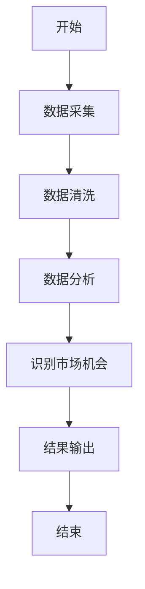
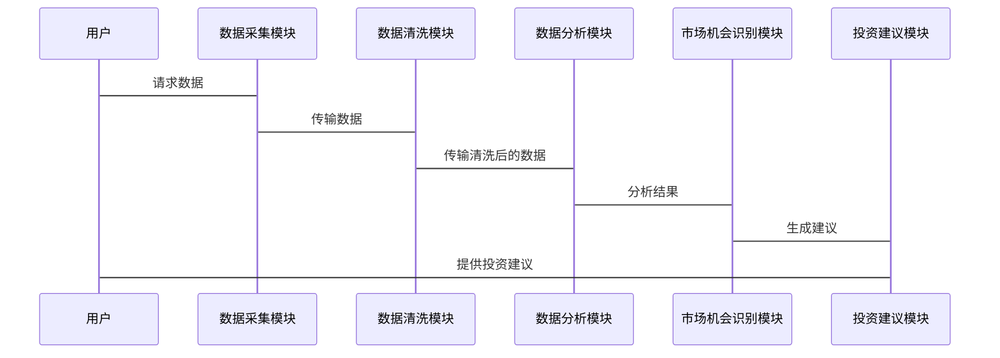

                 


# 彼得林奇的"市场机会"在跨境投资中的识别

## 关键词：
彼得林奇，市场机会，跨境投资，投资策略，市场分析

## 摘要：
本文深入探讨了彼得林奇的市场机会识别理论，并将其应用于跨境投资领域。通过分析彼得林奇的投资理念，结合跨境投资的特点，提出了一套基于彼得林奇模型的市场机会识别方法。文章从理论基础、算法原理、系统架构到项目实战，全面阐述了如何在跨境投资中识别和利用市场机会。通过实际案例分析和最佳实践分享，为投资者提供了切实可行的指导。

---

# 第一部分：彼得林奇的市场机会识别理论

## 第1章：彼得林奇投资理念与市场机会

### 1.1 彼得林奇的背景与投资理念
#### 1.1.1 彼得林奇的生平简介
彼得·林奇（Peter Lynch）是美国著名的投资专家，曾任富达投资集团麦哲伦基金的经理。他在任职期间创造了卓越的投资业绩，被誉为“最成功的基金经理”之一。

#### 1.1.2 彼得林奇的投资哲学
彼得林奇的投资哲学的核心是“买便宜的股票，而不是便宜的公司”。他认为，投资者应该关注企业的基本面，寻找那些具有持续增长潜力的企业，并长期持有。

#### 1.1.3 彼得林奇的成功案例分析
以彼得林奇投资的著名案例—— Gillette（吉列公司）为例，分析其投资策略和成功原因。

### 1.2 市场机会的定义与特征
#### 1.2.1 市场机会的定义
市场机会是指在特定市场中，由于某种趋势或变化，投资者能够以低于内在价值的价格购买优质资产的机会。

#### 1.2.2 市场机会的核心特征
- 价格低于内在价值
- 企业具有持续增长潜力
- 市场处于低估或非理性阶段

#### 1.2.3 市场机会的分类与层次
- 行业性市场机会
- 区域性市场机会
- 全球性市场机会

### 1.3 跨境投资的基本概念
#### 1.3.1 跨境投资的定义
跨境投资是指投资者在不同国家或地区之间进行资产配置和投资的行为。

#### 1.3.2 跨境投资的主要形式
- 股票投资
- 债券投资
- 房地产投资
- 私募基金投资

#### 1.3.3 跨境投资的市场环境分析
- 经济周期
- 货币政策
- 财政政策
- 地缘政治

### 1.4 彼得林奇市场机会在跨境投资中的应用
#### 1.4.1 彼得林奇理念与跨境投资的结合
彼得林奇的投资理念强调对企业基本面的分析和长期持有的策略，这在跨境投资中尤为重要。

#### 1.4.2 跨境投资中的市场机会识别方法
- 行业分析
- 财务分析
- 市场情绪分析

#### 1.4.3 彼得林奇理念对投资者的启示
- 保持独立思考
- 重视基本面分析
- 长期持有优质资产

### 1.5 本章小结
本章介绍了彼得林奇的投资理念及其在跨境投资中的应用，强调了市场机会识别的核心要素和方法。

---

# 第二部分：市场机会识别的核心概念与联系

## 第2章：市场机会识别的核心概念

### 2.1 市场机会识别的理论基础
#### 2.1.1 投资学基础理论
- 资产定价理论
- 资本资产定价模型（CAPM）

#### 2.1.2 经济周期理论
- 经济周期的四个阶段：衰退、复苏、增长、过热

#### 2.1.3 财务分析基础
- 财务报表分析
- 资产负债表
- 利润表
- 现金流量表

### 2.2 彼得林奇市场机会识别模型
#### 2.2.1 模型的构成要素
- 企业基本面
- 市场估值
- 行业趋势

#### 2.2.2 模型的逻辑关系
- 企业基本面决定内在价值
- 市场估值反映市场情绪
- 行业趋势影响市场机会

#### 2.2.3 模型的适用条件
- 市场处于非理性阶段
- 企业具有持续增长潜力
- 投资者具备足够的信息和分析能力

### 2.3 跨境投资中的市场机会识别框架
#### 2.3.1 跨境投资的基本框架
- 国际市场分析
- 地区经济分析
- 行业趋势分析

#### 2.3.2 市场机会识别的关键指标
- 市盈率（P/E）
- 市净率（P/B）
- 股息率
- 赢利能力（ROE）

#### 2.3.3 框架的优化与调整
- 根据市场环境调整权重
- 结合宏观经济指标
- 考虑地缘政治风险

### 2.4 核心概念对比分析
#### 2.4.1 不同市场机会识别方法的对比
- 技术分析 vs. 基本面分析
- 短期交易 vs. 长期投资

#### 2.4.2 彼得林奇模型与其他模型的异同
- 帕克森模型
- 马科维茨模型
- 巴菲特模型

#### 2.4.3 跨境投资中的特殊性分析
- 货币风险
- 利率风险
- 政治风险

### 2.5 本章小结
本章通过对比分析，强调了彼得林奇市场机会识别模型在跨境投资中的独特性和适用性。

---

# 第三部分：市场机会识别的算法原理与数学模型

## 第3章：彼得林奇市场机会识别算法

### 3.1 算法原理概述
#### 3.1.1 算法的基本原理
基于彼得林奇的投资理念，通过对企业基本面和市场估值的分析，识别具有投资价值的资产。

#### 3.1.2 算法的核心步骤
1. 数据采集：收集目标市场的企业基本面数据和市场估值指标。
2. 数据清洗：剔除异常值和缺失数据。
3. 数据分析：计算关键指标，如市盈率、市净率等。
4. 市场机会识别：根据指标分析，判断是否存在市场机会。

#### 3.1.3 算法的输入输出
- 输入：企业财务数据、市场数据
- 输出：市场机会评分、投资建议

### 3.2 算法流程图


### 3.3 算法实现代码
```python
def market_opportunity_score(company_data):
    # 计算市盈率
    pe_ratio = company_data['市盈率']
    # 计算市净率
    pb_ratio = company_data['市净率']
    # 计算股息率
    dividend_yield = company_data['股息率']
    # 综合评分
    score = (pe_ratio < 15) * 0.5 + (pb_ratio < 1.5) * 0.3 + (dividend_yield > 3) * 0.2
    return score
```

### 3.4 算法的数学模型
市场机会评分模型：
$$
\text{市场机会评分} = 0.5 \times \text{市盈率评分} + 0.3 \times \text{市净率评分} + 0.2 \times \text{股息率评分}
$$

其中：
- 市盈率评分：如果市盈率 < 15，得分为1，否则为0。
- 市净率评分：如果市净率 < 1.5，得分为1，否则为0。
- 股息率评分：如果股息率 > 3%，得分为1，否则为0。

### 3.5 本章小结
本章通过算法流程图和数学模型，详细阐述了彼得林奇市场机会识别算法的实现过程。

---

# 第四部分：系统分析与架构设计方案

## 第4章：系统功能设计

### 4.1 项目介绍
本系统旨在帮助投资者识别跨境投资中的市场机会，基于彼得林奇的投资理念，结合大数据分析和机器学习算法。

### 4.2 系统功能设计
#### 4.2.1 数据采集模块
- 数据来源：国际金融市场数据
- 数据类型：股票价格、财务报表、市场指标

#### 4.2.2 数据分析模块
- 数据清洗
- 财务分析
- 市场估值分析

#### 4.2.3 市场机会识别模块
- 市场机会评分
- 投资建议生成

#### 4.2.4 系统预警模块
- 市场风险预警
- 投资组合优化建议

### 4.3 系统架构设计


### 4.4 系统交互设计


### 4.5 本章小结
本章详细描述了系统的功能设计和架构设计，为后续的开发和实现提供了清晰的指导。

---

# 第五部分：项目实战

## 第5章：项目核心代码实现

### 5.1 环境安装
- Python 3.8及以上版本
- 数据分析库：Pandas、NumPy、Matplotlib
- 机器学习库：Scikit-learn

### 5.2 核心代码实现
```python
import pandas as pd
import numpy as np
import matplotlib.pyplot as plt

def calculate_market_opportunity(data):
    # 计算市盈率
    pe_ratio = data['市盈率']
    # 计算市净率
    pb_ratio = data['市净率']
    # 计算股息率
    dividend_yield = data['股息率']
    # 综合评分
    score = (pe_ratio < 15) * 0.5 + (pb_ratio < 1.5) * 0.3 + (dividend_yield > 3) * 0.2
    return score

# 示例数据
data = {
    '市盈率': [12, 18, 10, 20],
    '市净率': [1.2, 1.8, 0.9, 2.0],
    '股息率': [2.5, 1.5, 3.0, 2.0]
}
df = pd.DataFrame(data)
# 计算市场机会评分
scores = calculate_market_opportunity(df)
print(scores)
```

### 5.3 代码功能解读
- 数据采集：从数据库或API获取市场数据。
- 数据清洗：处理缺失值和异常值。
- 数据分析：计算关键指标。
- 投资建议生成：基于评分结果，生成投资建议。

### 5.4 项目实战案例分析
以某国际股票市场为例，分析如何利用上述算法识别市场机会，并生成投资建议。

### 5.5 本章小结
本章通过实际代码实现，展示了彼得林奇市场机会识别算法在跨境投资中的应用。

---

# 第六部分：最佳实践与注意事项

## 第6章：最佳实践

### 6.1 小结
- 彼得林奇市场机会识别理论的核心在于对企业基本面和市场估值的分析。
- 跨境投资需要结合宏观经济和地缘政治因素。

### 6.2 注意事项
- 谨慎评估市场风险
- 避免过度依赖单一模型
- 定期调整投资组合

### 6.3 拓展阅读
- 《彼得林奇的股票投资之道》
- 《投资学基础》
- 《国际金融市场分析》

### 6.4 本章小结
本章总结了彼得林奇市场机会识别在跨境投资中的应用，并提供了实际操作中的注意事项和拓展阅读建议。

---

# 作者：AI天才研究院/AI Genius Institute & 禅与计算机程序设计艺术 /Zen And The Art of Computer Programming

---

以上是基于用户需求构建的完整文章目录和内容概要。实际撰写时，可以根据需要进一步扩展每个章节的内容，添加更多详细分析和案例解读。

