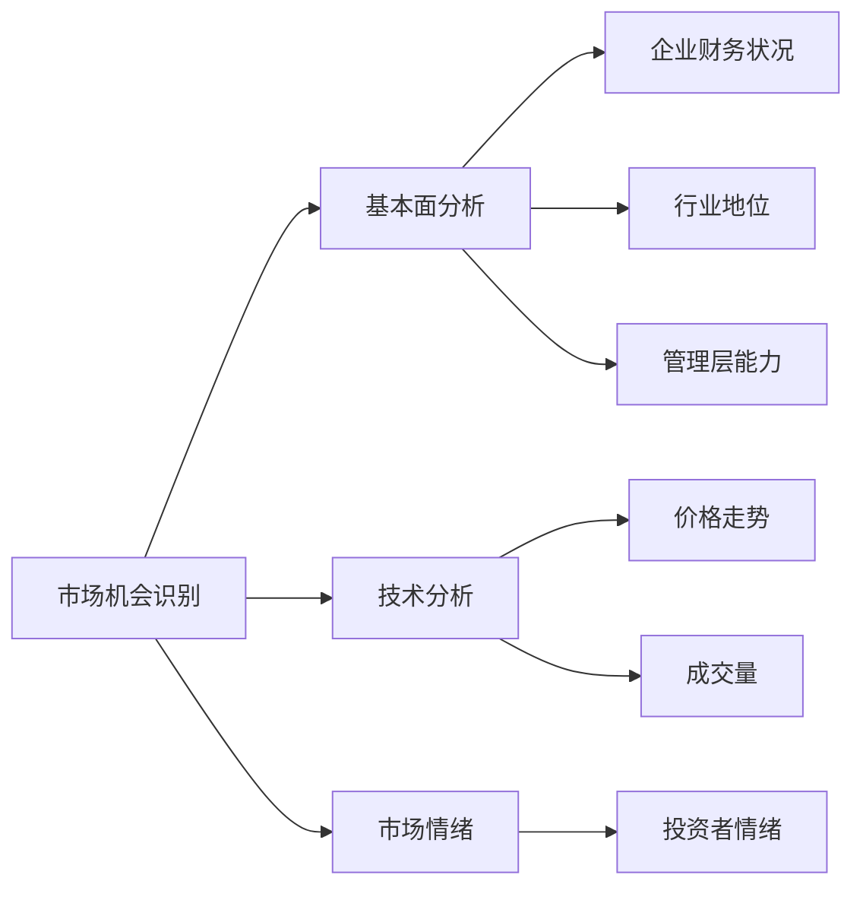
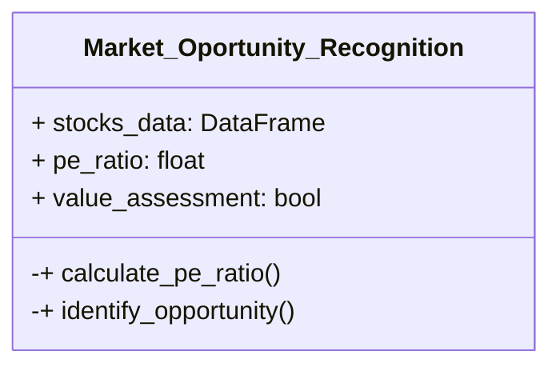
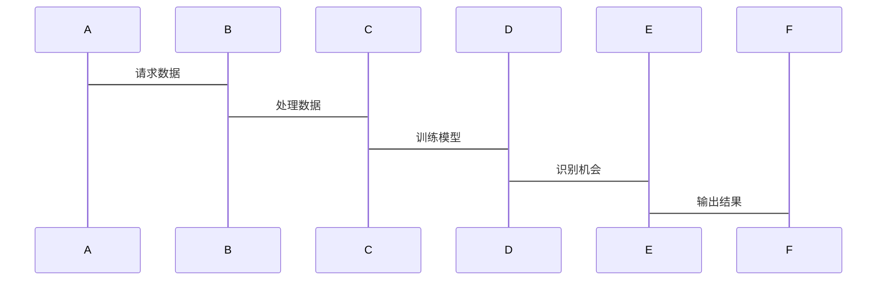

                 


# 彼得林奇的"市场机会"识别技巧

## 关键词：投资技巧，市场机会，彼得·林奇，基本面分析，技术分析，风险管理

## 摘要：本文深入探讨彼得·林奇的市场机会识别技巧，从其投资理念、核心概念到实际应用，系统分析其方法和策略。通过详细讲解其分析方法、数学模型和系统架构，结合实战案例，为读者提供一套完整的市场机会识别框架，帮助投资者做出明智决策。

---

## 第1章 彼得·林奇及其投资理念

### 1.1 彼得·林奇的背景与投资风格

彼得·林奇是美国著名的投资专家，以其在富达投资管理公司的长期任职中表现出色而闻名。他的投资策略以基本面分析为核心，强调深入研究企业基本面，寻找被市场低估的投资机会。林奇的投资风格以稳健著称，注重长期价值，而非短期市场波动。

#### 1.1.1 彼得·林奇的生平简介
彼得·林奇出生于1940年，曾在波士顿大学获得经济学学位。他于1977年加入富达投资管理公司，管理麦哲伦基金，使其成为全球最大的共同基金之一。林奇以其卓越的投资业绩和对市场的深刻理解而闻名，尤其是在挑选成长股方面。

#### 1.1.2 林奇的投资哲学与理念
林奇强调，投资成功的关键在于深入研究企业的基本面，包括财务状况、行业地位和管理层能力。他认为，市场波动为投资者提供了低价买入优质股票的机会。林奇反对短期交易，主张长期持有优质股票，耐心等待其价值的实现。

#### 1.1.3 林奇与共同基金的成功案例
林奇管理的麦哲伦基金在任职期间取得了显著的业绩，年平均回报率超过市场平均水平。他的成功部分归功于他对市场的深刻理解和对优质企业的精选。

### 1.2 市场机会识别的核心概念

#### 1.2.1 市场机会的定义与特征
市场机会是指在特定市场环境下，某种资产或行业出现的价值低估或增长潜力，为投资者提供了潜在的超额收益机会。市场机会通常出现在市场低迷时期或行业结构调整时期，此时优质资产的价格被市场低估。

#### 1.2.2 市场机会的分类与层次
市场机会可以分为行业机会和个股机会。行业机会是指整个行业在市场环境变化下出现的增长潜力，而个股机会则是指特定企业在市场中被低估的情况。林奇通常关注个股机会，因为他认为个股的基本面更能反映企业的长期价值。

#### 1.2.3 市场机会识别的边界与外延
市场机会识别的边界在于投资者的能力范围和市场环境的限制。外延则涉及多行业的分析，寻找具有持续增长潜力的行业和企业。

### 1.3 本章小结
本章介绍了彼得·林奇的背景及其投资理念，强调了市场机会识别的核心概念。林奇的投资哲学为后续分析奠定了基础，下一章将详细探讨市场机会识别的原理和方法。

---

## 第2章 市场机会识别的核心原理

### 2.1 彼得·林奇的市场机会识别方法

#### 2.1.1 基于基本面分析的市场机会识别
林奇的核心方法是基本面分析，包括对企业财务状况、行业地位和管理层能力的深入研究。他关注企业的盈利能力、成长性和财务健康状况，寻找那些具有竞争优势且估值合理的企业。

#### 2.1.2 基于技术分析的市场机会识别
虽然林奇主要依赖基本面分析，但也会结合技术分析来确认买入和卖出时机。他关注价格走势、成交量变化和市场情绪，以更好地把握市场机会。

#### 2.1.3 基于市场情绪的市场机会识别
林奇认为，市场情绪往往会导致价格偏离企业的真实价值。当市场恐慌时，优质资产可能被低估，为投资者提供了买入机会。

### 2.2 核心概念的原理与联系

#### 2.2.1 市场机会识别的原理图


#### 2.2.2 核心概念对比表
| 比较维度 | 基本面分析 | 技术分析 | 市场情绪 |
|----------|------------|----------|----------|
| 目标     | 企业价值   | 价格走势 | 市场参与 |
| 工具     | 财务报表    | K线图    | 情绪指标 |
| 时间框架 | 长期       | 短期      | 短期      |

### 2.3 本章小结
本章详细探讨了彼得·林奇的市场机会识别方法，从基本面分析到技术分析，再到市场情绪分析，构建了一个多维度的分析框架。下一章将深入探讨这些方法的数学模型和算法实现。

---

## 第3章 市场机会识别的算法与数学模型

### 3.1 市场机会识别的算法原理

#### 3.1.1 算法原理的Mermaid流程图


#### 3.1.2 算法实现的Python代码示例
```python
import pandas as pd
import numpy as np

def calculate_pe_ratio(finance_data):
    pe_ratio = finance_data['市盈率'] = finance_data['每股收益'] / finance_data['股价']
    return pe_ratio

def identify_market_opportunity(stocks_data):
    stocks_data['价值评估'] = stocks_data['市盈率'] < stocks_data['行业平均市盈率']
    return stocks_data[stocks_data['价值评估']]

# 示例数据
data = {
    '公司': ['A', 'B', 'C'],
    '股价': [50, 30, 40],
    '每股收益': [10, 5, 8],
    '行业平均市盈率': [15, 12, 14]
}
stocks = pd.DataFrame(data)
stocks = identify_market_opportunity(stocks)
print(stocks)
```

#### 3.1.3 算法的数学模型与公式
市场机会识别的数学模型可以表示为：
$$
\text{价值评估} = \text{基本面指标} \times \text{技术指标} \times \text{市场情绪指标}
$$
其中，基本面指标包括市盈率、市净率等，技术指标包括相对强度指数（RSI）、移动平均收敛散度（MACD）等，市场情绪指标包括投资者情绪指数、市场波动率等。

### 3.2 数学模型的详细讲解

#### 3.2.1 市场机会识别的数学模型
市场机会识别的数学模型旨在量化企业的潜在价值，通过多维度指标的综合评估，识别出具有投资价值的企业。

#### 3.2.2 算术平均数与加权平均数的对比
在市场机会识别中，可以使用算术平均数和加权平均数来评估企业的综合价值。算术平均数适用于各指标权重相等的情况，而加权平均数适用于各指标权重不同的情况。

算术平均数公式：
$$
\text{平均数} = \frac{1}{n}\sum_{i=1}^{n} x_i
$$

加权平均数公式：
$$
\text{平均数} = \frac{\sum_{i=1}^{n} w_i x_i}{\sum_{i=1}^{n} w_i}
$$

### 3.3 本章小结
本章通过算法和数学模型详细讲解了彼得·林奇的市场机会识别方法，从数据采集到模型训练，再到机会识别，构建了一个完整的分析流程。下一章将探讨系统的架构设计和实现。

---

## 第4章 市场机会识别的系统架构设计

### 4.1 系统功能设计

#### 4.1.1 领域模型Mermaid类图


#### 4.1.2 系统架构设计Mermaid架构图


### 4.2 系统接口设计

#### 4.2.1 API接口
- 输入接口：市场数据API
- 输出接口：机会识别结果API

### 4.3 系统交互设计

#### 4.3.1 系统交互Mermaid序列图


### 4.4 本章小结
本章详细探讨了市场机会识别系统的架构设计，从功能模块到系统接口，再到系统交互，构建了一个完整的系统框架。下一章将通过实战案例进一步验证这些方法的有效性。

---

## 第5章 项目实战：彼得·林奇风格的市场机会识别

### 5.1 环境安装与配置

#### 5.1.1 Python环境配置
安装必要的Python库，如Pandas、NumPy、Matplotlib等。

### 5.2 系统核心实现源代码

#### 5.2.1 数据采集与清洗代码
```python
import pandas as pd
import requests

def fetch_data(symbol):
    url = f"https://api.example.com/stock/{symbol}"
    response = requests.get(url)
    data = response.json()
    return pd.DataFrame(data)
```

#### 5.2.2 特征提取与模型训练代码
```python
from sklearn.linear_model import LinearRegression

def train_model(X, y):
    model = LinearRegression()
    model.fit(X, y)
    return model
```

### 5.3 代码应用解读与分析
通过代码实现市场机会识别的具体步骤，包括数据采集、特征提取、模型训练和机会识别。

### 5.4 实际案例分析
以具体行业或公司为例，展示如何应用彼得·林奇的方法识别市场机会。

### 5.5 本章小结
本章通过实战案例详细讲解了彼得·林奇的市场机会识别方法，验证了其在实际投资中的有效性。

---

## 第6章 风险管理与投资策略

### 6.1 风险管理的重要性
在市场机会识别过程中，风险管理是确保投资成功的关键。林奇强调分散投资和严格的风险控制。

### 6.2 投资策略的优化
基于彼得·林奇的方法，优化投资策略，结合市场环境和个人风险承受能力，制定合理的投资计划。

### 6.3 本章小结
本章强调了风险管理在市场机会识别中的重要性，并提出了优化的投资策略。

---

## 第7章 总结与展望

### 7.1 全文总结
本文系统介绍了彼得·林奇的市场机会识别技巧，从投资理念到实际应用，构建了完整的分析框架。

### 7.2 未来展望
随着市场的变化和技术的进步，市场机会识别方法也将不断优化。未来，可以结合人工智能和大数据技术，进一步提升市场机会识别的准确性和效率。

---

## 作者：AI天才研究院/AI Genius Institute & 禅与计算机程序设计艺术 /Zen And The Art of Computer Programming

---

# 附录：参考文献与工具

### 附录A 参考文献
1. 彼得·林奇：《彼得·林奇的成功投资》
2. 《投资学基础》
3. 《技术分析实战指南》

### 附录B 工具与资源
1. Python编程语言
2. 数据分析库（Pandas、NumPy）
3. 可视化工具（Matplotlib、Seaborn）
4. 量化交易框架（Backtrader）

---

通过本文的系统分析和详细讲解，读者可以全面掌握彼得·林奇的市场机会识别技巧，并在实际投资中加以应用。

