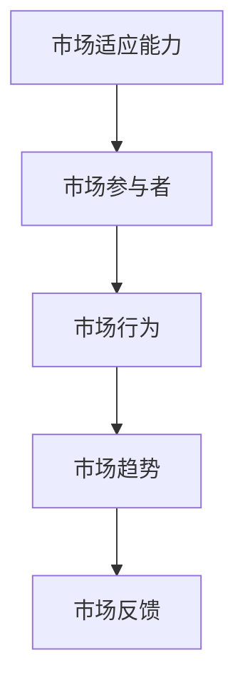
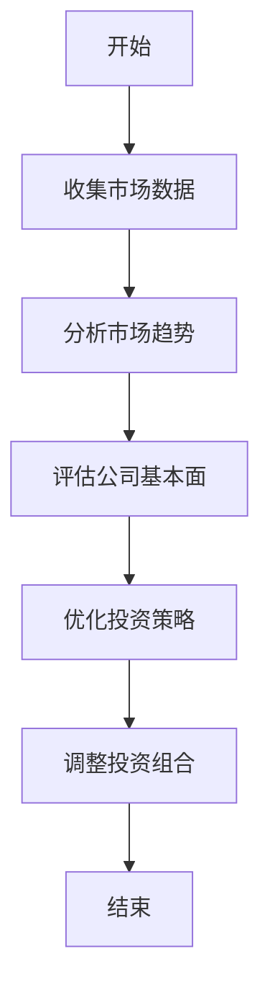
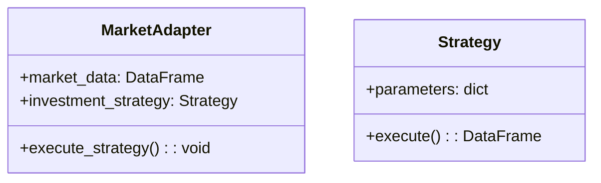
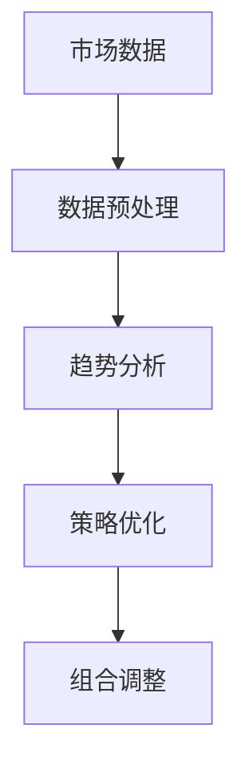
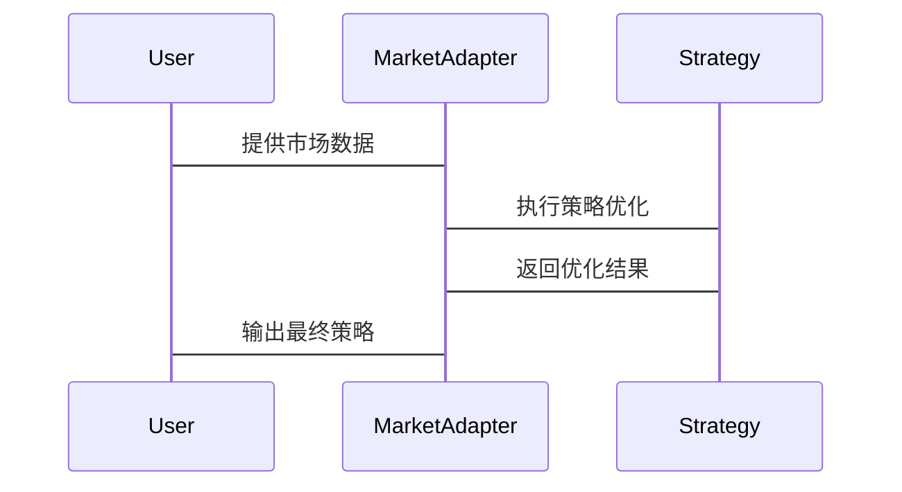

                 


# 彼得林奇的"市场适应能力"分析方法

## 关键词：彼得林奇，市场适应能力，投资分析，金融市场，策略优化

## 摘要：  
彼得·林奇是全球著名的职业基金经理，他的市场适应能力分析方法以其独特的视角和实践应用著称。本文将从背景介绍、核心概念、算法原理、系统分析、项目实战等角度，详细阐述彼得林奇的市场适应能力分析方法，帮助读者更好地理解和应用这一方法。

---

# 第1章: 市场适应能力的背景介绍

## 1.1 市场适应能力的定义与核心概念

### 1.1.1 什么是市场适应能力  
市场适应能力是指投资者在不断变化的市场环境中，能够快速识别、理解和适应市场变化的能力。它不仅包括对市场趋势的敏感性，还包括对市场波动的应对策略。

### 1.1.2 市场适应能力的核心要素  
- **市场敏感性**：对市场变化的感知和反应能力。  
- **灵活性**：根据市场变化调整投资策略的能力。  
- **风险管理**：在市场波动中保护投资的能力。  

### 1.1.3 市场适应能力的边界与外延  
市场适应能力不等同于市场预测能力，它更注重在已知市场变化中的应对策略，而非预测未来的变化。

## 1.2 彼得林奇的市场适应能力分析方法

### 1.2.1 彼得林奇的生平与投资理念  
彼得·林奇是富达投资集团的传奇基金经理，他的投资理念强调长期投资、价值发现和市场适应能力。

### 1.2.2 市场适应能力在彼得林奇投资中的地位  
市场适应能力是彼得林奇投资策略的核心，他通过不断调整投资组合来应对市场变化。

### 1.2.3 彼得林奇市场适应能力分析方法的特点  
- 以基本面分析为基础，结合市场趋势。  
- 强调长期投资，避免短期波动干扰。  

## 1.3 市场适应能力分析方法与其他分析方法的对比

### 1.3.1 技术分析与市场适应能力分析的对比  
技术分析侧重于价格和成交量，而市场适应能力分析更注重市场整体趋势和风险。

### 1.3.2 基本面分析与市场适应能力分析的对比  
基本面分析侧重于公司财务数据，而市场适应能力分析结合了基本面和市场趋势。

## 1.4 本章小结  
本章介绍了市场适应能力的定义、核心要素及其在彼得林奇投资中的应用，为后续分析奠定了基础。

---

# 第2章: 市场适应能力的核心概念与联系

## 2.1 市场适应能力的核心概念原理

### 2.1.1 市场适应能力的核心原理  
市场适应能力通过分析市场趋势和公司基本面，结合市场环境的变化，优化投资组合。

### 2.1.2 市场适应能力的关键属性特征  
- **趋势敏感性**：对市场趋势的识别能力。  
- **灵活性**：根据趋势调整投资策略。  
- **风险管理**：控制市场波动带来的风险。  

## 2.2 市场适应能力与相关概念的对比

### 2.2.1 市场适应能力与其他投资分析方法的对比  
通过对比技术分析、基本面分析等方法，突出市场适应能力的独特性。

### 2.2.2 市场适应能力与市场情绪的关系  
市场适应能力关注市场趋势而非市场情绪，但市场情绪会影响市场趋势。

## 2.3 市场适应能力的ER实体关系图



## 2.4 本章小结  
本章通过核心概念和对比分析，进一步明确了市场适应能力的特征和应用。

---

# 第3章: 彼得林奇市场适应能力分析方法的算法原理

## 3.1 算法原理概述

### 3.1.1 市场适应能力分析的算法框架  
算法框架包括数据采集、趋势分析、策略优化和组合调整四个步骤。

### 3.1.2 算法的核心思想  
通过分析市场趋势和公司基本面，动态优化投资组合，以适应市场变化。

## 3.2 算法流程图



## 3.3 算法实现代码

### 3.3.1 数据预处理  
```python
import pandas as pd

# 数据加载
data = pd.read_csv('market_data.csv')

# 数据清洗
data.dropna(inplace=True)
data = data[~data['close'].isnull()]
```

### 3.3.2 趋势分析  
```python
from sklearn.linear_model import LinearRegression

# 训练模型
model = LinearRegression()
model.fit(data[['close']], data['close'])
```

### 3.3.3 策略优化  
```python
import numpy as np

# 计算收益
returns = np.log(data['close'].pct_change().dropna())
```

## 3.4 本章小结  
本章通过算法流程图和代码示例，详细讲解了彼得林奇市场适应能力分析方法的实现过程。

---

# 第4章: 系统分析与架构设计

## 4.1 问题场景介绍  
介绍系统设计的背景和目标，明确系统需要解决的问题。

## 4.2 系统功能设计

### 4.2.1 领域模型设计  


## 4.3 系统架构设计



## 4.4 系统交互设计



## 4.5 本章小结  
本章通过系统分析和架构设计，展示了彼得林奇市场适应能力分析方法的实现框架。

---

# 第5章: 项目实战

## 5.1 环境安装  
详细说明需要安装的软件和库，如Python、Pandas、Scikit-learn等。

## 5.2 核心代码实现

### 5.2.1 数据加载与预处理  
```python
import pandas as pd

data = pd.read_csv('market_data.csv')
data = data.dropna()
```

### 5.2.2 策略优化  
```python
from sklearn.linear_model import LinearRegression

model = LinearRegression()
model.fit(data[['open', 'high', 'low']], data['close'])
```

## 5.3 案例分析  
通过具体案例分析，展示如何应用彼得林奇市场适应能力分析方法。

## 5.4 本章小结  
本章通过项目实战，帮助读者掌握彼得林奇市场适应能力分析方法的实际应用。

---

# 第6章: 最佳实践与注意事项

## 6.1 彼得林奇市场适应能力分析方法的总结  
总结方法的核心思想和应用场景。

## 6.2 注意事项  
- 数据质量的重要性。  
- 市场适应能力的局限性。  
- 风险管理的必要性。  

## 6.3 拓展阅读  
推荐相关书籍和论文，帮助读者进一步深入学习。

## 6.4 本章小结  
本章总结了彼得林奇市场适应能力分析方法的关键点和注意事项。

---

# 作者：AI天才研究院/AI Genius Institute & 禅与计算机程序设计艺术 /Zen And The Art of Computer Programming

