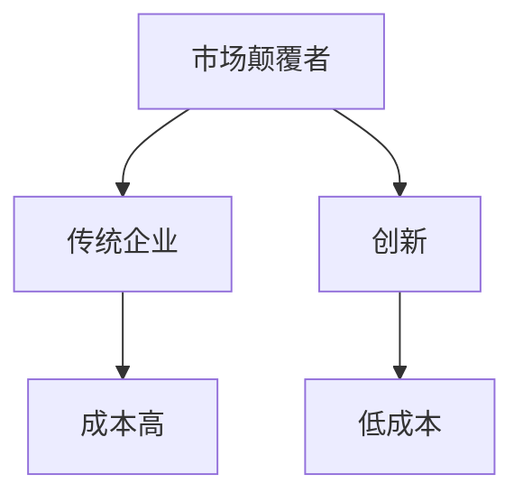
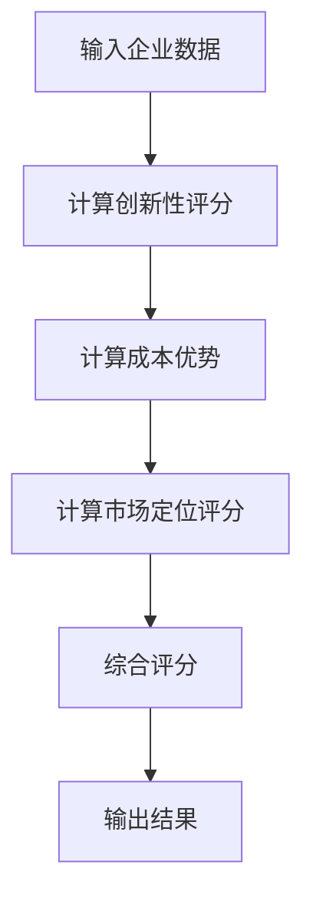
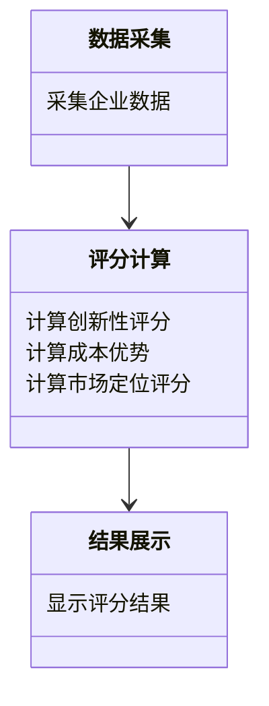

                 


# 彼得林奇的"市场颠覆者"在新兴行业中的识别技巧

## 关键词：彼得林奇、市场颠覆者、新兴行业、投资策略、算法识别

## 摘要：本文深入探讨了彼得林奇的市场颠覆者理论，并结合新兴行业的特点，分析了如何识别这些颠覆者。通过结合理论、算法和实际案例，本文提供了识别新兴行业中潜在颠覆者的系统方法，帮助投资者做出明智决策。

---

# 第一部分：背景介绍

## 第1章：市场颠覆者的定义与背景

### 1.1 什么是市场颠覆者
市场颠覆者是指通过创新的产品或服务，以更低的成本进入市场，最终取代传统企业地位的公司。这些公司在新兴行业中尤其具有竞争力，因为它们能够打破现有市场格局。

### 1.2 彼得林奇的市场颠覆者理论
彼得林奇是著名的基金经理，他提出市场颠覆者是那些能够通过创新和低成本策略颠覆传统企业的公司。他的理论强调识别这些公司的潜力，以在投资中获得超额收益。

### 1.3 新兴行业中的市场颠覆者
新兴行业为市场颠覆者提供了机会，因为这些行业通常缺乏成熟的企业，颠覆者可以迅速占据市场份额。本文将结合彼得林奇的理论，分析如何在这些行业中识别颠覆者。

---

# 第二部分：核心概念与联系

## 第2章：市场颠覆者的特征分析

### 2.1 创新性分析
市场颠覆者通常具有高度的创新性，无论是产品、服务还是商业模式。这种创新使他们能够以更低的成本满足客户需求。

### 2.2 竞争优势分析
通过成本优势、技术优势或资源优化，市场颠覆者能够在竞争中占据优势，逐步扩大市场份额。

### 2.3 市场定位分析
颠覆者的市场定位通常针对未被满足的细分市场，通过精准定位吸引目标客户群体。

### 2.4 对比分析
下表对比了市场颠覆者与传统企业的特征：

| 特性       | 市场颠覆者          | 传统企业          |
|------------|--------------------|-------------------|
| 创新性      | 高                 | 低                |
| 成本        | 低                 | 高                |
| 市场定位    | 精准               | 宽泛              |
| 发展速度    | 快                 | 缓慢              |

Mermaid图：市场颠覆者与传统企业的关系



---

# 第三部分：算法原理讲解

## 第3章：市场颠覆者的识别算法

### 3.1 算法概述
识别市场颠覆者的算法通过分析企业的创新性、成本结构和市场定位，计算颠覆潜力评分。

### 3.2 算法流程
Mermaid流程图：识别市场颠覆者的算法



### 3.3 算法实现
Python代码示例：企业评分系统

```python
def calculate_disruptor_score(enterprise_data):
    innovation_score = calculate_innovation_score(enterprise_data)
    cost_advantage = calculate_cost_advantage(enterprise_data)
    market_position_score = calculate_market_position_score(enterprise_data)
    total_score = 0.3 * innovation_score + 0.4 * cost_advantage + 0.3 * market_position_score
    return total_score

def calculate_innovation_score(data):
    # 创新性评分逻辑
    return data['创新性评分']

def calculate_cost_advantage(data):
    # 成本优势评分逻辑
    return data['成本优势评分']

def calculate_market_position_score(data):
    # 市场定位评分逻辑
    return data['市场定位评分']
```

### 3.4 数学模型
评分公式：

$$ \text{总评分} = 0.3 \times \text{创新性评分} + 0.4 \times \text{成本优势} + 0.3 \times \text{市场定位评分} $$

例如，某企业的创新性评分为80，成本优势为70，市场定位评分为85：

$$ \text{总评分} = 0.3 \times 80 + 0.4 \times 70 + 0.3 \times 85 = 24 + 28 + 25.5 = 77.5 $$

---

# 第四部分：系统分析与架构设计

## 第4章：系统分析与架构设计方案

### 4.1 问题场景介绍
新兴行业中的市场颠覆者识别涉及收集和分析大量企业数据，需要设计高效的系统来支持这一过程。

### 4.2 系统功能设计
系统功能包括数据采集、评分计算、结果展示。

Mermaid类图：系统功能模块



Mermaid架构图：系统架构

```mermaid
container 新兴行业颠覆者识别系统 {
    数据采集模块
    评分计算模块
    结果展示模块
}
```

---

# 第五部分：项目实战

## 第5章：项目实战与案例分析

### 5.1 环境安装
安装Python和必要的库（如pandas、numpy）。

### 5.2 核心代码实现
企业评分系统代码：

```python
import pandas as pd

def calculate_disruptor_score(data):
    return 0.3 * data['创新性'] + 0.4 * data['成本优势'] + 0.3 * data['市场定位']

# 示例数据
data = {
    '创新性': 80,
    '成本优势': 70,
    '市场定位': 85
}
score = calculate_disruptor_score(data)
print(score)
```

### 5.3 代码解读与分析
代码实现企业评分系统，输入企业数据后输出总评分，帮助识别颠覆者潜力。

### 5.4 案例分析
分析某新兴行业中的企业，使用评分系统计算其颠覆潜力，并得出结论。

### 5.5 项目小结
总结项目实施过程，强调算法的有效性和实际应用价值。

---

# 第六部分：最佳实践

## 第6章：最佳实践、小结、注意事项和拓展阅读

### 6.1 小结
本文结合彼得林奇的理论，提出了识别新兴行业市场颠覆者的系统方法，包括理论分析、算法设计和实际应用。

### 6.2 注意事项
在实际应用中，需结合市场变化和企业动态调整模型参数，定期更新数据。

### 6.3 拓展阅读
推荐相关书籍和文献，深入学习市场颠覆者识别的理论和方法。

---

# 作者：AI天才研究院 & 禅与计算机程序设计艺术

---

本文通过系统分析和实际案例，详细讲解了彼得林奇的市场颠覆者识别技巧，并结合新兴行业的特点，提供了实用的识别方法。希望读者能通过本文，掌握如何在新兴行业中识别潜在的市场颠覆者，从而在投资决策中占据优势。

