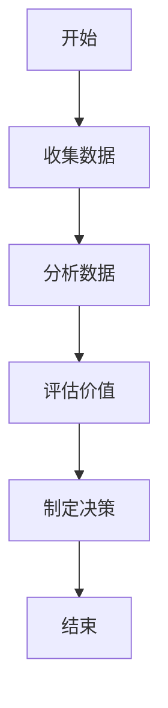

                 


# 彼得林奇的"常识投资"原则解析

## 关键词：投资原则，基本面分析，价值投资，长期投资，分散投资，彼得林奇，投资策略

## 摘要：彼得林奇是全球著名的投资专家，他的“常识投资”原则强调通过基本面分析、价值投资、长期持有和分散投资来实现稳健的投资回报。本文详细解析了这些原则的核心思想，并通过算法、数学模型和系统架构等技术手段，深入分析了投资决策的过程，结合实际案例，展示了如何在实际投资中应用这些原则。文章还总结了投资的最佳实践和注意事项，为读者提供了全面的指导。

---

# 正文

## 第1章：背景介绍

### 1.1 投资的基本概念

#### 1.1.1 投资的定义与分类
投资是指将资金投入某个项目或资产，以期望在未来获得收益或资本增值。投资可以分为股票、债券、房地产等多种形式，每种形式都有其独特的风险和回报特征。

#### 1.1.2 投资的基本原则
- 风险与回报的权衡：高风险通常意味着高回报，但同时也意味着可能的高损失。
- 时间的价值：长期投资能够通过复利效应实现财富的增值。
- 分散投资：通过投资不同资产或行业来降低风险。

#### 1.1.3 投资市场的基本结构
- 股票市场：投资者通过购买公司股份成为股东，享有分红和资本增值。
- 债券市场：投资者购买政府或企业的债券，获得固定的利息收入。
- 其他市场：包括房地产、黄金、基金等。

### 1.2 彼得林奇的背景与成就

#### 1.2.1 彼得林奇的生平简介
彼得·林奇（Peter Lynch）是美国著名的投资专家，曾任富达麦哲伦基金的经理，创造了卓越的投资业绩。

#### 1.2.2 彼得林奇的投资理念
- 专注于基本面分析。
- 倾向于投资自己熟悉的行业和公司。
- 长期持有优质资产。

#### 1.2.3 彼得林奇的代表作品与影响
彼得林奇的代表作《彼得林奇的成功投资》等书籍，影响了全球无数投资者。

### 1.3 常识投资的定义与意义

#### 1.3.1 常识投资的定义
常识投资是指通过基本的常识和理性分析，选择具有长期增长潜力的公司进行投资。

#### 1.3.2 常识投资的核心理念
- 买入优质资产，长期持有。
- 避免跟风，注重基本面分析。
- 分散投资以降低风险。

#### 1.3.3 常识投资在现代投资中的地位
常识投资作为一种简单有效的投资方法，适合大多数普通投资者，尤其是那些不具备复杂分析能力的投资者。

---

## 第2章：常识投资的核心原则

### 2.1 基本面分析

#### 2.1.1 基本面分析的定义
基本面分析是通过研究公司的财务报表、行业地位、管理团队等因素，评估其内在价值。

#### 2.1.2 基本面分析的关键指标
- 市盈率（PE）：市价与每股收益的比率。
- 市净率（PB）：市价与每股净资产的比率。
- 资产负债率：评估公司的财务健康状况。

#### 2.1.3 基本面分析的步骤与方法
1. 收集公司财务数据。
2. 分析财务指标。
3. 评估公司竞争优势。

### 2.2 价值投资

#### 2.2.1 价值投资的定义
价值投资是寻找市场价格低于其内在价值的股票进行投资。

#### 2.2.2 价值投资的核心要素
- 内在价值：公司未来现金流的现值。
- 安全边际：市场价格与内在价值的差距。

#### 2.2.3 价值投资与成长投资的区别
- 价值投资关注低估的股票，成长投资关注高增长的股票。
- 价值投资注重安全边际，成长投资注重未来的增长潜力。

### 2.3 长期投资

#### 2.3.1 长期投资的定义
长期投资是指持有资产超过一年的投资行为，以复利效应实现财富增长。

#### 2.3.2 长期投资的优势
- 避免短期市场的波动影响。
- 利用复利效应实现财富增值。

#### 2.3.3 长期投资的风险与挑战
- 长期持有优质资产的风险较低，但仍需关注宏观经济环境的变化。

### 2.4 分散投资

#### 2.4.1 分散投资的定义
分散投资是通过投资不同的资产或行业来降低风险。

#### 2.4.2 分散投资的原理
- 不同资产的回报率相关性较低，从而降低整体风险。

#### 2.4.3 分散投资的实际操作
- 将资金分配到不同的资产类别中，如股票、债券、房地产等。

---

## 第3章：投资决策的算法原理

### 3.1 投资决策的基本流程



### 3.2 投资决策的数学模型

#### 3.2.1 CAPM模型
$$ E(r_i) = r_f + \beta_i (E(r_m) - r_f) $$
其中，$E(r_i)$是资产的预期回报率，$r_f$是无风险利率，$\beta_i$是资产的贝塔系数，$E(r_m)$是市场预期回报率。

#### 3.2.2 市盈率模型
$$ P/E = \frac{P}{E} $$
其中，$P$是股票价格，$E$是每股收益。

---

## 第4章：系统架构设计

### 4.1 系统功能设计

#### 4.1.1 数据采集模块
- 从财务报表中提取关键指标。

#### 4.1.2 数据分析模块
- 使用Python进行数据清洗和分析。

#### 4.1.3 投资决策模块
- 根据分析结果生成投资建议。

### 4.2 系统架构设计


---

## 第5章：项目实战

### 5.1 环境配置
- 安装Python、Pandas、Matplotlib等工具。

### 5.2 核心代码实现

```python
import pandas as pd

# 加载数据
data = pd.read_csv('stock_data.csv')

# 计算市盈率
data['PE'] = data['Price'] / data['EPS']

# 找出PE小于行业平均的股票
mean_pe = data['PE'].mean()
undervalued_stocks = data[data['PE'] < mean_pe]

print(undervalued_stocks)
```

### 5.3 案例分析
- 分析某行业的股票，找出具有低估潜力的公司。

### 5.4 结果解读
- 根据分析结果，生成投资建议。

---

## 第6章：最佳实践与总结

### 6.1 小结
- 彼得林奇的常识投资原则简单有效，适合普通投资者。

### 6.2 注意事项
- 避免过度依赖单一指标。
- 定期审视投资组合。

### 6.3 拓展阅读
- 《彼得林奇的成功投资》
- 《投资学基础》

---

# 结论

彼得林奇的常识投资原则为我们提供了一种简单而有效的方法来管理投资。通过基本面分析、价值投资、长期持有和分散投资，投资者可以在复杂多变的市场中实现稳健的回报。希望本文的分析和案例能够帮助读者更好地理解和应用这些原则。

---

# 作者

作者：AI天才研究院/AI Genius Institute & 禅与计算机程序设计艺术 /Zen And The Art of Computer Programming

