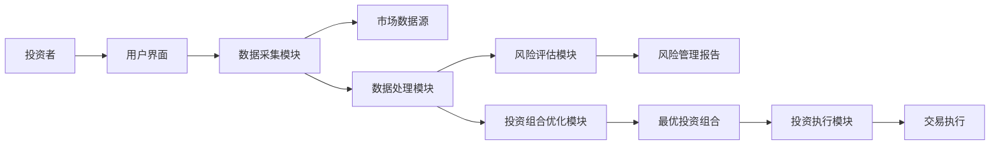
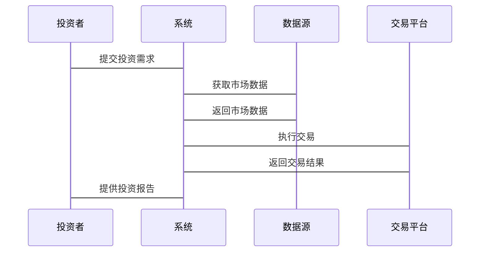

                 

# 彼得林奇的"常识投资"在复杂金融衍生品时代的重要性

> 关键词：常识投资，金融衍生品，彼得·林奇，投资策略，风险管理

> 摘要：本文探讨了在复杂金融衍生品时代，彼得·林奇的常识投资策略的重要性。通过分析金融市场的现状、复杂金融环境对投资者的影响、常识投资的核心理念、金融衍生品的特性与风险，结合实际案例分析，本文详细阐述了如何在复杂金融环境中应用常识投资策略，并通过系统架构设计和项目实战，展示如何利用这些策略进行投资决策和风险管理。文章最后总结了最佳实践经验和注意事项，为投资者提供了实用的指导。

---

# 第一部分: 复杂金融衍生品时代的投资背景

## # 第1章: 金融市场的现状与挑战

### ## 1.1 金融市场的现状分析

#### ### 1.1.1 全球金融市场的现状

全球金融市场近年来经历了剧烈的波动，尤其是在新冠疫情后，市场的不确定性显著增加。金融衍生品的市场规模迅速扩大，其复杂性也在不断提升。根据国际清算银行（BIS）的数据，全球场外衍生品市场的规模已经超过600万亿美元。市场的高度杠杆化和复杂化使得投资者面临更大的风险。

#### ### 1.1.2 金融衍生品的快速发展

金融衍生品的种类和数量在近年来呈爆炸式增长。除了传统的期货、期权外，复杂的合成衍生品、信用违约互换（CDOs）等新型产品层出不穷。这些产品的设计往往基于复杂的数学模型和算法，普通投资者难以理解其内在风险。

#### ### 1.1.3 复杂金融环境对投资者的影响

复杂金融环境使得投资者的决策难度显著增加。传统的基于价格和市场情绪的投资策略逐渐失效，投资者需要更加注重基本面分析和风险管理。特别是在金融衍生品领域，投资者需要具备更高的专业素养和风险意识。

---

### ## 1.2 投资者面临的挑战

#### ### 1.2.1 金融衍生品的复杂性

金融衍生品的复杂性使得投资者难以准确评估其风险和价值。许多投资者在不了解产品真实风险的情况下盲目跟风，导致了严重的损失。

#### ### 1.2.2 市场波动性增加

金融市场的波动性显著增加，尤其是在量化交易和高频交易的推动下，市场的短期波动更加剧烈。这使得传统的长期投资策略面临更大的挑战。

#### ### 1.2.3 投资者决策的难度提升

投资者需要面对更多的信息干扰和市场噪音，尤其是在社交媒体和自媒体的推动下，信息的真假难辨，投资者的决策难度进一步增加。

---

### ## 1.3 常识投资的基本概念

#### ### 1.3.1 常识投资的定义

常识投资是一种基于基本面分析和常识的投资策略，强调对企业和市场的深入研究，避免盲目跟风和过度依赖市场情绪。

#### ### 1.3.2 常识投资的核心原则

1. **价值投资**：寻找具有长期增长潜力的企业，关注企业的财务健康和管理层能力。
2. **风险管理**：在投资决策中充分考虑风险，避免过度杠杆和集中投资。
3. **长期视角**：注重长期投资，避免短期波动的干扰。

#### ### 1.3.3 常识投资与传统投资的区别

| 特性 | 常识投资 | 传统投资 |
|------|----------|----------|
| 理论基础 | 基于基本面分析和常识 | 基于技术分析和市场情绪 |
| 投资期限 | 长期投资为主 | 短期交易为主 |
| 风险管理 | 强调风险管理 | 风险管理较为忽视 |

---

## # 第2章: 彼得·林奇的常识投资策略

### ## 2.1 常识投资的核心理念

#### ### 2.1.1 基于常识的投资决策

彼得·林奇强调，投资者需要基于常识和基本面分析做出投资决策。他认为，投资者应该关注企业的基本面，如财务状况、管理层能力、行业地位等，而不是仅仅关注市场情绪和技术指标。

#### ### 2.1.2 价值投资与成长投资的结合

林奇认为，投资者应该寻找具有长期增长潜力的企业，同时关注其估值是否合理。他强调，价值投资和成长投资并不是对立的，而是可以结合起来。

#### ### 2.1.3 风险控制的重要性

林奇多次强调风险管理的重要性。他认为，投资者应该避免过度杠杆和集中投资，特别是在市场波动较大的情况下。

---

### ## 2.2 常识投资的策略体系

#### ### 2.2.1 基本面分析的核心作用

基本面分析是常识投资的核心。投资者需要对企业进行深入研究，包括财务报表、管理层能力、行业前景等。

#### ### 2.2.2 市场情绪的判断与利用

虽然林奇强调基本面分析的重要性，但他并不完全忽视市场情绪。他认为，市场情绪可以帮助投资者发现短期机会，但需要结合基本面分析。

#### ### 2.2.3 个股分析与行业分析的结合

林奇认为，个股分析和行业分析是相辅相成的。通过对行业趋势的分析，可以更好地判断个股的投资价值。

---

### ## 2.3 常识投资的实践案例

#### ### 2.3.1 彼得·林奇的经典投资案例

林奇在波士顿的Fidelity Magellan基金的管理中，通过深入研究企业的基本面，成功投资了许多优质企业，如可口可乐和微软。

#### ### 2.3.2 常识投资在实际操作中的应用

林奇的投资策略在实际操作中被广泛应用于机构投资和个人投资。例如，他通过深入研究企业财务报表，发现了一些被市场低估的优质企业。

#### ### 2.3.3 投资者如何借鉴林奇的策略

投资者可以通过学习林奇的投资方法，结合自身的实际情况，制定合适的投资策略。

---

## # 第3章: 金融衍生品的特性与风险

### ## 3.1 金融衍生品的基本概念

#### ### 3.1.1 金融衍生品的定义与分类

金融衍生品是基于标的资产的金融工具，包括期货、期权、掉期等。根据标的资产的不同，可以分为股票衍生品、外汇衍生品、利率衍生品等。

#### ### 3.1.2 期货、期权、掉期的基本原理

- **期货**：双方约定在未来某一时间以预定价格买卖标的资产的合同。
- **期权**：购买者有权在特定时间内以预定价格买卖标的资产的权利。
- **掉期**：双方约定在未来某一时间交换资产或现金流的协议。

#### ### 3.1.3 金融衍生品的市场功能

金融衍生品具有价格发现、风险管理、流动性提供等功能。

---

### ## 3.2 金融衍生品的风险分析

#### ### 3.2.1 市场风险

市场风险是指由于市场价格波动导致的衍生品价值下降的风险。

#### ### 3.2.2 信用风险

信用风险是指由于交易对手违约导致的损失风险。

#### ### 3.2.3 操作风险

操作风险是指由于操作失误或内部管理不善导致的风险。

---

## # 第4章: 常识投资在复杂金融环境中的应用

### ## 4.1 金融衍生品与常识投资的结合

#### ### 4.1.1 金融衍生品作为风险管理工具

林奇认为，金融衍生品可以作为风险管理工具，帮助投资者对冲市场波动风险。

#### ### 4.1.2 金融衍生品的复杂性与投资策略

由于金融衍生品的复杂性，投资者需要更加谨慎地选择和管理投资组合。

---

### ## 4.2 常识投资策略的具体实施

#### ### 4.2.1 风险管理策略

投资者需要制定合理的风险管理策略，包括分散投资、设定止损点等。

#### ### 4.2.2 投资组合优化

通过对金融衍生品的合理配置，投资者可以优化投资组合的风险和收益。

---

## # 第5章: 系统分析与架构设计方案

### ## 5.1 问题场景介绍

在复杂金融环境中，投资者需要一个高效的系统来辅助决策。基于常识投资策略，我们需要设计一个能够实时分析市场数据、评估风险、优化投资组合的系统。

### ## 5.2 系统功能设计

#### ### 5.2.1 数据采集与处理

系统需要实时采集市场数据，包括股票价格、期货价格、期权价格等。

#### ### 5.2.2 风险评估与分析

系统需要对投资组合进行风险评估，包括市场风险、信用风险等。

#### ### 5.2.3 投资组合优化

系统需要根据投资者的风险偏好和市场情况，优化投资组合。

### ## 5.3 系统架构设计

### ## 5.4 系统接口设计

系统需要与外部数据源、交易平台等进行接口对接。

### ## 5.5 系统交互设计

---

## # 第6章: 项目实战

### ## 6.1 环境安装

#### ### 6.1.1 安装Python环境

使用Anaconda安装Python 3.8及以上版本。

#### ### 6.1.2 安装必要的库

安装numpy、pandas、matplotlib、scikit-learn等库。

### ## 6.2 核心实现

#### ### 6.2.1 数据采集模块

编写代码从Yahoo Finance获取股票和期货价格数据。

#### ### 6.2.2 风险评估模块

使用蒙特卡洛模拟评估投资组合的风险。

#### ### 6.2.3 投资组合优化模块

使用优化算法（如遗传算法）优化投资组合。

### ## 6.3 案例分析

#### ### 6.3.1 金融衍生品的定价与风险管理

通过案例分析，展示如何利用系统进行金融衍生品的定价和风险管理。

#### ### 6.3.2 投资组合优化

通过实际案例，展示如何利用系统优化投资组合。

### ## 6.4 小结

通过项目实战，我们验证了系统在复杂金融环境中的有效性。

---

## # 第7章: 最佳实践与小结

### ## 7.1 最佳实践

#### ### 7.1.1 投资者应注重风险管理

投资者需要制定合理的风险管理策略，避免过度杠杆和集中投资。

#### ### 7.1.2 投资者应结合基本面分析和市场情绪

投资者需要结合基本面分析和市场情绪，制定合适的投资策略。

#### ### 7.1.3 投资者应持续学习和调整策略

投资者需要持续关注市场变化，及时调整投资策略。

---

### ## 7.2 小结

在复杂金融衍生品时代，彼得·林奇的常识投资策略仍然具有重要的现实意义。投资者需要结合基本面分析和风险管理，制定合适的投资策略。

---

## # 第8章: 注意事项与拓展阅读

### ## 8.1 注意事项

#### ### 8.1.1 投资者应避免盲目跟风

投资者需要避免盲目跟风，特别是在不了解产品风险的情况下。

#### ### 8.1.2 投资者应谨慎使用金融衍生品

金融衍生品具有高风险，投资者需要谨慎使用。

### ## 8.2 拓展阅读

#### ### 8.2.1 推荐书籍

1. 《彼得·林奇的成功投资》
2. 《金融衍生品市场分析》

#### ### 8.2.2 推荐网站

1. 彼得·林奇的官方网站
2. 金融衍生品市场的相关论坛和博客

---

## # 作者信息

作者：AI天才研究院/AI Genius Institute & 禅与计算机程序设计艺术 /Zen And The Art of Computer Programming

---

**注**：由于篇幅限制，以上内容为文章的简化版，实际文章将包含完整的代码实现、详细的数据分析和更多的实际案例。

