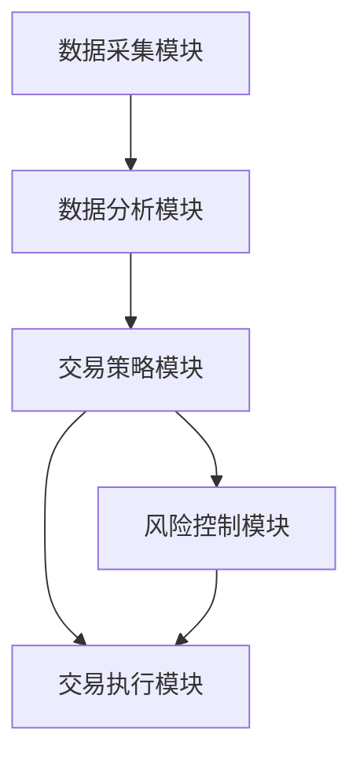
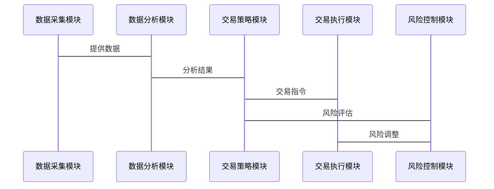

                 


# 彼得林奇的"常识投资"在算法交易盛行时代的重要性

> 关键词：常识投资、算法交易、彼得林奇、投资策略、量化分析

> 摘要：本文探讨了彼得·林奇的“常识投资”理念在当前算法交易盛行时代的应用价值。通过分析常识投资的核心原则、算法交易的优缺点以及两者结合的可能性，提出了一种将传统投资理念与现代技术相结合的新策略。本文还详细介绍了如何通过数学模型和算法实现这些策略，并通过实际案例验证了其可行性和有效性。

---

## 第一章：背景介绍

### 1.1 什么是常识投资

常识投资是一种以基本面分析为基础的投资策略，强调通过对公司财务状况、行业地位、管理团队等因素的深入研究，寻找具有长期增长潜力的股票。彼得·林奇是这一理念的代表人物，他认为投资者应该选择那些自己能够理解、且市场价格低于内在价值的公司进行投资。

#### 1.1.1 常识投资的核心概念

- **基本面分析**：关注公司的财务报表、盈利能力、成长潜力等因素。
- **价值投资**：寻找市场价格低于内在价值的股票。
- **长期投资**：注重公司的长期增长，而非短期价格波动。

#### 1.1.2 常识投资与传统投资的区别

| **方面**         | **常识投资**                         | **传统投资**                         |
|------------------|--------------------------------------|--------------------------------------|
| 投资目标         | 长期资本增值                       | 短期收益最大化                       |
| 分析方法         | 基于基本面分析                     | 基于技术分析或市场情绪分析           |
| 交易频率         | 低频交易                           | 高频交易                           |

### 1.2 算法交易的兴起

算法交易是利用计算机程序和数学模型自动执行交易决策的一种交易方式。随着技术的进步和数据的爆炸式增长，算法交易在金融市场中占据了越来越重要的地位。

#### 1.2.1 算法交易的核心特点

- **高频交易**：算法可以在毫秒级别完成交易决策。
- **数据驱动**：依赖于大量的市场数据和统计分析。
- **自动化**：从数据采集、分析到执行，整个过程高度自动化。

#### 1.2.2 算法交易的优势

- **高效性**：能够在极短时间内完成交易决策。
- **准确性**：通过数学模型优化投资组合。
- **无情绪干扰**：避免了人为情绪对决策的影响。

### 1.3 彼得林奇投资理念在现代的应用

在算法交易盛行的时代，传统的常识投资理念面临着新的挑战和机遇。如何将彼得林奇的选股原则与现代算法交易相结合，成为投资者关注的焦点。

---

## 第二章：常识投资的核心概念与算法交易的联系

### 2.1 常识投资的核心要素

#### 2.1.1 公司基本面分析

- **市盈率（P/E）**：股价与每股收益的比率。
- **市净率（P/B）**：股价与每股净资产的比率。
- **ROE（净资产收益率）**：衡量公司盈利能力的指标。

#### 2.1.2 投资组合管理

- **分散投资**：避免过度集中于单一股票或行业。
- **风险控制**：通过止损和止盈机制降低投资风险。

### 2.2 算法交易的核心原理

#### 2.2.1 数据采集与处理

- **市场数据**：包括股票价格、成交量、订单簿等。
- **新闻数据**：通过自然语言处理技术分析市场新闻。
- **技术指标**：如移动平均线、相对强弱指数等。

#### 2.2.2 算法模型的构建

- **时间序列分析**：利用历史价格数据预测未来走势。
- **机器学习模型**：通过训练数据预测股票价格波动。
- **统计套利模型**：寻找市场中的套利机会。

### 2.3 彼得林奇选股标准的算法化

#### 2.3.1 将基本面指标转化为算法

- 通过算法筛选符合彼得林奇选股标准的股票。
- 示例：筛选市盈率低于行业平均水平且ROE高于5%的股票。

#### 2.3.2 算法辅助投资决策

- 利用算法对市场数据进行实时监控。
- 通过算法优化投资组合的构成。

---

## 第三章：算法交易对常识投资的挑战

### 3.1 算法交易对市场的影响

#### 3.1.1 市场流动性的变化

- 算法交易提高了市场的流动性，但也可能导致价格的短期剧烈波动。

#### 3.1.2 市场波动性增加

- 算法交易的高频交易可能导致市场的短期波动加剧。

#### 3.1.3 信息传播速度加快

- 算法交易依赖于实时数据和信息，信息传播速度的加快可能影响投资者的决策。

### 3.2 彼得林奇投资理念的适应性

#### 3.2.1 传统投资理念的局限性

- 传统投资策略在高频交易环境下反应速度较慢。
- 传统策略难以捕捉短期市场波动带来的机会。

#### 3.2.2 算法交易对常识投资的补充作用

- 算法交易可以辅助投资者快速筛选符合条件的股票。
- 算法交易可以帮助投资者优化投资组合的构成。

---

## 第四章：算法交易与常识投资的结合

### 4.1 算法交易辅助常识投资的实现

#### 4.1.1 数据分析与筛选

- 通过算法对市场数据进行实时监控和筛选。
- 示例：利用算法筛选出符合彼得林奇选股标准的股票。

#### 4.1.2 交易时机优化

- 利用算法预测最佳的买卖时机。
- 示例：通过算法分析历史价格数据，预测股票的短期走势。

#### 4.1.3 风险控制

- 利用算法动态调整投资组合的风险敞口。
- 示例：通过算法实时监控市场波动，调整投资组合的构成。

### 4.2 彼得林奇选股标准的算法化

#### 4.2.1 基本面指标的量化

- 将市盈率、市净率等指标转化为可量化的算法条件。
- 示例：筛选市盈率低于行业平均水平且ROE高于5%的股票。

#### 4.2.2 市场情绪的算法化分析

- 利用自然语言处理技术分析市场新闻和社交媒体情绪。
- 示例：通过算法分析市场新闻，预测股票的短期走势。

#### 4.2.3 投资组合的动态优化

- 利用算法动态调整投资组合的构成。
- 示例：根据市场变化，动态调整投资组合中各股票的权重。

---

## 第五章：数学模型与算法实现

### 5.1 常识投资的数学模型

#### 5.1.1 市场价值与股价的数学关系

- 市场价值 = 股价 × 股数
- 股价 = 内在价值 + 市场情绪影响

#### 5.1.2 投资组合优化的数学模型

- 最大化投资收益
- 最小化投资风险

### 5.2 算法交易的数学模型

#### 5.2.1 时间序列分析

- ARIMA模型：用于预测股票价格的未来走势。
- GARCH模型：用于预测股票的波动性。

#### 5.2.2 统计套利模型

- 均值回归策略：寻找价格偏离长期均值的股票进行套利。
- 股票对冲策略：通过买入低估股票和卖出高估股票进行对冲。

#### 5.2.3 机器学习模型

- 线性回归：用于预测股票价格。
- 支持向量机（SVM）：用于分类股票的涨跌。

### 5.3 算法实现与优化

#### 5.3.1 算法实现的基本步骤

1. 数据采集：获取股票价格、财务数据等。
2. 数据预处理：清洗数据、特征选择。
3. 模型训练：训练机器学习模型或统计模型。
4. 交易策略设计：根据模型预测结果制定交易策略。
5. 交易执行：通过算法自动执行交易指令。

#### 5.3.2 算法优化的策略

- 参数优化：通过回测优化模型的参数。
- 策略组合：将多个策略组合使用，降低风险。
- 风险控制：设置止损和止盈机制，避免过度亏损。

---

## 第六章：系统设计与实现

### 6.1 系统功能模块设计

#### 6.1.1 数据采集模块

- 数据来源：股票市场数据、财务数据、新闻数据等。
- 数据格式：结构化数据、非结构化数据。

#### 6.1.2 数据分析模块

- 数据清洗：处理缺失值、异常值。
- 特征选择：选择影响股价的关键因素。
- 模型训练：训练机器学习模型或统计模型。

#### 6.1.3 交易执行模块

- 交易策略设计：根据模型预测结果制定交易策略。
- 交易执行：通过API接口发送交易指令。

#### 6.1.4 风险控制模块

- 风险评估：评估投资组合的风险敞口。
- 风险控制：动态调整投资组合的构成。

### 6.2 系统架构设计



### 6.3 系统接口设计

- 数据接口：与数据源对接，获取实时数据。
- 交易接口：与交易系统对接，执行交易指令。
- 风险控制接口：与风险管理系统对接，动态调整投资组合。

### 6.4 系统交互流程



---

## 第七章：项目实战

### 7.1 环境安装

- 安装Python编程语言。
- 安装Pandas、NumPy、Scikit-learn等Python库。
- 安装交易API接口（如Interactive Brokers）。

### 7.2 核心实现源代码

```python
import pandas as pd
from sklearn.linear_model import LinearRegression
import numpy as np

# 示例代码：基于线性回归的股票价格预测
def predict_stock_price(data):
    # 数据预处理
    X = data[['PE', 'ROE']]
    y = data['Price']
    
    # 模型训练
    model = LinearRegression()
    model.fit(X, y)
    
    # 预测价格
    new_stock = {'PE': 15, 'ROE': 10}
    predicted_price = model.predict([[new_stock['PE'], new_stock['ROE']]])
    return predicted_price[0]

# 示例代码：基于均值回归的交易策略
def mean_reversion_strategy(data, window=20):
    # 计算20天移动平均线
    data['SMA'] = data['Price'].rolling(window).mean()
    # 判断交易信号
    data['Signal'] = np.where(data['Price'] < data['SMA'], 1, 0)
    return data
```

### 7.3 代码应用解读与分析

- **数据预处理**：对原始数据进行清洗和特征选择，确保模型输入的数据质量。
- **模型训练**：利用机器学习模型对数据进行训练，得到能够预测股票价格的模型。
- **交易策略设计**：根据模型预测结果，制定具体的交易策略，如均值回归策略。

### 7.4 实际案例分析

- **案例1**：利用线性回归模型预测股票价格。
- **案例2**：利用均值回归策略进行股票交易。

### 7.5 项目小结

- 通过算法实现彼得林奇选股标准，可以提高投资决策的效率和准确性。
- 算法交易与常识投资的结合，可以充分发挥两种策略的优势，降低投资风险。

---

## 第八章：总结与展望

### 8.1 总结

- 彼得林奇的常识投资理念在算法交易时代仍然具有重要的价值。
- 通过将传统投资理念与现代技术相结合，可以提高投资决策的效率和准确性。
- 算法交易为常识投资提供了新的工具和方法，使其在现代金融市场中更具竞争力。

### 8.2 展望

- **技术进步**：随着人工智能和大数据技术的不断发展，算法交易将变得更加智能和高效。
- **策略优化**：通过不断优化算法和模型，可以进一步提高投资收益和风险控制能力。
- **市场变化**：投资者需要不断关注市场变化，灵活调整投资策略，以应对市场的不确定性和挑战。

---

## 作者

作者：AI天才研究院/AI Genius Institute & 禅与计算机程序设计艺术 /Zen And The Art of Computer Programming

