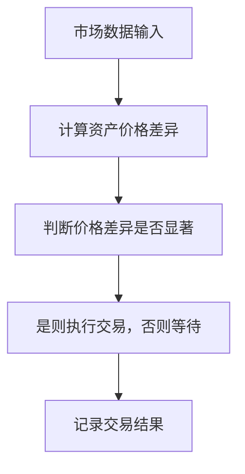
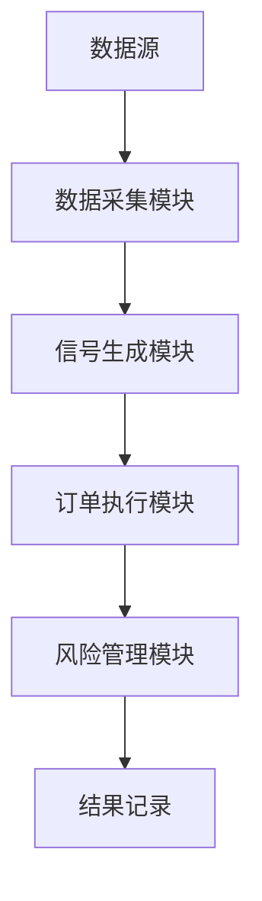

                 


# 彼得林奇的"常识投资"在高频交易时代的价值重估

> 关键词：高频交易、彼得·林奇、常识投资、算法交易、风险管理

> 摘要：本文探讨了彼得·林奇的常识投资理念在高频交易时代的适用性，分析了传统投资与高频交易的对比，详细讲解了高频交易的技术基础、算法原理、数学模型和系统架构设计，并通过案例分析展示了如何在高频交易环境中应用常识投资策略。

---

## 第1章：高频交易时代的投资挑战

### 1.1 高频交易的现状与影响

#### 1.1.1 高频交易的定义与特点
高频交易（High-Frequency Trading, HFT）是一种利用计算机算法在极短时间内进行大量交易的交易方式。其特点包括：
- **高速性**：利用低延迟的网络和高性能计算机快速执行交易。
- **自动化**：依赖算法自动决策和执行。
- **大数据驱动**：依赖实时数据分析进行交易决策。
- **高流动性**：通常集中在高流动性的市场和资产。

#### 1.1.2 高频交易对传统投资的影响
- **市场结构变化**：高频交易加剧了市场的流动性，但也可能导致市场的不稳定性。
- **交易成本降低**：高频交易通过自动化降低了交易成本，但同时也使得传统交易者的竞争优势减弱。
- **信息不对称加剧**：高频交易者利用技术优势获取信息，可能导致普通投资者处于劣势。

#### 1.1.3 投资者面临的挑战与机遇
- **挑战**：传统投资者需要面对技术驱动的交易方式，如何在高频交易环境下保持竞争力是一个难题。
- **机遇**：高频交易提供了新的市场机会，但也要求投资者具备更强的技术能力和风险管理能力。

---

### 1.2 彼得·林奇的常识投资理念

#### 1.2.1 彼得·林奇的生平与投资风格
彼得·林奇是美国著名的职业基金经理，曾管理富达麦哲伦基金，创造了卓越的投资业绩。他主张基本面分析，强调通过研究公司基本面来寻找投资机会。

#### 1.2.2 常识投资的核心思想
- **基本面分析**：通过研究公司财务报表、行业地位、管理团队等基本面因素来评估投资价值。
- **长期视角**：关注企业的长期增长潜力，而不是短期价格波动。
- **分散投资**：通过分散投资降低风险，避免过度集中在单一资产或行业。

#### 1.2.3 常识投资在现代金融中的价值
- **稳定性**：常识投资注重长期价值，有助于在市场波动中保持投资组合的稳定性。
- **风险管理**：通过基本面分析识别潜在风险，帮助投资者在市场下跌时做出更明智的决策。

---

## 第2章：高频交易与传统投资的对比分析

### 2.1 高频交易的技术基础

#### 2.1.1 高频交易的技术架构
高频交易依赖于高性能计算机、低延迟网络和高效算法的结合，通常部署在靠近交易所的机房内，以减少物理距离带来的延迟。

#### 2.1.2 算法交易的实现原理
算法交易通过编写程序自动执行交易决策，常见的算法包括：
- **统计套利**：利用资产价格的短期偏差进行交易。
- **算法执行**：将大额订单分解为小订单，以减少市场冲击。

#### 2.1.3 数据源与数据处理技术
高频交易依赖实时市场数据，数据源包括：
- **订单簿数据**：显示当前市场上所有订单的信息。
- **历史数据**：用于分析价格走势和交易模式。
- **新闻数据**：通过自然语言处理技术分析新闻对市场的影响。

---

### 2.2 传统投资与高频交易的优劣势

#### 2.2.1 传统投资的优势与劣势
- **优势**：
  - 长期视角，注重价值投资。
  - 适合分析能力强的投资者。
- **劣势**：
  - 反应速度慢，难以应对高频交易带来的市场波动。
  - 交易成本较高。

#### 2.2.2 高频交易的优势与劣势
- **优势**：
  - 高速交易，捕捉短期价格波动。
  - 自动化操作，减少人为情绪影响。
- **劣势**：
  - 风险较高，高频交易可能导致市场的不稳定性。
  - 对技术依赖性强，成本较高。

#### 2.2.3 两者的互补性与冲突点
- **互补性**：
  - 高频交易提供短期流动性，传统投资提供长期价值。
- **冲突点**：
  - 高频交易可能导致市场的短期波动，影响传统投资的稳定性。

---

## 第3章：常识投资在高频交易时代的适用性

### 3.1 高频交易环境下的常识投资策略

#### 3.1.1 常识投资的核心要素在高频交易中的体现
- **基本面分析**：尽管高频交易注重短期价格波动，但基本面分析仍有助于识别长期投资机会。
- **风险管理**：通过基本面分析识别潜在风险，帮助投资者在高频交易环境中做出更明智的决策。

#### 3.1.2 高频交易对常识投资的挑战
- **信息过载**：高频交易产生大量数据，传统投资者难以处理。
- **时间压力**：高频交易要求快速决策，传统投资的长期视角可能不适用。

#### 3.1.3 如何在高频交易中应用常识投资理念
- **结合技术分析**：在基本面分析的基础上，加入技术指标来捕捉短期交易机会。
- **算法辅助**：利用算法辅助基本面分析，提高决策速度和准确性。

---

### 3.2 高频交易环境下的风险管理

#### 3.2.1 风险管理的基本原则
- **分散投资**：通过分散投资降低风险。
- **止损策略**：设定止损点，避免亏损过大。
- **监控与调整**：实时监控市场变化，及时调整投资策略。

#### 3.2.2 高频交易中的风险管理技术
- **算法监控**：利用算法实时监控市场变化，自动触发止损。
- **风险管理模型**：使用数学模型量化风险，优化投资组合。

#### 3.2.3 常识投资的风险管理策略
- **基本面分析**：通过研究公司基本面，识别潜在风险。
- **长期视角**：保持长期投资策略，避免短期波动的影响。

---

## 第4章：算法原理与数学模型

### 4.1 高频交易中的算法实现

#### 4.1.1 统计套利算法
统计套利算法通过寻找资产价格的短期偏差进行交易。其核心思想是利用资产价格的均值回归特性。

**流程图：**


#### 4.1.2 机器学习算法
机器学习算法通过分析历史数据，预测未来的价格走势。常用的算法包括：
- **支持向量机（SVM）**：用于分类和回归分析。
- **随机森林**：用于特征选择和非线性关系分析。

**Python代码示例：**
```python
from sklearn.svm import SVC
import pandas as pd

# 假设data是包含特征和标签的数据框
# 特征为['feature1', 'feature2']，标签为'y'
model = SVC()
model.fit(data[['feature1', 'feature2']], data['y'])
```

---

### 4.2 数学模型与公式

#### 4.2.1 均值-方差优化模型
均值-方差优化模型用于优化投资组合的风险和收益。

**公式：**
$$ \text{目标：} \min \sigma^2 \text{ s.t. } \mathbb{E}[r] \geq \mu, \mathbf{w}^T \mathbf{1} = 1 $$
其中，$\sigma^2$是投资组合的方差，$\mathbb{E}[r]$是投资组合的期望收益，$\mu$是目标收益，$\mathbf{w}$是投资权重向量。

---

## 第5章：系统分析与架构设计

### 5.1 项目介绍

#### 5.1.1 项目目标
开发一个结合常识投资和高频交易的系统，实现自动化交易和风险管理。

#### 5.1.2 系统功能设计
- **数据采集模块**：实时采集市场数据。
- **信号生成模块**：基于算法生成交易信号。
- **订单执行模块**：自动执行交易指令。
- **风险管理模块**：实时监控和管理风险。

#### 5.1.3 系统架构设计


---

## 第6章：项目实战

### 6.1 环境搭建

#### 6.1.1 系统需求
- **硬件**：高性能计算机、低延迟网络。
- **软件**：Python、Jupyter Notebook、交易API。

#### 6.1.2 环境配置
安装必要的库：
```bash
pip install pandas numpy matplotlib yfinance
```

---

### 6.2 核心代码实现

#### 6.2.1 数据采集代码
```python
import pandas as pd
import yfinance as yf

# 下载数据
data = yf.download('AAPL', start='2023-01-01', end='2023-12-31')
data.head()
```

#### 6.2.2 信号生成代码
```python
import pandas as pd
import numpy as np

# 计算移动平均线
data['MA_50'] = data['Close'].rolling(50).mean()
data['MA_200'] = data['Close'].rolling(200).mean()

# 生成信号
data['Signal'] = np.where(data['MA_50'] > data['MA_200'], 1, -1)
```

---

### 6.3 案例分析与结果解读

#### 6.3.1 数据分析
分析移动平均线策略在AAPL股票上的表现，计算收益和回撤。

#### 6.3.2 结果展示
绘制价格和信号图：
```python
import matplotlib.pyplot as plt

plt.plot(data['Close'], label='Close Price')
plt.plot(data['MA_50'], label='50-Day MA')
plt.plot(data['MA_200'], label='200-Day MA')
plt.legend()
plt.show()
```

---

## 第7章：最佳实践与总结

### 7.1 最佳实践

#### 7.1.1 平衡传统策略与新技术
在高频交易时代，投资者需要平衡传统投资策略和新技术的应用，避免盲目跟风。

#### 7.1.2 注重风险管理
无论采用何种策略，风险管理都是投资成功的关键。

#### 7.1.3 持续学习与创新
金融市场变化迅速，投资者需要不断学习新技术和新策略，保持竞争力。

---

### 7.2 小结

本文探讨了彼得·林奇的常识投资理念在高频交易时代的适用性，分析了高频交易的技术基础和算法实现。通过案例分析展示了如何在高频交易环境中应用常识投资策略，并提出了风险管理的最佳实践。

---

### 7.3 未来展望

随着技术的不断发展，高频交易和传统投资的界限将逐渐模糊。投资者需要结合两者的优点，开发更加智能化的投资策略，以应对未来的市场挑战。

---

## 作者

**作者：AI天才研究院/AI Genius Institute & 禅与计算机程序设计艺术 /Zen And The Art of Computer Programming**

---

这篇文章详细探讨了彼得·林奇的常识投资理念在高频交易时代的适用性，分析了高频交易的技术基础、算法实现和数学模型，并通过案例展示了如何在高频交易环境中应用常识投资策略。文章结构清晰，内容丰富，涵盖了从理论到实践的各个方面，为投资者提供了有价值的参考。

