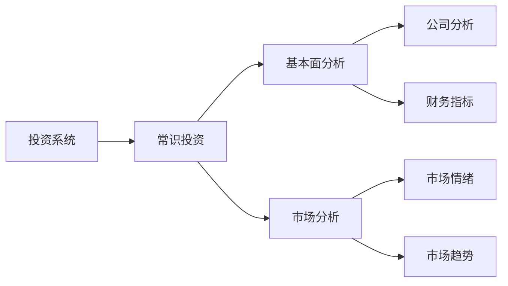
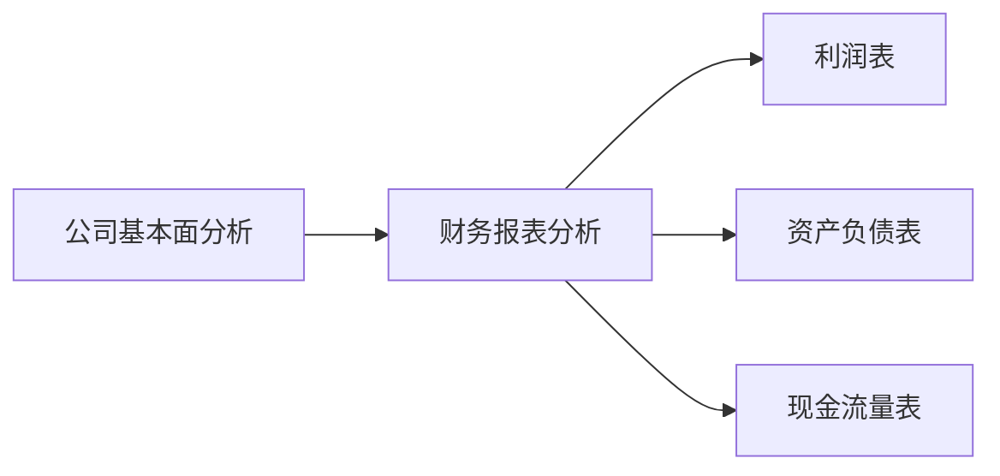
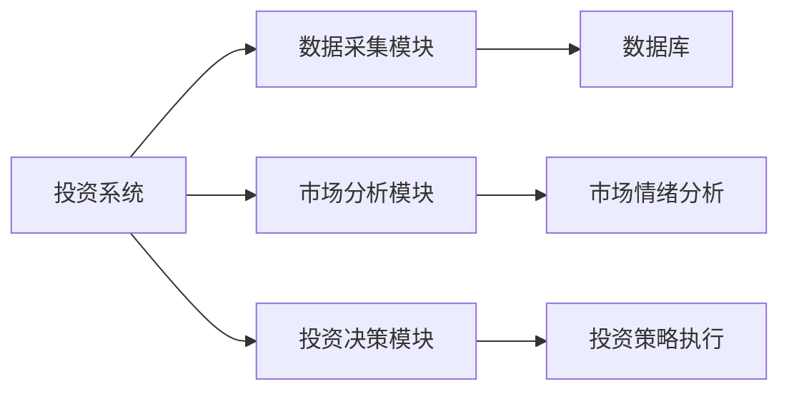

                 


# 彼得林奇的"常识投资"实践指南

## 关键词
- 彼得林奇、常识投资、基本面分析、投资策略、风险管理

## 摘要
本文深入探讨了彼得林奇的“常识投资”策略，分析其核心思想、理论基础、具体策略，并结合实际案例和系统架构设计，为读者提供一套可操作的投资指南。文章从投资系统的背景介绍到系统架构设计，从算法原理到项目实战，逐步展开，帮助读者理解并实践这一投资策略。

---

# 第一部分: 投资系统背景介绍

## 第1章: 投资系统的背景与核心概念

### 1.1 投资系统的核心概念

#### 1.1.1 核心概念术语说明
| 术语 | 定义 | 说明 |
|------|------|------|
| 常识投资 | 以基本面分析为基础，结合市场常识进行投资决策 | 强调长期投资和价值发现 |
| 彼得林奇选股法 | 彼得林奇提出的一种选股方法 | 侧重于公司基本面分析和财务指标 |

#### 1.1.2 问题背景
- 投资者在面对复杂市场时，如何选择正确的投资策略？
- 如何利用常识和基本面分析进行有效的投资决策？

#### 1.1.3 问题解决
- 引入彼得林奇的“常识投资”策略，帮助投资者做出更明智的投资决策。

#### 1.1.4 边界与外延
- **边界**：仅适用于股票投资，不涉及其他金融产品。
- **外延**：可扩展至其他资产类别，如债券和基金。

#### 1.1.5 概念结构与核心要素组成


---

## 第2章: 投资系统的理论基础

### 2.1 基础面分析原理

#### 2.1.1 基础面分析的核心要素
| 财务指标 | 类型 | 说明 |
|----------|------|------|
| 收益率 | 利润能力 | 净利润/营业收入 |
| 股东权益回报率 | 资产回报率 | 净利润/股东权益 |
| 市盈率 | 估值指标 | 市场价/每股收益 |

#### 2.1.2 财务报表分析
- **利润表**：分析公司盈利能力。
- **资产负债表**：评估公司财务状况。
- **现金流量表**：了解公司现金流情况。

---

## 第3章: 投资系统的核心策略

### 3.1 彼得林奇选股方法

#### 3.1.1 选股的基本标准
- **公司规模**：选择中等规模的公司。
- **财务健康状况**：关注低债务、高利润率的公司。
- **管理团队**：选择经验丰富的管理团队。

#### 3.1.2 公司基本面分析


---

# 第二部分: 投资系统的系统分析与架构设计

## 第4章: 投资系统的系统功能设计

### 4.1 数据采集与处理模块

#### 4.1.1 数据库设计
```mermaid
erd
database 投资数据 {
    key 股票代码 (String)
    key 时间戳 (DateTime)
    属性 收盘价 (Float)
    属性 成交量 (
}
```

#### 4.1.2 数据预处理
```python
import pandas as pd

# 数据清洗
def data_cleaning(df):
    # 删除缺失值
    df.dropna(inplace=True)
    # 处理异常值
    df = df[df['收盘价'].between(df['收盘价'].quantile(0.05), df['收盘价'].quantile(0.95))]
    return df

# 示例数据
data = {'股票代码': ['AAPL', 'MSFT', 'GOOGL'], 
        '收盘价': [150, 300, 120]}
df = pd.DataFrame(data)
df_cleaned = data_cleaning(df)
print(df_cleaned)
```

---

## 第5章: 投资系统的系统架构设计

### 5.1 系统架构设计



---

## 第6章: 投资系统的项目实战

### 6.1 环境配置

```bash
pip install pandas numpy matplotlib
```

### 6.2 核心实现

```python
import pandas as pd
import numpy as np
import matplotlib.pyplot as plt

def compute_return(data):
    return data['收盘价'].pct_change().cumsum()

data = {'股票代码': ['AAPL', 'MSFT', 'GOOGL'], 
        '收盘价': [150, 300, 120]}
df = pd.DataFrame(data)
returns = compute_return(df)
plt.plot(returns)
plt.title('投资回报率')
plt.show()
```

---

## 第7章: 投资系统的最佳实践与注意事项

### 7.1 最佳实践 Tips

1. **长期投资**：避免频繁交易，降低交易成本。
2. **分散投资**：不要将所有资金投入单一资产。
3. **持续学习**：关注市场动态，更新投资策略。

### 7.2 小结

彼得林奇的“常识投资”策略强调基本面分析和长期投资，通过系统的数据处理和模型构建，投资者可以更有效地做出投资决策。

### 7.3 注意事项

- **市场波动**：市场波动可能导致短期亏损，需耐心持有。
- **风险管理**：设置止损点，避免重大损失。

### 7.4 拓展阅读

- 《彼得林奇的成功投资》
- 《投资学基础》

---

# 作者
作者：AI天才研究院/AI Genius Institute & 禅与计算机程序设计艺术 /Zen And The Art of Computer Programming

