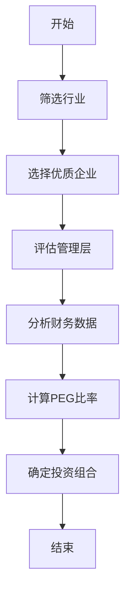

                 


# 彼得林奇的"慢牛"投资哲学

## 关键词：投资哲学，彼得·林奇，慢牛，价值投资，长期投资

## 摘要：  
本文深入探讨了彼得·林奇提出的"慢牛"投资哲学，从理论基础到实际应用，结合技术分析和系统设计，详细解读了这一投资策略的核心思想、算法原理和实践方法。文章通过对比分析、流程图、数学公式和系统架构图等多种形式，全面解析了"慢牛"投资的逻辑和实现路径。

---

# 第一部分: "慢牛"投资哲学的背景与核心概念

## 第1章: 投资哲学的基本概念

### 1.1 "慢牛"投资的定义与特点

#### 1.1.1 什么是"慢牛"投资
"慢牛"投资是一种长期价值投资策略，强调通过选择具有持续竞争优势和稳定增长潜力的企业，逐步积累财富。与"快牛"投资（短期高频交易）不同，"慢牛"注重企业的基本面和长期增长能力，追求稳健且可持续的投资回报。

#### 1.1.2 "慢牛"投资的核心要素
- **企业基本面**：重点关注企业的盈利能力、财务健康状况和管理层质量。
- **长期增长潜力**：寻找那些能够在未来5-10年持续增长的企业。
- **市场波动中的机会**：利用市场短期波动，以合理价格买入优质资产。

#### 1.1.3 "慢牛"投资与传统投资的区别
| 特性 | 慢牛投资 | 传统短期投资 |
|------|----------|--------------|
| 时间框架 | 长期（5-10年） | 短期（1年以内） |
| 标的筛选 | 企业基本面+长期潜力 | 技术分析+短期趋势 |
| 风险控制 | 低波动，注重安全边际 | 高波动，注重短线收益 |

### 1.2 彼得·林奇与"慢牛"投资的背景

#### 1.2.1 彼得·林奇的个人背景
彼得·林奇是美国著名的职业基金经理，曾管理富达麦哲伦基金，创造了年化13.7%的长期回报率。他的投资理念以基本面分析和长期投资著称。

#### 1.2.2 "慢牛"投资的提出背景
20世纪80年代，美国股市经历了多次剧烈波动，投资者开始反思短期交易的高风险，逐渐转向注重企业基本面的长期投资策略。

#### 1.2.3 "慢牛"投资的理论基础
- **价值投资**：寻找被市场低估的优质企业。
- **复利效应**：通过长期持有优质资产，实现财富的指数级增长。
- **风险管理**：避免重大损失，注重安全边际。

## 第2章: "慢牛"投资的核心概念与联系

### 2.1 核心概念原理

#### 2.1.1 长期投资的逻辑
长期投资的核心在于企业的持续盈利能力。通过持有优质资产，投资者能够分享企业的成长成果，同时规避短期市场波动的风险。

#### 2.1.2 企业价值评估的关键指标
- **市盈率（P/E）**：衡量股价是否合理。
- **市净率（P/B）**：评估股价与账面价值的关系。
- **PEG比率**：结合市盈率与盈利增长率的指标。

#### 2.1.3 市场情绪与投资决策的关系
市场情绪通常与投资决策呈负相关。当市场恐慌时，优质资产可能被低估，成为买入机会。

### 2.2 核心概念对比表格

表2-1: 不同投资策略的核心要素对比

| 战略 | 短期交易 | 长期投资 |
|------|----------|----------|
| 时间框架 | 1-3个月 | 5-10年 |
| 标的筛选 | 技术分析+市场情绪 | 企业基本面+长期潜力 |
| 风险控制 | 高波动，注重止损 | 低波动，注重安全边际 |

### 2.3 ER实体关系图

```mermaid
er
    actor 投资者
    actor 市场
    actor 企业
    entity 投资组合
    entity 财务数据
    entity 市场数据
    relation 投资者 -> 投资组合: 持有
    relation 企业 -> 财务数据: 提供
    relation 市场 -> 市场数据: 提供
    relation 投资组合 -> 企业: 持股
```

---

# 第二部分: "慢牛"投资的算法原理与系统分析

## 第3章: "慢牛"投资的算法原理

### 3.1 算法流程图



### 3.2 算法实现细节

#### 3.2.1 行业筛选
- 选择具有长期增长潜力的行业，如科技、医疗、消费等领域。

#### 3.2.2 企业评估
- 使用财务指标（如ROE、净利润增长率）和非财务指标（如管理层稳定性）对企业进行综合评估。

#### 3.2.3 PEG比率计算
$$ \text{PEG比率} = \frac{\text{市盈率}}{\text{净利润增长率}} $$

#### 3.2.4 投资组合构建
- 根据企业的综合评分，选择具有较高成长性和合理估值的公司。

---

## 第4章: 投资管理系统架构设计

### 4.1 系统功能设计

#### 4.1.1 数据采集模块
- 收集企业的财务数据、市场数据和行业信息。

#### 4.1.2 数据分析模块
- 计算关键指标（如PEG、ROE）并生成评估报告。

#### 4.1.3 投资策略模块
- 根据"慢牛"投资逻辑，筛选出符合条件的企业。

#### 4.1.4 投资组合管理模块
- 动态调整投资组合，优化资产配置。

### 4.2 系统架构图


---

## 第5章: 项目实战——构建"慢牛"投资组合

### 5.1 环境安装
- 数据分析工具：Python、Pandas、Matplotlib
- 投资组合管理工具：Excel、Minitab

### 5.2 核心代码实现

#### 5.2.1 数据采集代码
```python
import pandas as pd

# 下载行业数据
def get_industry_data():
    industry_data = pd.read_csv('industry.csv')
    return industry_data

# 下载企业财务数据
def get_finance_data():
    finance_data = pd.read_csv('finance.csv')
    return finance_data
```

#### 5.2.2 数据分析代码
```python
def calculate_PEG(finance_data):
    finance_data['PEG'] = finance_data['市盈率'] / finance_data['净利润增长率']
    return finance_data
```

#### 5.2.3 投资组合筛选代码
```python
def select_stocks(finance_data, industry_data):
    merged_data = pd.merge(finance_data, industry_data, on='行业代码')
    selected_stocks = merged_data[merged_data['PEG'] < 1.5]
    return selected_stocks
```

### 5.3 实际案例分析
以苹果公司为例，分析其投资价值：
- 苹果公司财务数据：ROE=25%，净利润增长率=8%，PEG=1.2。
- 行业数据：科技行业增长潜力大，市场需求稳定。
- 结论：苹果符合"慢牛"投资标准，适合长期持有。

---

## 第6章: 最佳实践与小结

### 6.1 小结
"慢牛"投资是一种注重长期价值的投资策略，通过选择优质企业，规避短期市场波动风险，实现稳健的财富增长。

### 6.2 注意事项
- 避免过度分散投资。
- 定期复盘和调整投资组合。
- 保持对市场的敏感性，及时应对重大变化。

### 6.3 拓展阅读
- 彼得·林奇的《彼得·林奇的成功投资：专业的角度》
- 《价值投资：从格雷厄姆到巴菲特》

---

# 作者：AI天才研究院/AI Genius Institute & 禅与计算机程序设计艺术 /Zen And The Art of Computer Programming

---

本文通过系统性地分析"慢牛"投资哲学，结合技术分析和实际案例，为投资者提供了一种稳健的投资思路。希望本文能为读者在投资决策中提供有价值的参考和启发。

