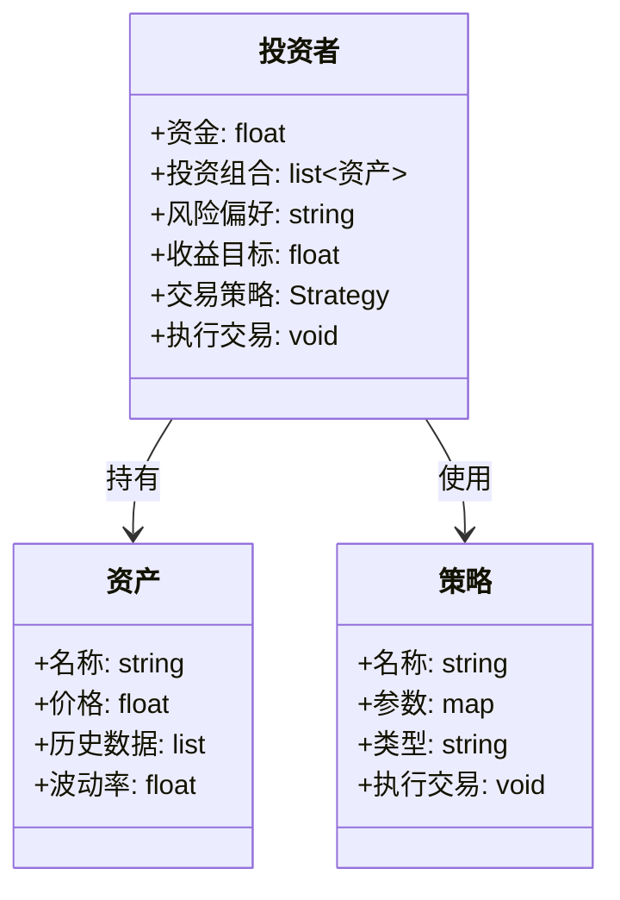

                 


# 彼得林奇的"慢牛"投资在算法交易时代的重要性

---

## 关键词

- 彼得林奇
- "慢牛"投资
- 算法交易
- 长期投资
- 量化交易

---

## 摘要

本文探讨了彼得林奇的"慢牛"投资理念在现代算法交易时代的重要性。通过分析"慢牛"投资的核心思想、算法交易的基本原理以及两者结合的应用，本文揭示了在快速变化的金融市场中，如何通过算法交易优化和提升"慢牛"投资策略的效果。文章还详细介绍了算法交易中的数学模型、系统架构设计以及实际项目案例，为投资者和算法交易从业者提供了深刻的见解和实践指导。

---

## 第一部分：彼得林奇"慢牛"投资概述

### 第1章：彼得林奇投资理念的核心思想

#### 1.1 "慢牛"投资的定义与特点

"慢牛"投资是一种长期投资策略，强调选择优质公司进行长期持有，避免频繁交易和短期波动的干扰。其核心特点包括：

- **长期性**：注重长期收益，而非短期利润。
- **价值导向**：寻找具有持续增长潜力的公司。
- **低风险**：通过精选优质资产降低投资风险。

#### 1.2 彼得林奇投资理念的背景

彼得林奇是美国著名基金经理，以其成功的投资业绩和独特的投资理念闻名。他的"慢牛"投资理念源于对市场波动的深刻理解，主张在市场恐慌时买入优质资产，耐心持有，等待其价值逐步实现。

#### 1.3 "慢牛"投资在现代金融中的意义

在现代金融市场中，"慢牛"投资为投资者提供了一种对抗短期波动的有效策略。通过长期持有优质资产，投资者能够避免市场短期波动的干扰，实现稳定的长期收益。

---

### 第2章：算法交易的基本原理

#### 2.1 算法交易的定义

算法交易是利用计算机算法自动执行交易的策略。其核心在于通过数学模型和算法，捕捉市场中的短期机会，实现快速、高效的投资。

#### 2.2 算法交易的主要类型

- **高频交易**：利用算法在极短时间内完成大量交易，主要依赖技术优势和算法优化。
- **统计套利**：通过统计分析寻找市场中的套利机会，利用价格差异进行无风险或低风险投资。
- **机器学习驱动的交易**：利用机器学习模型预测市场走势，优化交易策略。

#### 2.3 算法交易的优缺点

- **优点**：
  - 高效性：快速执行交易，抓住短期机会。
  - 稳定性：通过算法减少人为情绪干扰。
- **缺点**：
  - 风险性：算法交易可能导致市场剧烈波动。
  - 技术依赖：对技术设备和算法的依赖较高。

---

### 第3章："慢牛"投资与算法交易的结合

#### 3.1 "慢牛"投资与算法交易的结合背景

在现代金融市场中，"慢牛"投资面临市场波动加剧和信息获取成本上升的挑战。算法交易的出现为"慢牛"投资提供了新的工具和方法，帮助投资者更高效地执行策略。

#### 3.2 算法交易如何优化"慢牛"投资策略

- **选股优化**：利用算法分析大量数据，筛选出符合"慢牛"投资理念的优质公司。
- **风险控制**：通过算法实时监控市场波动，动态调整投资组合。
- **交易执行**：利用算法快速完成交易，降低交易成本。

#### 3.3 案例分析

以某只股票为例，假设该股票符合"慢牛"投资理念，但市场波动较大。通过算法交易，投资者可以在市场低估时自动买入，在市场高估时自动卖出，从而优化投资收益。

---

### 第4章：算法交易中的数学模型与公式

#### 4.1 常见数学模型

- **CAPM模型**：用于评估资产的预期收益。
  $$ R_i = \alpha + \beta R_m + \epsilon $$
- **马科维茨有效前沿**：用于优化投资组合。
  $$ \sigma_p^2 = \lambda_1 \sigma_1^2 + \lambda_2 \sigma_2^2 + \dots + \lambda_n \sigma_n^2 $$

#### 4.2 机器学习模型

- **随机森林**：用于分类和回归分析。
- **神经网络**：用于预测市场走势。

---

## 第二部分：系统分析与架构设计

### 第5章：系统功能设计

#### 5.1 领域模型（Mermaid类图）



---

## 第三部分：项目实战

### 第6章：环境安装与核心代码实现

#### 6.1 环境安装

安装Python和相关库：

```bash
pip install numpy pandas scikit-learn
```

#### 6.2 核心代码实现

```python
import numpy as np
import pandas as pd
from sklearn.ensemble import RandomForestRegressor

# 示例数据：股票价格
data = pd.DataFrame({
    'date': range(100),
    'price': np.random.lognormal(mean=1, sigma=0.2, size=100)
})

# 训练随机森林模型
model = RandomForestRegressor(n_estimators=100)
model.fit(data[['date']], data['price'])
```

---

## 第四部分：总结与展望

### 第7章：总结与展望

#### 7.1 总结

通过算法交易优化"慢牛"投资策略，投资者可以在现代金融市场中实现更高效的长期投资。算法交易提供了强大的工具和方法，帮助投资者更好地应对市场波动和复杂性。

#### 7.2 展望

未来，随着人工智能和大数据技术的进一步发展，"慢牛"投资与算法交易的结合将更加紧密。投资者需要不断学习和适应新技术，以在竞争激烈的金融市场中获得优势。

---

## 作者

作者：AI天才研究院/AI Genius Institute & 禅与计算机程序设计艺术/Zen And The Art of Computer Programming

---

# 结语

彼得林奇的"慢牛"投资理念在算法交易时代的重要性不容忽视。通过结合长期投资与算法交易，投资者可以在现代金融市场中实现更高效、更稳定的收益。未来，随着技术的不断发展，"慢牛"投资与算法交易的结合将为投资者提供更多可能性。

