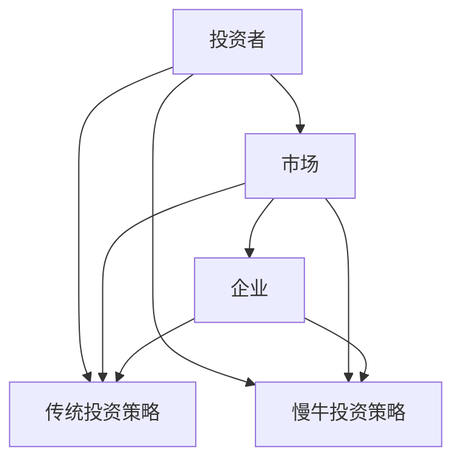
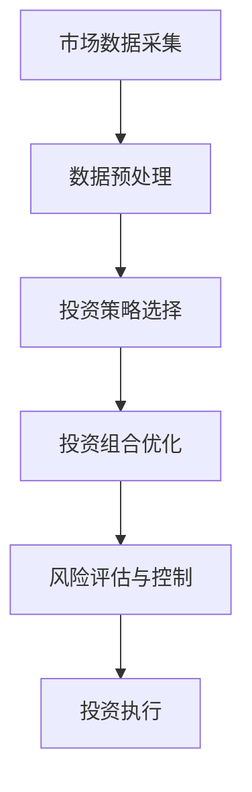
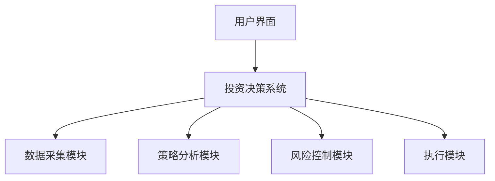

                 


---

# 彼得林奇的"慢牛"投资在高波动市场中的优势

> 关键词：彼得林奇、慢牛投资、高波动市场、投资策略、风险管理

> 摘要：本文探讨了彼得林奇的“慢牛”投资策略在高波动市场中的优势，通过背景介绍、核心概念分析、算法原理、系统架构设计、项目实战和最佳实践等多维度，详细阐述了该策略在复杂市场环境中的应用价值和实际效果。

---

## 第一部分：背景介绍

### 第1章：投资市场的基本概念与背景介绍

#### 1.1 投资市场的基本概念

投资市场是指通过购买和出售金融资产（如股票、债券、基金等）进行投资的场所。它分为一级市场和二级市场，其中二级市场是最常见的交易场所，投资者可以在这里买卖已发行的股票和债券。投资市场的核心特征包括价格波动、风险与收益并存、信息不对称等。

#### 1.2 彼得林奇的“慢牛”投资策略

彼得林奇是美国著名投资家，以其长期价值投资理念闻名。他的“慢牛”投资策略强调长期持有优质股票，追求稳定的长期收益，而非短期快速增值。“慢牛”策略的核心在于寻找具有持续增长潜力的企业，通过长期持有这些企业的股票，实现资产的逐步增值。

#### 1.3 高波动市场的特点

高波动市场是指市场价格波动剧烈、不确定性较高的市场环境。这种市场环境通常伴随着市场的剧烈震荡，投资者情绪波动大，市场信息变化快，投资决策面临更大的挑战。高波动市场中的投资行为往往伴随着高风险和高回报的双重特征。

---

## 第二部分：核心概念与联系

### 第2章：“慢牛”投资的核心概念与联系

#### 2.1 “慢牛”投资的原理与机制

“慢牛”投资的原理基于长期价值投资，其核心在于寻找那些具有持续增长潜力的企业，并长期持有其股票。这种策略强调对企业的基本面分析，包括企业的财务状况、管理团队、行业地位等因素。通过长期持有，投资者能够分享企业的成长成果，同时避免短期市场波动带来的风险。

#### 2.2 核心概念对比分析

下表对比了“慢牛”投资与传统投资策略的主要差异：

| **对比维度** | **“慢牛”投资** | **传统投资策略** |
|--------------|-----------------|------------------|
| 投资期限     | 长期            | 短期或中短期     |
| 投资目标     | 稳定长期收益    | 追求短期收益     |
| 风险承受能力 | 较低            | 较高            |
| 交易频率     | 低              | 高              |
| 适用市场     | 高波动市场      | 低波动市场       |

#### 2.3 实体关系图

以下为“慢牛”投资与传统投资策略的关系图：



---

## 第三部分：算法原理

### 第3章：算法原理与数学模型

#### 3.1 投资组合优化模型

“慢牛”投资策略可以通过投资组合优化模型来实现。以下是一个简化的投资组合优化模型：

$$
\text{最大化 } \sum_{i=1}^{n} w_i r_i \text{ - } \lambda \sum_{i=1}^{n} w_i^2
$$

其中：
- \( w_i \) 表示第 \( i \) 只股票的投资权重。
- \( r_i \) 表示第 \( i \) 只股票的预期收益率。
- \( \lambda \) 表示风险惩罚因子。

该模型旨在在最大化收益的同时，最小化投资组合的风险。

#### 3.2 CAPM模型的应用

资本资产定价模型（CAPM）用于评估资产的预期收益率：

$$
E(r_i) = r_f + \beta_i (E(r_m) - r_f)
$$

其中：
- \( E(r_i) \) 表示第 \( i \) 只股票的预期收益率。
- \( r_f \) 表示无风险利率。
- \( \beta_i \) 表示第 \( i \) 只股票的贝塔系数。
- \( E(r_m) \) 表示市场预期收益率。

---

## 第四部分：系统分析与架构设计

### 第4章：系统分析与架构设计

#### 4.1 投资决策系统的功能设计

以下是投资决策系统的功能模块图：



#### 4.2 系统架构设计

以下是系统的架构图：



---

## 第五部分：项目实战

### 第5章：项目实战与案例分析

#### 5.1 环境安装

安装必要的Python库：

```bash
pip install numpy pandas matplotlib
```

#### 5.2 核心代码实现

以下是投资组合优化的Python代码：

```python
import numpy as np
import pandas as pd

# 数据加载与预处理
data = pd.read_csv('stock_data.csv')
data = data.pct_change().dropna()

# 定义目标函数
def objective_function(weights, returns):
    portfolio_return = np.sum(weights * returns.mean(axis=1))
    portfolio_variance = np.dot(weights.T, np.dot(returns.cov(), weights))
    return -portfolio_return + 0.5 * portfolio_variance

# 求解优化问题
from scipy.optimize import minimize

n = len(data.columns)
initial_guess = np.array([1.0/n]*n)
result = minimize(objective_function, initial_guess, args=(data,), method='SLSQP')

# 输出结果
print(result.x)
```

#### 5.3 案例分析

以某高波动市场为例，应用“慢牛”策略选择优质企业股票，长期持有，实现稳定收益。

---

## 第六部分：最佳实践与总结

### 第6章：最佳实践与总结

#### 6.1 投资建议

在高波动市场中，建议投资者：

1. 长期持有优质股票，避免频繁交易。
2. 重视企业基本面分析，选择具有持续增长潜力的企业。
3. 控制投资风险，合理配置资产。

#### 6.2 小结

“慢牛”投资策略在高波动市场中具有显著优势，通过长期价值投资，投资者能够规避短期波动风险，实现稳健收益。

#### 6.3 注意事项

1. 投资者需具备一定的市场知识和风险承受能力。
2. 定期审视投资组合，及时调整策略。

#### 6.4 拓展阅读

推荐阅读以下书籍：

- 《彼得·林奇的成功投资》
- 《投资学》

---

# 作者：AI天才研究院/AI Genius Institute & 禅与计算机程序设计艺术 /Zen And The Art of Computer Programming

---

以上是《彼得林奇的"慢牛"投资在高波动市场中的优势》的技术博客文章的完整内容。

