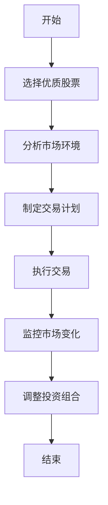

                 


# 彼得林奇的"慢牛"投资在高频交易主导市场中的执行策略优化

---

## 关键词：高频交易，慢牛投资，彼得林奇，投资策略优化，算法交易

---

## 摘要：  
本文探讨了彼得林奇的“慢牛”投资理念在高频交易主导市场中的应用与优化。高频交易的快速发展对传统投资策略提出了新的挑战，本文通过分析高频交易的特点、慢牛投资的核心要素及其在高频交易环境下的优化策略，提出了结合高频交易技术的慢牛投资执行策略，为投资者提供了新的思路。

---

# 第一部分：高频交易与慢牛投资的背景与结合

## 第1章：高频交易与慢牛投资的背景

### 1.1 高频交易的现状与影响
- 高频交易的定义与特点：
  - 高频交易是指通过计算机算法在极短时间内进行大量交易的策略，其特点是速度快、交易频繁、依赖算法。
  - 高频交易的市场规模庞大，占全球股票交易量的大部分。
- 高频交易对市场的双重影响：
  - 优点：提高市场流动性、降低交易成本。
  - 缺点：可能导致市场波动加剧、增加交易成本、引发“闪崩”事件。

### 1.2 慢牛投资策略的背景
- 慢牛投资的定义与特点：
  - 慢牛投资是指通过长期持有优质资产，逐步实现资本增值的投资策略。
  - 该策略强调基本面分析、长期价值和风险控制。
- 慢牛投资在传统市场中的应用：
  - 通过精选优质股票、分散投资、长期持有实现稳健收益。
  - 适用于市场波动较小、长期趋势向上的环境。

### 1.3 彼得林奇投资理念的介绍
- 彼得林奇的投资者背景：
  - 彼得·林奇是美国著名投资家，曾管理富达麦哲伦基金，创造了卓越的投资业绩。
  - 他以价值投资、长期持有和选股能力著称。
- 彼得林奇的核心投资理念：
  - 选择具有持续增长潜力的公司。
  - 长期持有，避免频繁交易。
  - 强调基本面分析和风险管理。
- 彼得林奇理念与现代市场的结合：
  - 在传统市场中，慢牛投资策略表现优异。
  - 在高频交易主导的市场中，需要优化执行策略。

### 1.4 高频交易与慢牛投资的结合
- 高频交易与慢牛投资的优劣势对比：
  | 对比维度 | 高频交易 | 慢牛投资 |
  |----------|----------|----------|
  | 交易频率 | 极高     | 低       |
  | 风险控制 | 高       | 中       |
  | 成本     | 低       | 中       |
  | 收益来源 | 短期价差 | 长期增值 |
- 高频交易环境下慢牛投资的可行性：
  - 市场波动加剧，慢牛投资面临更大的挑战。
  - 需要优化执行策略，降低交易成本，减少市场冲击。
- 高频交易与慢牛投资结合的必要性：
  - 利用高频交易的技术优化慢牛投资的执行。
  - 结合长期价值投资与高频交易的优势。

## 第2章：高频交易与慢牛投资的核心概念与联系

### 2.1 高频交易的核心机制
- 高频交易的算法驱动：
  - 统计套利算法：利用市场短期波动进行套利。
  - 市场微观结构算法：分析订单簿数据，捕捉交易机会。
  - 高频交易的市场微观结构：订单簿、买卖价差、深度等。
- 高频交易的订单流分析：
  - 订单流的特点：高频、大额、算法驱动。
  - 订单流对市场价格的影响：瞬时波动、市场深度变化。
- 高频交易的市场微观结构：
  - 市场深度、买卖价差、订单簿动态。

### 2.2 慢牛投资的核心要素
- 长期价值投资的核心要素：
  - 选择具有持续增长潜力的公司。
  - 长期持有，避免频繁交易。
  - 强调基本面分析和风险管理。
- 慢牛投资的选股策略：
  - 基本面分析：市盈率、市净率、ROE等。
  - 行业分析：选择具有增长潜力的行业。
  - 公司分析：财务状况、管理团队、竞争优势。
- 慢牛投资的风险控制：
  - 分散投资：降低个股风险。
  - 仓位管理：避免过度集中。
  - 定期复检：动态调整投资组合。

### 2.3 高频交易与慢牛投资的联系
- 高频交易对慢牛投资的影响：
  - 市场波动加剧，慢牛投资面临更大的挑战。
  - 高频交易可能导致短期价格偏离长期价值。
  - 高频交易增加了交易成本，影响慢牛投资的收益。
- 慢牛投资在高频交易环境下的优化：
  - 利用高频交易的技术优化慢牛投资的执行。
  - 结合长期价值投资与高频交易的优势。
  - 优化订单执行策略，降低交易成本。

---

## 第3章：高频交易与慢牛投资的算法原理

### 3.1 高频交易算法分析
- 统计套利算法：
  - 基于统计套利理论，利用短期价格波动进行套利。
  - 例如，利用两个资产的价格差异进行套利。
- 市场微观结构算法：
  - 基于订单簿数据，分析市场深度和买卖价差。
  - 例如，利用订单簿数据预测短期价格走势。
- 高频交易算法的优劣势：
  - 优点：交易速度快、成本低。
  - 缺点：容易受到市场波动的影响，风险较高。

### 3.2 慢牛投资策略优化算法
- 长期价值评估算法：
  - 基于基本面分析，评估公司的长期价值。
  - 例如，利用市盈率、市净率等指标筛选优质股票。
- 风险控制算法：
  - 基于风险承受能力，动态调整投资组合。
  - 例如，利用现代投资组合理论优化资产配置。
- 慢牛投资策略优化的算法流程图：



### 3.3 高频交易与慢牛投资算法的结合
- 高频交易算法对慢牛投资策略的影响：
  - 高频交易算法可以优化慢牛投资的执行策略。
  - 例如，利用高频交易算法优化订单执行路径，降低交易成本。
- 慢牛投资策略对高频交易算法的优化：
  - 慢牛投资策略可以为高频交易算法提供长期价值信号。
  - 例如，利用长期价值信号优化高频交易的交易策略。

---

## 第4章：数学模型与公式分析

### 4.1 高频交易中的数学模型
- 统计套利模型：
  - 假设资产A和资产B存在套利机会。
  - 利用统计套利模型预测两者的价差回归均值。
  - 例如，利用均值回归模型预测套利机会。
- 市场微观结构模型：
  - 基于订单簿数据，分析市场深度和买卖价差。
  - 例如，利用订单簿模型预测短期价格走势。

### 4.2 慢牛投资中的数学模型
- 长期价值评估模型：
  - 基于基本面指标（如市盈率、市净率等）评估公司价值。
  - 例如，利用现金流折现模型评估公司内在价值。
- 风险控制模型：
  - 基于现代投资组合理论优化资产配置。
  - 例如，利用马科维茨均值-方差模型优化投资组合。

### 4.3 高频交易与慢牛投资结合的数学模型
- 结合高频交易算法与慢牛投资策略的数学模型：
  - 例如，利用统计套利模型优化订单执行路径。
  - 利用现代投资组合理论优化资产配置。
  - 利用订单簿模型预测市场波动，优化投资组合的风险控制。

---

## 第5章：系统分析与架构设计

### 5.1 高频交易与慢牛投资的系统架构
- 高频交易系统架构：
  - 数据采集模块：实时采集市场数据。
  - 信号生成模块：基于算法生成交易信号。
  - 执行策略模块：优化订单执行策略。
  - 风险控制模块：实时监控市场风险。
- 慢牛投资系统架构：
  - 数据分析模块：基于基本面分析筛选优质股票。
  - 交易计划模块：制定长期交易计划。
  - 风险控制模块：动态调整投资组合。

### 5.2 高频交易与慢牛投资结合的系统架构
- 综合系统架构：
  - 数据采集模块：实时采集市场数据和基本面数据。
  - 信号生成模块：基于高频交易算法生成短期交易信号。
  - 长期投资计划模块：基于慢牛投资策略制定长期投资计划。
  - 执行策略模块：优化订单执行策略。
  - 风险控制模块：实时监控市场风险，动态调整投资组合。

### 5.3 系统接口设计
- 高频交易与慢牛投资结合的系统接口：
  - 数据接口：实时数据接口与历史数据接口。
  - 交易接口：订单提交接口与交易确认接口。
  - 风险控制接口：风险监控接口与风险预警接口。

### 5.4 系统交互设计
- 高频交易与慢牛投资结合的系统交互：
  - 用户输入交易指令。
  - 系统根据交易指令生成交易信号。
  - 系统优化订单执行策略。
  - 系统实时监控市场风险，动态调整投资组合。

---

## 第6章：项目实战

### 6.1 环境配置
- 高频交易与慢牛投资结合的系统环境配置：
  - 数据源：实时市场数据接口。
  - 算法库：高频交易算法库与慢牛投资策略库。
  - 系统架构：分布式架构，支持高频交易与慢牛投资结合的系统。

### 6.2 核心实现
- 高频交易算法实现：
  - 统计套利算法实现：基于Python的统计套利模型。
  - 市场微观结构算法实现：基于订单簿数据的算法实现。
- 慢牛投资策略实现：
  - 长期价值评估模型实现：基于基本面指标的选股策略。
  - 风险控制模型实现：基于现代投资组合理论的风险控制。

### 6.3 实际案例分析
- 高频交易与慢牛投资结合的实际案例：
  - 某股票的基本面分析与长期价值评估。
  - 高频交易算法优化订单执行路径。
  - 动态调整投资组合，降低市场风险。

### 6.4 代码实现与解读
- 高频交易算法代码实现：
  ```python
  def statistical_arbitrage_model(price_data):
      # 统计套利模型实现
      # 输入：价格数据
      # 输出：套利信号
      # 均值回归模型实现
      # 计算价差
      spread = price_data['资产A'] - price_data['资产B']
      # 计算均值回归信号
      mean = spread.mean()
      std = spread.std()
      z_score = (spread - mean) / std
      # 生成套利信号
      signal = z_score.apply(lambda x: 1 if x > 2 else 0)
      return signal
  ```
- 慢牛投资策略代码实现：
  ```python
  def value_investing_model(fundamental_data):
      # 长期价值评估模型实现
      # 输入：基本面数据
      # 输出：优质股票筛选结果
      # 计算基本面指标
      pe_ratio = fundamental_data['市盈率']
      pb_ratio = fundamental_data['市净率']
      roe = fundamental_data['ROE']
      # 优质股票筛选标准
      selected = pe_ratio < pe_ratio.mean() & pb_ratio < pb_ratio.mean() & roe > roe.mean()
      return selected
  ```

---

## 第7章：总结与展望

### 7.1 最佳实践 tips
- 高频交易与慢牛投资结合的最佳实践：
  - 利用高频交易技术优化慢牛投资的执行策略。
  - 结合长期价值投资与高频交易的优势。
  - 动态调整投资组合，降低市场风险。

### 7.2 小结
- 本文总结了高频交易与慢牛投资的核心概念与联系。
- 探讨了高频交易与慢牛投资结合的算法原理与数学模型。
- 实现了高频交易与慢牛投资结合的系统架构与代码实现。

### 7.3 注意事项
- 高频交易与慢牛投资结合的风险：
  - 市场波动加剧，投资风险增加。
  - 高频交易算法可能受到市场环境的影响。
  - 需要实时监控市场风险，动态调整投资策略。

### 7.4 拓展阅读
- 推荐阅读的书籍与论文：
  - 《彼得·林奇的成功投资：选股在什么时候，怎样买入并卖出》
  - 《算法交易：机深浅说量化投资》
  - 《高频交易：数据驱动的技术与策略》

---

## 作者：AI天才研究院/AI Genius Institute & 禅与计算机程序设计艺术 /Zen And The Art of Computer Programming

