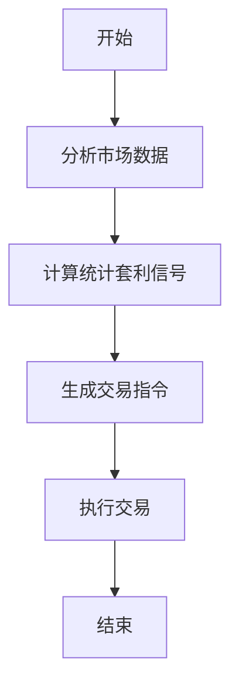
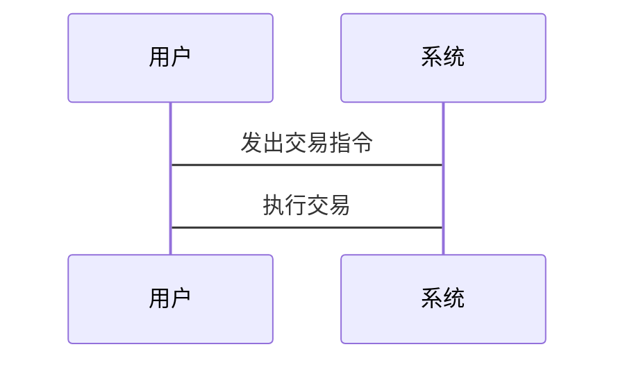

                 


# 彼得林奇的"慢牛"投资在高频交易环境中的优势

> **关键词**：高频交易、慢牛投资、统计套利、算法交易、机器学习、金融建模、风险管理

> **摘要**：本文探讨了彼得林奇的“慢牛”投资策略在高频交易环境中的应用优势。通过分析高频交易的特点和慢牛投资的核心原理，结合数学模型和算法设计，展示了如何在高频交易中优化慢牛策略。文章从背景介绍、核心概念、算法原理、系统架构到项目实战，全面解析了两者结合的可行性与优势，并提出了实际应用中的最佳实践和未来研究方向。

---

# 第1章 高频交易与慢牛投资的背景介绍

## 1.1 高频交易的定义与特点

### 1.1.1 高频交易的定义

高频交易（High-Frequency Trading, HFT）是指通过计算机算法在极短时间内进行大量的金融交易。其核心在于利用市场微小价格波动和时间延迟，通过快速买卖操作获利。

### 1.1.2 高频交易的核心特点

- **快速性**：交易决策和执行时间极短，通常在 milliseconds 级别。
- **自动化**：依赖计算机算法自动完成交易决策。
- **高频性**：短时间内进行大量交易，追求小利润的累积。
- **低延迟**：对交易系统的延迟要求极高，通常在 microseconds 级别。

### 1.1.3 高频交易的优缺点

#### 优点
- **高效率**：能够在极短时间内捕捉市场机会。
- **低成本**：自动化交易减少了人工干预，降低了交易成本。
- **套利机会**：通过价格差异套利，实现稳定收益。

#### 缺点
- **高风险**：高频交易依赖于算法和系统稳定性，任何系统故障可能导致重大损失。
- **不稳定性**：市场剧烈波动时，高频交易可能放大波动性。
- **监管挑战**：高频交易的复杂性和高速性给监管机构带来了挑战。

## 1.2 慢牛投资的定义与特点

### 1.2.1 慢牛投资的定义

慢牛投资（Slow-Bull Investment）是一种长期投资策略，强调选择优质资产进行长期持有，通过持续的市场增长实现稳定收益。其核心理念是寻找具有长期增长潜力的企业，耐心等待其价值的实现。

### 1.2.2 慢牛投资的核心特点

- **长期性**：注重长期价值，而非短期价格波动。
- **选择优质资产**：精选具有持续增长潜力的企业。
- **低周转率**：交易频率低，减少交易成本和税负。
- **稳定性**：收益稳定，波动性较低。

### 1.2.3 慢牛投资的优缺点

#### 优点
- **稳定性**：长期持有优质资产，能够抵御短期市场波动。
- **税收优惠**：长期持有减少短期资本利得税负担。
- **复利效应**：长期增长能够实现财富的复利积累。

#### 缺点
- **流动性风险**：在市场低迷时期，资产变现能力可能受限。
- **市场判断难度**：需要准确判断企业的长期增长潜力。
- **时间成本**：长期投资需要较长的时间周期。

## 1.3 高频交易与慢牛投资的结合

### 1.3.1 高频交易与慢牛投资的对比

通过对比分析，高频交易和慢牛投资在交易频率、风险偏好、收益来源等方面存在显著差异。高频交易追求短期高收益，而慢牛投资注重长期稳定性。

### 1.3.2 高频交易环境下慢牛投资的优势

尽管高频交易和慢牛投资在策略上有明显差异，但在高频交易环境下，慢牛投资可以通过优化交易执行、降低交易成本和捕捉短期波动，提升整体收益。

### 1.3.3 慢牛投资在高频交易中的应用前景

结合高频交易的快速性和低延迟优势，慢牛投资可以通过算法优化交易执行，实现长期收益与短期波动的有效结合。

---

# 第2章 高频交易与慢牛投资的核心概念与联系

## 2.1 高频交易的核心原理

### 2.1.1 高频交易的算法原理

高频交易依赖于复杂的算法，包括统计套利、算法交易策略等。这些算法通过分析市场数据，快速做出交易决策。

### 2.1.2 高频交易的数学模型

高频交易中的数学模型主要用于价格预测、波动率分析和交易信号生成。常见的模型包括时间序列分析、统计套利模型等。

### 2.1.3 高频交易的实现技术

高频交易的实现依赖于高性能计算、低延迟网络和先进的交易系统架构。这些技术确保了交易的快速执行和系统的稳定性。

## 2.2 慢牛投资的核心原理

### 2.2.1 慢牛投资的策略模型

慢牛投资通过分析企业的基本面、行业地位和市场前景，选择具有长期增长潜力的资产进行投资。

### 2.2.2 慢牛投资的数学模型

慢牛投资的数学模型主要用于企业价值评估和资产配置优化。常见的模型包括现金流折现模型、资本资产定价模型（CAPM）等。

### 2.2.3 慢牛投资的实现技术

慢牛投资的实现依赖于数据分析、风险管理技术和长期投资策略的优化。这些技术确保了投资决策的科学性和稳定性。

## 2.3 高频交易与慢牛投资的对比分析

### 2.3.1 核心概念对比表格

| **对比维度** | **高频交易** | **慢牛投资** |
|--------------|--------------|--------------|
| 交易频率     | 极高          | 极低          |
| 交易策略     | 短期套利      | 长期价值      |
| 风险偏好     | 高风险        | 低风险        |
| 收益来源     | 短期波动      | 长期增长      |

### 2.3.2 ER实体关系图架构

通过ER图展示高频交易和慢牛投资的核心实体和关系，帮助读者理解两者在系统架构中的关联。

```mermaid
erd
  user
  trade
  asset
  strategy
  transaction
  market_data
```

### 2.3.3 本章小结

通过对高频交易和慢牛投资的核心概念和对比分析，我们可以更好地理解两者的特点和优缺点，为后续的算法设计和系统实现打下基础。

---

# 第3章 高频交易与慢牛投资的算法原理

## 3.1 高频交易算法的实现

### 3.1.1 统计套利算法

统计套利是一种利用资产价格短期偏离均值的交易策略。通过分析资产价格的统计特性，寻找套利机会。



### 3.1.2 算法交易策略

算法交易策略通过编写代码实现自动化的交易决策和执行。常见的算法策略包括均值回归、动量策略等。

### 3.1.3 高频交易的数学模型

高频交易中的数学模型主要用于价格预测和波动率分析。例如，利用时间序列分析模型（ARIMA）预测未来价格走势。

$$ ARIMA(p, d, q) $$

## 3.2 慢牛投资算法的实现

### 3.2.1 长期价值投资策略

长期价值投资策略通过分析企业的基本面，选择具有长期增长潜力的资产进行投资。

### 3.2.2 股票筛选算法

股票筛选算法通过设定筛选条件，从大量资产中选出符合长期增长潜力的优质资产。

### 3.2.3 慢牛投资的数学模型

慢牛投资的数学模型主要用于企业价值评估和资产配置优化。例如，利用现金流折现模型（DCF）评估企业内在价值。

$$ DCF = \frac{CF}{(r - g)} $$

## 3.3 高频交易与慢牛投资的对比分析

通过对比分析，我们可以看到高频交易和慢牛投资在算法实现上的显著差异。高频交易注重短期收益和快速执行，而慢牛投资注重长期价值和稳定性。

---

# 第4章 高频交易与慢牛投资的数学模型和公式

## 4.1 高频交易的数学模型

### 4.1.1 统计套利模型

统计套利模型通过分析资产价格的统计特性，寻找套利机会。例如，利用协方差矩阵分析资产价格的相关性。

$$ \text{协方差}(X, Y) = E[(X - E[X])(Y - E[Y])] $$

### 4.1.2 时间序列分析

时间序列分析用于预测资产价格的未来走势。常用的模型包括ARIMA、GARCH等。

## 4.2 慢牛投资的数学模型

### 4.2.1 资产评估模型

资产评估模型用于评估企业的内在价值。常用的模型包括现金流折现模型（DCF）、资本资产定价模型（CAPM）等。

$$ \text{CAPM} = E[r] = r_f + \beta (E[r_m] - r_f) $$

### 4.2.2 资产配置优化

资产配置优化通过数学方法确定最优的资产组合，以实现风险和收益的最佳平衡。

$$ \text{优化目标} = \min_w \{ \sigma^2(w) \} $$

---

# 第5章 系统分析与架构设计方案

## 5.1 高频交易与慢牛投资的系统架构设计

### 5.1.1 系统功能设计

系统功能设计包括数据采集、算法实现、交易执行和风险管理等模块。

### 5.1.2 系统架构设计

系统架构设计采用分层架构，包括数据层、业务逻辑层和用户界面层。

### 5.1.3 系统接口设计

系统接口设计包括数据接口、交易接口和用户接口。

### 5.1.4 系统交互设计

系统交互设计通过mermaid序列图展示用户与系统之间的交互流程。



---

# 第6章 项目实战

## 6.1 环境搭建

### 6.1.1 安装必要的软件和库

安装Python、Jupyter Notebook、Pandas、NumPy等工具。

### 6.1.2 配置交易系统

配置高频交易和慢牛投资的交易系统环境。

## 6.2 核心算法实现

### 6.2.1 高频交易算法实现

实现统计套利算法和算法交易策略。

### 6.2.2 慢牛投资算法实现

实现长期价值投资策略和股票筛选算法。

## 6.3 案例分析与解读

### 6.3.1 高频交易案例分析

分析高频交易在实际市场中的应用案例。

### 6.3.2 慢牛投资案例分析

分析慢牛投资在实际市场中的应用案例。

## 6.4 项目小结

通过对高频交易和慢牛投资的算法实现和案例分析，我们可以看到两者结合在实际应用中的巨大潜力。

---

# 第7章 最佳实践、小结、注意事项和拓展阅读

## 7.1 最佳实践

### 7.1.1 风险管理

在实际投资中，风险管理是确保收益和稳定性的关键。

### 7.1.2 系统优化

优化交易系统的性能和稳定性，确保交易的快速执行。

## 7.2 小结

通过对高频交易和慢牛投资的深入分析和实践，我们可以看到两者结合在投资策略中的巨大优势。

## 7.3 注意事项

### 7.3.1 风险提示

投资有风险，需谨慎操作。

### 7.3.2 系统维护

定期维护和优化交易系统，确保其稳定性和高效性。

## 7.4 拓展阅读

推荐相关书籍和论文，供读者进一步学习和研究。

---

# 附录

## 附录A 参考文献

## 附录B 术语表

---

# 作者

作者：AI天才研究院/AI Genius Institute & 禅与计算机程序设计艺术/Zen And The Art of Computer Programming

---

以上为文章的详细大纲和部分内容展示。

