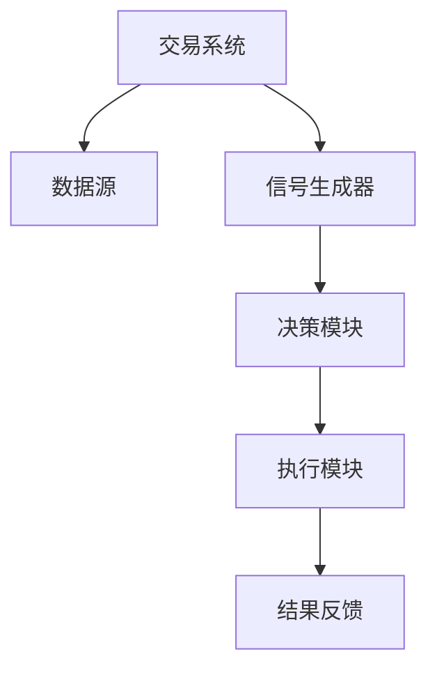
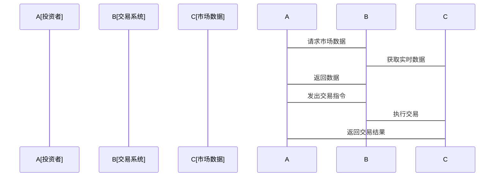

                 


# 彼得林奇的"慢牛"投资在高频交易环境中的心理建设

> 关键词：彼得林奇，慢牛投资，高频交易，心理建设，投资策略

> 摘要：本文深入探讨了彼得林奇的“慢牛”投资理念在高频交易环境中的心理建设。通过分析高频交易的特点及其对投资者心理的影响，结合“慢牛”投资的核心理念，提出了在高频交易环境中如何实现心理调适的具体方法。文章从理论到实践，详细阐述了如何将“慢牛”投资策略与高频交易环境相结合，并通过实际案例分析和系统设计，为投资者提供了实用的心理建设指导。

---

## 第一部分：背景介绍

### 第1章：彼得林奇的“慢牛”投资理念

#### 1.1 “慢牛”投资的定义与特点

“慢牛”投资是一种强调长期稳定增长的投资策略，其核心理念是通过精选优质资产，耐心持有，避免频繁交易，从而实现资本的长期增值。与传统投资相比，“慢牛”投资更注重基本面分析和长期趋势判断，而非短期市场波动。

- **定义**：通过长期持有优质资产，逐步实现资本增值的投资方式。
- **特点**：
  - 长期性：注重资产的长期价值，而非短期收益。
  - 稳定性：通过精选优质资产，降低投资风险。
  - 耐心性：不追求短期收益，而是通过时间积累财富。

#### 1.2 彼得林奇的投资理念

彼得林奇是全球著名投资家，他的“慢牛”投资理念强调对企业的深入研究和长期持有。他认为，成功的投资需要选择那些具有持续增长潜力的企业，并耐心等待其成长。

- **核心观点**：
  - 投资者应关注企业的基本面，而非市场的短期波动。
  - 长期持有优质资产是实现财富增长的关键。
  - 避免频繁交易，减少交易成本和情绪干扰。

#### 1.3 “慢牛”投资在高频交易环境中的应用

高频交易是一种以极快速度进行买卖交易的交易方式，其特点是交易频率高、算法驱动、依赖技术优势。在高频交易环境中，如何将“慢牛”投资理念与高频交易相结合，是本文的核心问题。

---

### 第2章：高频交易环境的特点与挑战

#### 2.1 高频交易的定义与特点

高频交易是一种依赖算法和高速网络的交易方式，其特点是交易频率高、算法驱动、技术依赖性强。

- **定义**：高频交易是指在极短的时间内，通过算法和自动化系统进行大量买卖交易的行为。
- **特点**：
  - 交易速度快：依赖高速网络和低延迟技术。
  - 算法驱动：通过复杂算法自动执行交易。
  - 数据依赖：依赖实时市场数据和高频交易策略。

#### 2.2 高频交易对心理的影响

高频交易的高风险和高压力对投资者的心理产生了显著影响，包括情绪波动、决策疲劳和心理压力。

- **情绪波动**：高频交易的快节奏和不确定性容易引发投资者的情绪波动。
- **决策疲劳**：高频交易需要快速决策，容易导致决策疲劳。
- **心理压力**：高频交易的高风险和高收益并存，容易导致投资者的心理压力。

#### 2.3 高频交易环境中的心理建设

在高频交易环境中，心理建设是投资者成功的关键。投资者需要通过心理调适、情绪控制和决策优化来应对高频交易的挑战。

- **心理调适**：通过心理训练和认知调整，增强心理韧性。
- **情绪控制**：通过情绪管理技巧，减少情绪波动对决策的影响。
- **决策优化**：通过优化决策流程，提高决策效率和准确性。

---

## 第二部分：核心概念与联系

### 第3章：“慢牛”投资理念与高频交易的结合

#### 3.1 “慢牛”投资与高频交易的结合

在高频交易环境中，如何将“慢牛”投资理念与高频交易相结合，是本文的核心问题。

- **结合的必要性**：高频交易的高风险和高压力需要通过“慢牛”投资的理念来实现心理平衡。
- **结合的方式**：通过心理建设，将“慢牛”投资的长期性与高频交易的快速性相结合。

#### 3.2 高频交易环境中的心理调适

在高频交易环境中，投资者需要通过心理调适来应对高压力和高风险。

- **心理调适的目标**：实现心理平衡，减少情绪波动，提高决策效率。
- **心理调适的方法**：通过认知调整、情绪管理和行为训练，增强心理韧性。

#### 3.3 心理调适的具体方法

- **认知调整**：通过认知行为疗法，调整投资者的思维方式。
- **情绪管理**：通过情绪调节技巧，减少情绪波动对决策的影响。
- **行为训练**：通过模拟交易和心理训练，提高投资者的心理素质。

---

## 第三部分：算法原理讲解

### 第4章：高频交易算法的实现

#### 4.1 高频交易算法的流程

- **市场数据接收**：通过高频数据接口接收实时市场数据。
- **信号生成**：通过算法分析市场数据，生成交易信号。
- **决策执行**：根据交易信号，执行买卖交易。
- **结果反馈**：通过反馈机制，优化交易策略。

#### 4.2 高频交易算法的数学模型

- **交易信号生成模型**：通过统计套利和算法交易，生成交易信号。
- **交易成本优化模型**：通过优化交易成本，提高交易效率。
- **风险控制模型**：通过风险控制算法，降低交易风险。

#### 4.3 高频交易算法的Python实现

```python
import numpy as np
import pandas as pd

def generate_signals(data):
    # 生成交易信号
    signals = pd.Series(np.zeros(len(data)))
    signals[data['close'] > data['ema_20']] = 1
    return signals

def execute_trades(signals):
    # 执行交易
    positions = pd.Series(np.zeros(len(signals)))
    positions[signals == 1] = 1
    return positions

# 示例数据
data = pd.DataFrame({'close': np.random.randn(100).cumsum(), 'ema_20': np.zeros(100)})
signals = generate_signals(data)
positions = execute_trades(signals)
```

---

## 第四部分：系统分析与架构设计方案

### 第5章：高频交易系统的架构设计

#### 5.1 系统功能设计

- **数据采集**：通过高频数据接口采集实时市场数据。
- **信号生成**：通过算法生成交易信号。
- **决策执行**：根据交易信号执行买卖交易。
- **结果反馈**：通过反馈机制优化交易策略。

#### 5.2 系统架构设计



#### 5.3 系统接口设计

- **数据接口**：通过API接口接收市场数据。
- **信号接口**：通过信号生成器生成交易信号。
- **执行接口**：通过执行模块执行买卖交易。

#### 5.4 系统交互设计



---

## 第五部分：项目实战

### 第6章：高频交易环境中的心理建设实战

#### 6.1 环境搭建

- **硬件环境**：高性能计算机、高速网络和低延迟设备。
- **软件环境**：高频交易系统、数据分析工具和算法交易平台。

#### 6.2 心理建设的核心实现

- **认知调整**：通过认知行为疗法调整投资者的思维方式。
- **情绪管理**：通过情绪调节技巧减少情绪波动对决策的影响。
- **行为训练**：通过模拟交易和心理训练提高投资者的心理素质。

#### 6.3 心理建设的案例分析

- **案例背景**：某高频交易投资者在市场波动中情绪波动较大，导致交易亏损。
- **心理建设过程**：通过认知调整、情绪管理和行为训练，帮助投资者实现心理平衡。
- **结果分析**：通过心理建设，投资者的交易表现显著提高。

---

## 第六部分：最佳实践

### 第7章：心理建设的最佳实践

#### 7.1 心理建设的小结

- **核心观点**：心理建设是高频交易环境中投资者成功的关键。
- **关键点**：通过认知调整、情绪管理和行为训练实现心理平衡。
- **注意事项**：投资者需要长期坚持心理建设，避免短期情绪波动影响决策。

#### 7.2 心理建设的注意事项

- **长期性**：心理建设是一个长期过程，需要持续努力。
- **个体化**：心理建设方法需要根据投资者的个性和需求进行调整。
- **专业性**：心理建设需要专业的指导和帮助。

#### 7.3 心理建设的未来展望

- **技术进步**：随着人工智能和大数据技术的发展，心理建设将更加科学和精准。
- **结合创新**：心理建设将与更多的投资策略相结合，实现更优的投资效果。
- **全球化**：心理建设将更加全球化和国际化，帮助投资者应对全球市场的挑战。

---

## 作者

作者：AI天才研究院/AI Genius Institute & 禅与计算机程序设计艺术 /Zen And The Art of Computer Programming

