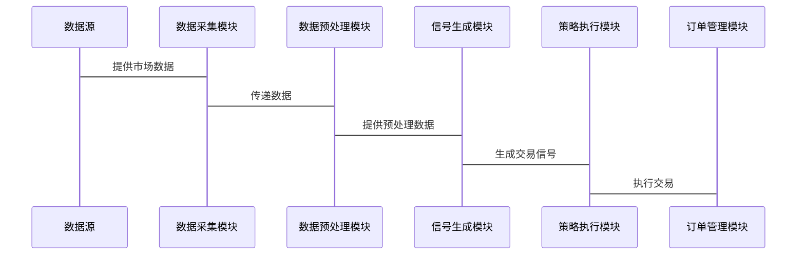
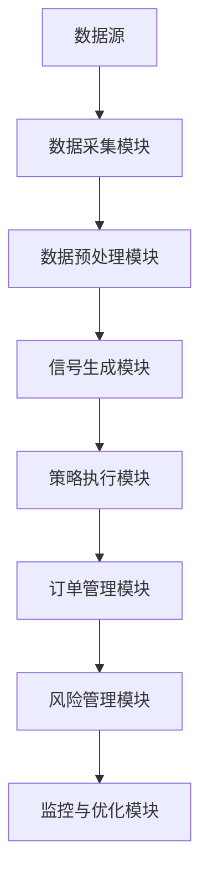

                 


# 彼得林奇的"慢牛"投资在高频交易环境中的执行策略

> 关键词：彼得林奇，慢牛投资，高频交易，算法交易，风险管理

> 摘要：本文探讨了彼得林奇的“慢牛”投资理念在高频交易环境中的应用策略，分析了高频交易对传统投资策略的影响，并提出了结合长期投资与高频交易的执行框架，包括系统架构设计、算法实现和实际案例分析。

---

## 第一部分：背景介绍

### 第1章：彼得林奇“慢牛”投资理念概述

#### 1.1 彼得林奇投资理念的核心思想

彼得林奇是美国著名投资家，以其长期稳健的投资策略闻名。他的“慢牛”投资理念强调通过深入研究公司基本面，选择具有长期增长潜力的股票，并进行长期持有。这种策略的核心在于寻找低估的股票，耐心等待其价值回归，而非频繁交易以追求短期收益。

**关键点：**
- 长期投资
- 价值发现
- 风险控制

#### 1.2 高频交易的基本概念

高频交易是一种利用先进的技术手段，在极短时间内进行大量交易的策略。其主要特点包括：
1. 高频次交易：短时间内执行大量订单。
2. 算法驱动：依赖复杂的算法和计算机系统自动执行交易。
3. 低延迟：交易系统必须具备极低的延迟，以确保快速反应市场变化。

**关键点：**
- 算法交易
- 低延迟
- 高频次

#### 1.3 “慢牛”投资理念与高频交易的结合

高频交易环境下，“慢牛”投资策略的执行面临新的挑战。传统“慢牛”策略依赖于长期持有，而高频交易强调快速反应。然而，通过优化算法和交易策略，可以在高频交易环境中实现类似“慢牛”策略的效果。

---

## 第二部分：高频交易环境下的策略执行框架

### 第2章：高频交易环境下的策略执行框架

#### 2.1 高频交易中的算法交易模型

高频交易依赖于复杂的算法模型，这些模型通过分析市场数据，快速生成交易信号。常见的算法包括统计套利算法、算法交易模型等。

**统计套利算法：**
- 基于统计学方法，寻找资产之间的价格偏差。
- 通过高频交易捕捉短期价格波动。

**算法交易模型：**
- 包括时间序列分析、均值回归等模型。
- 算法模型用于生成交易信号，并指导交易执行。

#### 2.2 高频交易中的数学模型与公式

##### 2.2.1 时间序列分析模型

时间序列分析是高频交易中常用的数学工具，用于预测未来的价格走势。

$$ y_t = c + \phi y_{t-1} + \theta \epsilon_{t-1} + \epsilon_t $$

其中，$y_t$ 表示t时刻的价格，$\phi$ 和 $\theta$ 是模型参数，$\epsilon_t$ 是误差项。

##### 2.2.2 均值回归模型

均值回归模型假设价格会回归到长期均值水平。

$$ E[y_t] = \mu + \beta t $$

其中，$\mu$ 是长期均值，$\beta$ 是趋势系数。

##### 2.2.3 马科维茨优化模型

马科维茨模型用于优化投资组合，以最大化收益并最小化风险。

$$ \min_{w} \frac{1}{2} w^T \Sigma w $$
$$ \text{subject to} \quad w^T \mu = \text{target return} $$

其中，$w$ 是投资权重向量，$\Sigma$ 是协方差矩阵，$\mu$ 是收益向量。

#### 2.3 高频交易中的信号生成与执行策略

##### 2.3.1 信号生成的数学模型

基于均值回归模型，生成交易信号：

$$ \text{如果当前价格 > 短期均值，则卖出} $$
$$ \text{如果当前价格 < 短期均值，则买入} $$

##### 2.3.2 策略执行的时序图

以下是一个简单的交易信号生成与执行的时序图：



---

## 第三部分：高频交易环境下的系统架构与实现

### 第3章：高频交易系统架构设计

#### 3.1 系统架构概述

高频交易系统通常包括以下几个模块：
1. 数据源：提供实时市场数据。
2. 数据采集模块：接收并解析市场数据。
3. 数据预处理模块：对数据进行清洗和转换。
4. 信号生成模块：基于算法模型生成交易信号。
5. 策略执行模块：根据信号执行交易。
6. 订单管理模块：管理交易订单。
7. 风险管理模块：监控并管理交易风险。

#### 3.2 系统功能设计

##### 3.2.1 数据采集与预处理

数据采集模块需要从多个数据源（如交易所API）获取实时数据，并将其传递给数据预处理模块。数据预处理包括清洗、标准化等步骤。

##### 3.2.2 信号生成与策略选择

信号生成模块基于算法模型生成交易信号，并将其传递给策略执行模块。策略执行模块根据信号生成订单，并提交给订单管理模块。

##### 3.2.3 策略执行与订单管理

订单管理模块负责管理所有交易订单，并将其提交给交易所执行。

##### 3.2.4 风险监控与调整

风险管理模块实时监控交易风险，并根据市场变化调整交易策略。

#### 3.3 系统架构图（Mermaid）

以下是一个高频交易系统的架构图：



---

## 第四部分：高频交易环境下的项目实战

### 第4章：高频交易系统核心实现

#### 4.1 环境安装

为了实现高频交易系统，需要安装以下工具和库：
- Python编程语言
- 数据处理库（如Pandas、NumPy）
- 数据可视化库（如Matplotlib）
- 交易API接口（如Interactive Brokers）

#### 4.2 核心实现代码

##### 4.2.1 数据获取与预处理

以下是一个简单的数据获取代码：

```python
import pandas as pd
import numpy as np

# 获取数据
data = pd.read_csv('data.csv')

# 数据预处理
data['date'] = pd.to_datetime(data['date'])
data.set_index('date', inplace=True)
data = data['close'].resample('5T').mean()
```

##### 4.2.2 信号生成与策略执行

以下是一个基于均值回归的信号生成代码：

```python
import pandas as pd
import numpy as np

def generate_signal(data, window=20):
    # 计算短期均值
   短期均值 = data.rolling(window).mean()
    
    # 生成信号
    signal = []
    for i in range(len(data)):
        if data.iloc[i] > 短期均值.iloc[i]:
            signal.append(0)  # 卖出
        elif data.iloc[i] < 短期均值.iloc[i]:
            signal.append(1)  # 买入
        else:
            signal.append(2)  # 无操作
    return signal

signal = generate_signal(data)
```

##### 4.2.3 风险管理与订单执行

以下是一个简单的风险管理代码：

```python
import pandas as pd
import numpy as np

def manage_risk(signal, data, max_pos=1):
    position = 0
    for i in range(len(signal)):
        if signal[i] == 1 and position == 0:
            # 买入
            position += 1
        elif signal[i] == 0 and position > 0:
            # 卖出
            position -= 1
    return position
```

---

## 第五部分：总结与展望

### 第5章：总结与展望

#### 5.1 策略总结

通过本文的分析，我们探讨了彼得林奇的“慢牛”投资理念在高频交易环境中的应用策略。结合算法交易和高频交易的特点，提出了一个基于均值回归模型的交易信号生成与执行框架，并通过具体的代码实现展示了如何在高频交易环境中实现“慢牛”策略。

#### 5.2 策略优缺点

**优点：**
- 快速反应市场变化
- 精准捕捉价格波动
- 风险可控

**缺点：**
- 交易成本高
- 算法复杂，需要大量计算资源
- 市场深度不足时效果不佳

#### 5.3 未来展望

未来的研究方向可以包括：
1. 更复杂的算法模型，如深度学习模型，用于生成交易信号。
2. 更高效的交易系统架构，以应对更高频率的交易需求。
3. 更完善的风险管理机制，以应对高频交易中的各种风险。

---

## 附录：最佳实践 Tips

- **硬件优化：** 高频交易需要强大的计算能力，建议使用高性能计算机和低延迟网络。
- **数据源选择：** 选择可靠的市场数据源，确保数据的实时性和准确性。
- **风险管理：** 严格的风险管理是高频交易成功的关键，建议使用先进的风险管理工具。
- **算法优化：** 不断优化算法模型，以适应市场的变化。

---

**作者：AI天才研究院/AI Genius Institute & 禅与计算机程序设计艺术 /Zen And The Art of Computer Programming**

