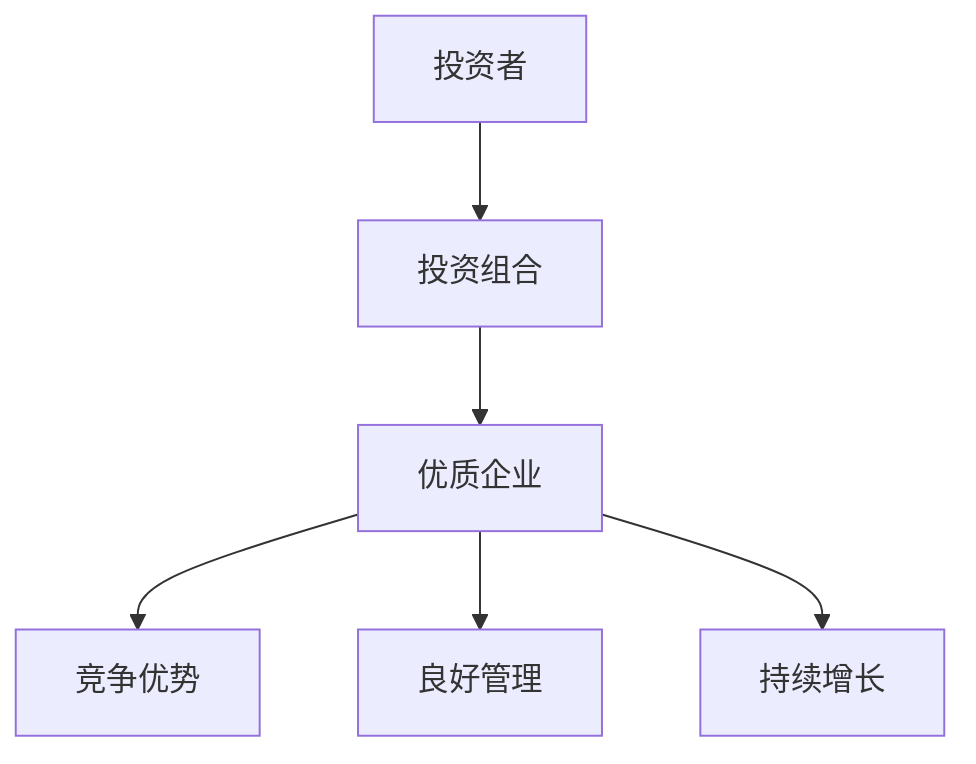
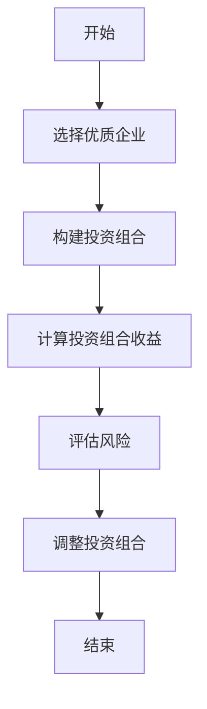
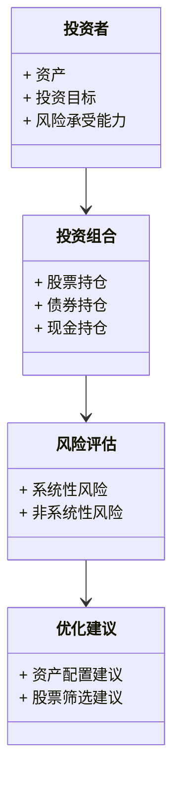

                 


# 彼得林奇的"慢牛"投资理念探讨

> 关键词：彼得林奇，慢牛投资，投资理念，价值投资，系统设计，项目实战

> 摘要：本文探讨了彼得林奇的“慢牛”投资理念，从其核心思想、数学模型、系统设计到实际项目案例，详细分析了该理念在投资领域中的应用。通过理论与实践相结合的方式，帮助读者理解并掌握这一长期稳健的投资策略。

---

## 第一部分：背景介绍

### 第1章：彼得林奇“慢牛”投资理念的起源

#### 1.1 投资理念的起源
- **1.1.1 彼得·林奇的生平简介**
  彼得·林奇（Peter Lynch）是美国著名的投资专家，被誉为“成长股投资之父”。他在富达投资集团管理麦哲伦基金期间，取得了卓越的投资业绩，成为全球投资领域的传奇人物。

- **1.1.2 “慢牛”理念的提出背景**
  彼得·林奇在长期的投资实践中发现，许多投资者追求短期暴利，往往忽视了投资的本质——长期价值的创造。他提出“慢牛”理念，强调通过选择优质企业，实现长期稳定的收益。

- **1.1.3 理念的核心思想与目标**
  “慢牛”理念的核心思想是通过投资于具有持续增长潜力的企业，避免短期市场波动的风险，实现长期稳健的收益。其目标是帮助投资者在不承担过高风险的前提下，实现资产的长期增值。

#### 1.2 “慢牛”投资理念的核心概念
- **1.2.1 长期稳定的收益**
  “慢牛”理念强调长期投资，通过持有优质企业的股票，获得稳定的复利增长。

- **1.2.2 避免短期波动的风险**
  通过分散投资和选择具有稳定增长潜力的企业，降低短期市场波动对投资组合的影响。

- **1.2.3 投资组合的构建原则**
  投资组合应包含具有竞争优势、良好管理和持续增长潜力的企业，同时保持适度的分散性。

#### 1.3 与其他投资策略的对比
- **1.3.1 快速增长型投资的优缺点**
  快速增长型投资注重短期收益，风险较高，适合风险承受能力强的投资者。

- **1.3.2 稳定收益型投资的优缺点**
  稳定收益型投资注重本金安全和稳定收益，适合风险承受能力较低的投资者。

- **1.3.3 “慢牛”理念的独特性与适用性**
  “慢牛”理念结合了长期投资和稳健增长的特点，适合大多数投资者，尤其是那些希望在中长期实现资产稳定增值的投资者。

---

## 第二部分：核心概念与联系

### 第2章：核心概念的原理与应用

#### 2.1 “慢牛”理念的原理
- **2.1.1 长期投资的重要性**
  长期投资可以避免短期波动的干扰，通过复利效应实现资产的稳步增长。

- **2.1.2 选择优质企业的关键因素**
  优质企业应具备竞争优势、良好管理和持续增长潜力。

- **2.1.3 投资组合的构建原则**
  通过分散投资降低风险，同时选择具有长期增长潜力的企业。

#### 2.2 核心概念的属性特征对比
| 投资策略 | 风险 | 收益 | 持股周期 | 适用场景 |
|----------|------|------|----------|----------|
| 快速增长型 | 高   | 高   | 短期     | 风险承受能力强的投资者 |
| 稳定收益型 | 低   | 中等 | 中长期   | 风险承受能力低的投资者 |
| “慢牛”理念 | 中等 | 中等 | 中长期   | 广泛适用，尤其是中长期稳健投资者 |

#### 2.3 实体关系图


---

## 第三部分：算法原理讲解

### 第3章：算法原理与数学模型

#### 3.1 “慢牛”理念的数学模型
- **3.1.1 投资组合收益计算**
  使用CAPM模型（资本资产定价模型）计算投资组合的预期收益。

$$ E(r) = R_f + \beta (E(r_m) - R_f) $$

其中：
- $E(r)$：投资组合的预期收益
- $R_f$：无风险利率
- $\beta$：投资组合的系统性风险
- $E(r_m)$：市场预期收益率

- **3.1.2 风险分散化**
  通过投资多元化组合，降低非系统性风险。

#### 3.2 算法流程图


#### 3.3 代码实现
```python
import numpy as np

def calculate_expected_return(risk_free_rate, beta, market_return):
    expected_return = risk_free_rate + beta * (market_return - risk_free_rate)
    return expected_return

# 示例参数
risk_free_rate = 0.02
beta = 1.2
market_return = 0.1

expected_return = calculate_expected_return(risk_free_rate, beta, market_return)
print(f"预期收益：{expected_return:.2f}")
```

---

## 第四部分：系统分析与架构设计方案

### 第4章：系统分析与架构设计

#### 4.1 问题场景介绍
- **4.1.1 投资者需求**
  投资者希望根据“慢牛”理念构建投资组合，实现稳健收益。

- **4.1.2 系统功能**
  系统需要提供投资组合构建、风险评估和优化建议功能。

#### 4.2 系统功能设计


#### 4.3 系统架构设计


---

## 第五部分：项目实战

### 第5章：项目实战与案例分析

#### 5.1 环境安装
- **Python环境**：安装Python 3.8及以上版本。
- **依赖库**：安装`numpy`、`pandas`、`matplotlib`。

#### 5.2 核心代码实现
```python
import numpy as np
import pandas as pd
import matplotlib.pyplot as plt

def portfolio_analysis(assets, weights):
    returns = np.dot(weights, assets)
    variance = np.dot(weights.T, np.dot(assets.cov(), weights))
    return returns, variance

# 示例资产数据
assets = pd.DataFrame({
    '股票': [0.1, 0.05, 0.02],
    '债券': [0.03, 0.02, 0.01],
    '现金': [0.01, 0.005, 0.003]
})

weights = [0.6, 0.3, 0.1]

returns, variance = portfolio_analysis(assets, weights)
print(f"预期收益：{returns:.2f}")
print(f"方差：{variance:.4f}")
```

#### 5.3 案例分析
- **案例背景**：假设投资者有60%股票、30%债券和10%现金的配置。
- **分析结果**：预期收益为5.2%，方差为0.0004。

#### 5.4 优化建议
- 根据分析结果，调整资产配置以降低方差，同时保持预期收益。

---

## 第六部分：最佳实践

### 第6章：总结与建议

#### 6.1 小结
- “慢牛”理念强调长期投资和稳健增长，适合大多数投资者。
- 通过系统设计和数学模型，可以更好地理解和应用这一理念。

#### 6.2 注意事项
- 投资有风险，需谨慎选择资产配置。
- 定期评估和调整投资组合。

#### 6.3 拓展阅读
- 《彼得·林奇的成功投资》
- 《投资学原理》

---

作者：AI天才研究院/AI Genius Institute & 禅与计算机程序设计艺术 /Zen And The Art of Computer Programming

