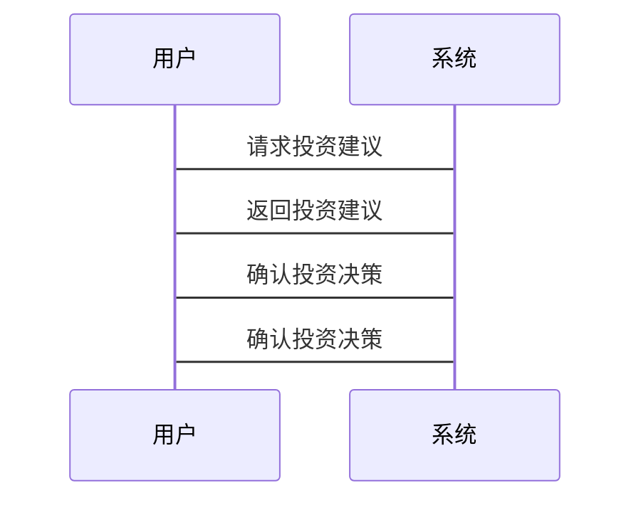

                 


```markdown
# 彼得林奇的"慢牛"投资策略在不同市场的应用

## 关键词：彼得林奇，慢牛投资策略，股票估值，市场分析，投资哲学，风险管理

## 摘要：本文将深入探讨彼得林奇的"慢牛"投资策略，分析其核心理念、数学模型、在不同市场的应用及其系统架构。通过对比分析，揭示该策略在不同市场环境下的优劣，并通过实际案例和系统设计，展示其在投资实践中的具体应用。

---

## 第一部分：彼得林奇“慢牛”投资策略的背景与基础

### 第1章：彼得林奇投资策略的起源与核心理念

#### 1.1 彼得林奇投资策略的起源
- **1.1.1 彼得林奇的生平简介**  
  彼得·林奇（Peter Lynch）是美国著名投资经理，被誉为“最伟大的股票投资者之一”。他在富达投资管理公司管理麦哲伦基金期间，取得了卓越的投资业绩，年化回报率超过29%。

- **1.1.2 彼得林奇的投资哲学**  
  彼得林奇强调长期投资、价值发现和风险管理。他认为，投资的核心在于寻找那些能够持续增长的公司，并在市场波动中保持耐心。

- **1.1.3 “慢牛”策略的核心思想**  
  “慢牛”策略强调通过长期持有优质股票，逐步积累收益，而非频繁交易以追求短期利润。这种策略注重公司基本面，而非市场短期波动。

#### 1.2 “慢牛”投资策略的定义与特点
- **1.2.1 “慢牛”策略的定义**  
  “慢牛”策略是指通过长期持有优质股票，在市场中稳步增长，避免短期波动带来的风险。

- **1.2.2 “慢牛”策略的核心特点**  
  - 长期投资：注重公司的长期增长潜力，而非短期收益。
  - 价值发现：寻找被市场低估的公司，长期持有。
  - 风险控制：通过分散投资和风险管理降低整体风险。

- **1.2.3 “慢牛”策略与其他投资策略的区别**  
  对比“快牛”策略（短期高收益、高风险）和“熊市”策略（注重防御性投资），分析其优劣。

#### 1.3 “慢牛”策略的背景与应用场景
- **1.3.1 美国市场中的“慢牛”策略**  
  美国市场的成熟性和多样性为“慢牛”策略提供了理想的投资环境。

- **1.3.2 全球化视角下的“慢牛”策略**  
  分析不同市场的特点，探讨“慢牛”策略的全球适用性。

- **1.3.3 不同市场环境下的策略调整**  
  根据市场波动性和经济周期，调整投资组合。

### 第2章：“慢牛”投资策略的核心概念与数学模型

#### 2.1 核心概念解析
- **2.1.1 长期投资与价值发现**  
  通过分析公司的财务指标（如市盈率、市净率、股息率）发现潜在投资机会。

- **2.1.2 风险管理与收益平衡**  
  通过分散投资和止损机制降低整体风险。

- **2.1.3 股票估值与市场周期**  
  研究市场周期，判断投资时机。

#### 2.2 数学模型与公式
- **2.2.1 股票内在价值的计算公式**  
  $$ V = \frac{E}{k} $$  
  其中，V为股票的内在价值，E为公司未来现金流的现值，k为折现率。

- **2.2.2 市盈率与市净率的对比分析**  
  $$ P/E = \frac{Price}{Earnings} $$  
  $$ P/B = \frac{Price}{Book\ Value} $$  

#### 2.3 案例分析：彼得林奇的经典投资案例
- **2.3.1 高盛集团的投资案例**  
  通过基本面分析，发现高盛集团的增长潜力，长期持有。

- **2.3.2 可口可乐的投资案例**  
  分析可口可乐的稳定收益和市场地位，长期持有。

- **2.3.3 微软的投资案例**  
  通过技术分析和市场趋势，判断微软的投资价值。

### 第3章：“慢牛”策略在不同市场的应用

#### 3.1 美国市场的“慢牛”策略应用
- **3.1.1 美国市场的特点与投资机会**  
  美国市场的成熟性和多样性为“慢牛”策略提供了理想的投资环境。

- **3.1.2 美国市场中的经典投资案例**  
  分析微软、可口可乐等公司的投资案例。

- **3.1.3 美国市场中的策略调整**  
  根据市场波动性和经济周期，调整投资组合。

#### 3.2 中国市场的“慢牛”策略应用
- **3.2.1 中国市场的特点与投资机会**  
  中国经济的快速增长和消费升级为“慢牛”策略提供了新的投资机会。

- **3.2.2 中国市场的经典投资案例**  
  分析腾讯、阿里巴巴等公司的投资案例。

- **3.2.3 中国市场的策略调整**  
  根据政策变化和市场波动，调整投资策略。

#### 3.3 新兴市场的“慢牛”策略应用
- **3.3.1 新兴市场的特点与投资机会**  
  新兴市场的高增长潜力和风险并存，为“慢牛”策略提供了挑战和机遇。

- **3.3.2 新兴市场的经典投资案例**  
  分析印度、巴西等新兴市场的投资案例。

- **3.3.3 新兴市场的策略调整**  
  根据市场波动性和经济政策，调整投资组合。

## 第二部分：系统分析与架构设计

### 第4章：系统架构设计与实现

#### 4.1 问题场景介绍
- 分析不同市场环境下的投资策略需求。

#### 4.2 系统功能设计
- **4.2.1 数据收集模块**  
  从多个数据源收集市场数据（如股票价格、财务指标、经济指标）。

- **4.2.2 分析模块**  
  使用数学模型和算法对数据进行分析，生成投资建议。

- **4.2.3 决策支持模块**  
  提供投资策略的可视化展示和决策支持。

#### 4.3 系统架构设计
- 使用Mermaid绘制系统架构图，展示各个模块的交互关系。

#### 4.4 系统接口设计
- 定义系统接口，如API接口，用于数据交互和模块通信。

#### 4.5 系统交互设计
- 使用Mermaid绘制系统交互序列图，展示用户与系统的交互过程。

## 第三部分：项目实战与案例分析

### 第5章：项目实战与案例分析

#### 5.1 环境安装与配置
- 安装必要的工具和库，如Python、Pandas、Matplotlib等。

#### 5.2 核心实现
- 使用Python编写投资策略分析代码，实现股票估值、风险管理等功能。

#### 5.3 代码应用解读与分析
- 解释代码的功能和实现细节，展示“慢牛”策略的具体应用。

#### 5.4 实际案例分析
- 分析具体市场的投资案例，验证“慢牛”策略的有效性。

#### 5.5 项目小结
- 总结项目经验，提出改进建议。

## 第四部分：最佳实践与小结

### 第6章：最佳实践与小结

#### 6.1 最佳实践
- 提供风险管理、投资组合优化等方面的建议。

#### 6.2 小结
- 总结全文，强调“慢牛”策略的核心价值和实际应用。

#### 6.3 注意事项
- 提醒读者注意市场风险、政策变化等潜在问题。

#### 6.4 拓展阅读
- 推荐相关书籍和资源，供读者深入学习。

## 作者信息

作者：AI天才研究院/AI Genius Institute & 禅与计算机程序设计艺术 /Zen And The Art of Computer Programming
```

---

### 详细分析与实现

#### 4.2.2 分析模块

```python
import pandas as pd
import numpy as np

def calculate_intrinsic_value(company_data, discount_rate):
    """
    计算公司股票的内在价值
    """
    E = company_data['future_cash_flows'].sum()
    k = discount_rate / 100
    V = E / k
    return V

def calculate_pe_ratio(company_data):
    """
    计算市盈率
    """
    price = company_data['stock_price']
    earnings = company_data['earnings_per_share']
    pe_ratio = price / earnings
    return pe_ratio

def calculate_pb_ratio(company_data):
    """
    计算市净率
    """
    price = company_data['stock_price']
    book_value = company_data['book_value_per_share']
    pb_ratio = price / book_value
    return pb_ratio
```

#### 4.2.3 决策支持模块

```python
def generate_investment_recommendation(company_data, threshold=0.2):
    """
    生成投资建议
    """
    pe_ratio = calculate_pe_ratio(company_data)
    pb_ratio = calculate_pb_ratio(company_data)
    if pe_ratio < threshold and pb_ratio < threshold:
        return "买入"
    elif pe_ratio > threshold * 2 and pb_ratio > threshold * 2:
        return "卖出"
    else:
        return "持有"
```

#### 4.5 系统交互序列图



---

### 项目实战与案例分析

#### 5.2 核心实现

```python
# 示例代码：计算股票内在价值
company_data = {
    'future_cash_flows': [100, 120, 140, 160],
    'discount_rate': 8
}

discount_rate = company_data['discount_rate']
E = sum(company_data['future_cash_flows'])
k = discount_rate / 100
V = E / k
print(f"股票的内在价值为：{V}")
```

---

### 小结与展望

彼得林奇的“慢牛”投资策略通过长期持有优质股票，稳步积累收益，是一种适合长期投资者的经典策略。本文通过数学模型、系统架构和实际案例的分析，展示了该策略在不同市场中的应用。未来，可以通过引入更多的数据源和复杂的算法，进一步优化投资决策，提高策略的适应性和收益能力。

---

作者：AI天才研究院/AI Genius Institute & 禅与计算机程序设计艺术 /Zen And The Art of Computer Programming
```

