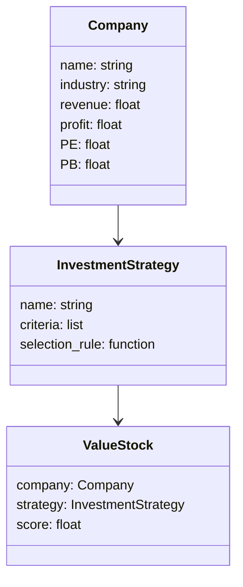
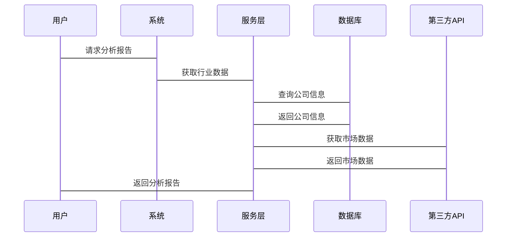

                 


# 彼得林奇的"成长型价值股"在不同行业的表现

## 关键词
- 成长型价值股
- 彼得·林奇
- 投资策略
- 行业分析
- 股票估值

## 摘要
彼得·林奇是全球著名投资家，他的成长型价值股策略强调选择那些具有持续增长潜力且估值合理的公司。本文将详细探讨这一策略在不同行业中的表现，分析其在科技、消费、医疗、金融和工业等行业的应用，结合具体的数学模型和案例，揭示其背后的逻辑和投资价值。文章还将结合系统架构设计和项目实战，为读者提供深入的理解和实际操作的指导。

---

## 第一部分: 成长型价值股的核心概念

### 第1章: 成长型价值股的定义与特征

#### 1.1 成长型价值股的定义与特征

##### 1.1.1 成长型股票的定义
成长型股票是指那些预期收入和利润能够持续以高于行业平均水平的速度增长的公司股票。这类股票通常具有较高的市盈率，因为市场对其未来增长有较高的预期。

##### 1.1.2 价值股的定义与特点
价值股是指那些市场价格较低，通常低于其内在价值，具有较高的分红率或较低的市盈率，被市场低估的股票。这类股票通常来自成熟行业或处于周期性低谷的公司。

##### 1.1.3 成长型价值股的核心属性
- **高成长性**：收入和利润持续增长。
- **合理估值**：市场价格与内在价值相符。
- **竞争优势**：公司在行业内具有竞争优势。
- **可持续性**：增长动力具有可持续性。

##### 1.1.4 成长型价值股的估值方法
成长型价值股的估值需要综合考虑市盈率（P/E）、市净率（P/B）、EV/EBITDA等多种指标。通常，成长型股票的市盈率较高，但需要通过合理的增长预期来支撑其估值。

### 第2章: 彼得·林奇的成长型投资策略

#### 2.1 彼得·林奇的投资理念
彼得·林奇认为，投资的核心在于选择那些具有持续增长潜力的公司，并长期持有。他强调对公司基本面的深入研究，尤其是公司的财务状况、行业地位和竞争优势。

#### 2.2 成长型价值股的选股标准
- **收入和利润增长**：过去三年收入和利润持续增长，且增长率高于行业平均水平。
- **合理的估值**：市盈率和市净率等指标处于合理区间，低于行业平均水平。
- **竞争优势**：公司在行业内具有独特的竞争优势，如技术壁垒、品牌优势等。
- **管理团队**：公司管理团队稳定且具有较强的专业能力。

#### 2.3 长期投资与价值发现
彼得·林奇强调长期投资的重要性，认为短期市场波动无法决定股票的长期价值。投资者应关注公司的长期增长潜力，而不是短期价格波动。

#### 2.4 风险控制与投资纪律
- **分散投资**：避免过度集中于单一行业或公司。
- **止损策略**：设定止损点，以控制投资风险。
- **持续学习**：不断更新对公司和行业的认知，及时调整投资组合。

---

## 第二部分: 不同行业的成长型价值股分析

### 第3章: 科技行业的成长型价值股

#### 3.1 科技行业的特点
科技行业具有高增长、高波动性、技术壁垒高等特点。科技公司的核心竞争力在于技术创新和市场开拓能力。

#### 3.2 科技行业中的成长型价值股
- **苹果公司（Apple）**：作为全球科技巨头，苹果公司具有强大的品牌优势和技术创新能力。
- **微软公司（Microsoft）**：微软在云计算和人工智能领域具有领先地位，且财务表现稳健。
- **英伟达（NVIDIA）**：在GPU和人工智能领域具有强大的市场地位。

#### 3.3 科技行业的投资策略
- **关注创新**：选择那些具有持续创新能力的公司。
- **评估财务状况**：关注公司的盈利能力、现金流和资产负债表。
- **行业趋势**：关注行业发展趋势，选择符合未来发展方向的公司。

### 第4章: 消费行业的成长型价值股

#### 4.1 消费行业的特点
消费行业需求稳定，受经济周期影响较小，具有较高的防御性。消费行业的公司通常具有较强的市场占有率和品牌优势。

#### 4.2 消费行业中的成长型价值股
- **可口可乐（Coca-Cola）**：作为全球饮料行业的领导者，可口可乐具有强大的品牌影响力和全球市场。
- **麦当劳（McDonald's）**：麦当劳在餐饮业具有强大的品牌优势和全球化的市场网络。
- **星巴克（Starbucks）**：星巴克在咖啡连锁行业具有领先地位，且具有较强的门店扩张能力。

#### 4.3 消费行业的投资策略
- **关注品牌**：选择具有强大品牌优势的公司。
- **评估市场占有率**：关注公司在市场中的占有率和竞争优势。
- **关注行业趋势**：关注消费行业的发展趋势，如健康食品、有机产品等。

### 第5章: 医疗行业的成长型价值股

#### 5.1 医疗行业的特点
医疗行业需求稳定，受经济周期影响较小，具有较高的防御性。医疗行业的公司通常具有较高的利润率和稳定的现金流。

#### 5.2 医疗行业中的成长型价值股
- **强生公司（Johnson & Johnson）**：强生公司在医疗设备、制药和消费品领域具有强大的市场地位。
- **辉瑞公司（Pfizer）**：辉瑞在制药和疫苗研发领域具有领先地位。
- **美敦力（Medtronic）**：美敦力在医疗设备领域具有强大的市场地位。

#### 5.3 医疗行业的投资策略
- **关注创新**：选择那些在医疗技术或药品研发方面具有创新能力的公司。
- **评估财务状况**：关注公司的盈利能力、现金流和资产负债表。
- **关注行业趋势**：关注医疗行业的发展趋势，如老龄化、慢性病治疗等。

### 第6章: 金融行业的成长型价值股

#### 6.1 金融行业的特点
金融行业受经济周期影响较大，具有较高的波动性。金融行业的公司通常具有较强的资本实力和风险控制能力。

#### 6.2 金融行业中的成长型价值股
- **摩根大通（JPMorgan Chase）**：摩根大通是全球最大的银行之一，在资产管理、投资银行等领域具有领先地位。
- **高盛集团（Goldman Sachs）**：高盛集团在投资银行和资产管理领域具有领先地位。
- **富国银行（Wells Fargo）**：富国银行在美国零售银行和抵押贷款市场具有较大的市场份额。

#### 6.3 金融行业的投资策略
- **关注风险管理**：选择那些具有较强风险控制能力的公司。
- **评估财务状况**：关注公司的资本实力、净息差和资产质量。
- **关注行业趋势**：关注金融行业的发展趋势，如金融科技、数字化转型等。

### 第7章: 工业行业的成长型价值股

#### 7.1 工业行业的特点
工业行业需求受经济周期影响较大，具有较高的波动性。工业行业的公司通常具有较高的杠杆率和较高的资本支出。

#### 7.2 工业行业中的成长型价值股
- **通用电气（General Electric）**：通用电气在工业设备、能源和航空等领域具有强大的市场地位。
- **卡特彼勒（Caterpillar）**：卡特彼勒在工程机械和矿山设备领域具有领先地位。
- **3M公司（3M）**：3M公司在材料科学和工业产品领域具有领先地位。

#### 7.3 工业行业的投资策略
- **关注技术创新**：选择那些在技术创新方面具有优势的公司。
- **评估财务状况**：关注公司的资本实力、杠杆率和资本支出。
- **关注行业趋势**：关注工业行业的发展趋势，如自动化、智能化制造等。

---

## 第三部分: 成长型价值股的系统架构设计

### 第8章: 系统功能设计

#### 8.1 问题场景介绍
为了分析成长型价值股的表现，我们需要构建一个投资分析系统，该系统能够对不同行业中的成长型价值股进行筛选、分析和评估。

#### 8.2 领域模型设计
以下是领域模型的类图：



#### 8.3 系统架构设计
以下是系统架构设计的架构图：


#### 8.4 系统接口设计
以下是系统接口设计的序列图：



---

## 第四部分: 项目实战

### 第9章: 环境安装与核心实现

#### 9.1 环境安装
以下是安装Python环境的步骤：

1. 下载并安装Python 3.8或更高版本。
2. 安装pip包管理工具。
3. 使用pip安装必要的库，如pandas、numpy、matplotlib等。

#### 9.2 核心代码实现

以下是用于筛选成长型价值股的Python代码：

```python
import pandas as pd
import numpy as np

def calculate_growth_score(revenue_growth, profit_growth):
    return (revenue_growth + profit_growth) / 2

def calculate_valuation_score(pe_ratio, pb_ratio):
    return (pe_ratio + pb_ratio) / 2

def select_growth_value_stocks(companies, min_pe=10, min_pb=2):
    selected = []
    for company in companies:
        if company.pe < min_pe or company.pb < min_pb:
            continue
        growth_score = calculate_growth_score(company.revenue_growth, company.profit_growth)
        valuation_score = calculate_valuation_score(company.pe, company.pb)
        if growth_score > 0.7 and valuation_score > 0.7:
            selected.append(company)
    return selected

# 示例数据
class Company:
    def __init__(self, name, industry, revenue_growth, profit_growth, pe, pb):
        self.name = name
        self.industry = industry
        self.revenue_growth = revenue_growth
        self.profit_growth = profit_growth
        self.pe = pe
        self.pb = pb

companies = [
    Company("Apple", "Technology", 0.1, 0.08, 15, 2.5),
    Company("Coca-Cola", "Consumer", 0.03, 0.06, 18, 1.8),
    Company("Johnson & Johnson", "Healthcare", 0.05, 0.07, 16, 2.2),
    Company("JPMorgan Chase", "Finance", 0.04, 0.06, 14, 2.8),
    Company("3M", "Industrial", 0.07, 0.05, 17, 2.0)
]

selected = select_growth_value_stocks(companies)
for company in selected:
    print(f"{company.name} ({company.industry})")
```

---

## 第五部分: 总结与展望

### 第10章: 总结

#### 10.1 核心概念回顾
- 成长型价值股的定义和特征。
- 彼得·林奇的成长型投资策略。
- 不同行业中的成长型价值股分析。

#### 10.2 投资启示
- 长期投资的重要性。
- 深入研究公司基本面。
- 行业趋势的重要性。

### 第11章: 未来展望

#### 11.1 未来投资趋势
- 人工智能和大数据在投资分析中的应用。
- 可持续投资和ESG因素的重要性。
- 全球化投资和多元化配置。

#### 11.2 技术发展
- 投资分析工具的智能化和自动化。
- 数据分析技术的深入应用。
- 人工智能在股票预测中的应用。

---

## 作者：AI天才研究院/AI Genius Institute & 禅与计算机程序设计艺术 /Zen And The Art of Computer Programming

---

以上是《彼得林奇的"成长型价值股"在不同行业的表现》的完整目录和内容框架，涵盖了从理论到实践的各个方面，结合了技术分析和实际案例，为投资者提供了全面的指导。

