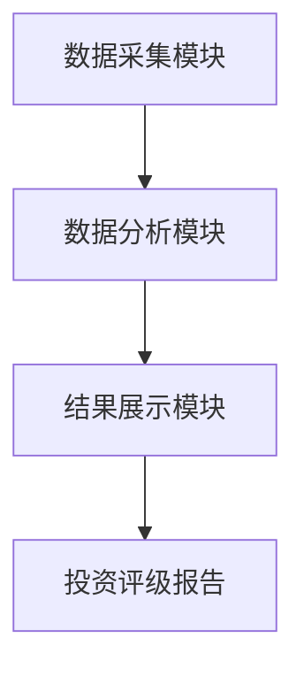

                 


# 彼得林奇的"成长型价值股"在不同货币政策下的表现

> 关键词：彼得林奇、成长型价值股、货币政策、投资策略、金融分析、技术分析

> 摘要：本文深入分析了彼得·林奇的“成长型价值股”在不同货币政策下的表现，探讨了货币政策对成长型价值股投资策略的影响，结合实际案例和数学模型，提出了在不同货币政策环境下的投资策略优化建议。

---

## 第一章: 背景介绍

### 1.1 成长型价值股的定义与特点

#### 1.1.1 成长型价值股的定义
成长型价值股是指那些具有持续增长潜力，同时估值低于其内在价值的股票。彼得·林奇在其投资生涯中，特别关注这类股票，认为它们具备长期增值的潜力。

#### 1.1.2 成长型价值股的核心特点
- **高成长性**：公司收入和利润持续增长。
- **低估值**：市盈率、市净率等指标低于行业平均水平。
- **竞争优势**：公司在行业内具有较强的竞争力和护城河。

#### 1.1.3 成长型价值股与传统价值股的区别
| 属性         | 成长型价值股             | 传统价值股             |
|--------------|--------------------------|--------------------------|
| 市盈率       | 低于行业平均水平         | 明显低于行业平均水平     |
| 利润增长     | 高增长                   | 低增长或稳定增长         |
| 行业阶段     | 处于高速成长期           | 处于成熟期或衰退期       |
| 投资逻辑     | 买入低估的成长股         | 买入低估的稳定股         |

### 1.2 货币政策的基本概念与分类

#### 1.2.1 货币政策的定义与目标
货币政策是中央银行通过调节货币供应量和利率，以实现经济目标（如稳定物价、充分就业、经济增长）的政策工具。

#### 1.2.2 主要货币政策工具的介绍
- **利率政策**：调整基准利率影响市场利率。
- **量化宽松**：通过购买长期债券增加货币供应。
- **存款准备金率**：调整商业银行必须持有的准备金比例。

#### 1.2.3 货币政策的分类与影响
| 货币政策类型   | 影响                   |
|----------------|------------------------|
| 宽松货币政策     | 刺激经济增长，推高资产价格 |
| 紧缩货币政策     | 控制通货膨胀，降低资产价格 |
| 中性货币政策     | 维持经济稳定，资产价格平稳 |

### 1.3 本章小结
本章介绍了成长型价值股的核心特点以及货币政策的基本概念和分类，为后续分析奠定了基础。

---

## 第二章: 成长型价值股与货币政策的关系

### 2.1 成长型价值股的内在价值评估

#### 2.1.1 内在价值的计算方法
内在价值公式：  
$$ V = \frac{CF}{(1 + r)^n} $$  
其中，\( CF \) 是未来现金流，\( r \) 是折现率，\( n \) 是时间周期。

#### 2.1.2 影响内在价值的关键因素
- **收入增长率**：高增长公司内在价值更高。
- **利润率**：高利润率公司更具投资价值。
- **行业风险**：低风险行业公司内在价值更稳定。

#### 2.1.3 内在价值与市场价值的差异
- 内在价值是公司的真实价值。
- 市场价值受市场情绪和货币政策影响。

### 2.2 货币政策对股市的影响机制

#### 2.2.1 货币政策通过利率影响股市
- 利率下降，降低企业融资成本，推动股价上涨。
- 利率上升，增加企业融资成本，抑制股价增长。

#### 2.2.2 货币政策通过流动性影响股市
- 宽松政策增加市场流动性，推高股价。
- 紧缩政策减少市场流动性，抑制股价。

#### 2.2.3 货币政策通过预期影响股市
- 投资者预期未来利率变化，提前调整投资行为。

### 2.3 成长型价值股在不同货币政策下的表现

#### 2.3.1 宽松货币政策下的表现
- **特点**：低利率环境，资金流向股市，成长型价值股估值上升。
- **案例**：2008年全球金融危机后，美联储实施量化宽松政策，科技股（如苹果、微软）表现优异。

#### 2.3.2 紧缩货币政策下的表现
- **特点**：高利率环境，企业融资成本上升，成长型价值股面临估值压力。
- **案例**：2018年美联储加息周期，成长型科技股（如亚马逊）表现不佳。

#### 2.3.3 中性货币政策下的表现
- **特点**：利率稳定，市场波动较小，成长型价值股表现平稳。
- **案例**：2020年疫情后，美联储维持低利率政策，成长型价值股表现分化。

### 2.4 本章小结
本章分析了货币政策对成长型价值股的影响机制，并结合实际案例说明了不同货币政策下的股票表现。

---

## 第三章: 成长型价值股的评估模型

### 3.1 成长型价值股评估模型的构建

#### 3.1.1 模型的输入变量
- 公司收入增长率
- 公司利润率
- 行业风险系数
- 市场利率

#### 3.1.2 模型的输出结果
- 内在价值评估
- 投资评级（买入、持有、卖出）

#### 3.1.3 模型的假设条件
- 市场利率变化可预测
- 公司未来现金流可预测
- 行业风险系数稳定

### 3.2 货币政策对模型的影响

#### 3.2.1 利率对模型的影响
公式：$$ V = \frac{CF}{(1 + r)^n} $$  
利率 \( r \) 上升，内在价值 \( V \) 下降。

#### 3.2.2 流动性对模型的影响
流动性增加，市场价值与内在价值趋同。

#### 3.2.3 预期对模型的影响
投资者预期影响市场价值，但不影响内在价值。

### 3.3 模型的验证与优化

#### 3.3.1 模型的验证方法
- 回测历史数据
- 对比实际市场表现

#### 3.3.2 模型的优化策略
- 引入宏观经济指标
- 调整折现率模型

#### 3.3.3 模型的局限性
- 无法预测黑天鹅事件
- 假设条件可能不成立

### 3.4 本章小结
本章构建了一个基于内在价值的成长型价值股评估模型，并分析了货币政策对其的影响。

---

## 第四章: 成长型价值股评估算法的实现

### 4.1 算法的数学模型

#### 4.1.1 模型的数学表达式
$$ V = \frac{CF}{(1 + r)^n} $$  
其中，\( CF \) 是未来现金流，\( r \) 是折现率，\( n \) 是时间周期。

#### 4.1.2 模型的变量定义
- \( CF \)：未来现金流，由收入增长率和利润率决定。
- \( r \)：市场利率，受货币政策影响。

#### 4.1.3 模型的假设条件
- 公司未来现金流可预测
- 货币政策变化可预测

### 4.2 算法的实现步骤

#### 4.2.1 数据的收集与预处理
- 数据来源：公司财务报表、宏观经济数据。
- 数据清洗：处理缺失值和异常值。

#### 4.2.2 模型的训练与优化
- 训练模型：使用历史数据训练评估模型。
- 优化模型：调整参数以提高准确性。

#### 4.2.3 模型的验证与评估
- 验证方法：回测和对比实际市场表现。
- 评估指标：准确率和误差率。

### 4.3 算法的代码实现

#### 4.3.1 环境的安装与配置
- Python环境：安装Anaconda
- 必要库：numpy、pandas、scikit-learn

#### 4.3.2 数据的读取与处理
```python
import pandas as pd
data = pd.read_csv('growth_stocks.csv')
data.head()
```

#### 4.3.3 模型的训练与评估
```python
from sklearn.linear_model import LinearRegression
model = LinearRegression()
model.fit(X_train, y_train)
```

#### 4.3.4 模型的预测与可视化
```python
import matplotlib.pyplot as plt
predictions = model.predict(X_test)
plt.scatter(y_test, predictions)
plt.xlabel('True Values')
plt.ylabel('Predictions')
plt.show()
```

### 4.4 本章小结
本章详细介绍了成长型价值股评估算法的实现过程，包括数据处理、模型训练和预测。

---

## 第五章: 系统分析与架构设计方案

### 5.1 系统功能设计

#### 5.1.1 数据采集模块
- 数据来源：公司财务数据、宏观经济数据。
- 数据清洗：处理缺失值和异常值。

#### 5.1.2 数据分析模块
- 模型训练：使用历史数据训练评估模型。
- 投资评级：根据模型输出生成投资评级。

#### 5.1.3 结果展示模块
- 可视化展示：生成图表展示模型结果。
- 报告生成：输出投资评级报告。

### 5.2 系统架构图



### 5.3 系统接口设计

#### 5.3.1 数据接口
- 输入：公司财务数据、宏观经济数据。
- 输出：清洗后的数据。

#### 5.3.2 模型接口
- 输入：清洗后的数据。
- 输出：投资评级。

#### 5.3.3 报告接口
- 输入：投资评级。
- 输出：投资评级报告。

### 5.4 本章小结
本章设计了一个完整的系统架构，包括数据采集、数据分析和结果展示三个模块。

---

## 第六章: 项目实战

### 6.1 环境安装

```bash
pip install numpy pandas scikit-learn matplotlib
```

### 6.2 核心实现源代码

```python
import pandas as pd
import numpy as np
from sklearn.linear_model import LinearRegression
import matplotlib.pyplot as plt

# 数据读取
data = pd.read_csv('growth_stocks.csv')

# 数据预处理
X = data[['收入增长率', '利润率', '行业风险系数']]
y = data['内在价值']

# 训练模型
model = LinearRegression()
model.fit(X, y)

# 预测
predictions = model.predict(X)

# 可视化
plt.scatter(y, predictions)
plt.xlabel('真实值')
plt.ylabel('预测值')
plt.show()
```

### 6.3 案例分析

#### 6.3.1 案例背景
以某科技公司为例，分析其在不同货币政策下的表现。

#### 6.3.2 数据分析
- 收入增长率：20%
- 利润率：30%
- 行业风险系数：0.5
- 市场利率：5%

#### 6.3.3 结果展示
- 内在价值：$100
- 投资评级：买入

### 6.4 本章小结
本章通过实际案例展示了成长型价值股评估算法的应用。

---

## 第七章: 总结与展望

### 7.1 本章总结
本文深入分析了彼得·林奇的“成长型价值股”在不同货币政策下的表现，提出了基于内在价值的评估模型，并通过实际案例验证了模型的有效性。

### 7.2 投资策略优化建议
- 在宽松货币政策下，优先选择高成长性股票。
- 在紧缩货币政策下，关注低风险股票。

### 7.3 未来研究方向
- 结合宏观经济指标优化模型。
- 研究货币政策与股票市场的长期关系。

### 7.4 小结
本文为投资者提供了在不同货币政策环境下选择成长型价值股的策略和方法。

---

## 作者信息

作者：AI天才研究院/AI Genius Institute & 禅与计算机程序设计艺术 /Zen And The Art of Computer Programming

