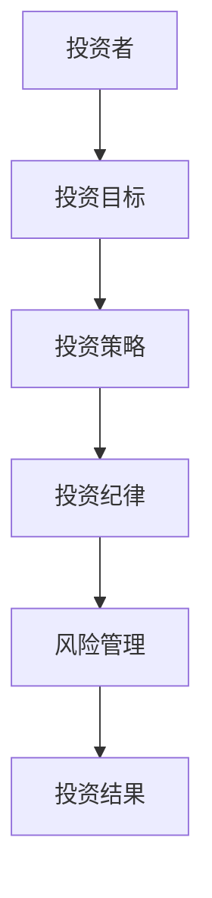
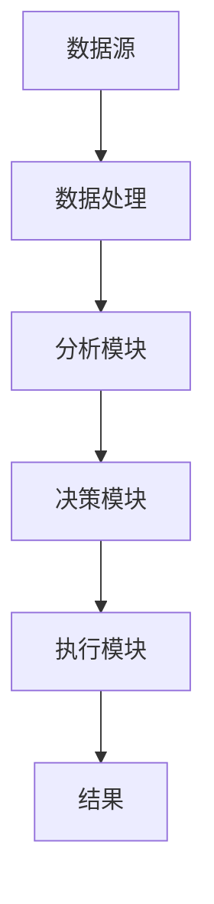

                 


# 彼得林奇的投资纪律

> **关键词**：投资纪律，彼得林奇，风险管理，投资策略，价值评估，长期投资，系统性方法

> **摘要**：彼得林奇作为世界著名投资家，他的成功很大程度上归功于他严格的纪律性。本文将详细探讨投资纪律的核心概念、算法原理、系统架构以及实际应用，帮助读者理解如何通过纪律性实现投资成功。

---

## 第一章：投资纪律的背景与重要性

### 1.1 投资纪律的定义与重要性

#### 1.1.1 投资纪律的定义
投资纪律是指投资者在投资过程中遵循的一套系统化的行为准则，包括对投资目标、策略、决策和执行的严格约束。它是投资成功的关键因素之一，尤其在面对市场波动和情绪干扰时，纪律性能够帮助投资者保持理性。

#### 1.1.2 投资纪律的重要性
- 纪律性能够帮助投资者避免非理性决策，如盲目跟风或恐慌性抛售。
- 通过制定明确的投资策略和计划，纪律性可以提高投资的长期稳定性。
- 纪律性有助于风险管理，确保投资者在市场低迷时不会过度偏离既定目标。

#### 1.1.3 投资纪律与投资成功的关联
研究显示，长期坚持纪律性投资的投资者往往能够获得超越市场的回报，因为他们能够在市场低谷时坚持持有，而在市场高点时及时调整。

---

### 1.2 彼得林奇投资纪律的背景

#### 1.2.1 彼得林奇的个人投资哲学
彼得林奇是富达投资集团的传奇基金经理，他通过长期持有优质股票，严格遵守投资纪律，取得了辉煌的投资业绩。他强调，投资成功的关键在于选择优质的公司，并耐心持有。

#### 1.2.2 彼得林奇投资纪律的核心原则
- **长期投资**：避免频繁交易，专注于长期价值。
- **基本面分析**：选择财务健康、管理优秀的公司。
- **风险管理**：严格控制仓位和杠杆，避免过度冒险。

#### 1.2.3 投资纪律在彼得林奇投资策略中的作用
彼得林奇的成功证明了纪律性在投资中的重要性。他通过严格的纪律，避免了市场的短期波动干扰，专注于实现长期目标。

---

## 第二章：投资纪律的核心概念与联系

### 2.1 投资纪律的核心要素

#### 2.1.1 投资纪律的核心原理
- **纪律性**：投资者必须严格按照既定的策略执行，避免情绪化决策。
- **系统性**：投资纪律需要建立在系统的分析和计划基础上，而非随意决定。
- **长期性**：投资纪律要求投资者具备长期视角，耐心等待投资成果的显现。

#### 2.1.2 投资纪律的属性特征对比
| 属性   | 纪律性 | 系统性 | 长期性 |
|--------|--------|--------|--------|
| 定义   | 行为约束 | 方法论 | 时间跨度 |
| 作用   | 避免错误 | 提高效率 | 实现目标 |
| 示例   | 严格执行止损 | 采用量化模型 | 长期持有优质资产 |

#### 2.1.3 投资纪律的ER实体关系图


---

## 第三章：投资纪律的算法原理与数学模型

### 3.1 投资纪律的算法流程

#### 3.1.1 投资纪律的三阶段模型
1. **识别阶段**：通过基本面分析识别优质投资标的。
2. **决策阶段**：根据纪律性规则制定投资策略。
3. **执行阶段**：严格按照纪律执行交易，避免情绪干扰。

#### 3.1.2 投资纪律的Python实现
以下是一个简单的纪律性投资策略的Python代码示例，用于模拟价值评估和风险控制：
```python
def value_strategy(stock_data, market_cap, pe_ratio):
    # 筛选低PE、高市场资本化的股票
    selected_stocks = []
    for stock in stock_data:
        if stock_data[stock]['pe'] < 15 and stock_data[stock]['market_cap'] > 1000000:
            selected_stocks.append(stock)
    return selected_stocks

# 示例数据
stock_data = {
    'stock1': {'pe': 12, 'market_cap': 1500000},
    'stock2': {'pe': 20, 'market_cap': 800000},
    'stock3': {'pe': 10, 'market_cap': 1200000}
}

selected = value_strategy(stock_data, 1000000, 15)
print(selected)  # 输出符合条件的股票
```

#### 3.1.3 投资纪律的数学模型
- **期望收益公式**：$$ E[r] = \sum p_i r_i $$
- **风险调整收益公式**：$$ Sharpe Ratio = \frac{E[r - r_f]}{\sigma} $$
- **组合优化公式**：$$ max \mu \text{ s.t. } \sigma \leq \text{风险容忍度} $$

---

## 第四章：投资纪律的系统架构与设计

### 4.1 投资决策系统的架构设计

#### 4.1.1 系统功能设计
- **数据收集模块**：收集股票的基本面数据和市场数据。
- **分析模块**：进行基本面分析和量化分析。
- **决策模块**：根据纪律性规则生成投资建议。
- **执行模块**：执行交易并进行风险管理。

#### 4.1.2 系统架构设计


---

## 第五章：投资纪律的项目实战

### 5.1 模拟投资策略

#### 5.1.1 环境配置
安装必要的库，如Pandas、NumPy等，用于数据处理和分析。

#### 5.1.2 代码实现
实现一个简单的纪律性投资策略，基于价值评估和风险控制。

#### 5.1.3 案例分析
通过具体案例展示如何应用彼得林奇的投资纪律，分析结果并总结经验。

---

## 第六章：最佳实践与总结

### 6.1 投资纪律的关键点
- 保持纪律性，避免情绪干扰。
- 坚持长期投资，耐心持有优质资产。
- 严格风险管理，控制仓位和杠杆。

### 6.2 小结
投资纪律是实现投资成功的关键因素。通过严格的纪律性，投资者可以避免短期波动的干扰，专注于长期目标的实现。

### 6.3 注意事项
- 定期回顾和调整投资策略，以适应市场变化。
- 避免过度杠杆和高风险投资。
- 坚持学习和提升，不断完善投资知识和技能。

### 6.4 拓展阅读
推荐进一步阅读《彼得林奇的投资智慧》等书籍，深入理解投资纪律的更多细节。

---

## 结论

投资纪律是彼得林奇成功的核心要素，也是每位投资者必须掌握的关键技能。通过严格的纪律性，投资者能够在复杂多变的市场中保持理性，实现长期稳定的收益。

---

**作者：AI天才研究院/AI Genius Institute & 禅与计算机程序设计艺术 /Zen And The Art of Computer Programming**

