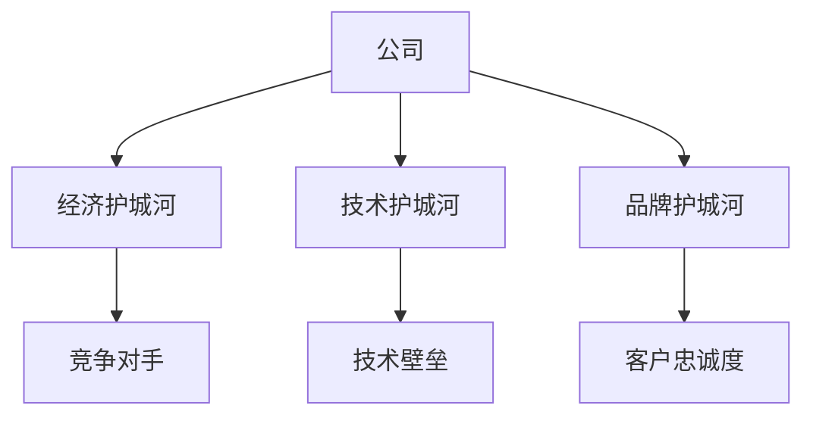
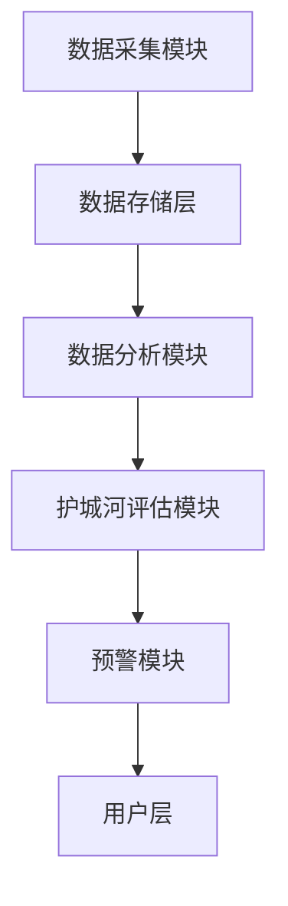

                 


# 彼得林奇的"护城河"理论在数字经济时代的演变

> 关键词：护城河理论、数字经济、竞争优势、数据安全、技术壁垒、品牌价值

> 摘要：本文探讨了彼得·林奇的护城河理论在数字经济时代的发展与演变，分析了护城河理论在数字环境下的新挑战和机会，结合具体案例和算法模型，详细阐述了护城河理论在数据安全、技术壁垒和品牌建设中的应用，最后总结了数字经济时代下护城河理论的未来发展方向。

---

# 第一部分: 彼得·林奇的"护城河"理论概述

## 第1章: 背景介绍

### 1.1 彼得·林奇"护城河"理论的起源

#### 1.1.1 护城河理论的提出背景

彼得·林奇（Peter Lynch）是美国著名的职业棒球运动员，他在职业生涯中以其卓越的防守能力和领导力而闻名。护城河理论最初由林奇提出，旨在帮助球队识别和培养具有长期竞争优势的球员。这一理论的核心在于通过分析球员的技术特点、比赛风格和团队协作能力，构建一个能够抵御对手进攻的“护城河”。

#### 1.1.2 护城河理论的核心概念

护城河理论强调每个球员的独特优势，这些优势构成了他们在团队中的“护城河”。例如，一位擅长防守的球员可以成为球队后防线的核心，从而为球队提供稳固的防守保障。林奇通过护城河理论，帮助球队识别出那些能够为球队提供独特价值的球员。

#### 1.1.3 护城河理论在投资中的应用

尽管护城河理论最初用于棒球领域，但其核心思想在投资领域也得到了广泛应用。投资者通过分析公司的竞争优势、市场地位和财务状况，识别那些具备长期竞争优势的公司，从而构建自己的投资组合。

### 1.2 护城河理论的核心要素

#### 1.2.1 经济护城河

经济护城河是指公司通过成本优势、规模效应或其他经济因素，形成对竞争对手的长期竞争优势。例如，一家公司通过垂直整合供应链，降低生产成本，从而在价格竞争中占据优势。

#### 1.2.2 技术护城河

技术护城河是指公司通过技术创新或专利保护，形成对竞争对手的技术优势。例如，一家科技公司通过研发独特的技术，使其产品在市场上具有差异化竞争优势。

#### 1.2.3 品牌护城河

品牌护城河是指公司通过强大的品牌影响力和客户忠诚度，形成对竞争对手的品牌优势。例如，一家知名品牌通过长期的市场推广和优质服务，赢得了客户的信任和忠诚，从而在市场竞争中占据优势。

#### 1.2.4 行业结构护城河

行业结构护城河是指公司通过占据特定市场的有利位置，形成对竞争对手的结构优势。例如，一家公司通过占据垄断地位或成为行业标准制定者，从而在行业中占据优势地位。

### 1.3 数字经济时代下的护城河理论演变

#### 1.3.1 数字经济的定义与特点

数字经济是指以数字技术为核心驱动力，通过数据的生成、处理、分析和应用，推动经济活动的数字化转型。其特点包括数据驱动、技术创新、网络化和智能化。

#### 1.3.2 护城河理论在数字经济中的新挑战

在数字经济时代，数据成为最重要的生产要素，护城河理论面临新的挑战。例如，数据泄露、技术迅速迭代和用户隐私问题，使得传统的护城河要素在数字经济中可能不再适用。

#### 1.3.3 护城河理论的数字化转型

为了适应数字经济时代的变化，护城河理论需要进行数字化转型。这包括将经济护城河与数字技术相结合，构建数据驱动的护城河，通过技术创新和数字化营销，提升品牌影响力和客户忠诚度。

---

## 第2章: 核心概念与联系

### 2.1 护城河理论的核心概念

#### 2.1.1 护城河的定义与属性

护城河是指公司在竞争市场中所拥有的独特优势，这些优势能够帮助公司在长期竞争中保持优势地位。护城河的属性包括可持续性、可扩展性和防御性。

#### 2.1.2 护城河的分类与特征

护城河可以分为经济护城河、技术护城河、品牌护城河和行业结构护城河。每种护城河都有其独特的特征和优势，例如经济护城河注重成本优势，技术护城河注重技术创新。

#### 2.1.3 护城河的动态变化

护城河并非一成不变，随着市场环境的变化和技术的发展，护城河需要不断更新和优化。例如，一家公司通过技术创新不断更新其技术护城河，以应对竞争对手的技术进步。

### 2.2 护城河理论与数字经济的关联

#### 2.2.1 数字经济中的护城河要素

在数字经济中，护城河的要素包括数据资产、数字技术、品牌影响力和网络效应。这些要素共同构成了公司在数字经济中的竞争优势。

#### 2.2.2 数字化转型中的护城河构建

公司需要通过数字化转型，构建新的护城河。例如，通过大数据分析和人工智能技术，提升公司的数据处理能力，从而在数据驱动的市场中占据优势。

#### 2.2.3 数字经济时代护城河的脆弱性

数字经济时代的护城河存在一定的脆弱性，例如数据泄露、技术快速迭代和政策变化，这些都可能削弱公司的竞争优势。

### 2.3 护城河理论的ER实体关系图

以下是一个简单的护城河理论的ER实体关系图：



---

## 第3章: 护城河理论的算法原理

### 3.1 数据挖掘与护城河识别

#### 3.1.1 数据挖掘的基本概念

数据挖掘是从大量数据中提取有价值信息的过程，其目的是发现数据中的模式、关联和趋势。数据挖掘技术广泛应用于商业智能、金融分析等领域。

#### 3.1.2 护城河识别的算法选择

护城河识别需要选择合适的算法，例如聚类分析和决策树模型。聚类分析可以帮助识别不同类型的护城河，而决策树模型可以帮助分类护城河的类型。

#### 3.1.3 数据预处理与特征提取

数据预处理包括数据清洗、数据转换和数据标准化。特征提取是将数据中的重要特征提取出来，以便更好地进行护城河识别。

### 3.2 机器学习在护城河分析中的应用

#### 3.2.1 机器学习的基本原理

机器学习是人工智能的一个分支，通过数据训练模型，使其能够进行预测和决策。机器学习算法包括监督学习、无监督学习和强化学习。

#### 3.2.2 护城河评估的分类模型

护城河评估可以通过分类模型实现，例如支持向量机（SVM）和随机森林。这些模型可以将公司分为具有护城河和没有护城河两类。

#### 3.2.3 基于聚类分析的护城河识别

聚类分析可以帮助识别护城河类型，例如K-means聚类算法。通过聚类分析，可以将公司分为不同的护城河类别，从而更好地进行竞争分析。

### 3.3 护城河分析的数学模型

#### 3.3.1 聚类分析的数学公式

K-means聚类算法的公式如下：

$$
\text{目标函数} = \sum_{i=1}^{k} \sum_{j=1}^{n_i} (x_{ij} - c_i)^2
$$

其中，$k$ 是聚类数，$n_i$ 是第$i$个聚类中的数据点数，$x_{ij}$ 是第$j$个数据点的特征向量，$c_i$ 是第$i$个聚类的中心点。

---

## 第4章: 护城河理论的系统分析与架构设计

### 4.1 系统分析与功能设计

#### 4.1.1 问题场景介绍

在数字经济时代，公司需要通过护城河理论构建竞争优势。然而，数据泄露和技术创新使得护城河的构建变得复杂。

#### 4.1.2 系统功能设计

护城河分析系统需要具备数据采集、数据分析、护城河评估和预警功能。系统功能模块包括数据采集模块、数据分析模块、护城河评估模块和预警模块。

#### 4.1.3 系统架构设计

护城河分析系统的架构包括数据层、应用层和用户层。数据层负责数据的存储和管理，应用层负责数据的处理和分析，用户层负责与用户的交互。

### 4.2 系统架构设计

以下是一个护城河分析系统的架构图：



### 4.3 系统接口设计

系统接口设计需要考虑数据输入、数据处理和结果输出。例如，数据采集模块需要与数据源进行接口对接，数据分析模块需要与机器学习模型进行接口对接。

### 4.4 系统交互设计

系统交互设计需要考虑用户的使用流程。例如，用户输入数据后，系统进行数据分析，生成护城河评估报告，并通过预警模块提醒用户潜在风险。

---

## 第5章: 项目实战

### 5.1 环境安装与配置

护城河分析系统需要安装Python、Pandas、Scikit-learn和Mermaid等工具。以下是安装命令：

```bash
pip install pandas scikit-learn mermaid
```

### 5.2 系统核心实现源代码

以下是护城河分析系统的Python实现代码：

```python
import pandas as pd
from sklearn.cluster import KMeans

# 数据预处理
data = pd.read_csv('护城河数据.csv')
data = data.dropna()
data = data[['经济护城河', '技术护城河', '品牌护城河']]

# 聚类分析
model = KMeans(n_clusters=3, random_state=0)
model.fit(data)

# 护城河评估
clusters = model.labels_
print("聚类结果:", clusters)
```

### 5.3 代码应用解读与分析

上述代码实现了护城河数据的聚类分析，将公司分为三类：经济护城河、技术护城河和品牌护城河。通过分析聚类结果，可以识别不同类型的护城河，并制定相应的竞争策略。

### 5.4 实际案例分析

以一家科技公司为例，通过护城河分析系统，识别其技术护城河，制定技术创新策略，提升公司在技术领域的竞争优势。

### 5.5 项目小结

护城河分析系统通过数据挖掘和机器学习技术，帮助公司识别和构建竞争优势，从而在数字经济时代中保持领先地位。

---

## 第6章: 最佳实践、小结、注意事项

### 6.1 最佳实践

护城河理论在数字经济时代需要结合数据驱动和技术创新，构建可持续的竞争优势。同时，需要注意数据隐私和伦理问题。

### 6.2 小结

本文详细阐述了彼得·林奇的护城河理论在数字经济时代的演变，分析了护城河理论在数据安全、技术壁垒和品牌建设中的应用，最后总结了数字经济时代下护城河理论的未来发展方向。

### 6.3 注意事项

护城河的构建需要综合考虑经济、技术和品牌等多个因素，同时需要关注数据隐私和伦理问题，避免因数据泄露或技术滥用而削弱竞争优势。

---

## 第7章: 未来展望

### 7.1 护城河理论的未来趋势

随着人工智能和区块链技术的发展，护城河理论将更加依赖数据驱动和技术创新。未来，护城河理论将更加注重数据隐私和网络安全，构建更加智能化和动态化的竞争优势。

### 7.2 数字经济时代下的护城河研究方向

未来研究方向包括护城河的动态变化、数据隐私保护、技术创新对护城河的影响等。这些研究将为护城河理论在数字经济时代的应用提供理论支持和实践指导。

### 7.3 护城河理论的挑战与机遇

数字经济时代的护城河理论面临新的挑战，例如数据泄露和技术快速迭代，但也带来了新的机遇，例如数据驱动的创新和智能化的竞争。

---

# 结语

彼得·林奇的护城河理论在数字经济时代经历了深刻的演变，从最初的经济护城河扩展到数据驱动和技术驱动的护城河。通过数据挖掘、机器学习和系统架构设计，护城河理论在数字经济中发挥着越来越重要的作用。未来，护城河理论将更加注重动态变化和技术创新，为公司在数字经济时代中提供更加坚实的竞争优势。

---

作者：AI天才研究院/AI Genius Institute & 禅与计算机程序设计艺术 /Zen And The Art of Computer Programming

