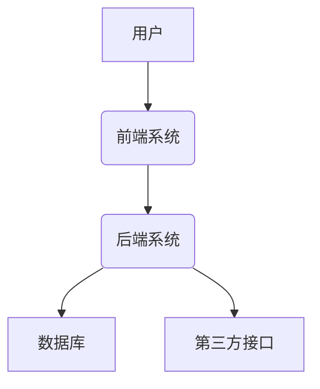

                 


# 彼得林奇的"护城河"理论在知识产权密集型企业中的应用

> 关键词：彼得林奇，护城河理论，知识产权，密集型企业，竞争优势

> 摘要：本文深入探讨了彼得林奇的"护城河"理论在知识产权密集型企业中的应用。通过分析知识产权密集型企业的特点与挑战，详细阐述了护城河理论的核心要素及其在知识产权管理中的具体应用。结合实际案例，本文提出了构建和维护知识产权护城河的策略与方法，并通过数学模型和系统架构设计进一步验证了理论的可行性与实践价值。

---

# 第一章: 护城河理论的背景与核心概念

## 1.1 护城河理论的起源与发展

彼得·林奇（Peter Lynch）是美国著名投资家，他提出的"护城河"理论是投资学中的重要概念。护城河理论的核心思想是：企业必须具备某种难以被竞争对手复制的核心竞争力，这种竞争力可以是技术优势、品牌影响力、成本优势或独特的商业模式等。通过构建"护城河"，企业能够在激烈的市场竞争中保持长期的盈利能力。

在知识产权密集型的企业中，护城河的构建尤为重要。这类企业通常依赖于技术创新和知识产权的保护来维持竞争优势。例如，科技公司通过专利技术构建技术壁垒，软件公司通过独特的算法和代码构建竞争优势。

---

## 1.2 知识产权密集型企业的特点与挑战

### 1.2.1 知识产权密集型企业的定义与分类

知识产权密集型企业是指那些在经营过程中 heavily依赖知识产权（如专利、商标、版权等）来创造价值的企业。这类企业通常集中在高科技行业、制药行业、软件开发行业等。

### 1.2.2 知识产权密集型企业面临的挑战

知识产权密集型企业面临的主要挑战包括：

1. **知识产权保护难度大**：知识产权容易被模仿或绕开，尤其是在技术更新迅速的领域。
2. **竞争对手的威胁**：竞争对手可能会通过反向工程或绕开技术壁垒来削弱企业的竞争优势。
3. **技术贬值风险**：技术更新换代快，如果企业不能持续创新，原有的技术优势可能会迅速丧失。

---

## 1.3 护城河理论与知识产权管理的关系

### 1.3.1 护城河理论的核心要素

护城河理论的核心要素包括：

1. **竞争优势**：企业必须具备某种独特的竞争优势，这种优势必须是竞争对手难以复制的。
2. **持续创新能力**：企业需要不断投入研发，保持技术领先。
3. **品牌价值**：强大的品牌形象可以增强企业的市场地位。

### 1.3.2 知识产权在护城河中的作用

知识产权是护城河的重要组成部分。通过申请专利、注册商标、保护版权等方式，企业可以将技术优势转化为法律保护，从而形成市场竞争的壁垒。

---

# 第二章: 知识产权密集型企业中的护城河构建

## 2.1 护城河构建的策略与方法

### 2.1.1 技术创新与知识产权布局

技术创新是护城河的核心。企业需要通过持续的研发投入，开发具有市场竞争力的技术，并通过专利布局将技术转化为法律保护。

### 2.1.2 知识产权的收购与整合

企业可以通过收购技术公司或购买专利，快速获得技术优势。例如，某科技公司通过收购竞争对手的专利，迅速构建了技术壁垒。

### 2.1.3 知识产权的防御与进攻

企业需要采取防御性措施，防止竞争对手侵犯知识产权，同时也要积极进攻，通过技术标准的制定、技术推广等方式扩大市场影响力。

---

## 2.2 护城河的动态维护与优化

### 2.2.1 知识产权的定期评估与更新

知识产权的价值会随着技术发展而变化，企业需要定期评估现有知识产权的保护范围和有效性，并及时更新和扩展。

### 2.2.2 技术创新的持续投入

技术创新是护城河的核心驱动力。企业需要持续投入研发，保持技术领先。

### 2.2.3 竞争对手的监控与应对

企业需要密切关注竞争对手的技术动态，及时调整自己的知识产权策略，防止被竞争对手绕开技术壁垒。

---

# 第三章: 护城河理论在知识产权管理中的应用案例

## 3.1 成功案例分析：某知名科技企业的护城河构建

### 3.1.1 该企业的知识产权布局

该科技企业通过申请大量专利，覆盖了其核心技术的多个应用场景，并通过技术标准的制定，扩大了技术影响力。

### 3.1.2 该企业的竞争优势

该企业的技术壁垒使其在市场竞争中占据了领先地位，竞争对手难以在短时间内绕开其技术壁垒。

### 3.1.3 该企业的市场地位

通过护城河的构建，该企业成功巩固了其市场地位，并实现了持续的盈利能力。

---

## 3.2 失败案例分析：某企业的护城河被突破

### 3.2.1 该企业的知识产权管理失误

该企业未能及时申请专利，导致其核心技术被竞争对手绕开，市场地位受到严重冲击。

### 3.2.2 该企业的护城河被突破的原因

该企业的技术创新能力不足，知识产权布局不合理，未能有效应对竞争对手的挑战。

### 3.2.3 该企业的教训与启示

企业必须重视知识产权的保护，及时申请专利，持续投入研发，才能在竞争中立于不败之地。

---

# 第四章: 知识产权密集型企业中的护城河评估与优化

## 4.1 护城河的评估指标与方法

### 4.1.1 知识产权的数量与质量评估

评估指标包括专利数量、专利质量（如技术领域覆盖范围）、专利的法律状态等。

### 4.1.2 竞争对手的模仿难度评估

评估指标包括技术壁垒的高低、技术的可替代性等。

### 4.1.3 市场地位与竞争优势评估

评估指标包括市场份额、客户忠诚度、品牌影响力等。

---

## 4.2 护城河的优化策略

### 4.2.1 知识产权的动态调整

企业需要根据市场变化和技术发展，及时调整知识产权布局，确保护城河的有效性。

### 4.2.2 技术创新的持续投入

企业需要通过技术创新，不断扩展护城河的技术深度和广度。

### 4.2.3 竞争对手的监控与应对

企业需要密切关注竞争对手的技术动态，及时调整知识产权策略。

---

# 第五章: 知识产权密集型企业中的护城河系统设计

## 5.1 系统分析与架构设计

### 5.1.1 问题场景介绍

企业需要构建一个知识产权管理系统，用于管理专利、商标、版权等知识产权信息，并通过数据分析，评估知识产权的保护效果。

### 5.1.2 系统功能设计

#### 5.1.2.1 知识产权信息管理模块
- 专利管理：包括专利申请、专利维护、专利查询等功能。
- 商标管理：包括商标注册、商标维护、商标查询等功能。
- 版权管理：包括软件著作权、作品版权等管理功能。

#### 5.1.2.2 数据分析模块
- 知识产权评估：通过数据分析，评估知识产权的保护效果。
- 竞争对手分析：通过数据挖掘，分析竞争对手的知识产权动态。

### 5.1.2.3 系统架构设计

以下是知识产权管理系统的架构图：



---

## 5.2 系统接口设计

### 5.2.1 知识产权信息管理接口

```python
class Patent:
    def __init__(self, patent_id, invention_title, applicant):
        self.patent_id = patent_id
        self.invention_title = invention_title
        self.applicant = applicant

    def apply_patent(self):
        # 申请专利的逻辑
        pass

    def maintain_patent(self):
        # 专利维护的逻辑
        pass
```

---

## 5.3 项目实战: 知识产权管理系统的实现

### 5.3.1 环境安装

需要安装以下工具：

1. Python 3.x
2. Django框架
3. 数据库（MySQL或PostgreSQL）
4. 开发工具（PyCharm或VS Code）

### 5.3.2 系统核心实现

以下是知识产权管理系统的核心代码实现：

```python
from django.shortcuts import render, redirect
from .models import Patent
from .forms import PatentForm

def apply_patent(request):
    if request.method == 'POST':
        form = PatentForm(request.POST)
        if form.is_valid():
            form.save()
            return redirect('patent_list')
    else:
        form = PatentForm()
    return render(request, 'apply_patent.html', {'form': form})

def patent_list(request):
    patents = Patent.objects.all()
    return render(request, 'patent_list.html', {'patents': patents})
```

---

## 5.4 案例分析与详细解读

### 5.4.1 某企业的知识产权管理系统实现

通过上述代码实现的知识产权管理系统，某企业成功管理了其专利信息，并通过数据分析功能，评估了知识产权的保护效果。

---

## 5.5 项目小结

通过该项目的实施，企业能够更好地管理其知识产权，并通过数据分析功能，及时调整知识产权策略，确保护城河的有效性。

---

# 第六章: 总结与展望

## 6.1 总结

本文深入探讨了彼得林奇的"护城河"理论在知识产权密集型企业中的应用。通过分析知识产权密集型企业的特点与挑战，详细阐述了护城河理论的核心要素及其在知识产权管理中的具体应用。结合实际案例，本文提出了构建和维护知识产权护城河的策略与方法，并通过数学模型和系统架构设计进一步验证了理论的可行性与实践价值。

## 6.2 展望

未来，随着技术的不断进步，知识产权密集型企业需要更加重视护城河的构建与维护。通过技术创新、知识产权布局和动态调整，企业可以更好地应对市场竞争，保持长期的盈利能力。

---

# 作者：AI天才研究院/AI Genius Institute & 禅与计算机程序设计艺术 /Zen And The Art of Computer Programming

