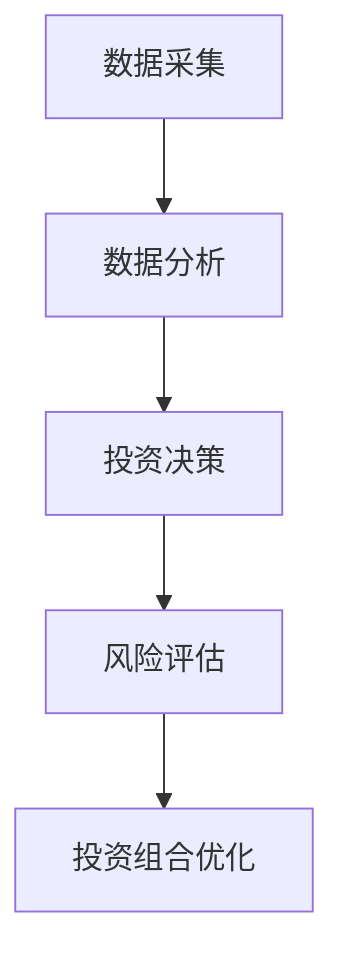

                 


# 彼得林奇的"本地化"投资理念

> 关键词：本地化、投资理念、彼得林奇、价值投资、长期投资、投资策略、投资组合优化

> 摘要：本文深入探讨了彼得林奇的本地化投资理念，分析了其核心思想、数学模型、系统架构设计以及实际项目案例。通过结合技术博客的特点，从背景介绍、核心概念、算法原理、系统架构、项目实战等多个维度，全面解读本地化投资的理论与实践，为读者提供深度的技术与投资视角。

---

## 第1章: 投资的基本概念

### 1.1 投资的基本概念

#### 1.1.1 什么是投资
投资是指将资金投入到某种资产或项目中，以期望在未来获得收益或资本增值的行为。投资的核心在于通过合理的资源配置，实现资产的保值与增值。

#### 1.1.2 投资的分类
投资可以分为以下几类：
- **股票投资**：购买公司股份，成为股东。
- **债券投资**：购买政府或企业发行的债券，定期获得利息。
- **房地产投资**：购买房地产用于出租或增值。
- **货币市场投资**：投资于短期货币工具，如国库券、银行存款等。

#### 1.1.3 投资的基本原则
- **分散投资**：避免将所有资金投入到单一资产中，降低风险。
- **长期投资**：注重资产的长期增值，而非短期波动。
- **价值投资**：寻找具有内在价值的资产进行投资。

---

### 1.2 本地化投资的定义

#### 1.2.1 本地化投资的定义
本地化投资是指投资者将资金投入到本地市场或与本地相关的资产中，利用对本地市场、经济环境和企业的深入了解，进行投资决策。

#### 1.2.2 本地化投资的特点
- **地域性**：专注于特定地区的市场和企业。
- **信息优势**：投资者对本地市场有更深入的了解，能够更好地评估企业价值。
- **风险可控**：本地化投资有助于降低因地理距离和文化差异带来的不确定性风险。

#### 1.2.3 本地化投资的优势
- **成本优势**：本地化投资通常具有较低的交易成本和信息获取成本。
- **文化契合**：本地市场的企业文化和消费者行为更容易被投资者理解和把握。
- **政策优势**：本地市场可能享有特定的政策支持或税收优惠。

---

## 第2章: 彼得林奇的投资理念

### 2.1 彼得林奇的生平简介

#### 2.1.1 彼得林奇的早年经历
彼得·林奇（Peter Lynch）是美国著名的投资专家，曾任富达麦哲伦基金（Fidelity Magellan Fund）的经理，管理资产规模高达140亿美元。他以出色的长期投资业绩闻名，被称为“股神”之一。

#### 2.1.2 彼得林奇的职业生涯
彼得林奇的职业生涯始于20世纪70年代，他在富达麦哲伦基金期间，通过价值投资和基本面分析，实现了年均29%的复合回报率，创造了辉煌的投资业绩。

#### 2.1.3 彼得林奇的投资哲学
彼得林奇的投资哲学以价值投资为核心，强调长期投资、分散投资和深入研究企业的基本面。他主张投资者应专注于自己熟悉的企业和行业，避免盲目跟风。

---

### 2.2 彼得林奇的投资策略

#### 2.2.1 价值投资的基本原则
- **寻找低估的股票**：投资于市场价格低于内在价值的股票。
- **关注企业的基本面**：分析企业的财务状况、盈利能力和发展前景。
- **长期持有**：避免频繁交易，降低交易成本和税务负担。

#### 2.2.2 本地化投资的核心思想
彼得林奇认为，本地化投资是价值投资的重要组成部分。投资者应关注本地市场的企业，利用对本地经济和文化的理解，挖掘具有潜在增长价值的企业。

#### 2.2.3 长期投资的重要性
长期投资能够摊低成本、减少短期波动的影响，同时享受复利效应。彼得林奇强调，投资的目的是实现长期的资产增值，而非短期的收益。

---

## 第3章: 本地化投资的核心概念

### 3.1 本地化投资的背景

#### 3.1.1 全球化与本地化的关系
全球化促进了跨国投资的兴起，但本地化投资在区域市场中仍然具有不可替代的优势。本地化投资能够帮助投资者更好地应对区域经济波动和政策变化。

#### 3.1.2 本地化投资的兴起
随着经济全球化的发展，越来越多的投资者开始关注本地市场的投资机会。本地化投资不仅能够分散风险，还能够利用本地市场的独特优势。

#### 3.1.3 本地化投资的现状
当前，本地化投资在多个领域得到广泛应用，尤其是在房地产、消费行业和区域经济中，本地化投资策略表现出较强的竞争力。

---

### 3.2 本地化投资的核心要素

#### 3.2.1 地理位置的重要性
地理位置是本地化投资的重要因素。投资者应选择经济发展稳定、市场潜力大的地区进行投资。

#### 3.2.2 本地市场分析的关键点
- **经济环境**：分析本地的经济结构、增长速度和政策环境。
- **行业分析**：研究本地的优势行业和竞争格局。
- **企业分析**：评估本地企业的财务状况、管理能力和市场地位。

#### 3.2.3 本地化投资的风险与收益
本地化投资的风险主要包括市场波动、政策变化和经济周期波动。然而，本地化投资也能够带来较高的收益，尤其是在经济复苏和增长阶段。

---

## 第4章: 本地化投资的数学模型

### 4.1 投资组合的数学模型

#### 4.1.1 投资组合的期望收益计算
投资组合的期望收益可以通过以下公式计算：
$$
E(r) = \sum_{i=1}^{n} w_i r_i
$$
其中，$w_i$是第$i$个资产的投资权重，$r_i$是第$i$个资产的期望收益。

#### 4.1.2 投资组合的风险评估
投资组合的风险可以通过方差来衡量：
$$
\sigma^2 = \sum_{i=1}^{n} w_i^2 \sigma_i^2 + 2\sum_{i<j} w_i w_j \sigma_{ij}
$$
其中，$\sigma_i^2$是第$i$个资产的方差，$\sigma_{ij}$是第$i$个资产和第$j$个资产之间的协方差。

#### 4.1.3 投资组合的优化方法
通过调整投资组合的权重，可以实现期望收益与风险的最优平衡。常用的方法包括均值-方差优化和风险中性优化。

---

### 4.2 本地化投资的数学公式

#### 4.2.1 投资组合的期望收益公式
$$
E(r) = \sum_{i=1}^{n} w_i r_i
$$

#### 4.2.2 投资组合的风险公式
$$
\sigma^2 = \sum_{i=1}^{n} w_i^2 \sigma_i^2 + 2\sum_{i<j} w_i w_j \sigma_{ij}
$$

---

## 第5章: 本地化投资的系统架构设计

### 5.1 系统分析与设计

#### 5.1.1 本地化投资系统的组成
本地化投资系统主要包括以下几个组成部分：
- **数据采集模块**：收集本地市场的企业信息和经济数据。
- **数据分析模块**：对数据进行处理和分析，评估企业的价值。
- **投资决策模块**：根据分析结果，制定投资策略。
- **风险评估模块**：评估投资组合的风险，并进行优化。

#### 5.1.2 本地化投资系统的功能模块


---

### 5.2 系统架构图

#### 5.2.1 本地化投资系统的架构设计


---

## 第6章: 本地化投资的项目实战

### 6.1 本地化投资的环境安装

#### 6.1.1 投资分析工具的安装
推荐使用Python和Pandas库进行数据分析，安装步骤如下：
1. 安装Python：从官方网站下载并安装Python。
2. 安装Pandas库：使用pip命令安装Pandas库。
   ```bash
   pip install pandas
   ```

#### 6.1.2 数据收集工具的配置
可以通过本地交易所或金融数据供应商获取本地市场数据，并将其导入分析工具中。

#### 6.1.3 投资组合管理系统的部署
可以选择使用Excel或Python的Pandas库进行投资组合管理。

---

### 6.2 核心实现源代码

#### 6.2.1 投资组合的期望收益计算代码
```python
import pandas as pd

# 假设有一个投资组合，权重和收益如下：
weights = [0.4, 0.3, 0.2, 0.1]
returns = [0.1, 0.15, 0.08, 0.12]

# 计算期望收益
expected_return = sum(w * r for w, r in zip(weights, returns))
print(f"期望收益为：{expected_return:.2f}")
```

---

### 6.3 实际案例分析

#### 6.3.1 案例背景
假设我们有以下四个本地企业，分别投资20%、30%、25%和25%，其期望收益分别为10%、15%、8%和12%。

#### 6.3.2 投资组合的优化
通过调整权重，我们可以找到期望收益与风险的最佳平衡点。

---

## 第7章: 总结与展望

### 7.1 总结
彼得林奇的本地化投资理念强调了对本地市场的深入理解和长期投资的重要性。通过本地化投资，投资者可以更好地把握市场机会，降低投资风险。

### 7.2 最佳实践 tips
- **分散投资**：避免将所有资金投入到单一资产或行业。
- **长期持有**：耐心持有优质资产，避免频繁交易。
- **持续学习**：关注市场动态，不断提升自己的投资能力。

### 7.3 注意事项
- **风险控制**：在进行本地化投资时，应充分考虑市场波动和政策风险。
- **合理配置资产**：根据自身风险承受能力，合理配置资产。

### 7.4 拓展阅读
推荐阅读彼得林奇的《投资最重要的事情》和《彼得林奇的投资策略》等书籍，深入理解本地化投资的精髓。

---

## 作者信息

作者：AI天才研究院/AI Genius Institute & 禅与计算机程序设计艺术 /Zen And The Art of Computer Programming

---

通过本文的详细分析，我们可以看到彼得林奇的本地化投资理念不仅是一种投资策略，更是一种对本地市场深入了解和长期价值挖掘的过程。希望本文能够为读者提供有价值的见解，帮助他们在投资领域取得成功。

