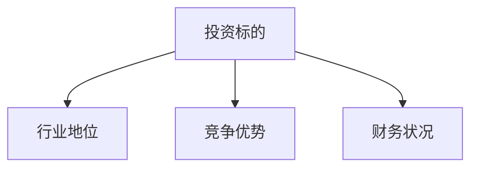

                 

---

# 彼得林奇的"知道你在买什么"原则

> 关键词：彼得林奇，投资原则，基本面分析，行业分析，财务报表分析，风险管理，投资组合管理

> 摘要：本文深入探讨了彼得林奇的"知道你在买什么"投资原则，分析了其核心思想、基本面分析方法、行业趋势识别、财务健康评估、风险管理策略以及投资组合管理等关键内容。通过具体实例和数学模型，展示了如何在实际投资中应用这一原则，并结合系统架构设计和项目实战，为投资者提供了实用的指导。

---

## 第1章: 彼得林奇投资理念的核心思想

### 1.1 彼得林奇与"知道你在买什么"原则的提出

彼得林奇是全球最著名的投资家之一，他的投资理念以"know what you own"为核心，强调投资者必须真正理解自己所投资的公司。这一原则的核心思想是：在投资之前，必须深入了解投资标的的本质、行业地位、财务状况以及潜在风险。

#### 1.1.1 彼得林奇的生平与投资成就

彼得林奇是富达投资的传奇基金经理，他通过深入研究和分析，成功管理了富达麦哲伦基金，使其在几十年间取得了卓越的投资回报。他的投资理念以基本面分析为核心，强调长期投资和价值发现。

#### 1.1.2 "知道你在买什么"原则的核心含义

"知道你在买什么"原则要求投资者在投资之前，必须明确投资标的的内在价值、行业地位、竞争优势以及财务状况。这一原则强调的是对投资标的深入理解和分析，而不是盲目跟风或短期投机。

#### 1.1.3 该原则在投资领域的应用价值

该原则的应用价值在于帮助投资者避免盲目投资，降低投资风险。通过深入分析投资标的的本质，投资者可以更好地把握投资机会，制定科学的投资策略。

### 1.2 该原则与传统投资理念的对比

#### 1.2.1 传统投资理念的局限性

传统投资理念往往注重短期市场波动和市场趋势，忽视了对投资标的深入分析。这种理念容易导致投资者盲目跟风，难以实现长期稳定的收益。

#### 1.2.2 "知道你在买什么"原则的创新性

彼得林奇的原则强调对投资标的深入分析和长期持有，注重内在价值和基本面研究。这种理念突破了传统投资理念的局限，为投资者提供了更为科学的投资方法。

#### 1.2.3 两者在投资决策中的区别

传统投资理念注重市场趋势和短期波动，而彼得林奇的原则注重基本面分析和长期投资。两者的区别在于，前者更注重市场情绪，后者更注重内在价值。

### 1.3 该原则的适用范围与限制

#### 1.3.1 适用的主要领域

该原则适用于股票投资、基金投资、房地产投资等领域，尤其是在股票投资中表现最为显著。

#### 1.3.2 该原则的局限性与不足

该原则的局限性在于，它无法完全预测市场波动和突发事件。此外，该原则对投资者的分析能力要求较高，普通投资者可能难以深入分析复杂的标的。

#### 1.3.3 与其他投资策略的结合

该原则可以与其他投资策略相结合，例如技术分析和风险管理，从而形成更为完善的投资体系。

---

## 第2章: 投资者必须了解的核心概念

### 2.1 什么是投资标的的本质

投资标的的本质是指其核心业务、行业地位、竞争优势以及财务状况。投资者必须了解这些核心要素，才能准确评估投资标的的价值。

#### 2.1.1 投资标的核心要素分析

投资标的的核心要素包括：

1. **行业地位**：公司在行业中的地位，是否是龙头企业。
2. **竞争优势**：公司是否具有独特的竞争优势，例如成本优势、技术优势等。
3. **财务状况**：公司的财务健康状况，包括盈利能力、资产负债情况等。

#### 2.1.2 投资标的属性特征对比表

| 特性         | 投资标的属性特征 |
|--------------|------------------|
| 行业地位     | 龙头企业         |
| 竞争优势     | 成本优势         |
| 财务状况     | 盈利能力高       |

#### 2.1.3 投资标的ER实体关系图（Mermaid流程图）

### 2.2 投资标的内在价值评估模型

#### 2.2.1 内在价值计算的数学模型

投资标的的内在价值可以通过以下公式计算：

$$ V = \frac{CF}{r} $$

其中，\( CF \) 为未来现金流，\( r \) 为折现率。

#### 2.2.2 投资回报率的数学公式

投资回报率（ROE）的计算公式为：

$$ ROE = \frac{净利润}{股东权益} $$

#### 2.2.3 通过实例计算验证模型的准确性

以某公司为例，假设其未来现金流为 $1000万，折现率为10%，则其内在价值为：

$$ V = \frac{1000}{0.10} = 10000万 $$

---

## 第3章: 投资标的基本面分析方法

### 3.1 行业分析与投资机会识别

#### 3.1.1 行业分析的核心步骤

行业分析的核心步骤包括：

1. 行业发展趋势分析
2. 行业竞争格局分析
3. 行业增长潜力评估

#### 3.1.2 投资机会的识别方法

投资机会的识别方法包括：

1. 行业增长潜力
2. 公司竞争优势
3. 行业风险评估

#### 3.1.3 行业趋势对投资的影响

行业趋势对投资的影响主要体现在行业的增长潜力和风险方面。例如，朝阳行业的增长潜力较大，而夕阳行业的风险较高。

### 3.2 公司竞争优势分析

#### 3.2.1 核心竞争力的定义与评估

核心竞争力是指公司在市场上独特的竞争优势，例如技术优势、成本优势等。

#### 3.2.2 竞争优势的来源与表现

竞争优势的来源包括技术创新、成本控制、品牌优势等。竞争优势的表现包括市场份额、利润率等。

#### 3.2.3 通过实例分析竞争优势的强弱

以苹果公司为例，其竞争优势主要体现在技术创新和品牌优势上。苹果公司通过不断创新，保持了其在科技领域的领先地位。

### 3.3 财务健康状况分析

#### 3.3.1 财务报表分析的基本方法

财务报表分析的基本方法包括利润表分析、资产负债表分析和现金流量表分析。

#### 3.3.2 财务健康指标的计算与解读

财务健康指标包括：

1. 净利润率
2. 负债率
3. 存货周转率

#### 3.3.3 通过财务数据评估公司风险

通过分析公司的财务数据，可以评估公司的财务健康状况和潜在风险。例如，高负债率的公司可能存在较大的财务风险。

---

## 第4章: 投资风险管理与控制

### 4.1 风险识别与评估

#### 4.1.1 投资风险的分类与特征

投资风险主要包括市场风险、流动性风险、信用风险等。

#### 4.1.2 风险识别的方法与工具

风险识别的方法包括财务报表分析、行业趋势分析、市场波动分析等。

#### 4.1.3 风险评估的数学模型

风险评估的数学模型包括：

$$ 风险值 = \sum_{i=1}^{n} (概率_i \times 影响_i) $$

---

## 第5章: 投资组合管理与优化

### 5.1 投资组合的基本原理

投资组合的基本原理是通过分散投资降低风险，同时追求最大化的收益。

#### 5.1.1 投资组合的构建方法

投资组合的构建方法包括：

1. 确定投资目标和风险承受能力
2. 选择投资标的
3. 确定投资比例

#### 5.1.2 投资组合的风险与收益平衡

投资组合的风险与收益平衡是通过合理分配资产来实现的。例如，通过配置不同风险等级的资产，可以降低整体投资组合的风险。

### 5.2 投资组合的优化策略

#### 5.2.1 投资组合优化的数学模型

投资组合优化的数学模型包括：

$$ max \sum_{i=1}^{n} (w_i \times R_i) - \lambda \sum_{i=1}^{n} (w_i \times \sigma_i^2) $$

其中，\( w_i \) 为投资比例，\( R_i \) 为收益，\( \sigma_i \) 为风险，\( \lambda \) 为风险惩罚系数。

#### 5.2.2 通过实例分析优化策略

以某投资组合为例，假设投资组合包括股票、债券和现金三种资产。通过计算每种资产的风险和收益，可以确定最优的投资比例。

---

## 第6章: 投资标的案例分析与实战

### 6.1 投资标的选择与分析

#### 6.1.1 投资标的筛选标准

投资标的筛选标准包括：

1. 行业地位
2. 竞争优势
3. 财务状况

#### 6.1.2 投资标的分析实例

以某公司为例，分析其行业地位、竞争优势和财务状况。

### 6.2 投资决策的实施与监控

#### 6.2.1 投资决策的实施步骤

投资决策的实施步骤包括：

1. 确定投资目标
2. 选择投资标的
3. 确定投资比例
4. 实施投资

#### 6.2.2 投资过程中的监控与调整

投资过程中的监控与调整包括定期评估投资组合的绩效，并根据市场变化进行调整。

---

## 第7章: 总结与展望

### 7.1 本文的核心观点总结

本文的核心观点是，投资者必须深入分析投资标的的本质，了解其行业地位、竞争优势和财务状况，才能实现长期稳定的收益。

### 7.2 该原则的未来发展趋势

随着市场环境的变化，"知道你在买什么"原则的应用将更加广泛和深入。投资者需要不断学习和适应市场变化，才能更好地应用这一原则。

### 7.3 对投资者的建议与展望

对投资者的建议是，要始终坚持基本面分析，深入理解投资标的的本质，避免盲目跟风。未来，投资者需要更加注重长期投资和价值发现。

---

## 作者：AI天才研究院/AI Genius Institute & 禅与计算机程序设计艺术 /Zen And The Art of Computer Programming

---

以上是《彼得林奇的"知道你在买什么"原则》的技术博客文章，希望对您有所帮助！

