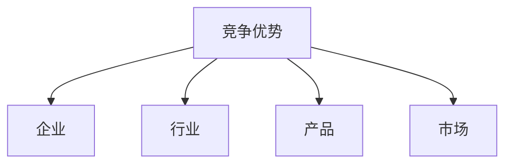
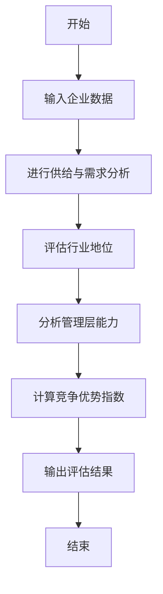
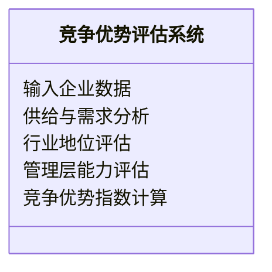
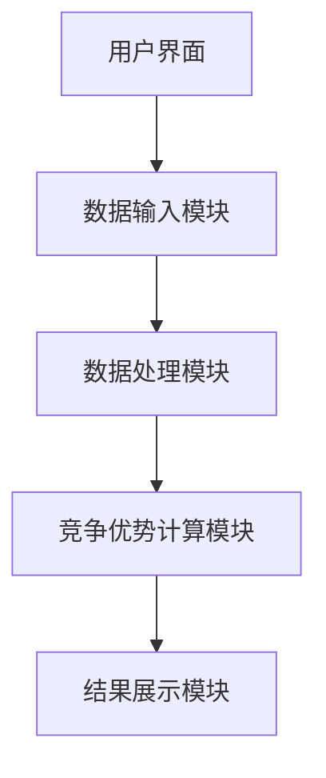

                 


# 彼得林奇的"竞争优势"评估体系

> 关键词：彼得林奇，竞争优势，投资评估，行业分析，数学模型

> 摘要：本文系统地介绍并深入分析了彼得林奇提出的"竞争优势"评估体系。首先，从背景出发，详细阐述了竞争优势的定义、核心要素及其重要性。接着，通过供给与需求分析、行业地位评估、管理层能力分析等多个维度，构建了竞争优势评估的数学模型，并通过mermaid图展示了算法流程与系统架构。最后，通过实际案例分析，验证了该评估体系的有效性，并总结了投资实践中需要注意的关键点。

---

## 第一部分：竞争优势的定义与背景

### 第1章：竞争优势的定义与背景

#### 1.1 竞争优势的定义
竞争优势是指企业在市场中相对于竞争对手的核心优势，这种优势可以是成本优势、技术优势、品牌优势、资源垄断等。彼得林奇认为，竞争优势是决定企业长期盈利能力的关键因素。

#### 1.2 竞争优势的核心要素
竞争优势的核心要素包括：
1. **供给分析**：企业是否能够以更低的成本提供产品或服务。
2. **需求分析**：市场需求是否足够大且稳定。
3. **行业地位**：企业在行业中的地位，是否是龙头企业。
4. **管理层能力**：管理层的战略决策能力和执行力。

#### 1.3 竞争优势的分类与特点
竞争优势可以分为短期竞争优势和长期竞争优势。短期竞争优势可能源于价格优势或短期市场波动，而长期竞争优势则来源于企业核心竞争力的持续发展。

---

### 第2章：彼得林奇竞争优势评估体系的背景

#### 2.1 投资分析的演变历程
投资分析从早期的简单财务指标分析，逐步发展到对行业地位、管理层能力等多维度的综合评估。彼得林奇的竞争优势评估体系是这一演变过程中的重要里程碑。

#### 2.2 彼得林奇的投资理念与方法
彼得林奇强调长期投资和价值投资，他认为市场的短期波动不应该影响对企业的长期判断。竞争优势评估体系正是基于这一理念而提出的。

#### 2.3 竞争优势评估体系的提出动机
为了帮助投资者更科学地评估企业的投资价值，彼得林奇提出了竞争优势评估体系。该体系通过对企业核心竞争力的系统分析，帮助投资者做出更明智的投资决策。

---

## 第二部分：竞争优势评估的核心概念与联系

### 第3章：核心概念原理

#### 3.1 供给与需求分析
供给分析包括对企业生产能力、成本结构的评估；需求分析则关注市场需求的规模、增长潜力以及客户黏性。

#### 3.2 行业地位与竞争格局
行业地位是竞争优势的重要组成部分。龙头企业通常具有更强的议价能力和市场影响力。

#### 3.3 管理层能力与战略决策
管理层的决策能力和战略眼光直接影响企业的长期发展。优秀的管理层能够带领企业在竞争中占据优势地位。

#### 3.4 核心概念属性特征对比表格
表3-1：竞争优势核心要素属性对比

| 要素 | 供给分析 | 需求分析 | 行业地位 | 管理层能力 |
|------|-----------|-----------|-----------|-------------|
| 定义 | 生产能力与成本结构 | 市场需求规模与潜力 | 企业在行业中的地位 | 管理层的决策能力与战略眼光 |
| 重要性 | 决定成本优势 | 决定市场需求的可持续性 | 影响市场影响力 | 决定企业长期发展 |

#### 3.5 ER实体关系图架构


---

### 第4章：竞争优势评估的算法原理

#### 4.1 算法流程图


#### 4.2 算法数学模型
1. **竞争优势指数计算公式**
$$ \text{竞争优势指数} = \frac{\text{供给优势} + \text{需求优势} + \text{行业地位} + \text{管理层能力}}{4} $$

2. **供给与需求分析模型**
$$ \text{供给} = \text{生产能力} \times \text{成本优势} $$
$$ \text{需求} = \text{市场容量} \times \text{品牌影响力} $$

---

## 第三部分：竞争优势评估的系统分析与架构设计

### 第5章：系统分析与架构设计

#### 5.1 系统功能设计


#### 5.2 系统架构设计


---

## 第四部分：竞争优势评估的项目实战

### 第6章：项目实战

#### 6.1 环境安装与配置
1. **系统环境要求**：需要安装Python、Jupyter Notebook、Mermaid工具。
2. **软件工具安装**：安装必要的数据分析库，如Pandas、Matplotlib。

#### 6.2 核心代码实现
1. **数据输入模块**：
```python
import pandas as pd

# 输入企业数据
df = pd.read_csv('企业数据.csv')
```

2. **数据处理模块**：
```python
# 供给与需求分析
供给优势 = df['生产能力'] * df['成本优势']
需求优势 = df['市场容量'] * df['品牌影响力']
```

3. **竞争优势计算模块**：
```python
# 计算竞争优势指数
竞争优势指数 = (供给优势 + 需求优势 + 行业地位 + 管理层能力) / 4
```

---

## 第五部分：总结与最佳实践

### 第7章：总结与最佳实践

#### 7.1 投资建议
1. **长期投资**：注重企业的长期竞争优势，避免短期市场波动的影响。
2. **行业分析**：选择具有持续增长潜力的行业，关注龙头企业。
3. **管理层评估**：重视管理层的能力和战略眼光，选择具有优秀管理团队的企业。

#### 7.2 注意事项
1. **数据准确性**：确保输入数据的准确性和完整性。
2. **模型局限性**：竞争优势评估体系只是一个工具，需要结合实际情况进行调整。

#### 7.3 拓展阅读
推荐阅读彼得林奇的《彼得林奇选股术》以及相关投资分析书籍。

---

作者：AI天才研究院/AI Genius Institute & 禅与计算机程序设计艺术 /Zen And The Art of Computer Programming

