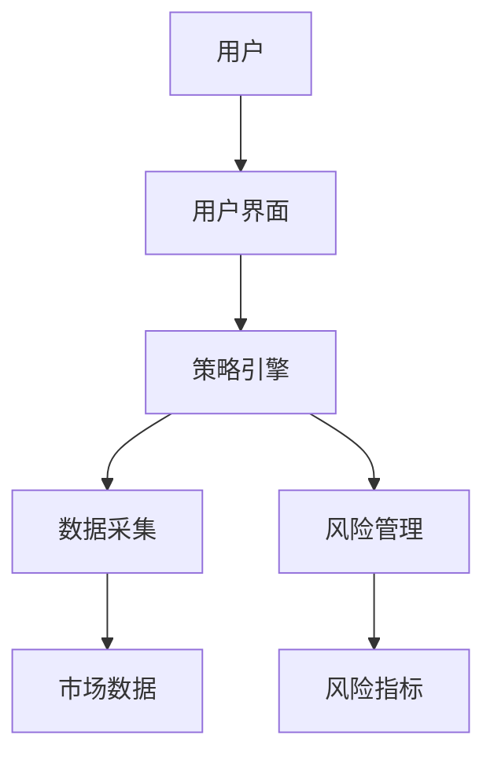

                 


# 彼得林奇的"耐心投资"在市场短期波动中的执行策略

## 关键词：彼得林奇，耐心投资，市场波动，投资策略，长期持有，风险管理

## 摘要：本文深入探讨了彼得林奇的耐心投资理念在市场短期波动中的执行策略。通过分析耐心投资的核心思想、策略实施步骤、应对短期波动的方法，结合实际案例和系统设计，为投资者提供了一套在波动市场中稳定投资的实战指南。文章从背景介绍、核心概念、算法原理、系统架构、项目实战到总结，全面解析了如何在市场波动中坚持长期投资策略，实现稳健收益。

---

## 第一部分：投资基础与市场波动

### 第1章：投资基础概述

#### 1.1 投资的基本概念

##### 1.1.1 什么是投资
投资是通过将资金投入特定的资产或项目，以期在未来获得超过初始投入的回报。投资的基本形式包括股票、债券、房地产等。投资的核心目标是实现财富的增值，同时需要考虑风险、收益和流动性之间的平衡。

##### 1.1.2 投资的基本原则
1. **分散投资**：不要将所有资金投入单一资产，以降低风险。
2. **长期视角**：投资不是短期交易，而是长期持有优质资产。
3. **价值投资**：选择具有长期增长潜力的公司，关注基本面。
4. **风险管理**：识别和控制潜在风险，避免重大损失。

##### 1.1.3 投资的目标与风险
- **目标**：实现资产增值、保值或收入。
- **风险**：包括市场风险、流动性风险、信用风险等，需通过 diversification 和资产配置来降低。

#### 1.2 市场波动的定义与特征

##### 1.2.1 市场波动的来源
1. **宏观经济因素**：利率变化、通货膨胀、经济周期。
2. **市场情绪**：投资者情绪波动影响市场走势。
3. **突发事件**：如政治事件、自然灾害等。

##### 1.2.2 市场波动的周期性
市场波动具有周期性，通常分为上升、下跌、震荡等阶段。投资者需识别这些周期，制定相应的策略。

##### 1.2.3 市场波动对投资者的影响
- **心理影响**：波动可能导致投资者恐慌或贪婪，影响决策。
- **决策影响**：短期波动可能促使投资者做出错误决策，如盲目追涨杀跌。

### 第2章：彼得·林奇与耐心投资

#### 2.1 彼得·林奇的投资理念

##### 2.1.1 长期投资的重要性
彼得·林奇强调长期投资，认为短期波动是市场的噪音，真正的投资机会来源于长期持有优质资产。

##### 2.1.2 耐心投资的核心思想
耐心投资是指不因短期波动而改变投资策略，坚持长期持有的理念。林奇认为，优秀的投资者应关注企业的长期价值，而非短期价格波动。

##### 2.1.3 林奇的投资风格与成功案例
林奇的投资风格以价值投资为主，注重基本面分析。他的成功案例包括投资优质成长股，如可口可乐、微软等。

#### 2.2 耐心投资的策略解析

##### 2.2.1 耐心投资的定义
耐心投资是一种长期投资策略，强调选择优质资产，长期持有，忽略短期波动。

##### 2.2.2 耐心投资的实施步骤
1. **选择优质资产**：关注企业的财务健康、行业地位和成长潜力。
2. **长期持有**：不因短期波动而改变投资决策。
3. **定期调整**：根据市场变化和个人目标，适当调整投资组合。

##### 2.2.3 耐心投资与短期波动的关系
耐心投资的核心是忽略短期波动，专注于长期价值。短期波动是市场的噪音，长期趋势才是关键。

### 第3章：市场短期波动的分析

#### 3.1 短期波动的成因分析

##### 3.1.1 市场情绪的影响
投资者情绪波动是短期波动的重要因素，如恐慌和贪婪会导致市场剧烈波动。

##### 3.1.2 市场新闻事件的影响
突发事件如经济数据发布、企业财报、政策变化等会引发短期波动。

##### 3.1.3 技术分析与短期波动
技术分析是通过价格走势预测短期波动，常用工具包括K线图、均线、成交量分析等。

#### 3.2 短期波动对投资者的影响

##### 3.2.1 短期波动的心理影响
短期波动可能导致投资者情绪失控，做出非理性决策。

##### 3.2.2 短期波动对投资决策的影响
短期波动会影响投资者的决策，如追涨杀跌，但这种行为通常会增加风险。

##### 3.2.3 短期波动的应对策略
- **制定计划**：在波动中坚持既定策略，避免情绪化决策。
- **分散投资**：降低波动对整体投资组合的影响。
- **关注长期价值**：不因短期波动而改变长期投资目标。

---

## 第二部分：耐心投资策略的执行框架

### 第4章：耐心投资的核心策略

#### 4.1 核心策略的定义与特点

##### 4.1.1 核心策略的定义
耐心投资的核心策略是选择优质资产，长期持有，忽略短期波动。

##### 4.1.2 核心策略的特点
1. **长期视角**：关注企业的长期价值。
2. **价值导向**：选择基本面良好的资产。
3. **低频交易**：减少交易频率，降低交易成本和税务负担。

#### 4.2 核心策略的实施步骤

##### 4.2.1 确定投资目标
- **明确投资目标**：收益目标、风险承受能力。
- **制定投资计划**：根据目标选择资产配置。

##### 4.2.2 选择优质股票
- **基本面分析**：关注企业的盈利能力、成长潜力、财务状况。
- **行业分析**：选择具有增长潜力的行业。
- **估值分析**：选择估值合理的股票。

##### 4.2.3 长期持有与定期调整
- **长期持有**：避免频繁交易，减少成本。
- **定期调整**：根据市场变化和个人目标，适当调整投资组合。

### 第5章：耐心投资策略的算法实现

#### 5.1 算法原理

##### 5.1.1 投资组合优化算法
基于现代投资组合理论（MPT），通过优化算法选择最优资产配置，降低风险。

##### 5.1.2 价值评估模型
使用现金流折现法（DCF）评估企业价值，选择低估的股票。

##### 5.1.3 风险管理算法
通过风险调整后的收益（RAR）评估投资组合的风险和收益平衡。

#### 5.2 算法实现

##### 5.2.1 投资组合优化的数学模型
$$ \text{目标函数}：\min \sigma^2 \quad \text{约束条件}：\sum w_i = 1, w_i \geq 0 $$

##### 5.2.2 价值评估的数学模型
$$ \text{DCF模型}：\text{企业价值} = \sum \frac{\text{自由现金流}}{(1 + r)^t} $$

##### 5.2.3 风险管理的数学模型
$$ \text{RAR} = \frac{\text{超额收益}}{\text{风险调整值}} $$

### 第6章：系统架构与实现

#### 6.1 系统架构设计

##### 6.1.1 系统功能模块
- **数据采集**：收集市场数据，包括价格、财务指标等。
- **策略引擎**：执行耐心投资策略，生成交易信号。
- **风险管理**：监控和管理投资组合风险。
- **用户界面**：提供直观的操作界面，展示投资组合状态。

##### 6.1.2 系统架构图


#### 6.2 系统实现

##### 6.2.1 数据采集与处理
- 使用API接口获取实时市场数据。
- 数据清洗和预处理，确保数据准确性。

##### 6.2.2 策略引擎实现
- 基于耐心投资策略，生成交易信号。
- 使用算法优化模块，优化投资组合。

##### 6.2.3 系统接口设计
- **输入接口**：用户输入投资目标和参数。
- **输出接口**：展示投资组合状态和交易信号。

---

## 第三部分：项目实战与总结

### 第7章：项目实战

#### 7.1 环境安装

##### 7.1.1 安装Python环境
安装Python和必要的库，如Pandas、NumPy、Matplotlib。

##### 7.1.2 安装数据分析工具
安装Jupyter Notebook或其他数据分析工具。

#### 7.2 核心实现

##### 7.2.1 价值评估代码
```python
import pandas as pd
import numpy as np

def calculate_intrinsic_value(fcf, discount_rate):
    # 计算DCF模型的内在价值
    return sum(fcf / (1 + discount_rate) ** t for t in range(len(fcf)))
```

##### 7.2.2 投资组合优化代码
```python
import numpy as np
from scipy.optimize import minimize

def portfolio_optimization(returns, weights):
    # 现金流波动最小化
    def objective(weights):
        return np.dot(weights.T @ returns @ weights)
    # 约束条件：权重之和为1
    constraints = [{'type': 'eq', 'fun': lambda w: sum(w) - 1}]
    result = minimize(objective, weights, constraints)
    return result.x
```

#### 7.3 案例分析

##### 7.3.1 案例背景
选择一家科技公司，分析其财务状况和市场地位，评估其投资价值。

##### 7.3.2 算法实现
使用DCF模型评估公司内在价值，制定投资策略。

### 第8章：总结与展望

#### 8.1 总结
耐心投资是一种长期有效的策略，通过选择优质资产和长期持有，可以在市场波动中实现稳健收益。

#### 8.2 注意事项
- **风险控制**：定期评估和调整投资组合，避免过度集中。
- **持续学习**：关注市场变化，提升投资能力。

#### 8.3 拓展阅读
推荐书籍和资源，帮助读者深入学习投资知识。

---

## 作者：AI天才研究院/AI Genius Institute & 禅与计算机程序设计艺术 /Zen And The Art of Computer Programming

