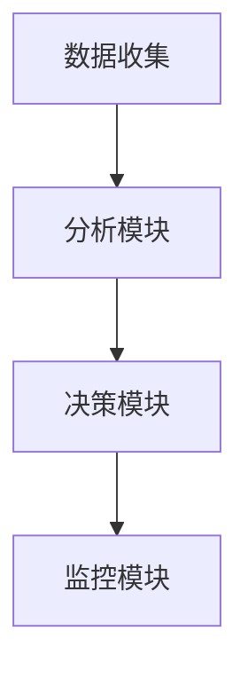

                 

# 彼得林奇的"耐心投资"在短期主义盛行时的价值

> 关键词：彼得·林奇，耐心投资，短期主义，投资策略，价值投资，投资模型

> 摘要：本文深入探讨彼得·林奇的耐心投资理念，分析其在当前短期主义盛行的市场环境下的价值。通过详细阐述耐心投资的核心原则、数学模型、系统架构和实际案例，本文为投资者提供了从理论到实践的全面指导。

---

# 第一部分：彼得·林奇的耐心投资理念

## 第1章：彼得·林奇的生平与投资理念

### 1.1 林奇的生平简介

#### 1.1.1 林奇的早年

彼得·林奇（Peter Lynch）是美国著名的投资专家，被誉为“最伟大的共同基金经理”。他于1942年9月16日出生于美国纽约州的一个小镇。林奇的职业生涯始于麻省投资信托基金（Massachusetts Investment Trust），这是美国历史最悠久的共同基金之一。林奇在1970年代开始管理该基金，并在1977年成为该基金的董事长兼首席投资官。在他的领导下，麻省投资信托基金的规模从1900万美元增长到超过100亿美元，年平均回报率达到13.7%，远超市场平均水平。

林奇的投资风格以耐心和长期价值投资著称。他认为，投资者应该选择那些自己能够理解的公司，并长期持有，而不是频繁交易。这种投资理念与短期主义盛行的市场环境形成了鲜明对比。

---

## 第2章：耐心投资的核心要素

### 2.1 投资策略的核心原则

耐心投资的核心原则包括以下几个方面：

1. **长期价值导向**：关注公司的内在价值，而不是市场的短期波动。
2. **分散投资**：通过投资不同类型的企业来降低风险。
3. **深入研究**：对投资标的进行深入的研究，包括财务报表、行业趋势和管理层能力。
4. **避免短期决策**：不被市场的短期波动所影响，保持耐心。

---

## 第3章：短期主义与长期投资的对比

### 3.1 短期主义的现状与问题

短期主义是指投资者仅关注短期收益，频繁买卖股票，追求快速获利的投资策略。这种策略在当前市场环境下非常普遍，尤其是在高频交易和算法交易盛行的情况下。然而，短期主义往往忽视了企业的长期价值，可能导致投资者错失长期增长的机会。

---

## 第4章：耐心投资的数学模型与算法

### 4.1 投资决策的数学模型

为了量化耐心投资的策略，我们可以构建一个简单的数学模型来评估公司的内在价值。以下是模型的详细步骤：

1. **确定公司的基本面数据**：包括收入、利润、负债和现金流。
2. **计算市盈率（P/E）**：市盈率 = 股价 / 每股净利润。
3. **比较行业平均市盈率**：如果公司的市盈率低于行业平均水平，可能是一个投资机会。
4. **长期持有策略**：根据公司的基本面和行业趋势，制定长期持有计划。

以下是市盈率的数学表达式：

$$ P/E = \frac{P}{E} $$

其中，$P$ 是股价，$E$ 是每股净利润。

---

## 第5章：系统架构与投资实践

### 5.1 投资系统的架构设计

为了实现耐心投资的策略，我们可以构建一个基于长期价值的投资系统。以下是系统的架构设计：

1. **数据收集模块**：收集公司的财务数据、行业趋势和市场新闻。
2. **分析模块**：使用数学模型评估公司的内在价值。
3. **决策模块**：根据分析结果制定投资决策。
4. **监控模块**：持续监控投资标的的动态，调整投资组合。

以下是系统架构的mermaid图：

---

## 第6章：实际案例分析

### 6.1 林奇的经典投资案例

林奇在管理麻省投资信托基金期间，投资了许多成功的公司，例如：

1. **莲花开发公司（Lotus Development）**：林奇在1980年代初期投资了莲花开发公司，该公司后来成为莲花软件公司，并在1990年代被IBM收购，为基金带来了丰厚的回报。
2. **苹果公司**：林奇在苹果公司成立初期投资了该公司，并在公司成长期间持续持有，最终获得了巨大的收益。

---

## 第7章：总结与建议

### 7.1 全书内容回顾

耐心投资是一种以长期价值为导向的投资策略，强调深入研究和长期持有。在短期主义盛行的市场环境下，耐心投资显得尤为重要。

### 7.2 投资策略的优化建议

1. **深入研究**：在投资之前，对公司的基本面进行深入研究。
2. **分散投资**：通过投资不同类型的企业来降低风险。
3. **保持耐心**：避免短期波动的影响，坚持长期投资。

### 7.3 对未来投资环境的展望

随着市场环境的变化，耐心投资的核心原则依然适用。投资者应该始终坚持长期价值导向，避免短期主义的诱惑。

---

# 结语

彼得·林奇的耐心投资理念为我们提供了一种在短期主义盛行的市场环境中保持冷静和理性的方法。通过深入研究和长期持有，投资者可以实现稳健的回报。希望本文的分析和案例能够为投资者提供有益的指导。

作者：AI天才研究院/AI Genius Institute & 禅与计算机程序设计艺术 /Zen And The Art of Computer Programming

