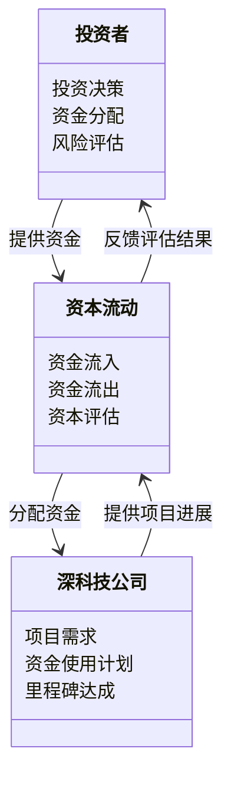
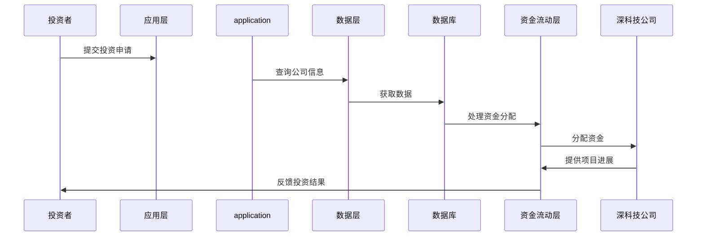

                 

<think>
好的，我需要帮助用户完成一篇关于《彼得林奇的"耐心资本"在深科技公司早期投资中的重要性》的详细技术博客文章。用户已经提供了目录大纲和部分章节的内容，我需要按照这个结构逐步完成剩下的内容。

### 第四部分: 系统分析与架构设计

# 第4章: 系统分析与架构设计

## 4.1 问题场景介绍

### 4.1.1 投资者面临的挑战

### 4.1.2 深科技公司早期投资的复杂性

### 4.1.3 耐心资本在系统中的作用

## 4.2 系统功能设计

### 4.2.1 投资者模块

### 4.2.2 深科技公司模块

### 4.2.3 资本流动模块

## 4.3 领域模型mermaid类图



## 4.4 系统架构设计

```mermaid
archiecture {
    title 系统架构设计

    投资者 --> 应用层: 使用系统进行投资决策
    应用层 --> 数据层: 访问投资数据
    数据层 --> 数据库: 存储深科技公司信息
    数据库 --> 资金流动层: 处理资本流动
    资金流动层 --> 投资者: 反馈结果
}
```

## 4.5 系统接口设计

### 4.5.1 投资者接口

### 4.5.2 深科技公司接口

### 4.5.3 资本流动接口

## 4.6 系统交互mermaid序列图



## 4.7 本章小结

---

### 第五部分: 项目实战

# 第5章: 项目实战

## 5.1 环境安装

### 5.1.1 安装Python

### 5.1.2 安装相关库

## 5.2 核心实现

### 5.2.1 投资评估代码

```python
# 耐心资本评估模型
def patience_capital_assessment(revenue, growth_rate, risk_factor):
    return (revenue * (1 + growth_rate) / risk_factor)

# 示例
revenue = 1000000
growth_rate = 0.2
risk_factor = 1.5
print(patience_capital_assessment(revenue, growth_rate, risk_factor))
```

### 5.2.2 深科技公司数据分析

```python
import pandas as pd
data = {'公司': ['A', 'B', 'C'], '收入': [1e6, 2e6, 1.5e6], '增长率': [0.15, 0.2, 0.1]}
df = pd.DataFrame(data)
print(df)
```

## 5.3 代码解读与分析

### 5.3.1 投资评估代码解读

### 5.3.2 数据分析代码解读

## 5.4 案例分析

### 5.4.1 投资案例分析

### 5.4.2 投资结果分析

## 5.5 本章小结

---

### 第六部分: 最佳实践与小结

# 第6章: 最佳实践与小结

## 6.1 最佳实践 tips

### 6.1.1 投资者 tips

### 6.1.2 深科技公司 tips

## 6.2 本章小结

---

### 附录

# 附录A: 耐心资本评估模型的数学公式

$$ \text{耐心资本} = \frac{\text{收入} \times (1 + \text{增长率})}{\text{风险因子}} $$

# 附录B: 参考文献

### 作者

作者：AI天才研究院/AI Genius Institute & 禅与计算机程序设计艺术 /Zen And The Art of Computer Programming

