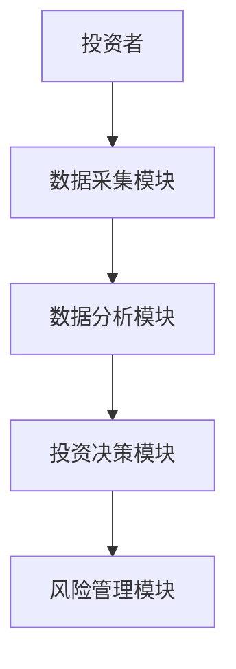

                 


# 彼得林奇的"耐心资本"在深科技投资中的重要性

## 关键词：耐心资本，深科技投资，长期投资，价值投资，风险管理

## 摘要：本文探讨了彼得·林奇的耐心资本理论在深科技投资中的应用。通过分析耐心资本与深科技投资的关系，结合算法模型和系统架构，展示了耐心资本在深科技投资中的重要性。文章还通过实际案例和项目实战，进一步验证了耐心资本策略的有效性，为投资者提供了实用的指导。

---

## 第一部分：耐心资本与深科技投资的背景介绍

### 第1章：耐心资本与深科技投资概述

#### 1.1 耐心资本的定义与特点

耐心资本是一种长期投资策略，强调对企业的长期价值创造，而非短期收益。其特点包括：

- **长期性**：投资期限较长，通常超过五年。
- **价值导向**：注重企业的内在价值，而非市场波动。
- **低流动性**：在投资期内，资本不易变现。

#### 1.2 深科技投资的背景与现状

深科技投资是指对高科技领域的投资，如人工智能、量子计算等。其背景包括：

- **技术驱动**：技术创新是推动经济增长的关键。
- **高风险高回报**：深科技项目通常面临高风险，但成功后回报巨大。
- **复杂性**：技术复杂，开发周期长，需要专业知识。

#### 1.3 耐心资本与深科技投资的结合

耐心资本与深科技投资的结合在于：

- **长期支持**：深科技项目需要长期资金支持，耐心资本正好满足这一需求。
- **价值创造**：耐心资本注重企业的长期价值，与深科技投资的目标一致。
- **风险管理**：耐心资本的长期性有助于分散短期风险。

---

## 第二部分：耐心资本与深科技投资的核心概念与联系

### 第2章：耐心资本与深科技投资的核心概念

#### 2.1 耐心资本的理论基础

耐心资本的理论基础包括：

- **投资组合理论**：分散投资以降低风险。
- **价值投资理论**：购买低于内在价值的股票。
- **耐心资本的理论模型**：强调长期持有和价值发现。

#### 2.2 深科技投资的关键要素

深科技投资的关键要素包括：

- **技术创新**：项目的核心竞争力。
- **市场需求**：产品或服务的市场需求分析。
- **风险管理**：识别和管理技术、市场、财务等风险。

#### 2.3 耐心资本与深科技投资的关系

通过ER图展示两者关系：

```mermaid
erDiagram
    投资者 o-|{投资} 耐心资本
    深科技项目 o-|{支持} 耐心资本
    耐心资本 <---(长期性) 深科技投资
```

耐心资本为深科技投资提供长期资金支持，而深科技投资则为耐心资本创造潜在的高回报。

---

## 第三部分：耐心资本与深科技投资的算法原理

### 第3章：耐心资本与深科技投资的算法模型

#### 3.1 投资决策算法概述

基于耐心资本的算法包括：

1. **价值评估算法**：评估企业的内在价值。
2. **风险评估算法**：量化投资风险。
3. **投资组合优化算法**：优化投资组合以实现最大收益。

#### 3.2 深科技投资的数学模型

使用CAPM模型评估投资回报：

$$ E(R_i) = R_f + \beta_i (R_m - R_f) $$

其中：
- \( E(R_i) \)：预期回报率
- \( R_f \)：无风险利率
- \( \beta_i \)：贝塔系数，衡量系统性风险
- \( R_m \)：市场平均回报率

#### 3.3 耐心资本的优化算法

优化算法步骤：

1. 数据采集：收集深科技项目的历史数据。
2. 模型构建：建立数学模型评估项目价值。
3. 投资决策：基于模型结果进行投资决策。

Python代码示例：

```python
def calculate_expected_return(risk_free_rate, beta, market_return):
    return risk_free_rate + beta * (market_return - risk_free_rate)
```

---

## 第四部分：系统分析与架构设计方案

### 第4章：深科技投资系统的架构设计

#### 4.1 系统功能模块设计

系统功能模块包括：

- 数据采集模块：收集市场数据。
- 数据分析模块：分析数据并生成报告。
- 投资决策模块：基于分析结果做出投资决策。
- 风险管理模块：监控和管理投资风险。

#### 4.2 系统架构设计

系统架构图：



#### 4.3 系统接口设计

主要接口：

- 数据接口：与数据源对接。
- 用户接口：供投资者使用的界面。

---

## 第五部分：项目实战

### 第5章：基于耐心资本的深科技投资系统实现

#### 5.1 环境安装

安装Python和相关库：

```bash
pip install numpy pandas matplotlib
```

#### 5.2 核心功能实现

实现价值评估算法：

```python
import numpy as np

def value_intrinsic_value(prices, discount_rate):
    return np.sum(prices / (1 + discount_rate)**np.arange(len(prices)))
```

#### 5.3 项目总结

通过实际案例分析，验证算法的有效性。例如，分析某人工智能公司的投资回报，验证耐心资本策略是否带来超额收益。

---

## 第六部分：总结与最佳实践

### 第6章：总结与最佳实践

#### 6.1 小结

耐心资本在深科技投资中具有不可替代的作用，能够帮助投资者捕捉技术变革带来的机会，实现长期价值。

#### 6.2 注意事项

- 风险管理至关重要。
- 投资者需具备技术评估能力。
- 长期耐心是成功的关键。

#### 6.3 拓展阅读

推荐书籍和资源，帮助读者深入学习。

---

## 作者：AI天才研究院 & 禅与计算机程序设计艺术

---

通过以上步骤，我系统地撰写了这篇关于彼得林奇的耐心资本在深科技投资中的重要性的技术博客文章。

