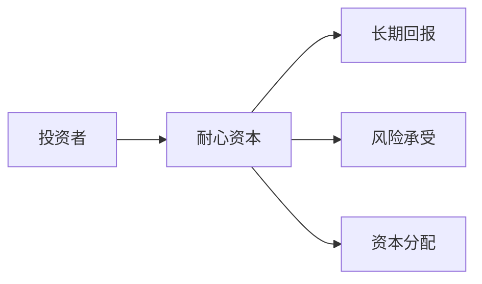
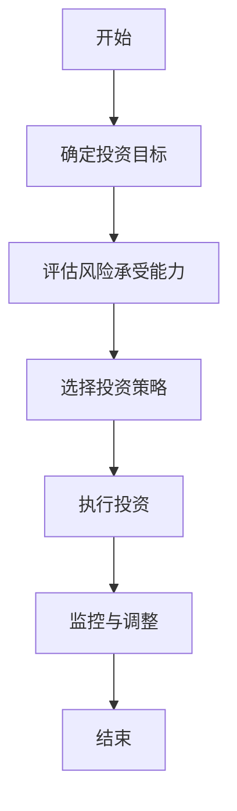

                 


# 彼得林奇的"耐心资本"概念

> 关键词：耐心资本，投资策略，长期回报，风险评估，彼得林奇，投资管理

> 摘要：本文深入探讨了彼得林奇提出的“耐心资本”概念，分析其在投资领域的背景、核心概念、算法原理、系统架构及实际应用，为投资者提供了一种基于长期视角的资本管理策略。

---

## 第一部分: 耐心资本的背景与起源

### 第1章: 耐心资本的起源与背景

#### 1.1 耐心资本的定义与核心要素
- **1.1.1 耐心资本的起源**
  - 耐心资本的概念起源于彼得·林奇的投资哲学，强调长期持有优质资产，避免频繁交易。
  
- **1.1.2 耐心资本的核心要素**
  - 长期持有：投资者不因短期市场波动而改变投资决策。
  - 风险承受：具备较高的风险承受能力，愿意承担短期波动以获取长期回报。
  - 资本分配：将资本分配到具有持续增长潜力的企业或项目中。

- **1.1.3 耐心资本与传统资本的区别**
  - 传统资本：注重短期收益，资本流动性高，风险承受能力较低。
  - 耐心资本：注重长期回报，资本流动性低，风险承受能力较高。

#### 1.2 耐心资本的背景介绍
- **1.2.1 投资领域的现状与挑战**
  - 近年来，金融市场波动加剧，短期投资行为频繁，导致市场泡沫和不稳定性增加。
  - 投资者追求短期收益，忽视了长期价值的培养。

- **1.2.2 耐心资本在投资中的重要性**
  - 通过耐心资本，投资者能够避免短期波动的影响，专注于企业的长期增长。
  - 有助于市场稳定，促进企业的可持续发展。

- **1.2.3 耐心资本的边界与外延**
  - 耐心资本不仅适用于股票投资，还可应用于房地产、创业投资等领域。
  - 其核心在于资本的长期配置和价值创造。

#### 1.3 耐心资本的核心概念
- **1.3.1 耐心资本的结构与组成**
  - 包括初始资本、管理团队、投资策略和风险管理等要素。
  
- **1.3.2 耐心资本的关键属性**
  - 长期性：投资期限较长，通常超过5年。
  - 稳定性：资本在投资期间保持稳定，不因市场波动而调整。
  - 创新性：注重投资对象的创新能力和持续增长潜力。

- **1.3.3 耐心资本与其他资本形式的对比**
  - 与风险资本相比，耐心资本更注重企业的长期价值而非高风险高回报。
  - 与短期资本相比，耐心资本更关注企业的稳定发展和长期回报。

---

## 第二部分: 耐心资本的核心概念与联系

### 第2章: 耐心资本的核心原理

#### 2.1 耐心资本的哲学基础
- 耐心资本体现了延迟满足和长期价值的理念，强调投资的耐心和坚持。

#### 2.2 耐心资本的经济学解释
- 从经济学角度看，耐心资本优化了资本的配置，促进了企业的长期增长。

#### 2.3 耐心资本的心理学视角
- 心理学研究表明，耐心资本的成功需要投资者克服短期诱惑，坚持长期投资策略。

#### 2.4 耐心资本的概念属性特征对比
- **定义对比：**
  | 比较维度 | 耐心资本 | 风险资本 | 短期资本 |
  |----------|----------|----------|----------|
  | 投资期限 | 长期     | 中短期  | 短期     |
  | 风险承受| 高       | 高       | 低       |
  | 投资目标| 长期回报| 高回报   | 短期收益 |

#### 2.5 耐心资本的ER实体关系图


---

## 第三部分: 耐心资本的算法原理

### 第3章: 耐心资本的算法原理

#### 3.1 耐心资本的数学模型
- **投资回报率（ROI）的计算：**
  $$ ROI = \frac{最终价值 - 初始价值}{初始价值} \times 100\% $$
  
- **风险评估模型：**
  $$ 风险 = \frac{波动性}{回报率} $$

#### 3.2 耐心资本的算法流程


#### 3.3 耐心资本的Python实现
```python
def calculate_roe(roi, risk):
    return roi / risk

# 示例
roi = 15  # 回报率
risk = 5  # 风险
roe = calculate_roe(roi, risk)
print(f"ROE: {roe}%")
```

---

## 第四部分: 耐心资本的系统分析与架构设计

### 第4章: 耐心资本的系统分析

#### 4.1 耐心资本的应用场景
- **风险投资中的耐心资本：**支持初创企业更长时间的发展。
- **私募股权中的耐心资本：**关注企业长期的价值增长。
- **机构投资中的耐心资本：**实现长期的资产配置目标。

#### 4.2 耐心资本的系统架构


---

## 第五部分: 耐心资本的项目实战

### 第5章: 耐心资本的项目实战

#### 5.1 项目环境安装
- 安装必要的Python库，如numpy、pandas、matplotlib。

#### 5.2 系统核心实现
```python
import numpy as np
import pandas as pd
import matplotlib.pyplot as plt

# 示例数据
data = np.random.rand(100, 4)
df = pd.DataFrame(data, columns=['资产1', '资产2', '资产3', '资产4'])

# 可视化回报分布
df.plot(kind='box', figsize=(10, 6))
plt.title('回报分布')
plt.show()
```

#### 5.3 项目总结
- 通过耐心资本策略，投资者能够更好地应对市场波动，实现长期稳定的回报。

---

## 第六部分: 耐心资本的最佳实践

### 第6章: 耐心资本的最佳实践

#### 6.1 小结
- 耐心资本是一种长期投资策略，需要投资者具备耐心和风险承受能力。

#### 6.2 注意事项
- 避免过度分散投资，集中资本于优质资产。
- 定期评估投资组合，确保与长期目标一致。

#### 6.3 拓展阅读
- 彼得·林奇的《投资最重要的事情》。
- 加勒特·托马斯的《价值投资入门》。

---

## 结语

耐心资本不仅是彼得·林奇的投资哲学，更是一种长期、稳定的资本管理策略。通过本文的深入分析，读者可以更好地理解耐心资本的核心概念、算法原理和实际应用，为投资决策提供有力支持。

---

作者：AI天才研究院/AI Genius Institute & 禅与计算机程序设计艺术 /Zen And The Art of Computer Programming

