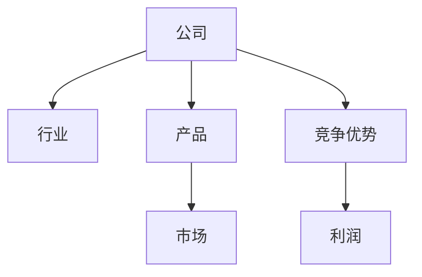
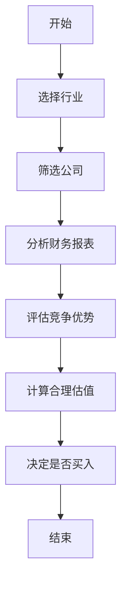
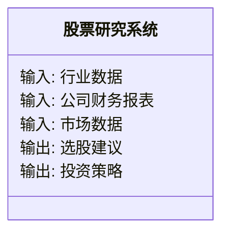
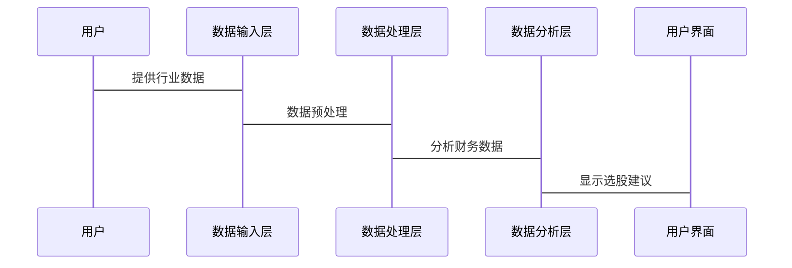

                 


# 彼得林奇的股票研究方法

> 关键词：彼得林奇，股票研究，基本面分析，价值投资，财务报表分析

> 摘要：本文详细介绍了彼得林奇的股票研究方法，从他的投资理念、选股标准、财务分析方法到实际操作策略，全面解析了这一经典的投资方法。通过系统分析和案例研究，帮助读者掌握如何运用彼得林奇的方法进行股票投资。

---

# 第1章: 彼得林奇的股票研究方法概述

## 1.1 背景介绍

### 1.1.1 彼得林奇的投资理念
- **长期投资**：彼得林奇强调长期持有优质股票，避免频繁交易。
- **价值投资**：寻找被市场低估的公司，关注其内在价值。
- **深入研究**：通过基本面分析，了解公司的财务状况、行业地位和竞争优势。

### 1.1.2 股票研究的核心概念
- **财务报表分析**：通过利润表、资产负债表和现金流量表评估公司财务健康状况。
- **估值指标**：如市盈率（PE）、市净率（PB）等，帮助判断股票是否被低估。
- **竞争优势**：分析公司的护城河，如品牌、技术、成本优势等。

### 1.1.3 为什么这种方法值得学习
- **系统性**：彼得林奇的方法提供了从行业分析到公司估值的完整框架。
- **实用性**：适用于个人投资者，帮助做出理性投资决策。
- **长期有效性**：经过时间验证，长期稳定收益。

## 1.2 彼得林奇的投资哲学

### 1.2.1 长期投资与价值发现
- **长期持有**：避免短期市场波动的干扰，专注于公司长期价值。
- **价值发现**：寻找那些市场价格低于内在价值的公司。

### 1.2.2 避免短期波动的干扰
- **市场情绪的影响**：避免因市场恐慌或过度乐观而做出错误决策。
- **坚持基本面分析**：关注公司业绩和财务数据，而非市场情绪。

### 1.2.3 买入并持有优质股票的策略
- **优质股票的定义**：具有强大竞争优势、良好财务状况和稳定增长潜力的公司。
- **买入时机**：在市场低迷或公司股价被低估时买入。

## 1.3 彼得林奇的选股标准

### 1.3.1 高质量公司的定义
- **行业地位**：公司在行业内具有领先地位，竞争优势明显。
- **财务健康**：公司财务状况稳健，盈利能力强，负债合理。
- **管理层质量**：管理层能力强，诚信可靠。

### 1.3.2 财务健康状况的判断
- **利润表分析**：关注收入增长、利润率和盈利能力。
- **资产负债表分析**：评估资产质量、负债结构和股东权益。
- **现金流量表分析**：关注经营活动现金流是否健康。

### 1.3.3 行业地位与竞争优势
- **行业分析**：选择增长潜力大、竞争格局稳定的行业。
- **竞争优势分析**：评估公司在行业中的独特优势，如技术、品牌、成本控制等。

---

# 第2章: 核心概念与联系

## 2.1 彼得林奇研究方法的核心原理

### 2.1.1 基本面分析的核心要素
- **行业分析**：了解行业发展趋势、周期性特点和竞争结构。
- **公司分析**：深入研究公司的财务状况、盈利能力、管理团队和竞争优势。
- **估值分析**：通过财务指标和估值模型判断股票的合理价格区间。

### 2.1.2 财务报表分析的关键指标
- **市盈率（PE）**：股价与每股净利润的比率，用于衡量股票的估值。
- **市净率（PB）**：股价与每股净资产的比率，用于判断股票是否被低估。
- **股息率**：每股股息与股价的比率，用于评估投资回报。

### 2.1.3 行业分析与公司估值的关系
- **行业趋势**：行业增长潜力影响公司的长期价值。
- **竞争地位**：公司在行业中的地位决定了其竞争优势和盈利能力。

## 2.2 核心概念对比分析

### 2.2.1 财务指标对比表格
| 财务指标 | 公式 | 作用 |
|----------|------|------|
| PE       | 股价/每股净利润 | 评估股票的估值是否合理 |
| PB       | 股价/每股净资产 | 判断股票是否被低估 |
| ROE      | 净利润/净资产   | 评估公司的盈利能力 |

### 2.2.2 公司竞争优势的ER实体关系图


---

# 第3章: 算法原理讲解

## 3.1 彼得林奇选股算法的流程图



## 3.2 选股标准的数学模型

### 3.2.1 PE计算公式
$$ PE = \frac{股票价格}{每股净利润} $$

### 3.2.2 PB计算公式
$$ PB = \frac{股票价格}{每股净资产} $$

## 3.3 举例说明

### 3.3.1 某公司PE与行业平均PE对比
- 公司PE：15
- 行业平均PE：20
- 结论：该公司股票可能被低估，值得进一步关注。

### 3.3.2 公司竞争优势分析
- 该公司在行业内具有领先地位，市场份额高。
- 公司财务状况稳健，净利润持续增长。
- 管理层能力强，注重研发和创新。

---

# 第4章: 系统分析与架构设计方案

## 4.1 投资决策系统的场景介绍

### 4.1.1 系统目标
- 实现彼得林奇选股方法的自动化分析。
- 提供行业分析、公司估值和投资建议。

### 4.1.2 使用场景
- 个人投资者用于股票筛选和投资决策。
- 机构投资者用于组合管理和风险控制。

## 4.2 系统功能设计

### 4.2.1 领域模型mermaid类图


## 4.3 系统架构设计

### 4.3.1 系统架构mermaid架构图


## 4.4 系统接口设计

### 4.4.1 数据接口
- 获取行业数据：从金融数据库获取行业信息。
- 获取公司财务报表：从公开数据源获取财务数据。
- 获取市场数据：包括股价、指数等实时数据。

### 4.4.2 用户界面接口
- 输入：用户输入行业和公司信息。
- 输出：系统输出选股建议和投资策略。

## 4.5 系统交互mermaid序列图


---

# 第5章: 项目实战

## 5.1 环境安装

### 5.1.1 数据分析工具安装
- 安装Python和Pandas库，用于数据处理和分析。
- 安装Matplotlib或Seaborn库，用于数据可视化。

### 5.1.2 金融数据源获取
- 使用Yahoo Finance API获取股票数据。
- 使用财经网站或数据库获取行业和公司信息。

## 5.2 核心实现源代码

### 5.2.1 财务指标计算代码
```python
import pandas as pd

def calculate_pe(stock_price, net_profit_per_share):
    return stock_price / net_profit_per_share

def calculate_pb(stock_price, book_value_per_share):
    return stock_price / book_value_per_share

# 示例数据
data = {
    '公司': ['A公司', 'B公司', 'C公司'],
    '股价': [50, 30, 40],
    '每股净利润': [2.5, 1.5, 2],
    '每股净资产': [10, 5, 8]
}

df = pd.DataFrame(data)

# 计算PE和PB
df['PE'] = df['股价'] / df['每股净利润']
df['PB'] = df['股价'] / df['每股净资产']

print(df)
```

### 5.2.2 代码应用解读与分析
- 通过代码计算PE和PB，帮助判断股票的估值。
- 示例中，A公司的PE为20，PB为5，可能被高估；B公司的PE为20，PB为6，可能被合理或低估。

## 5.3 实际案例分析和详细讲解剖析

### 5.3.1 案例背景
- 选择一个行业，如科技行业。
- 筛选几家公司，如苹果、谷歌、微软。

### 5.3.2 财务分析
- 分析公司的利润表、资产负债表和现金流量表。
- 计算PE、PB等指标，评估公司的估值。

### 5.3.3 投资决策
- 根据分析结果，决定是否买入或卖出股票。

## 5.4 项目小结

### 5.4.1 成功经验
- 通过系统分析和深入研究，成功筛选出优质股票。

### 5.4.2 挑战与解决
- 数据获取困难：使用可靠的金融数据源解决。
- 分析复杂性：通过自动化工具简化分析过程。

---

# 第6章: 总结与最佳实践

## 6.1 总结

### 6.1.1 核心观点回顾
- 彼得林奇的投资方法以基本面分析为核心。
- 通过深入研究公司财务状况和行业地位，判断股票的内在价值。

### 6.1.2 方法优势
- 系统性：提供完整的投资框架。
- 实用性：适用于个人和机构投资者。
- 长期有效性：经过时间验证的有效方法。

## 6.2 最佳实践 tips

### 6.2.1 选股标准
- 选择具有强大竞争优势和良好财务状况的公司。
- 避免投资于财务状况不佳或行业前景不明朗的公司。

### 6.2.2 系统分析
- 使用数据分析工具和自动化系统，提高分析效率。
- 定期更新数据和分析结果，保持投资策略的有效性。

### 6.2.3 持续学习
- 关注行业动态和公司新闻，及时调整投资策略。
- 不断学习和提升自己的分析能力。

## 6.3 小结

### 6.3.1 投资心态
- 长期投资需要耐心和信心，避免短期波动的干扰。
- 保持理性和冷静，避免情绪化决策。

### 6.3.2 持续改进
- 定期回顾和评估投资组合的表现。
- 根据市场变化和个人目标，调整投资策略。

---

作者：AI天才研究院/AI Genius Institute & 禅与计算机程序设计艺术 /Zen And The Art of Computer Programming

