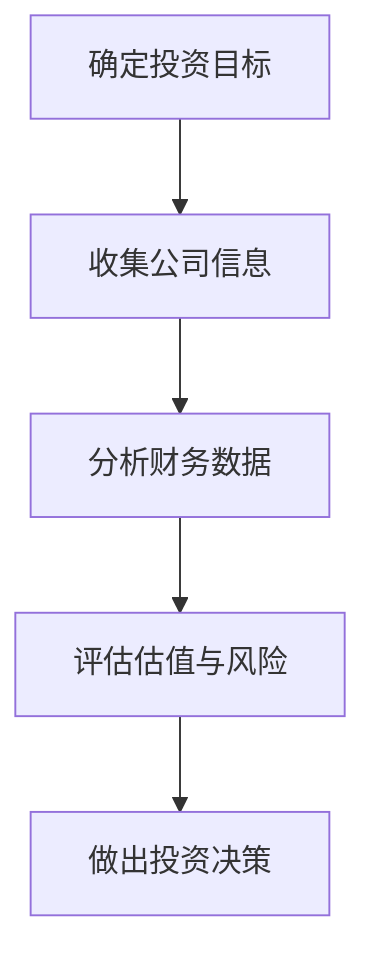

                 


# 彼得林奇的"自下而上"选股方法

## 关键词：彼得·林奇，自下而上，选股方法，基本面分析，投资策略

## 摘要：本文深入探讨了彼得·林奇的“自下而上”选股方法，从投资背景、核心概念、算法原理、系统设计到实战案例，全面解析这一经典投资策略。通过详细分析，帮助读者掌握如何从个股基本面出发，识别被低估的投资机会，构建稳健的投资组合。

---

## 第一部分: 投资背景与彼得·林奇的投资理念

### 1.1 股票市场的基本概念

股票市场是投资者通过买卖公司股份来实现财富增长的地方。股票价格受多种因素影响，包括公司业绩、行业趋势、宏观经济环境等。投资者需要理解市场运作机制，才能在其中做出明智决策。

### 1.2 彼得·林奇的生平简介

彼得·林奇是富达投资集团的传奇基金经理，以其卓越的投资成绩闻名。他主张通过深入研究公司基本面，选择被低估的股票，长期投资，从而实现超额收益。

### 1.3 自下而上选股方法的定义

自下而上选股方法是指从具体股票入手，通过分析公司财务状况、行业地位、竞争优势等因素，挑选具有投资价值的个股。这种方法与自上而下（从宏观经济、行业趋势出发）不同，强调个股的独立分析。

---

## 第二部分: 自下而上选股方法的核心概念

### 2.1 公司基本面分析

#### 2.1.1 财务报表分析

财务报表包括利润表、资产负债表和现金流量表。通过分析这些报表，可以评估公司的盈利能力、资产负债情况和现金流健康状况。

#### 2.1.2 财务指标分析

关键财务指标包括市盈率（P/E）、市净率（P/B）、股息率等。这些指标帮助评估股票的估值是否合理。

| 指标名称 | 公式 | 作用 |
|----------|------|------|
| 市盈率 | P/E = 股价/每股收益 | 评估股票价格是否被高估或低估 |
| 市净率 | P/B = 股价/每股净资产 | 判断股票相对于账面价值的高低 |
| 股息率 | Dividend Yield = 每股股息/股价 | 衡量股票收益稳定性 |

#### 2.1.3 可持续竞争优势分析

竞争优势是公司长期盈利的关键。分析公司的市场地位、品牌、技术壁垒等，判断其是否具备持续竞争优势。

### 2.2 行业分析与竞争优势

行业分析帮助识别具有增长潜力的行业。竞争优势分析则筛选出行业内具备独特优势的公司。

### 2.3 估值与风险评估

合理的估值是投资成功的关键。通过DCF模型等方法评估公司价值，并考虑市场风险、流动性风险等。

---

## 第三部分: 自下而上选股方法的算法原理

### 3.1 基于基本面分析的选股流程

#### 3.1.1 确定投资目标

明确投资目标，如追求长期资本增值还是股息收入。

#### 3.1.2 收集公司信息

通过公司财报、行业报告等渠道收集相关信息。

#### 3.1.3 分析财务数据

计算关键财务指标，评估公司财务健康状况。

#### 3.1.4 评估估值与风险

比较股票估值与市场平均水平，判断其是否具有投资价值。

#### 3.1.5 做出投资决策

综合分析结果，决定是否买入、持有或卖出。

### 3.2 算法流程图



### 3.3 数学模型与公式

市盈率公式：
$$ P/E = \frac{Stock Price}{Earnings Per Share} $$

市净率公式：
$$ P/B = \frac{Stock Price}{Book Value Per Share} $$

股息率公式：
$$ Dividend Yield = \frac{Dividend Per Share}{Stock Price} $$

---

## 第四部分: 系统分析与架构设计

### 4.1 系统功能设计

#### 4.1.1 数据获取模块

从金融数据源获取股票信息。

#### 4.1.2 数据清洗模块

处理缺失数据和异常值。

#### 4.1.3 数据分析模块

计算财务指标，评估公司价值。

#### 4.1.4 结果输出模块

生成选股结果和投资建议。

### 4.2 系统架构设计


---

## 第五部分: 项目实战

### 5.1 环境安装

安装Python、Pandas、Matplotlib等工具。

### 5.2 核心代码实现

```python
import pandas as pd

# 示例数据
data = {'公司': ['A', 'B', 'C'],
         '股价': [10, 15, 20],
         '每股收益': [2, 3, 4]}
df = pd.DataFrame(data)

# 计算市盈率
df['P/E'] = df['股价'] / df['每股收益']
print(df)
```

### 5.3 案例分析

以公司A为例，分析其市盈率是否合理，判断是否具备投资价值。

### 5.4 项目总结

通过实战案例，验证自下而上选股方法的有效性，总结经验教训。

---

## 第六部分: 小结

彼得·林奇的自下而上选股方法通过深入分析公司基本面，挑选被低估的股票，实现长期稳健的投资回报。本文从理论到实践，全面解析了这一方法，为投资者提供了实用的指导。

---

## 作者：AI天才研究院 & 禅与计算机程序设计艺术

---

通过本文，读者可以系统地了解自下而上选股方法的原理和应用，掌握如何在实际投资中运用这一策略。希望本文能为投资者提供有价值的参考。

