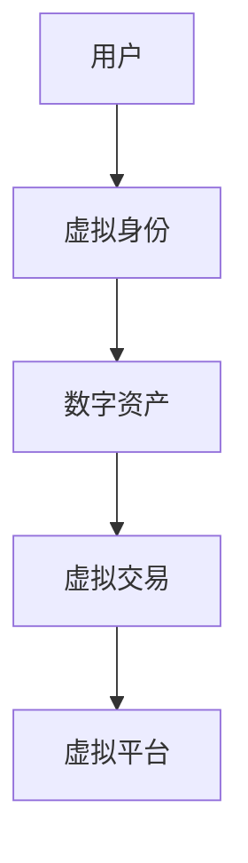
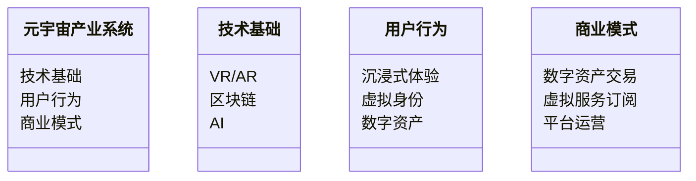

                 

# 彼得林奇的"行业分析"在元宇宙相关产业中的调整

## 关键词：彼得林奇，行业分析，元宇宙，产业调整，技术驱动

## 摘要：  
本文探讨了彼得林奇的行业分析方法在元宇宙相关产业中的应用与调整。随着元宇宙产业的崛起，传统行业分析方法面临新的挑战。本文从元宇宙的基本概念、行业特点出发，分析了彼得林奇方法的局限性，并提出了一套适用于元宇宙行业的调整策略，包括技术评估、用户行为分析、商业模式创新等方面。通过实际案例和系统架构设计，本文详细阐述了如何在元宇宙产业中有效应用调整后的行业分析方法。

---

# 第一部分: 元宇宙相关产业的行业分析背景与概念

## 第1章: 元宇宙与行业分析概述

### 1.1 元宇宙的基本概念与特点
#### 1.1.1 元宇宙的定义与核心特征
元宇宙（Metaverse）是一个虚拟的、持续的、跨平台的数字空间，用户通过虚拟现实（VR）或增强现实（AR）设备接入，能够在其中进行社交、娱乐、工作和交易等活动。其核心特征包括：

- **沉浸式体验**：通过VR/AR技术提供高度沉浸的交互体验。
- **去中心化**：基于区块链技术，确保数字资产的不可篡改性和透明性。
- **开放性**：支持跨平台、多设备接入，用户可以在不同平台间无缝切换。
- **可编程性**：通过智能合约实现自动化交易和业务流程。

#### 1.1.2 元宇宙与传统行业的区别
元宇宙行业与传统行业的区别主要体现在以下几个方面：

| **维度**       | **传统行业**                          | **元宇宙行业**                          |
|----------------|---------------------------------------|------------------------------------------|
| 技术基础       | 线下实体设施、互联网                   | VR/AR、区块链、AI                        |
| 用户行为       | 实际场景中的物理行为                  | 虚拟场景中的沉浸式行为                   |
| 业务模式       | 线下销售、服务                        | 数字资产交易、虚拟服务                  |
| 竞争格局       | 线下渠道、品牌影响力                   | 虚拟平台、数字资产价值                    |
| 增长潜力       | 受限于物理资源                        | 技术驱动，增长潜力巨大                    |

#### 1.1.3 元宇宙产业的现状与发展趋势
当前，元宇宙产业仍处于初期发展阶段，主要集中在以下几个领域：
- **虚拟社交**：如Meta的Horizon Worlds、Decentraland。
- **数字收藏品**：如NFT（非同质化代币）市场。
- **虚拟办公**：如微软Mesh平台。
- **虚拟娱乐**：如VR游戏、虚拟演唱会。

未来，随着技术的进步和应用场景的拓展，元宇宙产业将呈现以下发展趋势：
- **技术融合**：VR/AR、区块链、AI等技术的深度融合。
- **生态化发展**：形成完整的虚拟经济生态。
- **去中心化**：从中心化平台向去中心化架构转变。

---

### 1.2 彼得林奇的行业分析方法
#### 1.2.1 彼得林奇行业分析的核心理念
彼得林奇是全球著名投资家，他的行业分析方法以基本面研究为核心，强调以下几点：
- **行业增长潜力**：关注行业的长期增长趋势。
- **竞争格局**：分析行业内的主要竞争对手及其市场份额。
- **商业模式**：研究企业的盈利模式和成本结构。
- **管理团队**：重视企业管理层的能力和决策。

#### 1.2.2 传统行业分析方法的特点
传统行业分析方法通常包括以下几个步骤：
1. **行业背景分析**：研究行业的历史发展、市场规模、增长速度。
2. **竞争分析**：分析主要竞争对手的市场份额、竞争优势。
3. **财务分析**：通过财务数据评估行业的盈利能力、成长性。
4. **风险分析**：识别行业内的潜在风险因素。

#### 1.2.3 彼得林奇方法在投资中的应用案例
彼得林奇的成功案例之一是对Home Depot的投资。他通过深入分析家居零售行业的增长潜力，发现Home Depot在供应链管理和成本控制方面的优势，最终投资获得巨大收益。

---

### 1.3 元宇宙相关产业的行业分析调整
#### 1.3.1 元宇宙行业分析的特殊性
元宇宙行业的特殊性主要体现在以下几个方面：
- **技术驱动**：行业的发展高度依赖新兴技术（如VR/AR、区块链）。
- **用户行为**：用户的虚拟行为与物理世界的行为存在显著差异。
- **商业模式**：以数字资产、虚拟服务为核心，传统商业模式不完全适用。

#### 1.3.2 传统行业分析方法的局限性
传统行业分析方法在面对元宇宙产业时，存在以下局限性：
- **技术评估不足**：传统方法对技术驱动型行业的关注较少。
- **用户行为变化**：忽视了虚拟环境下用户行为的特殊性。
- **商业模式创新**：难以评估新兴商业模式的价值。

#### 1.3.3 调整彼得林奇方法的必要性
为了适应元宇宙产业的特点，需要对彼得林奇的行业分析方法进行调整，具体包括：
- **增加技术评估权重**：将技术成熟度、创新性作为关键评估指标。
- **关注用户需求变化**：深入研究虚拟环境下的用户行为和需求。
- **重视商业模式创新**：评估新兴商业模式的可行性和潜力。

---

## 第2章: 元宇宙行业的核心要素与分析框架

### 2.1 元宇宙行业的核心要素
#### 2.1.1 技术基础
元宇宙行业的技术基础包括以下几个方面：
- **VR/AR技术**：实现沉浸式体验的核心技术。
- **区块链技术**：确保数字资产的安全性和唯一性。
- **人工智能**：支持智能合约、虚拟助手等应用。

#### 2.1.2 产业链结构
元宇宙产业链可以分为以下几个部分：
- **硬件设备**：VR头显、AR眼镜等。
- **软件平台**：操作系统、虚拟世界构建工具。
- **数字内容**：虚拟角色、场景设计、数字资产。
- **服务与应用**：虚拟社交、虚拟办公、虚拟娱乐。

#### 2.1.3 用户行为与需求特点
在元宇宙环境中，用户行为呈现出以下特点：
- **沉浸式体验**：用户更倾向于在虚拟环境中进行社交和娱乐活动。
- **虚拟身份**：用户通过虚拟身份进行交互，身份认同感强烈。
- **数字资产**：用户对数字资产的拥有权和交易权高度关注。

### 2.2 传统行业与元宇宙行业的属性对比
#### 2.2.1 业务模式差异对比表
以下是对传统行业和元宇宙行业在业务模式上的对比：

| **业务模式**         | **传统行业**                     | **元宇宙行业**                     |
|----------------------|----------------------------------|-------------------------------------|
| 收入来源             | 产品销售、服务收费               | 数字资产交易、虚拟服务订阅         |
| 价值链               | 制造、分销、零售                 | 内容创作、平台运营、用户付费         |
| 客户关系             | 线下服务、售后服务               | 虚拟社区、社交网络                   |

#### 2.2.2 用户群体特征对比表
| **用户特征**         | **传统行业**                     | **元宇宙行业**                     |
|----------------------|----------------------------------|-------------------------------------|
| 用户行为             | 物理世界中的行为                 | 虚拟环境中的沉浸式行为               |
| 用户需求             | 功能性需求                       | 沉浸式体验需求、虚拟资产需求         |
| 用户粘性             | 取决于产品质量和服务               | 取决于虚拟体验的深度和资产的价值     |

### 2.3 元宇宙行业的ER实体关系图
以下是元宇宙行业的基本实体关系图：

---

## 第3章: 元宇宙行业的系统分析与架构设计

### 3.1 系统分析的核心问题
#### 3.1.1 元宇宙产业的关键问题识别
在元宇宙产业中，需要关注以下几个关键问题：
- **技术可行性**：核心技术（如VR/AR、区块链）是否成熟。
- **用户需求**：用户对虚拟环境的需求是否清晰。
- **商业模式**：新兴商业模式是否可行。

#### 3.1.2 产业系统的边界与外延
元宇宙产业系统的边界包括：
- **技术层**：VR/AR设备、区块链平台。
- **用户层**：虚拟身份、用户行为。
- **服务层**：虚拟社交、虚拟娱乐。

#### 3.1.3 系统分析的目标与方法
系统分析的目标是通过研究元宇宙产业的各个组成部分，识别其关键因素，并制定有效的分析策略。常用方法包括：
- **SWOT分析**：分析优势、劣势、机会和威胁。
- **PEST分析**：分析政治、经济、社会和技术因素。

### 3.2 元宇宙产业的领域模型
以下是元宇宙产业的领域模型：

---

## 第4章: 元宇宙行业的最佳实践与小结

### 4.1 最佳实践
#### 4.1.1 技术评估
在元宇宙行业分析中，技术评估是关键。需要关注以下几点：
- **技术成熟度**：VR/AR设备的性能是否满足用户体验需求。
- **技术门槛**：区块链技术的安全性和可扩展性。
- **技术融合**：不同技术之间的协同效应。

#### 4.1.2 用户需求分析
用户需求是元宇宙行业的核心驱动力。需要：
- **深入研究用户行为**：了解用户在虚拟环境中的行为模式。
- **关注虚拟身份认同**：用户对虚拟身份的认同感和忠诚度。
- **数字资产价值**：用户对数字资产的持有和交易需求。

#### 4.1.3 商业模式创新
在元宇宙行业中，商业模式创新是核心竞争力。需要：
- **数字资产交易**：构建安全的数字资产交易系统。
- **虚拟服务订阅**：提供多样化的虚拟服务，吸引用户付费。
- **平台运营**：打造开放的虚拟平台，吸引第三方开发者。

### 4.2 小结
通过本文的分析，我们可以看出，元宇宙行业的行业分析需要结合传统方法与新兴技术特点，调整彼得林奇的行业分析方法，重点关注技术驱动、用户行为和商业模式创新。只有这样，才能在元宇宙产业中找到投资机会和竞争优势。

---

## 作者：AI天才研究院/AI Genius Institute & 禅与计算机程序设计艺术 /Zen And The Art of Computer Programming

