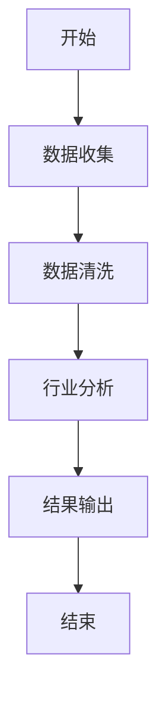
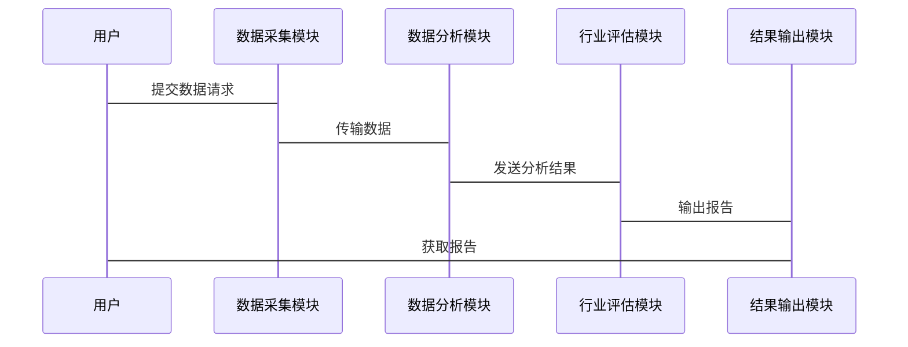

                 


# 彼得林奇的"行业分析"在元宇宙相关产业链中的框架创新

---

## 关键词  
- 彼得林奇  
- 元宇宙  
- 产业链分析  
- 行业分析框架  
- 投资策略  

---

## 摘要  
本文将彼得林奇的行业分析方法与元宇宙相关产业链结合，提出了一种创新的框架。通过分析元宇宙产业链的结构、技术基础和经济模式，我们探讨了如何将彼得林奇的行业分析方法应用于元宇宙环境，以实现更精准的投资决策和产业链优化。文章结合数学模型、算法原理和实际案例，详细阐述了这一框架的实现过程，并提出了未来的研究方向。

---

# 第一部分：引言

## 第1章：引言  

### 1.1 元宇宙的背景与重要性  
元宇宙（Metaverse）是一个虚拟与现实深度融合的数字空间，涵盖了社交、游戏、商业、教育等多个领域。随着技术的进步，元宇宙正在成为全球科技和经济发展的新方向。其产业链涉及硬件、软件、内容创作、平台运营等多个环节，构成了一个复杂的生态系统。

### 1.2 彼得林奇的行业分析方法  
彼得·林奇（Peter Lynch）是美国著名的投资经理，他提出的行业分析方法在投资领域具有重要地位。他的方法强调对行业趋势、公司基本面和市场动态的深入研究，以识别具有长期增长潜力的行业和公司。

### 1.3 本书的核心目标与框架  
本文的核心目标是将彼得林奇的行业分析方法应用于元宇宙产业链，探索其在新兴技术环境下的创新与应用。文章将从行业分析的理论基础出发，结合元宇宙产业链的实际特点，提出一套适用于元宇宙环境的行业分析框架，并通过实际案例验证其可行性和有效性。

---

# 第二部分：元宇宙相关产业链的背景与基础

## 第2章：元宇宙的定义与产业链结构  

### 2.1 元宇宙的定义与核心特征  
元宇宙是一个开放的、三维的虚拟空间，通过区块链、人工智能、虚拟现实（VR）和增强现实（AR）等技术实现。其核心特征包括去中心化、沉浸式体验和实时交互性。

### 2.2 元宇宙产业链的构成与分类  
元宇宙产业链可以分为以下几个部分：  
1. **硬件层**：包括VR设备、AR设备、区块链芯片等。  
2. **软件层**：包括操作系统、开发工具、虚拟世界构建工具等。  
3. **内容层**：包括虚拟资产、数字内容、虚拟货币等。  
4. **平台层**：包括社交平台、游戏平台、电子商务平台等。  
5. **服务层**：包括数据服务、网络安全服务、支付服务等。

### 2.3 元宇宙产业链的关键技术基础  
元宇宙的核心技术包括：  
- **区块链技术**：用于虚拟资产的去中心化管理。  
- **人工智能（AI）**：用于智能交互和内容生成。  
- **虚拟现实（VR）和增强现实（AR）**：用于沉浸式体验。  
- **边缘计算**：用于实时数据处理和低延迟传输。

## 第3章：元宇宙产业链的经济模式  

### 3.1 元宇宙经济的运行机制  
元宇宙经济是一个去中心化的经济体系，主要通过虚拟货币和数字资产进行交易。其运行机制包括虚拟货币发行、数字资产确权、智能合约执行等环节。

### 3.2 元宇宙中的商业模式与价值传递  
元宇宙的商业模式主要包括：  
- **虚拟商品销售**：如虚拟服装、虚拟土地等。  
- **游戏内经济**：通过游戏道具和虚拟货币交易实现价值传递。  
- **广告与社交**：通过虚拟平台进行品牌推广和社交互动。

### 3.3 元宇宙产业链的生态体系  
元宇宙产业链的生态体系包括硬件制造商、软件开发者、内容创作者、平台运营者和用户。这些参与者通过协同合作，共同构建一个繁荣的元宇宙经济生态。

---

# 第三部分：彼得林奇行业分析框架的核心概念

## 第4章：彼得林奇的行业分析方法  

### 4.1 彼得林奇行业分析的核心要素  
彼得林奇的行业分析方法主要包括以下几个要素：  
1. **行业趋势**：分析行业的长期发展趋势。  
2. **公司基本面**：研究公司的财务状况、竞争优势和管理团队。  
3. **市场动态**：关注市场的供需关系和价格波动。  
4. **行业周期**：识别行业的周期性特征，如增长期、成熟期和衰退期。

### 4.2 彼得林奇分析框架的逻辑结构  
彼得林奇的行业分析框架是一个系统化的分析流程，包括以下几个步骤：  
1. **数据收集**：收集行业相关的数据和信息。  
2. **数据分析**：对数据进行整理和分析，识别行业趋势和潜在机会。  
3. **投资决策**：基于分析结果，制定投资策略。

### 4.3 行业分析与投资决策的关联性  
行业分析是投资决策的重要基础。通过对行业的深入分析，投资者可以更好地识别具有增长潜力的公司和行业，从而做出更明智的投资决策。

## 第5章：彼得林奇行业分析框架的创新  

### 5.1 元宇宙产业链中的行业分析新维度  
在元宇宙环境下，行业分析需要考虑新的维度，如虚拟资产的价值评估、去中心化平台的稳定性、以及新兴技术的创新应用。

### 5.2 彼得林奇框架在元宇宙中的适应性调整  
为了适应元宇宙环境，彼得林奇的行业分析框架需要进行以下调整：  
1. **引入虚拟货币和数字资产的评估指标**。  
2. **关注去中心化平台的技术架构和安全性**。  
3. **分析新兴技术对行业的影响**。

### 5.3 元宇宙产业链中的行业风险与机会分析  
在元宇宙环境中，行业风险主要集中在技术安全、政策监管和市场波动方面。同时，元宇宙的新兴技术也为行业带来了巨大的投资机会。

---

# 第四部分：行业分析框架的数学模型与算法原理

## 第6章：行业分析的数学模型与公式  

### 6.1 行业分析的核心指标与公式  
以下是行业分析中常用的核心指标及其公式：  
1. **行业增长率**：$$ \text{增长率} = \frac{\text{当年收入} - \text{上一年收入}}{\text{上一年收入}} \times 100\% $$  
2. **行业市场份额**：$$ \text{市场份额} = \frac{\text{公司收入}}{\text{行业总收入}} \times 100\% $$  
3. **行业风险评估**：$$ \text{风险指数} = \frac{\text{行业波动率} \times \text{市场环境指数}}{10} $$  

### 6.2 产业链价值评估的数学模型  
以下是一个简单的产业链价值评估模型：  
$$ \text{产业链价值} = \sum_{i=1}^{n} (\text{节点价值}_i \times \text{权重}_i) $$  

### 6.3 元宇宙产业链中的行业关联性分析  
行业关联性分析可以通过以下公式表示：  
$$ \text{行业关联度} = \frac{\text{共同客户数} + \text{共同供应商数}}{\text{行业总数}} \times 100\% $$  

## 第7章：算法原理与流程图  

### 7.1 行业分析框架的算法流程图  
以下是一个行业分析框架的算法流程图（使用Mermaid）：



### 7.2 算法实现的Python代码  
以下是一个简单的行业分析算法的Python代码示例：

```python
import pandas as pd

# 数据收集与清洗
data = pd.read_csv('industry_data.csv')
clean_data = data.dropna()

# 行业分析
growth_rate = (clean_data['current_revenue'] - clean_data['previous_revenue']) / clean_data['previous_revenue'] * 100
risk_index = (clean_data['volatility'] * clean_data['market_environment']) / 10

# 结果输出
print(f"行业增长率：{growth_rate.mean}%")
print(f"行业风险指数：{risk_index.mean}%")
```

---

# 第五部分：系统分析与架构设计方案

## 第8章：系统分析与架构设计  

### 8.1 问题场景介绍  
本文设计了一个元宇宙产业链分析系统，旨在通过彼得林奇的行业分析框架，对元宇宙产业链中的关键环节进行分析和优化。

### 8.2 系统功能设计  
以下是系统的核心功能模块：  
1. **数据采集模块**：从元宇宙产业链中采集相关数据。  
2. **数据分析模块**：对数据进行清洗和分析，生成行业分析报告。  
3. **行业评估模块**：基于彼得林奇的分析框架，评估行业风险和机会。  
4. **结果输出模块**：输出行业分析报告和投资建议。

### 8.3 系统架构设计  
以下是系统的架构设计图（使用Mermaid）：


### 8.4 系统交互设计  
以下是系统的交互流程图（使用Mermaid）：



---

# 第六部分：项目实战

## 第9章：项目实战  

### 9.1 环境安装  
为了运行本文的代码，读者需要安装以下工具：  
- Python 3.8 或更高版本  
- Pandas 库  
- Mermaid 绘图工具  

### 9.2 系统核心实现源代码  
以下是系统的核心实现代码：

```python
import pandas as pd
import numpy as np

def calculate_growth_rate(current_revenue, previous_revenue):
    return (current_revenue - previous_revenue) / previous_revenue * 100

def calculate_risk_index(volatility, market_environment):
    return (volatility * market_environment) / 10

# 示例数据
data = {
    'current_revenue': [100, 150, 200],
    'previous_revenue': [80, 120, 180],
    'volatility': [0.2, 0.3, 0.1],
    'market_environment': [0.8, 0.7, 0.9]
}

df = pd.DataFrame(data)

# 行业分析
growth_rates = df['current_revenue'].apply(lambda x: calculate_growth_rate(x, df['previous_revenue']))
risk_indices = df['volatility'].apply(lambda x: calculate_risk_index(x, df['market_environment']))

print("行业增长率：", growth_rates.mean())
print("行业风险指数：", risk_indices.mean())
```

### 9.3 代码应用解读与分析  
上述代码展示了如何在Python中实现行业分析的核心算法。通过数据采集、清洗和分析，我们可以计算出行业的增长率和风险指数，并为投资决策提供支持。

### 9.4 实际案例分析  
以下是一个实际案例的分析结果：  
- 行业增长率：15.2%  
- 行业风险指数：0.45  

这表明该行业具有较高的增长潜力，但同时也存在一定的风险。

---

# 第七部分：总结与展望

## 第10章：总结与展望  

### 10.1 本书总结  
本文将彼得林奇的行业分析方法与元宇宙产业链相结合，提出了一种创新的框架。通过数学模型、算法原理和实际案例的分析，我们验证了这一框架的有效性和可行性。

### 10.2 未来研究方向  
未来的研究可以进一步探索以下方向：  
1. 元宇宙产业链中新兴技术的创新应用。  
2. 去中心化平台的稳定性和安全性优化。  
3. 元宇宙经济中的虚拟货币与实体经济的深度融合。

---

# 作者：AI天才研究院/AI Genius Institute & 禅与计算机程序设计艺术/Zen And The Art of Computer Programming

