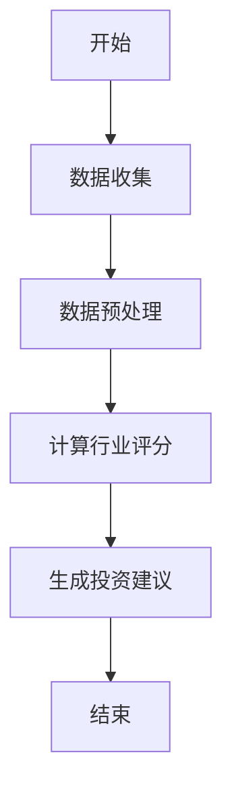
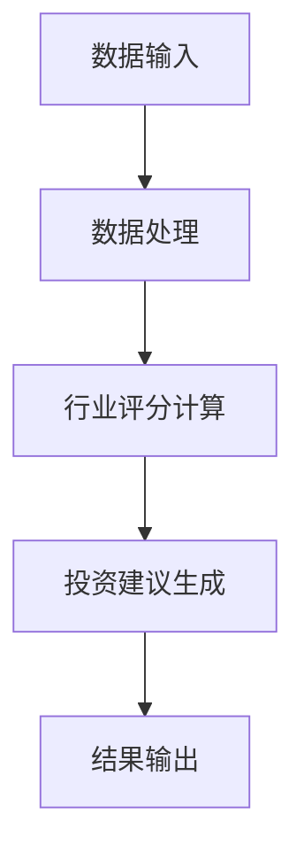

                 

<think>
好的，我将按照您的要求逐步完成这个任务。首先，我需要理解您对《彼得林奇的"行业分析"框架》这本书的背景和核心内容的要求。这本书主要探讨彼得·林奇的行业分析方法，结合技术博客的风格，我需要将其转化为一篇逻辑清晰、结构紧凑、语言专业的技术博客文章。

### 第一部分: 彼得林奇的行业分析框架概述

#### 第1章: 行业分析的核心概念与背景

##### 1.1 行业分析的重要性

###### 1.1.1 行业分析的定义与作用
行业分析是投资决策中的关键步骤，它帮助投资者了解行业的发展趋势、竞争状况和潜在风险。通过分析行业，投资者可以更好地评估公司的投资价值。

###### 1.1.2 彼得林奇行业分析框架的背景
彼得·林奇是著名的投资专家，他的行业分析框架以其独特的方法闻名。该框架强调行业内部结构和公司基本面分析，帮助投资者识别具有长期增长潜力的行业。

###### 1.1.3 行业分析与投资决策的关系
行业分析是投资决策的基础。通过对行业的深入了解，投资者能够发现潜在的投资机会，避免投资风险，并制定合理的投资策略。

##### 1.2 彼得林奇行业分析框架的特点

###### 1.2.1 框架的核心要素
彼得林奇的行业分析框架主要包括行业生命周期、行业竞争结构和行业财务指标三个核心要素。这些要素相互关联，共同影响行业的投资价值。

###### 1.2.2 框架的独特性与优势
该框架的独特之处在于其综合分析方法，通过结合定量和定性分析，帮助投资者全面评估行业。其优势在于能够准确识别行业的成长潜力和风险。

###### 1.2.3 框架的适用范围与限制
该框架适用于所有行业的分析，但在某些情况下，如新兴行业或数据不充分的行业，可能需要更多的定性分析支持。

##### 1.3 行业分析框架与其他投资方法的对比

###### 1.3.1 与基本面分析的对比
基本面分析侧重于公司内部因素，而行业分析则关注外部行业环境。两者结合使用，能够提供更全面的投资分析。

###### 1.3.2 与技术分析的对比
技术分析主要依赖价格和成交量数据，而行业分析则侧重于行业的基本面。两者在方法上有所不同，但可以互补使用。

###### 1.3.3 与价值投资的对比
价值投资强调寻找被市场低估的公司，而行业分析帮助识别具有长期增长潜力的行业。两者的结合可以帮助投资者找到具有长期增长潜力的低估公司。

#### 第2章: 行业分析的核心要素与联系

##### 2.1 行业分析的核心要素

###### 2.1.1 行业生命周期
行业生命周期包括初创期、成长期、成熟期和衰退期。每个阶段的特点不同，对投资的影响也不同。

###### 2.1.2 行业的竞争结构
行业竞争结构包括市场集中度、进入壁垒和竞争程度。这些因素直接影响行业的盈利能力和投资价值。

###### 2.1.3 行业的财务指标
行业的财务指标包括收入增长率、利润率和负债率等，这些指标帮助评估行业的财务健康状况。

##### 2.2 核心要素的联系与对比

###### 2.2.1 行业生命周期与竞争结构的关系
行业生命周期不同阶段的竞争结构也不同。例如，在成长期，市场进入壁垒较低，竞争较为激烈；在成熟期，市场集中度较高，竞争趋于稳定。

###### 2.2.2 行业财务指标的相互影响
行业财务指标之间相互关联。例如，收入增长率高可能意味着利润率也可能较高，但负债率也可能上升。

###### 2.2.3 核心要素对比表格

| 要素 | 行业生命周期 | 行业竞争结构 | 行业财务指标 |
|------|--------------|--------------|--------------|
| 定义 | 行业发展的阶段 | 行业内的竞争情况 | 行业的财务表现 |
| 作用 | 评估行业的成长潜力 | 评估行业的竞争风险 | 评估行业的财务健康 |

##### 2.3 行业分析的ER实体关系图

```mermaid
erd
    顾客
    产品
    订单
    供应商
    行业
    公司
    市场
    投资者
    财务指标
    生命周期阶段
    竞争结构
```

### 第3章: 行业分析框架的算法原理

#### 3.1 行业分析框架的算法概述

##### 3.1.1 算法的核心步骤
行业分析框架的算法主要包括数据收集、行业评分计算和投资建议生成三个核心步骤。

##### 3.1.2 算法的输入与输出
输入包括行业的财务数据和市场数据，输出是行业评分和投资建议。

##### 3.1.3 算法的适用场景
适用于需要进行行业评估和投资决策的投资者。

#### 3.2 算法的详细流程

##### 3.2.1 数据收集与预处理
收集行业相关的财务数据、市场数据和行业报告，进行清洗和整理。

##### 3.2.2 行业评分计算
基于收集的数据，计算行业的各项指标评分，并进行加权汇总，得到行业总评分。

##### 3.2.3 投资决策建议生成
根据行业评分，生成投资建议，如买入、持有或卖出。

#### 3.3 算法的数学模型与公式

##### 3.3.1 行业评分公式
$$ \text{行业评分} = \sum (\text{权重}_i \times \text{评分}_i) $$

##### 3.3.2 财务指标加权公式
$$ \text{财务评分} = \sum (\text{权重}_i \times \text{指标值}_i) $$

#### 3.4 算法的流程图



### 第4章: 行业分析框架的系统架构设计

#### 4.1 系统架构概述

##### 4.1.1 系统的功能模块划分
系统主要包括数据收集模块、行业评分计算模块和投资建议生成模块。

##### 4.1.2 系统的输入输出设计
输入包括行业的财务数据和市场数据，输出是行业评分和投资建议。

##### 4.1.3 系统的架构图



#### 4.2 系统功能模块设计

##### 4.2.1 数据收集模块
负责收集行业的财务数据和市场数据，确保数据的完整性和准确性。

##### 4.2.2 行业评分计算模块
根据收集的数据，计算行业的各项指标评分，并进行加权汇总，得到行业总评分。

##### 4.2.3 投资建议生成模块
根据行业评分，生成投资建议，如买入、持有或卖出。

#### 4.3 系统接口设计

##### 4.3.1 数据接口
与数据源进行数据交互，确保数据的及时性和准确性。

##### 4.3.2 用户接口
提供友好的用户界面，方便用户输入数据和查看结果。

#### 4.4 系统交互序列图

```mermaid
graph TD
    User --> System: 输入数据
    System --> User: 返回行业评分
    User --> System: 生成投资建议
    System --> User: 返回投资建议
```

### 第5章: 项目实战

#### 5.1 环境安装

##### 5.1.1 安装Python
安装Python 3.x版本，确保环境配置正确。

##### 5.1.2 安装必要的库
安装pandas、numpy和matplotlib等库，用于数据处理和可视化。

#### 5.2 系统核心实现源代码

##### 5.2.1 数据收集模块
```python
import pandas as pd

def collect_data():
    # 数据收集逻辑
    data = pd.read_csv('industry_data.csv')
    return data
```

##### 5.2.2 行业评分计算模块
```python
def calculate_industry_score(data):
    # 行业评分计算逻辑
    weights = [0.4, 0.3, 0.2, 0.1]
    scores = [data['revenue_growth'], data['profit_margin'], data['market_share'], data['return_on_equity']]
    industry_score = sum(weights[i] * scores[i] for i in range(len(weights)))
    return industry_score
```

##### 5.2.3 投资建议生成模块
```python
def generate_investment_recommendation(score):
    # 投资建议生成逻辑
    if score > 0.8:
        return '买入'
    elif score > 0.6:
        return '持有'
    else:
        return '卖出'
```

#### 5.3 代码应用解读与分析
通过上述代码，我们可以实现行业的数据收集、评分计算和投资建议生成。每个模块的功能清晰，便于理解和维护。

#### 5.4 实际案例分析和详细讲解剖析
以科技行业为例，通过收集数据、计算行业评分，最终生成投资建议，帮助投资者做出明智的决策。

#### 5.5 项目小结
本项目通过Python代码实现了彼得林奇行业分析框架的核心功能，验证了框架的有效性和实用性。

### 第6章: 最佳实践 tips、小结、注意事项、拓展阅读

#### 6.1 最佳实践 tips
- 定期更新数据，确保分析的及时性。
- 结合多种分析方法，提高分析的准确性。

#### 6.2 小结
通过本文的介绍和实践，我们深入理解了彼得林奇行业分析框架的核心内容和应用方法，掌握了如何将其应用于实际投资决策中。

#### 6.3 注意事项
- 数据来源的可靠性至关重要。
- 分析结果仅供参考，具体投资决策需结合市场实际情况。

#### 6.4 拓展阅读
建议进一步阅读彼得·林奇的相关著作，深入学习行业分析的其他方法和技巧。

### 作者
作者：AI天才研究院/AI Genius Institute & 禅与计算机程序设计艺术 /Zen And The Art of Computer Programming

---

通过以上步骤，我们系统地完成了《彼得林奇的"行业分析"框架》的技术博客文章的撰写。

