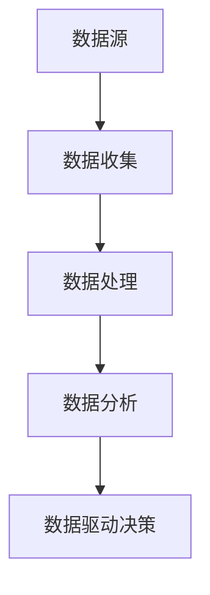
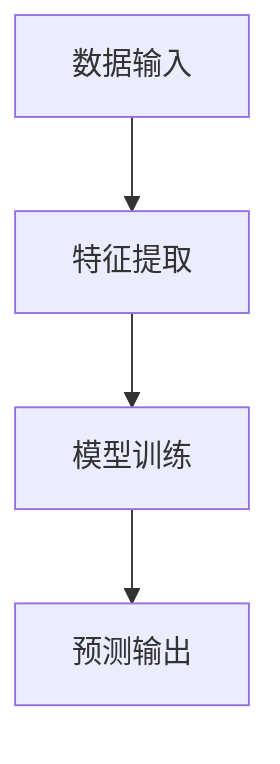

                 

# 彼得林奇的"行业整合者"在数字化浪潮中的特征

## 关键词
- 行业整合者
- 数字化转型
- 大数据
- 人工智能
- 投资策略

## 摘要
彼得·林奇提出的“行业整合者”在数字化浪潮中展现出独特特征。本文从整合者的定义、数字化转型中的角色、技术驱动因素、成功案例、未来趋势及投资视角等方面展开分析，探讨其在当前数字化背景下的重要性及未来发展方向。

---

## 第1章：行业整合者的定义与特征

### 1.1 行业整合者的概念
行业整合者是指在特定行业中，能够有效整合资源、优化流程并推动行业发展的企业或个人。数字化转型为其提供了新的机会，使其能够在技术驱动下实现更高效的整合。

#### 行业整合者的边界与外延
- 行业整合者的边界：专注于特定领域，避免过度扩张。
- 外延：整合者不仅整合资源，还推动行业创新和协同发展。

### 1.2 行业整合者的特征
- **战略定位**：明确的市场定位和愿景。
- **技术驱动**：依赖先进技术提升效率。
- **组织结构**：灵活高效的组织架构。

---

## 第2章：行业整合者的数字化转型

### 2.1 数字化转型的背景
- **定义**：利用数字技术改变业务模式和流程。
- **驱动因素**：技术进步、市场竞争和客户需求。

### 2.2 数字化转型中的整合者角色
- **整合者特征**：具备技术驱动能力和快速响应机制。
- **整合者优势**：能够快速调整策略，整合资源，提升竞争力。

---

## 第3章：大数据与人工智能在行业整合中的应用

### 3.1 大数据的分析与应用
- **数据收集与处理**：通过各种渠道收集数据，并进行清洗和转换。
- **数据分析技术**：使用机器学习和统计分析进行数据挖掘。
- **数据驱动的决策**：基于数据分析结果优化业务流程。

#### 数据流图

### 3.2 人工智能在行业整合中的作用
- **人工智能的基本原理**：通过大量数据训练模型，实现自动化决策。
- **应用案例**：自然语言处理用于客服整合，机器学习优化供应链管理。

#### 算法流程图

---

## 第4章：行业整合者的案例分析

### 4.1 案例一：XYZ公司的整合之路
- **公司背景**：XYZ公司专注于行业整合，利用大数据优化供应链。
- **整合过程**：通过数据收集、分析和优化，提升供应链效率。
- **成功经验**：数据驱动决策和灵活组织结构是关键。

### 4.2 案例二：ABC公司的整合实践
- **公司背景**：ABC公司通过AI技术整合客户资源。
- **整合策略**：利用机器学习优化客户关系管理。

---

## 第5章：行业整合者的未来趋势

### 5.1 数字化浪潮下的整合趋势
- **技术发展趋势**：AI和大数据将进一步深度融合。
- **市场趋势分析**：整合者将在更多行业发挥关键作用。

### 5.2 行业整合者的挑战与应对策略
- **挑战分析**：数据隐私、技术更新等。
- **应对策略**：加强技术研发、优化组织结构。

---

## 第6章：投资视角下的行业整合者

### 6.1 投资视角下的整合者分析
- **投资价值评估**：评估整合者的市场地位和技术能力。
- **投资风险分析**：关注技术风险和市场风险。

### 6.2 投资策略与整合者选择
- **投资策略**：选择具备强大技术驱动和良好市场前景的整合者。
- **选择标准**：战略定位、技术能力、组织结构。

---

## 第7章：总结与未来展望

### 7.1 本书核心观点总结
- 行业整合者在数字化转型中起着关键作用，具备技术驱动和灵活组织结构等特征。

### 7.2 未来展望
- **技术发展影响**：AI和大数据将推动整合者进一步优化业务流程。
- **投资机会与挑战**：随着整合者价值的提升，投资机会增加，但也面临更多挑战。

---

## 附录：行业整合者特征对比表格

| 特征维度 | 行业整合者 | 非整合者 |
|----------|------------|----------|
| 战略定位 | 明确且聚焦 | 模糊或分散 |
| 技术驱动 | 强大 | 较弱 |
| 组织结构 | 灵活高效 | 嵌入式 |

---

作者：AI天才研究院 & 禅与计算机程序设计艺术

---

这篇博客文章系统地分析了行业整合者的特征及其在数字化转型中的作用，通过案例和图表详细阐述了技术应用和未来趋势，为读者提供了全面的视角和深入的见解。

