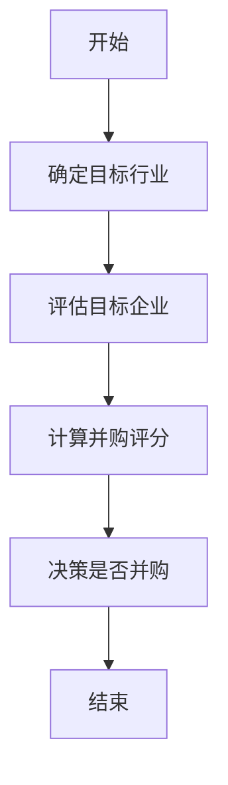
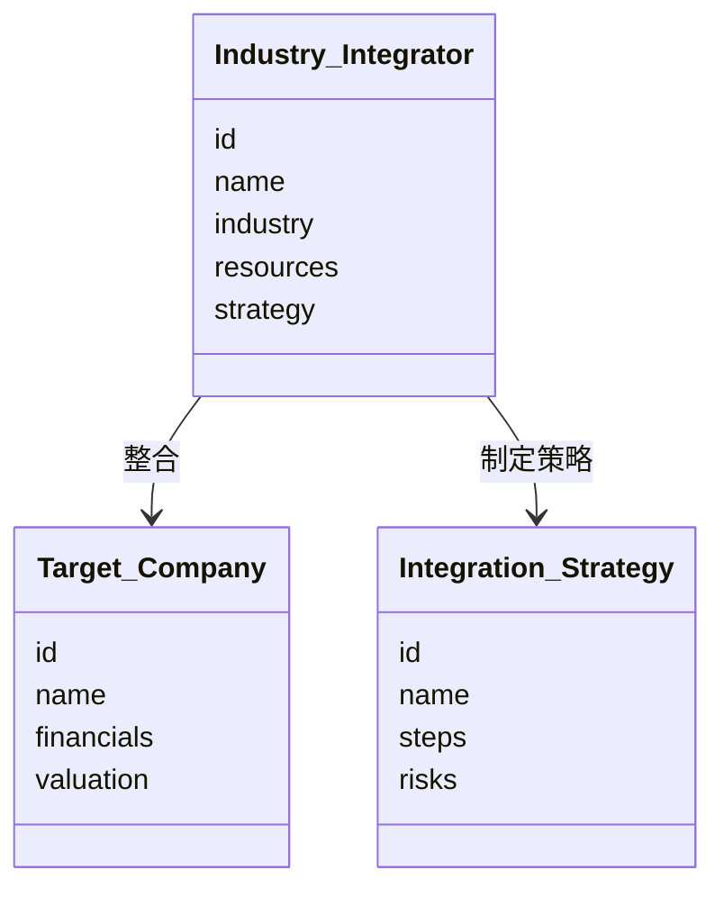

                 


# 彼得林奇的"行业整合者"在数字化经济中的特征分析

---

## 关键词：行业整合者，彼得林奇，数字化经济，并购策略，企业战略

---

## 摘要：  
本文分析了彼得林奇提出的“行业整合者”概念在数字化经济中的特征与应用。通过对比传统行业整合者与数字化经济中的整合者，揭示了数字化经济时代行业整合者的核心特征、战略选择以及算法模型。文章从行业整合者的定义、核心概念、算法原理、系统架构设计、项目实战以及最佳实践等多维度展开分析，深入探讨了行业整合者在数字化经济中的角色转变及其成功的关键因素。

---

# 第1章：行业整合者的背景与数字化经济

## 1.1 行业整合者的定义与背景

### 1.1.1 行业整合者的定义  
行业整合者是指在特定行业内，通过并购、重组等方式整合资源、技术和市场，以实现行业集中化、规模化发展的企业或个人。彼得林奇是美国著名投资家，他在投资领域提出了“行业整合者”的概念，认为行业整合者是推动行业变革和价值创造的核心力量。

### 1.1.2 行业整合者的背景与演变  
行业整合者并非新概念，但在数字化经济时代，行业整合者的角色发生了显著变化。数字化技术的普及使得行业整合者的整合方式更加灵活，整合效率大幅提升。同时，数字化经济的快速发展也为行业整合者提供了更多的机会和挑战。

### 1.1.3 数字化经济中的行业整合者  
在数字化经济中，行业整合者不仅需要具备传统整合者的资源整合能力，还需要掌握数字化技术的应用能力。他们通过数据驱动的决策、智能化的整合策略以及高效的数字化工具，推动行业的进一步整合和发展。

---

## 1.2 彼得林奇的行业整合者理论

### 1.2.1 彼得林奇的并购策略  
彼得林奇在其职业生涯中成功投资了多家企业，他的并购策略以“低风险、高收益”为核心。他倾向于选择具有强大市场地位、良好财务状况且估值合理的公司进行并购。

### 1.2.2 行业整合者的特征  
- **专注性**：行业整合者通常专注于特定行业，深入了解行业的痛点和机会。
- **资源整合能力**：整合者能够有效整合资源，包括技术、人才、资本等。
- **数据驱动**：在数字化经济中，整合者依赖数据驱动的决策，通过数据分析优化整合策略。

### 1.2.3 彼得林奇的行业整合者案例  
彼得林奇的经典案例包括投资通用电气和可口可乐。他通过深入分析这些公司的基本面，发现其整合潜力，并进行长期投资。

---

## 1.3 数字化经济中的行业整合者

### 1.3.1 数字化经济的定义与特征  
数字化经济是指以数字技术为核心驱动力的经济形态，其特征包括数据化、网络化、智能化和平台化。

### 1.3.2 行业整合者在数字化经济中的作用  
行业整合者在数字化经济中扮演着关键角色，他们通过整合数字化资源，推动行业的数字化转型，提升行业整体效率。

### 1.3.3 数字化经济中的行业整合者趋势  
随着数字化技术的不断进步，行业整合者将更加依赖数据和技术，整合方式也将更加智能化和高效化。

---

# 第2章：行业整合者的核心概念与联系

## 2.1 核心概念与属性对比

### 2.1.1 行业整合者的属性特征  
- **专注性**：专注于特定行业。
- **资源整合能力**：能够整合多种资源。
- **数据驱动**：依赖数据进行决策。

### 2.1.2 数字化经济中的行业整合者与传统整合者的对比  
| 特性 | 传统整合者 | 数字化整合者 |
|------|-------------|---------------|
| 整合方式 | 线下整合为主 | 线上线下结合 |
| 数据依赖 | 低 | 高 |
| 技术应用 | 少 | 多 |

### 2.1.3 行业整合者与行业领导者的区别  
行业整合者更关注整合资源，而行业领导者更关注市场地位和影响力。

---

## 2.2 行业整合者的ER实体关系图

```mermaid
erDiagram
    customer[顾客] {
        id : integer
        name : string
        email : string
    }
    supplier[供应商] {
        id : integer
        name : string
        product : string
    }
    order[订单] {
        id : integer
        customer_id : integer
        supplier_id : integer
        date : date
    }
    customer --> order : 下单
    supplier --> order : 提供产品
```

---

# 第3章：行业整合者的算法原理与数学模型

## 3.1 算法原理

### 3.1.1 彼得林奇的并购决策模型  
彼得林奇的并购决策模型基于企业的财务状况、市场地位和估值。核心步骤包括：  
1. 确定目标行业。  
2. 评估目标企业的财务状况。  
3. 计算并购评分。  
4. 决策是否并购。

### 3.1.2 行业整合者的并购评分算法  
并购评分公式：  
$$
\text{并购评分} = \sum_{i=1}^{n} w_i \cdot x_i
$$  
其中，\( w_i \) 是第 \( i \) 个因素的权重，\( x_i \) 是第 \( i \) 个因素的评分。

---

## 3.2 数学模型与公式

### 3.2.1 并购评分公式  
$$
\text{并购评分} = 0.4 \cdot \text{ROE} + 0.3 \cdot \text{PE} + 0.3 \cdot \text{PEG}
$$  
其中，ROE 是净资产收益率，PE 是市盈率，PEG 是市盈率与增长率比值。

### 3.2.2 并购决策树模型  


---

## 3.3 算法流程图

### 3.3.1 并购决策流程图  


---

# 第4章：系统分析与架构设计方案

## 4.1 系统分析

### 4.1.1 问题场景介绍  
在数字化经济中，行业整合者需要通过系统整合资源，优化整合策略。

### 4.1.2 系统功能设计  
系统功能包括：  
- 资源整合模块。  
- 数据分析模块。  
- 并购决策模块。

### 4.1.3 领域模型  


### 4.1.4 系统架构设计  


---

## 4.2 系统接口设计

### 4.2.1 系统接口  
系统接口包括：  
- 获取行业数据接口。  
- 计算并购评分接口。  
- 决策输出接口。

### 4.2.2 系统交互流程  

```mermaid
sequenceDiagram
    participant A[行业整合者]
    participant B[目标公司]
    A -> B: 查询公司数据
    B --> A: 返回数据
    A -> B: 评估并购评分
    B --> A: 决策结果
```


---

# 第5章：项目实战

## 5.1 环境安装

### 5.1.1 环境要求  
- 操作系统：Windows/Mac/Linux  
- 开发工具：Python、Jupyter Notebook  
- 数据库：MySQL

### 5.1.2 安装依赖  
```bash
pip install pandas numpy matplotlib
```

---

## 5.2 核心实现

### 5.2.1 并购评分计算  
```python
import pandas as pd

def calculate_merger_score(roe, pe, p

