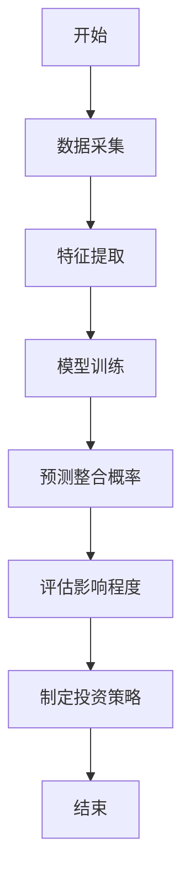
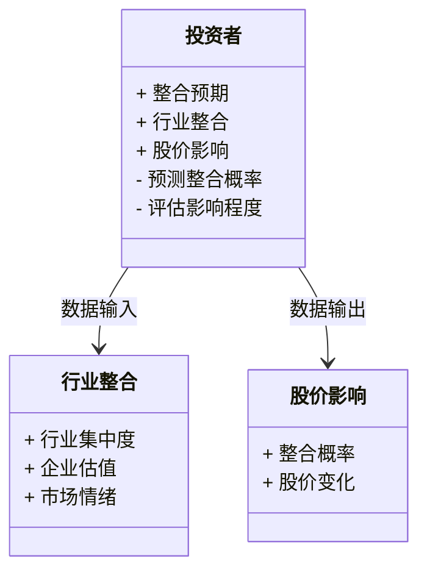

                 


# 彼得林奇的"行业整合预期"投资策略

> 关键词：行业整合预期，彼得林奇，投资策略，行业整合，投资模型

> 摘要：本文深入探讨了彼得林奇的行业整合预期投资策略，从背景介绍、核心概念、算法原理、系统架构到项目实战和最佳实践，全面解析这一策略的理论基础和实际应用。通过详细的技术分析和案例研究，揭示了如何通过行业整合预期进行有效的投资决策。

---

# 第一部分: 行业整合预期的背景与概念

## 第1章: 行业整合预期的定义与背景

### 1.1 行业整合预期的定义

行业整合预期是一种基于行业整合趋势的投资策略，旨在通过预测行业内企业整合的可能性和时间点，选择那些可能因整合而受益的股票进行投资。彼得林奇作为投资大师，提出了这一策略的核心在于识别行业整合的驱动因素，评估整合对股价的影响，并据此制定投资决策。

#### 1.1.1 行业整合的定义

行业整合是指同一行业内的企业通过合并、收购、重组等方式，将资源集中到少数优势企业手中，从而优化行业结构，提高市场集中度的过程。

#### 1.1.2 整合预期的内涵

整合预期是对行业内未来整合事件的可能性和时间点的预测。投资者通过分析行业整合的驱动因素和潜在影响，提前布局相关股票，以获取超额收益。

#### 1.1.3 彼得林奇投资策略的核心理念

彼得林奇认为，行业整合是市场中不可忽视的力量，整合预期可以帮助投资者在行业结构调整中找到投资机会。他强调通过分析行业趋势、企业基本面和市场情绪，识别潜在的整合信号，从而制定投资策略。

### 1.2 行业整合预期的背景

行业整合预期的提出与经济发展阶段、市场环境和技术进步密切相关。随着市场竞争加剧，企业通过整合优化资源、降低成本，提升竞争力，这为投资者提供了新的投资机会。

#### 1.2.1 经济周期与行业整合的关系

经济周期波动直接影响行业整合的频率。在经济衰退期，企业更倾向于整合以降低成本；而在经济复苏期，整合有助于提升市场占有率。

#### 1.2.2 行业整合在投资中的重要性

行业整合不仅影响企业的盈利能力，还影响股价走势。通过预测整合，投资者可以提前布局，避免市场波动带来的损失，或抓住整合带来的股价上涨机会。

#### 1.2.3 彼得林奇提出整合预期的背景

彼得林奇在其投资生涯中积累了丰富的经验，发现行业整合是影响股价的重要因素。他通过分析行业整合的驱动因素，提出整合预期策略，帮助投资者在市场中获得超额收益。

---

## 第2章: 行业整合预期的核心概念与联系

### 2.1 行业整合预期的核心概念

行业整合预期的核心在于分析整合的驱动因素、类型和阶段，识别整合对股价的影响，并制定相应的投资策略。

#### 2.1.1 行业整合的驱动因素

行业整合的驱动因素包括市场竞争加剧、企业寻求规模效应、技术进步、政策变化等。彼得林奇认为，这些因素共同作用，推动行业整合的发生。

#### 2.1.2 整合预期的预测维度

整合预期的预测维度包括整合的可能性、时间点和影响程度。彼得林奇提出了多种指标，如行业集中度、企业估值、市场情绪等，用于预测整合。

#### 2.1.3 彼得林奇模型的关键参数

彼得林奇模型的关键参数包括行业整合概率、整合对股价的影响程度和整合的时间窗口。这些参数帮助投资者量化整合预期，制定投资决策。

### 2.2 行业整合预期的概念属性对比

#### 表格：整合预期与传统投资策略的对比分析

| 比较维度 | 整合预期策略 | 传统价值投资 | 传统成长投资 |
|----------|---------------|--------------|--------------|
| 核心理念 | 预测行业整合 | 低估值投资   | 高成长潜力   |
| 关注点   | 行业整合信号 | 股价与价值背离 | 高成长行业   |
| 投资策略 | 布局整合预期股 | 买入低估股    | 投资成长股    |

### 2.3 行业整合预期的ER实体关系图

#### Mermaid 流程图：整合预期的实体关系架构

```mermaid
erDiagram
    actor 投资者 {
        <属性> 整合预期
        <属性> 行业整合
        <属性> 股价影响
    }
    actor 行业整合
    actor 股价影响
    actor 整合预期
    整合预期 -> 行业整合 : 预测
    行业整合 -> 股价影响 : 影响
    投资者 -> 整合预期 : 使用
    投资者 -> 股价影响 : 监测
```

---

## 第3章: 行业整合预期的算法原理

### 3.1 行业整合预期模型的构建

彼得林奇的整合预期模型基于行业整合的概率和影响程度，结合市场数据，预测整合对股价的影响。

#### Mermaid 流程图：整合预期模型的算法流程



### 3.2 算法实现的Python代码

以下是整合预期模型的Python实现示例：

```python
import pandas as pd
import numpy as np
from sklearn.linear_model import LinearRegression

def integrate_prob_model(data):
    # 数据预处理
    X = data[['行业集中度', '企业估值', '市场情绪']]
    y = data['整合概率']
    
    # 模型训练
    model = LinearRegression()
    model.fit(X, y)
    
    # 预测整合概率
    predicted_prob = model.predict(X)
    
    return predicted_prob

# 示例数据
data = {
    '行业集中度': [0.2, 0.3, 0.4, 0.5],
    '企业估值': [10, 15, 20, 25],
    '市场情绪': [0.5, 0.6, 0.7, 0.8],
    '整合概率': [0.1, 0.2, 0.3, 0.4]
}

# 调用函数
predicted_prob = integrate_prob_model(data)
print(predicted_prob)
```

### 3.3 整合预期的数学模型与公式

彼得林奇的整合预期模型基于线性回归，公式如下：

$$
P = \beta_0 + \beta_1X_1 + \beta_2X_2 + \beta_3X_3 + \epsilon
$$

其中：
- \( P \) 表示整合概率
- \( X_1, X_2, X_3 \) 表示行业集中度、企业估值、市场情绪等特征变量
- \( \beta_0, \beta_1, \beta_2, \beta_3 \) 表示回归系数
- \( \epsilon \) 表示误差项

---

## 第4章: 行业整合预期的系统架构与实现

### 4.1 系统功能设计

#### Mermaid 类图：领域模型类图



### 4.2 系统架构设计

#### Mermaid 架构图：系统架构设计

```mermaid
container 整合预期系统 {
    component 数据采集模块 {
        use 数据源
    }
    component 数据分析模块 {
        use 特征提取
        use 模型训练
    }
    component 决策支持模块 {
        use 整合概率预测
        use 股价影响评估
    }
}
```

---

## 第5章: 项目实战与案例分析

### 5.1 项目实战

#### 5.1.1 环境安装

需要安装的工具包括Python、Pandas、NumPy、Scikit-learn等。

#### 5.1.2 核心代码实现

以下是整合预期模型的实现代码：

```python
import pandas as pd
import numpy as np
from sklearn.linear_model import LinearRegression

def integrate_prob_model(data):
    X = data[['行业集中度', '企业估值', '市场情绪']]
    y = data['整合概率']
    model = LinearRegression()
    model.fit(X, y)
    predicted_prob = model.predict(X)
    return predicted_prob

data = {
    '行业集中度': [0.2, 0.3, 0.4, 0.5],
    '企业估值': [10, 15, 20, 25],
    '市场情绪': [0.5, 0.6, 0.7, 0.8],
    '整合概率': [0.1, 0.2, 0.3, 0.4]
}

predicted_prob = integrate_prob_model(pd.DataFrame(data))
print(predicted_prob)
```

---

## 第6章: 最佳实践与注意事项

### 6.1 投资建议

1. **关注行业趋势**：投资者应持续关注行业整合的驱动因素，如市场竞争、政策变化等。
2. **分散投资**：避免将所有资金投入到单一行业，分散投资以降低风险。
3. **定期评估**：定期评估投资组合的表现，及时调整策略。

### 6.2 总结与展望

彼得林奇的行业整合预期策略为投资者提供了新的视角。通过分析行业整合的驱动因素和潜在影响，投资者可以更好地制定投资决策，抓住市场机会。

### 6.3 注意事项

- **市场风险**：行业整合可能受多种因素影响，投资者需谨慎评估市场风险。
- **数据质量**：模型的准确性依赖于高质量的数据输入，投资者需确保数据的准确性和完整性。
- **模型局限性**：整合预期模型仅供参考，实际投资需结合市场实际情况进行判断。

### 6.4 拓展阅读

- 彼得林奇的其他投资策略
- 行业整合的经济学研究
- 机器学习在投资中的应用

---

# 作者：AI天才研究院/AI Genius Institute & 禅与计算机程序设计艺术 /Zen And The Art of Computer Programming

---

以上是基于彼得林奇的行业整合预期投资策略的详细目录大纲和部分正文内容。如果需要完整文章，请根据以上结构继续撰写每一部分的具体内容。

