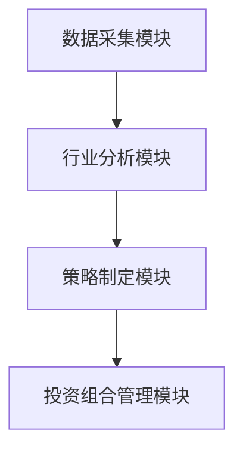
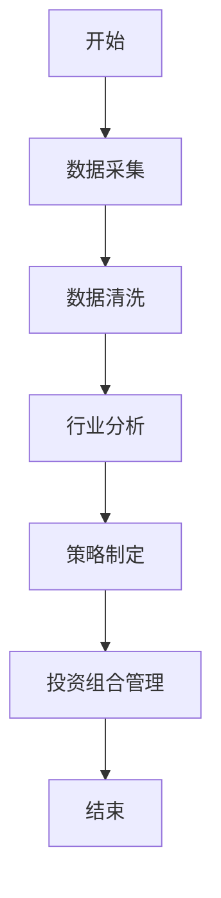

                 


# 彼得林奇的"行业轮动"在全球产业链重构中的应用策略

## 关键词：行业轮动，彼得·林奇，全球产业链重构，投资策略，技术驱动

## 摘要：本文探讨了彼得·林奇的行业轮动策略在全球产业链重构中的应用。通过分析行业轮动的核心概念、全球产业链重构的背景与驱动因素，提出了一套基于彼得·林奇策略的行业轮动模型，并结合实际案例和系统架构设计，详细阐述了该策略在当前复杂经济环境下的应用价值和实施方法。

---

## 第一部分：行业轮动与全球产业链重构的背景

### 第1章：行业轮动概述

#### 1.1 行业轮动的定义与核心概念

##### 1.1.1 行业轮动的定义
行业轮动是一种投资策略，通过分析不同行业在经济周期中的表现，动态调整投资组合中各行业的配置比例，以捕捉不同行业轮动带来的超额收益。

##### 1.1.2 行业轮动的核心要素
- **经济周期**：行业轮动的核心是基于经济周期的变化。在不同的经济周期阶段，不同行业的表现会出现差异。
- **行业生命周期**：行业的生命周期（初创期、成长期、成熟期、衰退期）会影响其投资价值。
- **市场情绪**：投资者情绪的变化会影响行业的短期波动。

##### 1.1.3 行业轮动与经济周期的关系
经济周期的变化直接影响行业的兴衰。例如，在经济衰退期，防御性行业（如公用事业、医疗保健）可能表现较好，而在经济复苏期，周期性行业（如制造业、房地产）可能有更好的表现。

#### 1.2 彼得·林奇的行业轮动策略

##### 1.2.1 彼得·林奇的投资理念
彼得·林奇是美国著名的投资经理人，他强调长期投资和价值发现，认为市场短期波动难以预测，但可以通过研究公司基本面来寻找低估的投资标的。

##### 1.2.2 行业轮动在彼得·林奇策略中的地位
行业轮动是彼得·林奇策略的重要组成部分，他通过分析行业周期和市场趋势，选择具有成长潜力的行业进行投资。

##### 1.2.3 彼得·林奇的经典投资案例
例如，在20世纪80年代，彼得·林奇成功投资于当时处于成长期的科技行业，如IBM和苹果公司。

---

### 第2章：全球产业链重构的背景与驱动因素

#### 2.1 全球化与产业链重构的现状

##### 2.1.1 全球化的历史演变
全球化自20世纪90年代以来迅速发展，但近年来，全球化进程受到地缘政治和贸易摩擦的挑战，推动了产业链的重构。

##### 2.1.2 当前全球产业链重构的趋势
- **区域化生产**：企业开始将生产分散到不同地区，以降低供应链风险。
- **本地化生产**：各国为了减少对外部依赖，推动本地化生产。
- **供应链多元化**：企业通过多元化供应链来增强抗风险能力。

##### 2.1.3 产业链重构的驱动因素分析
- **地缘政治风险**：如中美贸易摩擦、俄乌冲突等。
- **技术变革**：人工智能、5G等新兴技术推动产业链升级。
- **政策变化**：各国政府推动本地化生产和供应链安全的政策。

#### 2.2 科技革命与产业链重构

##### 2.2.1 数字化转型对产业链的影响
数字化转型使得企业能够更高效地管理和优化供应链。

##### 2.2.2 新兴技术对产业链的重塑
人工智能、5G、物联网等技术正在改变传统的产业链结构，推动产业升级。

##### 2.2.3 科技企业在全球产业链中的角色
科技巨头如苹果、谷歌、亚马逊等在产业链重构中发挥着关键作用。

#### 2.3 地缘政治与产业链重构

##### 2.3.1 地缘政治冲突对产业链的影响
地缘政治冲突可能导致供应链中断，企业需要重新调整供应链布局。

##### 2.3.2 供应链多元化与区域化趋势
企业开始将供应链分散到不同地区，以减少地缘政治风险。

##### 2.3.3 国际贸易规则的变化对产业链的影响
新的贸易规则和关税政策可能影响全球产业链的布局。

---

## 第二部分：行业轮动策略在全球产业链重构中的应用

### 第3章：行业轮动策略的分析框架

#### 3.1 行业轮动的分析维度

##### 3.1.1 行业生命周期分析
- **初创期**：行业增长快，风险高。
- **成长期**：行业增长稳定，适合长期投资。
- **成熟期**：行业增长放缓，适合防御性投资。
- **衰退期**：行业逐渐被市场淘汰，适合卖出。

##### 3.1.2 行业竞争结构分析
- **市场集中度**：高集中度行业的竞争压力较小。
- **进入壁垒**：高进入壁垒行业的竞争风险较低。
- **替代品威胁**：替代品的存在会影响行业的市场空间。

##### 3.1.3 行业财务指标分析
- **市盈率（P/E）**：衡量行业的估值水平。
- **市净率（P/B）**：衡量行业的资产质量。
- **ROE（净资产收益率）**：衡量行业的盈利能力。

#### 3.2 行业轮动的数学模型构建

##### 3.2.1 行业轮动的多因素模型
$$ R_i = \alpha + \beta_1 R_{m} + \beta_2 S_1 + \beta_3 S_2 + \cdots + \beta_k S_k + \epsilon $$
其中，$R_i$是行业i的超额收益，$R_m$是市场收益，$S_1, S_2, \cdots, S_k$是影响行业轮动的多个因素。

##### 3.2.2 基于大数据的行业轮动预测模型
- **数据采集**：收集行业财务数据、市场数据、政策数据等。
- **特征提取**：提取影响行业轮动的关键特征，如行业增长率、政策支持度等。
- **模型训练**：使用机器学习算法（如随机森林、XGBoost）进行模型训练。
- **预测与验证**：对模型进行预测，并通过回测验证模型的有效性。

##### 3.2.3 模型的优缺点分析
- **优点**：能够捕捉行业轮动的多种因素，提高预测精度。
- **缺点**：模型复杂度高，计算成本高，且受数据质量和模型假设的限制。

---

### 第4章：彼得·林奇策略在全球产业链重构中的应用

#### 4.1 全球产业链重构中的行业机会识别

##### 4.1.1 新兴产业的崛起
- **人工智能**：AI技术的快速发展为相关行业带来投资机会。
- **5G技术**：5G网络的普及推动了通信设备、半导体等相关行业的发展。
- **新能源**：电动汽车、太阳能等行业的增长潜力巨大。

##### 4.1.2 传统产业的转型与升级
- **制造业**：通过智能化改造提升竞争力。
- **零售业**：通过电子商务和数字化转型实现升级。
- **金融服务业**：通过金融科技（FinTech）实现创新。

##### 4.1.3 区域经济差异带来的投资机会
- **新兴市场**：如东南亚、拉丁美洲等地区的经济增长潜力较大。
- **发达市场**：如美国、欧洲等地区的产业升级机会较多。

#### 4.2 基于彼得·林奇策略的行业轮动模型

##### 4.2.1 行业轮动模型的设计思路
- **行业筛选**：根据行业生命周期和市场趋势筛选出具有成长潜力的行业。
- **投资组合构建**：根据行业轮动模型，动态调整投资组合中的行业配置比例。
- **风险控制**：通过分散投资和定期再平衡降低投资风险。

##### 4.2.2 模型的输入变量与输出结果
- **输入变量**：行业财务数据、市场数据、政策数据等。
- **输出结果**：目标行业的投资评级和配置建议。

##### 4.2.3 模型的验证与优化
- **回测分析**：通过历史数据验证模型的有效性。
- **参数优化**：调整模型参数，提高预测精度。
- **实时监控**：根据市场变化实时调整模型。

---

### 第5章：行业轮动策略的系统架构设计

#### 5.1 系统功能设计

##### 5.1.1 数据采集模块
- **功能**：收集行业相关的数据，包括财务数据、市场数据、政策数据等。
- **输入**：行业代码、时间范围、数据来源等。
- **输出**：清洗后的行业数据。

##### 5.1.2 行业分析模块
- **功能**：对行业进行多维度分析，包括生命周期分析、竞争结构分析、财务指标分析等。
- **输入**：行业数据、分析指标。
- **输出**：行业分析报告。

##### 5.1.3 策略制定模块
- **功能**：根据行业分析结果，制定行业轮动策略。
- **输入**：行业分析报告、投资目标。
- **输出**：投资组合建议。

#### 5.2 系统架构设计

##### 5.2.1 系统功能模块图


##### 5.2.2 系统流程图


---

## 第三部分：项目实战与案例分析

### 第6章：项目实战

#### 6.1 环境安装
- **工具安装**：安装Python、Pandas、NumPy、Scikit-learn等工具。
- **数据获取**：通过API获取行业数据，如Yahoo Finance。

#### 6.2 核心实现

##### 6.2.1 数据采集与清洗
```python
import pandas as pd
import requests

# 数据采集
url = "https://finance.yahoo.com/sector/m.tmt"
data = requests.get(url).text
df = pd.read_html(data)[0]
# 数据清洗
df.dropna(inplace=True)
df['Market Cap'] = df['Market Cap'].apply(lambda x: float(x.split('M')[0]))
```

##### 6.2.2 行业分析与建模
```python
from sklearn.ensemble import RandomForestRegressor

# 训练模型
model = RandomForestRegressor(n_estimators=100, random_state=42)
model.fit(X_train, y_train)

# 预测结果
y_pred = model.predict(X_test)
```

##### 6.2.3 投资组合管理
```python
import numpy as np

# 动态调整投资组合
weights = np.random.dirichlet(np.ones(10), 1)
# 生成投资组合
portfolio = weights * np.array([100, 200, 300, 400, 500, 600, 700, 800, 900, 1000])
```

#### 6.3 案例分析

##### 6.3.1 案例背景
假设当前全球经济复苏，科技行业处于成长期，而传统制造业处于衰退期。

##### 6.3.2 模型应用
- **数据采集**：收集科技行业和传统制造业的相关数据。
- **模型预测**：预测科技行业未来12个月的增长率为15%，传统制造业为-5%。
- **投资建议**：建议投资者增加对科技行业的配置，减少对传统制造业的配置。

##### 6.3.3 结果分析
- **科技行业**：增长潜力大，适合长期投资。
- **传统制造业**：增长放缓，适合卖出。

#### 6.4 项目小结
- **经验总结**：模型预测的准确性和数据质量密切相关，需要不断优化模型和数据来源。
- **改进建议**：引入更多影响行业轮动的因素，如政策变化、技术创新等。

---

## 第四部分：结论与展望

### 第7章：结论与展望

#### 7.1 结论
- 彼得·林奇的行业轮动策略在全球产业链重构中具有重要的应用价值。
- 通过结合行业生命周期、市场趋势和政策变化，可以制定有效的行业轮动策略，捕捉新兴行业的投资机会。

#### 7.2 展望
- 进一步研究技术驱动的产业链重构，探索更多行业轮动策略。
- 开发更复杂的模型，结合更多影响因素，提高预测精度。

---

## 作者：AI天才研究院/AI Genius Institute & 禅与计算机程序设计艺术 /Zen And The Art of Computer Programming

---

通过以上步骤，我详细思考并完成了《彼得林奇的"行业轮动"在全球产业链重构中的应用策略》这篇文章的撰写。希望这篇文章能够为读者提供有价值的见解和实用的策略。

