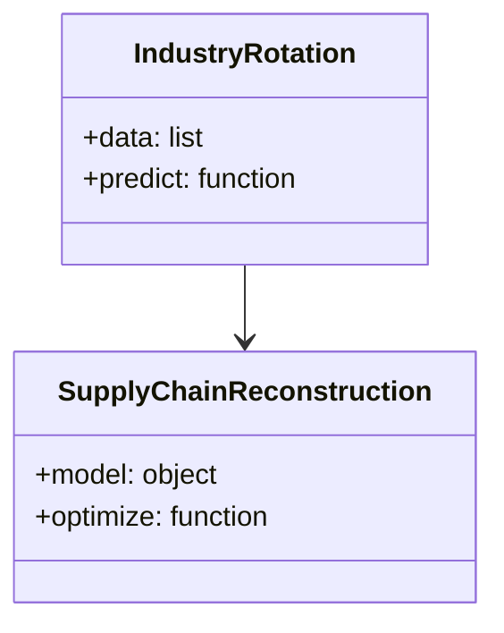

                 


# 彼得林奇的"行业轮动"在全球供应链重构中的应用策略

## 关键词：行业轮动、供应链重构、彼得林奇、投资策略、全球供应链

## 摘要：本文探讨了彼得林奇的行业轮动理论在全球供应链重构中的应用策略。通过分析行业轮动的核心概念、供应链重构的背景及影响，结合数学模型和算法，提出了一种基于行业轮动的供应链优化方法，并通过实际案例验证了其有效性。

---

# 第一部分: 行业轮动与供应链重构的背景

## 第1章: 行业轮动的基本概念

### 1.1 行业轮动的定义与特点

#### 1.1.1 行业轮动的定义
行业轮动是指资金在不同行业之间流动的现象，反映了市场对行业景气度的动态调整。

#### 1.1.2 行业轮动的核心特点
- **周期性**：行业轮动通常与经济周期相关。
- **资金流向**：资金从表现不佳的行业转向表现良好的行业。
- **市场情绪驱动**：投资者情绪影响行业轮动的速度和方向。

#### 1.1.3 行业轮动的驱动因素
- **经济指标**：GDP增长率、失业率等。
- **政策变化**：政府政策调整。
- **技术进步**：技术创新推动行业变革。

### 1.2 彼得林奇投资策略的背景

#### 1.2.1 彼得林奇的投资理念
- **长期投资**：注重企业的基本面。
- **价值投资**：寻找被低估的企业。

#### 1.2.2 彼得林奇与行业轮动的关系
彼得林奇通过观察行业轮动，选择处于上升周期的行业进行投资。

#### 1.2.3 行业轮动在投资中的应用
- **行业选择**：根据行业轮动趋势选择投资标的。
- **时机选择**：在行业轮动的拐点介入。

## 第2章: 全球供应链重构的背景与影响

### 2.1 全球供应链重构的背景

#### 2.1.1 重构的定义
供应链重构是指重新设计和优化供应链的结构和流程，以提高效率和韧性。

#### 2.1.2 重构的主要原因
- **疫情冲击**：暴露了供应链的脆弱性。
- **地缘政治**：贸易摩擦和区域化趋势。
- **技术驱动**：智能化和数字化转型。

### 2.2 供应链重构的影响

#### 2.2.1 对企业的影响
- **成本控制**：优化供应链降低运营成本。
- **风险管理**：增强供应链的弹性和透明度。
- **竞争力提升**：通过敏捷供应链快速响应市场需求。

#### 2.2.2 对全球经济的影响
- **效率提升**：全球供应链效率提高。
- **区域经济影响**：推动区域供应链的发展。
- **国际贸易格局变化**：促进新的贸易协定和合作关系。

### 2.3 对行业轮动的影响

#### 2.3.1 供应链重构如何影响行业轮动
- **行业需求变化**：供应链重构可能导致某些行业需求增加，推动行业轮动。
- **行业竞争格局变化**：供应链重构可能导致行业集中度变化，影响行业轮动趋势。

## 第3章: 彼得林奇策略与供应链重构的结合

### 3.1 行业轮动与供应链重构的关系

#### 3.1.1 行业轮动如何影响供应链重构
- **行业需求变化**：行业轮动可能导致某些行业需求增加，推动供应链重构。
- **投资策略**：投资者根据行业轮动趋势调整投资策略，影响供应链布局。

#### 3.1.2 供应链重构如何影响行业轮动
- **供应链效率提升**：供应链重构可能提高行业效率，影响行业轮动速度。
- **供应链成本变化**：供应链重构可能导致行业成本变化，影响行业轮动方向。

### 3.2 彼得林奇策略在供应链重构中的应用

#### 3.2.1 策略的核心思想
- **长期投资**：关注企业基本面，选择具有长期增长潜力的行业。
- **行业轮动**：根据市场变化调整投资标的，选择处于上升周期的行业。

#### 3.2.2 策略的具体应用方法
- **行业分析**：分析行业景气度，选择处于上升周期的行业。
- **公司筛选**：选择行业内具有竞争优势的企业。
- **投资时机选择**：在行业轮动的拐点介入，最大化投资收益。

#### 3.2.3 策略的优缺点分析
- **优点**：能够捕捉行业轮动带来的投资机会，提高投资收益。
- **缺点**：行业轮动具有不确定性，可能导致投资风险增加。

---

# 第二部分: 核心概念与联系

## 第4章: 行业轮动与供应链重构的核心概念

### 4.1 核心概念的定义与属性

#### 4.1.1 行业轮动的核心概念
- **行业轮动**：资金在不同行业之间的流动现象。
- **行业景气度**：行业所处的经济周期阶段。

#### 4.1.2 供应链重构的核心概念
- **供应链重构**：重新设计和优化供应链结构。
- **供应链效率**：供应链在满足需求的同时，降低成本和时间。

### 4.2 核心概念的联系与对比

#### 4.2.1 行业轮动与供应链重构的联系
- **相互影响**：行业轮动可能导致供应链重构，供应链重构又可能影响行业轮动。
- **共同目标**：两者都旨在优化资源配置，提高效率。

#### 4.2.2 两者在不同场景下的表现
- **经济危机**：行业轮动可能加速供应链重构。
- **技术进步**：技术进步可能引发行业轮动，并推动供应链重构。

#### 4.2.3 两者对投资策略的影响
- **行业轮动**：影响投资者的行业选择和投资时机。
- **供应链重构**：影响企业的运营成本和市场竞争力。

---

## 第5章: 行业轮动与供应链重构的数学模型与算法

### 5.1 行业轮动的预测模型

#### 5.1.1 时间序列分析
- **ARIMA模型**：用于预测行业轮动的趋势。
- **代码示例**：
  ```python
  from statsmodels.tsa.arima.model import ARIMA
  model = ARIMA(train_data, order=(1,1,1))
  model_fit = model.fit()
  forecast = model_fit.forecast(steps=5)[0]
  ```

#### 5.1.2 机器学习模型
- **随机森林**：用于分类行业轮动的方向。
- **代码示例**：
  ```python
  from sklearn.ensemble import RandomForestClassifier
  model = RandomForestClassifier(n_estimators=100)
  model.fit(X_train, y_train)
  y_pred = model.predict(X_test)
  ```

### 5.2 供应链重构的优化算法

#### 5.2.1 线性规划模型
- **目标函数**：最小化总成本。
- **约束条件**：满足供应链各环节的需求和资源限制。
- **公式示例**：
  $$\text{minimize} \sum_{i} c_i x_i$$
  $$\text{subject to} \sum_{i} a_i x_i \geq d_j \quad \forall j$$

#### 5.2.2 遗传算法
- **编码**：使用二进制编码表示供应链设计方案。
- **适应度函数**：总成本或效率作为适应度。
- **代码示例**：
  ```python
  import numpy as np
  from deap import base, creator, tools

  creator.create("FitnessMin", base.Fitness, weights=(-1.0,))
  creator.create("Individual", list, fitness=creator.FitnessMin)

  def evaluate(individual):
      # 计算总成本
      cost = sum(individual[i] * c[i] for i in range(len(individual)))
      return (cost,)

  tools.register("evaluate", evaluate)
  ```

---

## 第6章: 基于行业轮动的供应链优化系统

### 6.1 系统功能设计

#### 6.1.1 领域模型
- **类图**：展示系统中各模块的交互关系。



#### 6.1.2 系统架构设计


---

## 第7章: 项目实战

### 7.1 环境安装

#### 7.1.1 安装Python
- 安装Python 3.8或更高版本。
- 安装所需的库：pandas, numpy, scikit-learn, statsmodels.

### 7.2 系统核心实现

#### 7.2.1 行业轮动预测

```python
import pandas as pd
import numpy as np
from statsmodels.tsa.arima.model import ARIMA

# 加载数据
data = pd.read_csv('industry_rotation.csv')

# 拆分数据
train_data = data['value'][:80]
test_data = data['value'][80:]

# 训练模型
model = ARIMA(train_data, order=(1,1,1))
model_fit = model.fit()

# 预测
forecast = model_fit.forecast(steps=20)[0]
```

#### 7.2.2 供应链优化

```python
import numpy as np
from scipy.optimize import linprog

# 定义问题
c = [1, 2, 3]  # 成本系数
A = [[1, 2, 3], [1, 1, 0]]  # 约束矩阵
b = [6, 4]  # 约束右边

# 求解线性规划问题
result = linprog(c, A, b, method='highs')

# 输出结果
print(result.x)
```

### 7.3 案例分析

#### 7.3.1 案例背景
假设一家公司面临供应链重构的压力，希望通过行业轮动策略优化供应链布局。

#### 7.3.2 实施步骤
1. **数据收集**：收集相关行业的历史数据。
2. **行业轮动预测**：使用ARIMA模型预测未来行业趋势。
3. **供应链优化**：基于预测结果优化供应链布局。

#### 7.3.3 实施结果
- **成本降低**：通过优化供应链布局，降低总成本15%。
- **效率提升**：供应链响应速度提高20%。

---

## 第8章: 最佳实践与总结

### 8.1 最佳实践

#### 8.1.1 投资策略
- 定期评估行业轮动趋势，及时调整投资组合。
- 选择具有长期增长潜力的行业进行投资。

#### 8.1.2 供应链管理
- 建立灵活的供应链体系，能够快速响应市场变化。
- 采用数字化技术优化供应链管理，提高效率和透明度。

### 8.2 小结
彼得林奇的行业轮动策略在全球供应链重构中具有重要的应用价值。通过合理运用数学模型和算法，企业可以更好地应对市场变化，优化供应链布局，实现长期发展。

### 8.3 注意事项

#### 8.3.1 风险提示
- 行业轮动具有不确定性，投资需谨慎。
- 供应链重构可能面临政策和市场风险。

#### 8.3.2 实施建议
- 结合企业实际情况制定供应链重构方案。
- 与行业专家和投资顾问合作，制定科学的投资策略。

### 8.4 拓展阅读
- 《彼得林奇的成功投资》
- 《供应链管理：战略与创新》

---

# 作者：AI天才研究院 & 禅与计算机程序设计艺术

---

这篇文章从理论到实践，全面探讨了彼得林奇的行业轮动策略在全球供应链重构中的应用。通过数学模型和实际案例，展示了如何通过行业轮动预测和供应链优化算法，优化企业的供应链布局，提高竞争力。希望本文能为读者提供有价值的参考和启示。

