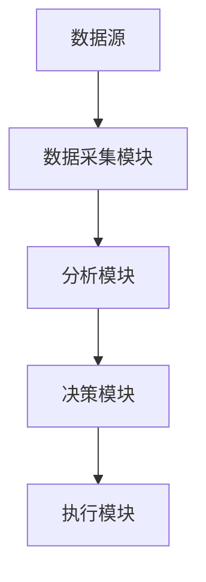

                 

# 彼得林奇的"行业轮动"投资策略

---

## 关键词

- 彼得林奇
- 行业轮动
- 投资策略
- 股票投资
- 经济周期

---

## 摘要

彼得林奇是全球著名投资专家，以其独特的行业轮动策略闻名。本文深入解析了彼得林奇的行业轮动投资策略，从理论基础、数学模型到系统设计、实战案例进行了全面探讨。通过分析行业轮动的动量、趋势和估值模型，结合实际投资案例，展示了如何在不同经济周期中捕捉投资机会，优化投资组合，实现超额收益。文章最后总结了行业轮动策略的优势与局限，并展望了其未来的发展方向。

---

## 第一部分: 彼得林奇的"行业轮动"投资策略概述

### 第1章: 行业轮动的背景与概念

#### 1.1 行业轮动的定义与核心要素

行业轮动是指投资者根据经济周期的变化，将资金从表现不佳的行业转移到表现较好的行业，以获取超额收益。其核心要素包括：

- **经济周期**：行业轮动与经济周期密切相关，不同周期阶段适合投资的行业不同。
- **行业基本面**：行业的财务状况、增长潜力和竞争结构是判断其投资价值的关键。
- **市场情绪**：投资者情绪波动会影响行业轮动的速度和幅度。

#### 1.2 彼得林奇的投资理念

彼得林奇强调长期投资和基本面分析，认为市场的短期波动不应影响长期投资决策。他提出行业轮动策略，主张根据行业发展趋势和经济周期变化，动态调整投资组合。

---

## 第二部分: 行业轮动的数学模型与算法原理

### 第2章: 行业轮动策略的数学模型

#### 2.1 动量策略模型

动量策略基于价格动量效应，认为近期价格上涨的行业未来将继续上涨。公式如下：

$$
Momentum = \frac{P_t}{P_{t-n}}
$$

其中，$P_t$ 为当前价格，$P_{t-n}$ 为n期前的价格。

#### 2.2 趋势策略模型

趋势策略通过移动平均线判断行业趋势，公式如下：

$$
Trend = P_t - MA(P_t, n)
$$

其中，$MA(P_t, n)$ 为n期移动平均价格。

#### 2.3 估值策略模型

估值策略基于相对估值指标，如市盈率和市净率，公式如下：

$$
Value = \frac{P/E}{Median\, P/E}
$$

其中，$P/E$ 为行业市盈率，$Median\, P/E$ 为市场中位数市盈率。

---

## 第三部分: 行业轮动策略的系统设计

### 第3章: 行业轮动投资系统的架构设计

#### 3.1 系统功能设计

- **数据采集模块**：获取行业指数和相关数据。
- **分析模块**：计算动量、趋势和估值指标。
- **决策模块**：基于模型结果生成投资策略。
- **执行模块**：将策略转化为具体买卖指令。

#### 3.2 系统架构图

---

## 第四部分: 行业轮动策略的实战分析

### 第4章: 实战案例分析

#### 4.1 2008年金融危机案例

- **背景**：金融危机期间，金融行业受挫，而公共事业和必需品行业表现较好。
- **策略应用**：通过动量策略，投资者可以及时从金融行业撤出资金，转向表现较好的行业。

#### 4.2 2010年后经济复苏案例

- **背景**：经济复苏期间，科技和消费行业表现突出。
- **策略应用**：利用趋势策略，投资者可以提前布局科技行业，获得超额收益。

---

## 第五部分: 行业轮动策略的风险管理与优化

### 第5章: 风险管理策略

#### 5.1 风险控制措施

- **分散投资**：通过投资多个行业降低风险。
- **止损策略**：设定止损点，避免重大损失。
- **动态调整**：根据市场变化及时调整投资组合。

#### 5.2 策略优化方向

- **多因素模型**：结合多个因素进行综合评估。
- **大数据与AI技术**：利用大数据和机器学习优化行业轮动策略。

---

## 第六部分: 总结与展望

### 第6章: 行业轮动策略的总结与展望

#### 6.1 策略总结

- **优势**：捕捉行业轮动机会，实现超额收益。
- **局限**：短期波动影响策略效果，需要长期坚持。

#### 6.2 未来展望

- **技术进步**：大数据和AI技术将优化行业轮动策略。
- **市场变化**：新兴行业和全球化趋势将带来更多投资机会。

---

## 作者

作者：AI天才研究院/AI Genius Institute & 禅与计算机程序设计艺术 /Zen And The Art of Computer Programming

---

希望这篇文章能帮助读者全面理解彼得林奇的行业轮动策略，并为实际投资提供有价值的参考。

