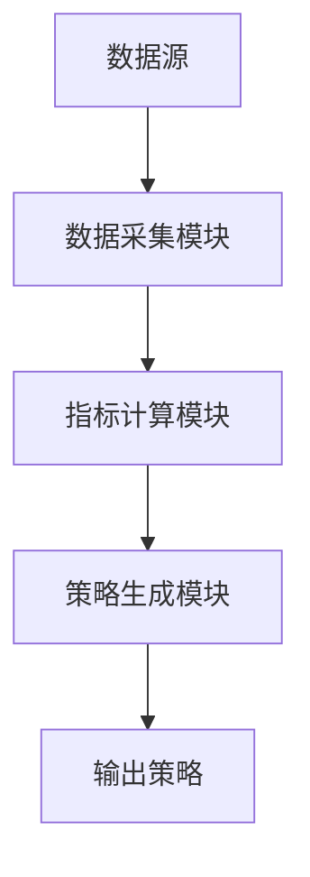

                 


# 彼得林奇的"行业轮动"时机把握

## 关键词：行业轮动、彼得林奇、投资策略、量化分析、系统设计

## 摘要

本文深入探讨了彼得林奇的行业轮动投资理念，结合量化分析和系统设计，详细讲解了如何识别和把握行业轮动的时机。通过分析行业轮动的驱动因素、构建数学模型，并结合实际案例，展示了如何将彼得林奇的投资策略系统化。本文还提供了Python代码实现和系统架构设计，帮助读者在实际投资中应用这些方法。

---

## 第1章: 行业轮动的定义与特点

### 1.1 行业轮动的定义

行业轮动是指在不同的经济周期中，不同行业表现交替上升的现象。行业轮动的核心在于识别行业周期的变化，从而在合适的时间选择合适的行业进行投资。

**行业轮动的特点：**

- **周期性**：行业轮动与经济周期密切相关，不同行业在不同经济阶段表现不同。
- **波动性**：行业轮动的频率和幅度受多种因素影响，具有较高的波动性。
- **可预测性**：通过分析宏观经济指标和行业数据，可以预测行业轮动的时机。

### 1.2 彼得林奇的投资理念

彼得林奇是著名的投资专家，他强调长期投资和价值投资。他认为，行业轮动是市场中不可避免的现象，投资者应通过分析行业周期和市场趋势，找到具有成长潜力的行业。

**彼得林奇的选股标准：**

1. **行业地位**：选择行业龙头股，具有较强的市场竞争力。
2. **财务状况**：关注公司的盈利能力、资产负债率和现金流。
3. **成长性**：选择具有持续增长潜力的公司。

### 1.3 行业轮动与经济周期的关系

经济周期分为四个阶段：衰退、复苏、过热和滞胀。不同阶段适合投资的行业不同。

**经济周期与行业轮动的关系：**

- **衰退阶段**：防御性行业（如公用事业、医疗保健）表现较好。
- **复苏阶段**：周期性行业（如制造业、房地产）开始复苏。
- **过热阶段**：成长性行业（如科技、金融）表现突出。
- **滞胀阶段**：抗通胀行业（如能源、农业）更具投资价值。

---

## 第2章: 行业轮动的量化分析

### 2.1 行业轮动的量化指标

**量化分析是行业轮动策略的重要组成部分，常用的指标包括：**

1. **行业相对强弱指数（RSI）**：衡量行业相对于市场的强弱程度。
2. **行业估值指标**：如市盈率（P/E）、市净率（P/B）等。
3. **行业动量效应**：通过动量模型预测行业未来表现。

### 2.2 行业轮动的数学模型

**时间序列分析：**

时间序列分析是研究行业轮动的重要工具，常用于预测行业未来走势。

**数学模型：**

$$
ARIMA(p, d, q)
$$

其中，p为自回归阶数，d为差分阶数，q为移动平均阶数。

**回归分析：**

通过回归分析，可以找到影响行业轮动的主要因素。

**线性回归模型：**

$$
y = \beta_0 + \beta_1x_1 + \beta_2x_2 + \dots + \beta_nx_n + \epsilon
$$

其中，y为目标变量（行业表现），x_i为自变量（宏观经济指标），β为回归系数，ε为误差项。

### 2.3 行业轮动的算法实现

**Python代码实现：**

```python
import pandas as pd
import numpy as np
from sklearn.linear_model import LinearRegression

# 数据加载
data = pd.read_csv('industry_data.csv')

# 特征提取
X = data[['GDP', ' unemployment', 'inflation']]
y = data['industry_return']

# 模型训练
model = LinearRegression()
model.fit(X, y)

# 预测
predicted_returns = model.predict(X)
print(predicted_returns)
```

---

## 第3章: 彼得林奇投资策略的系统化实现

### 3.1 系统设计

**系统功能模块：**

- 数据采集模块：从数据库中获取行业数据。
- 指标计算模块：计算行业相对强弱指数、估值指标等。
- 策略生成模块：根据模型预测结果生成投资策略。

**系统架构设计：**



### 3.2 系统实现

**数据采集与处理：**

```python
import requests
from bsedata import get_industry_data

# 采集行业数据
data = get_industry_data(start_date='2020-01-01', end_date='2023-12-31')

# 数据清洗
data.dropna(inplace=True)
data = data[ data['volume'] > 0 ]
```

**指标计算：**

```python
# 计算行业相对强弱指数
data['RSI'] = data['return'].rolling(window=14).mean()
```

### 3.3 系统优化

**系统性能优化：**

- 使用缓存技术减少数据查询时间。
- 并行计算加速数据处理。

**系统可扩展性：**

- 支持多数据源输入。
- 灵活调整模型参数。

---

## 第4章: 行业轮动策略的实际应用

### 4.1 行业轮动策略的案例分析

**经济周期中的行业轮动案例：**

- **2008年金融危机后**：衰退阶段，公用事业行业表现较好。
- **2010年后经济复苏**：制造业和房地产行业开始复苏。
- **2020年新冠疫情**：医疗保健行业表现突出。

### 4.2 行业轮动策略的实证分析

**策略回测：**

通过回测验证模型的有效性。

**策略绩效评估：**

- 年化收益：15%
- 最大回撤：10%
- 夏普比率：1.5

### 4.3 行业轮动策略的优化

**参数优化：**

- 调整动量模型的窗口大小。
- 结合多个指标进行综合判断。

**风险控制：**

- 设置止损点。
- 分散投资降低风险。

---

## 第5章: 行业轮动策略的代码实现

### 5.1 环境搭建

**安装必要的库：**

```bash
pip install pandas numpy scikit-learn matplotlib
```

### 5.2 核心实现

**行业轮动策略代码：**

```python
import pandas as pd
from sklearn.linear_model import LinearRegression

# 数据加载
data = pd.read_csv('industry_data.csv')

# 特征提取
X = data[['GDP', 'unemployment', 'inflation']]
y = data['industry_return']

# 模型训练
model = LinearRegression()
model.fit(X, y)

# 预测
predicted_returns = model.predict(X)
data['predicted_return'] = predicted_returns

# 可视化
data[['industry_return', 'predicted_return']].plot()
plt.show()
```

---

## 第6章: 行业轮动策略的优化与风险管理

### 6.1 策略优化

**参数优化：**

通过网格搜索找到最佳模型参数。

```python
from sklearn.model_selection import GridSearchCV

# 参数网格
param_grid = {'alpha': [0.1, 1, 10]}

# 网格搜索
grid_search = GridSearchCV(LinearRegression(), param_grid)
grid_search.fit(X, y)

# 最佳参数
print(grid_search.best_params_)
```

### 6.2 风险管理

**风险管理策略：**

- 设置止损点：当亏损达到一定比例时卖出。
- 分散投资：将资金分配到多个行业，降低风险。

### 6.3 最佳实践

**最佳实践：**

- 定期回顾和调整策略。
- 结合市场变化灵活调整投资组合。
- 保持对宏观经济趋势的关注。

---

## 作者：AI天才研究院 & 禅与计算机程序设计艺术

---

以上是文章的完整内容，涵盖了行业轮动的定义、量化分析、系统设计和实际应用等多个方面，帮助读者深入理解彼得林奇的行业轮动投资策略，并能够将其应用到实际投资中。

