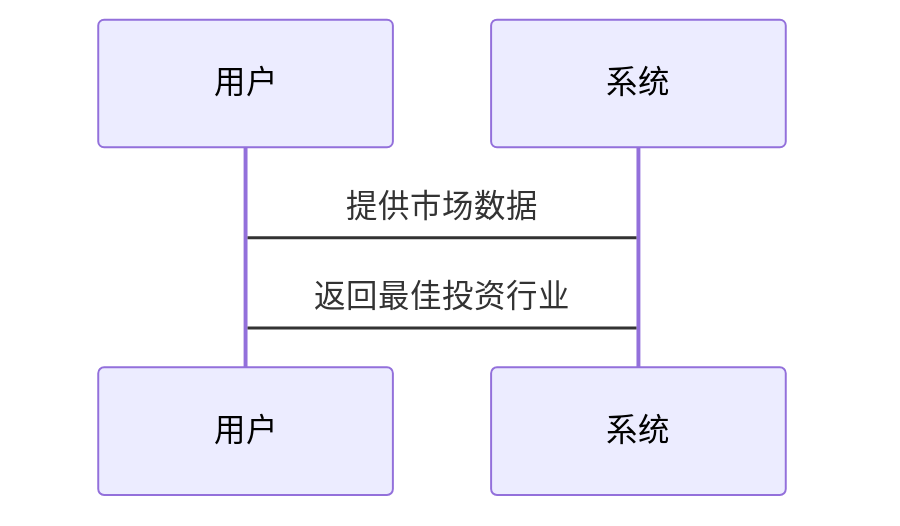

                 


# 彼得林奇的行业轮动策略

## 关键词
- 彼得林奇
- 行业轮动策略
- 投资策略
- 经济周期
- 股票投资

## 摘要
本文系统地探讨了彼得林奇的行业轮动策略，从理论基础到算法实现，再到实际应用，进行了深入分析。文章首先介绍了行业轮动的基本概念和背景，接着分析了经济周期对行业轮动的影响，详细讲解了行业基本面分析的方法。随后，文章从算法角度探讨了行业轮动的实现，包括动量策略、因子模型和CAPM模型的应用。最后，通过系统架构设计和项目实战，展示了如何将行业轮动策略应用于实际投资，并总结了最佳实践和注意事项。

---

# 第一部分：行业轮动策略概述

## 第1章：行业轮动策略的基本概念

### 1.1 行业轮动的定义与背景
- 1.1.1 行业轮动的定义
  行业轮动是指根据经济周期的变化，投资于表现相对较好的行业，从而实现超额收益的投资策略。
- 1.1.2 行业轮动的历史发展
  从20世纪70年代至今，行业轮动策略在投资实践中不断发展和完善。
- 1.1.3 行业轮动与经济周期的关系
  行业轮动策略的核心在于识别经济周期的变化，并据此调整投资组合。

### 1.2 行业轮动的核心要素
- 1.2.1 行业的分类与特征
  行业分为衰退期、恢复期、增长期和成熟期，不同阶段的行业表现差异显著。
- 1.2.2 经济周期对行业的影响力
  经济周期的变化直接影响行业的盈利能力和发展前景。
- 1.2.3 投资者行为与行业轮动的关系
  投资者的行为变化也会对行业轮动产生重要影响。

### 1.3 行业轮动与其他投资策略的对比
- 1.3.1 股票选择与行业轮动的差异
  股票选择侧重于个股筛选，而行业轮动侧重于行业配置。
- 1.3.2 被动投资与主动投资的对比
  行业轮动策略属于主动投资，而被动投资通常遵循固定的投资组合。
- 1.3.3 行业轮动在资产配置中的作用
  行业轮动策略可以优化资产配置，提升投资组合的收益。

---

# 第二部分：行业轮动的理论基础

## 第2章：经济周期与行业轮动

### 2.1 经济周期的定义与阶段划分
- 2.1.1 经济周期的四个阶段
  经济周期分为衰退期、恢复期、增长期和成熟期。
- 2.1.2 每个阶段的特征与影响
  每个阶段的经济指标和市场表现都有显著差异。

### 2.2 不同经济周期下的行业表现
- 2.2.1 衰退期的行业表现
  防守性行业（如公用事业、医疗保健）表现较好。
- 2.2.2 恢复期的行业表现
  周期性行业（如材料、工业）表现较好。
- 2.2.3 增长期的行业表现
  技术类行业（如信息技术、半导体）表现较好。
- 2.2.4 趋于成熟的行业表现
  成熟行业（如金融、能源）表现相对稳定。

### 2.3 经济指标对行业轮动的指导作用
- 2.3.1 主要经济指标的定义
  包括GDP增长率、失业率、通胀率等。
- 2.3.2 指标对行业轮动的预测作用
  通过经济指标预测行业轮动的方向。

## 第3章：行业基本面分析

### 3.1 行业基本面分析的框架
- 3.1.1 行业生命周期分析
  分析行业的生命周期阶段，确定其投资价值。
- 3.1.2 行业竞争结构分析
  使用波特五力模型分析行业的竞争格局。
- 3.1.3 行业财务指标分析
  通过行业平均ROE、毛利率等指标评估行业盈利能力。

### 3.2 彼得林奇的行业分析方法
- 3.2.1 通过财务报表分析行业风险
  重点关注行业的负债率、利润率和现金流。
- 3.2.2 通过行业趋势预测投资机会
  分析行业的增长潜力和未来发展趋势。
- 3.2.3 通过管理层能力评估行业前景
  评估管理层的决策能力和企业战略。

---

# 第三部分：行业轮动的算法实现

## 第4章：行业轮动的算法原理

### 4.1 动量策略
- 4.1.1 动量策略的定义
  选择过去表现较好的行业进行投资。
- 4.1.2 动量策略的实现步骤
  1. 计算各行业的过去收益率。
  2. 根据收益率排序，选择表现最好的行业。
  3. 持有期结束后平仓，重新选择行业。

### 4.2 因子模型
- 4.2.1 因子模型的定义
  通过多个因子（如市值、价值、动量）综合评估行业的投资价值。
- 4.2.2 因子模型的实现步骤
  1. 收集相关因子数据。
  2. 对因子进行标准化处理。
  3. 计算各行业的综合得分。
  4. 根据得分排序，选择得分最高的行业。

### 4.3 CAPM模型
- 4.3.1 CAPM模型的定义
  通过资本资产定价模型评估行业的预期收益。
- 4.3.2 CAPM模型的实现步骤
  1. 确定无风险收益率和市场预期收益率。
  2. 计算各行业的贝塔系数。
  3. 根据贝塔系数和市场收益计算各行业的预期收益。
  4. 根据预期收益选择投资行业。

### 4.4 行业轮动算法的实现代码
```python
import pandas as pd
import numpy as np

# 示例数据：各行业的过去收益率和贝塔系数
data = {
    '行业': ['行业A', '行业B', '行业C'],
    '过去收益率': [0.15, 0.10, 0.08],
    '贝塔系数': [1.2, 1.0, 0.8]
}
df = pd.DataFrame(data)

# 计算各行业的预期收益
risk_free_rate = 0.05
market_expected_return = 0.10

df['预期收益'] = risk_free_rate + df['贝塔系数'] * (market_expected_return - risk_free_rate)

# 根据预期收益排序，选择预期收益最高的行业
df = df.sort_values('预期收益', ascending=False)
selected_industry = df.iloc[0]['行业']
print("建议投资的行业为:", selected_industry)
```

---

# 第四部分：行业轮动的系统设计

## 第5章：行业轮动系统的架构设计

### 5.1 问题场景介绍
- 行业轮动系统的目的是根据实时市场数据和经济指标，自动选择最佳投资行业。

### 5.2 系统功能设计
- 5.2.1 数据采集模块
  - 采集各行业的历史数据和实时数据。
- 5.2.2 数据分析模块
  - 计算行业轮动指标（如动量、因子得分）。
- 5.2.3 投资决策模块
  - 根据算法选择最佳行业。
- 5.2.4 投资组合管理模块
  - 调整投资组合，实现行业轮动。

### 5.3 系统架构设计


### 5.4 接口设计
- 数据接口：与数据源对接，获取实时数据。
- 投资决策接口：与投资系统对接，实现自动投资。

### 5.5 交互设计


---

# 第五部分：行业轮动的项目实战

## 第6章：项目实战

### 6.1 环境安装
- 安装Python和相关库（如pandas、numpy、matplotlib）。
- 安装数据接口（如Yahoo Finance API）。

### 6.2 核心代码实现
```python
import pandas as pd
import numpy as np
import requests

# 数据接口函数
def get_industry_data(industry):
    url = f"https://api.finance.yahoo.com/industry/{industry}"
    response = requests.get(url)
    data = response.json()
    return data['chart']

# 行业轮动算法实现
def industry_rotational_strategy(data):
    # 计算动量指标
    momentum = data['过去收益率'].sort_values(ascending=False)
    # 计算因子得分
    factors = data[['市值', '价值', '动量']].apply(lambda x: x.mean(), axis=1)
    # 综合排序
    ranking = pd.DataFrame({
        '动量排序': momentum.rank(ascending=False),
        '因子排序': factors.rank(ascending=False)
    })
    # 计算综合得分
    ranking['综合得分'] = ranking['动量排序'] + ranking['因子排序']
    # 选择得分最低的行业
    selected_industry = ranking.sort_values('综合得分').index[0]
    return selected_industry

# 实战案例
data = {
    '行业': ['行业A', '行业B', '行业C'],
    '过去收益率': [0.15, 0.10, 0.08],
    '市值': [100, 80, 120],
    '价值': [2.5, 3.0, 2.0],
    '动量': [0.15, 0.10, 0.08]
}

data_df = pd.DataFrame(data)
selected_industry = industry_rotational_strategy(data_df)
print("建议投资的行业为:", selected_industry)
```

### 6.3 案例分析
- 通过实际数据，分析行业轮动策略的效果，并与基准策略进行对比。

---

# 第六部分：行业轮动的最佳实践

## 第7章：最佳实践

### 7.1 总结
- 行业轮动策略的核心在于识别经济周期的变化，并据此调整投资组合。

### 7.2 注意事项
- 需要结合市场环境和实际数据进行调整。
- 需要定期监控和评估行业轮动的效果。

### 7.3 拓展阅读
- 推荐阅读彼得林奇的《彼得林奇的投资策略》和《行业分析实战》。

---

# 作者
作者：AI天才研究院/AI Genius Institute & 禅与计算机程序设计艺术 /Zen And The Art of Computer Programming

