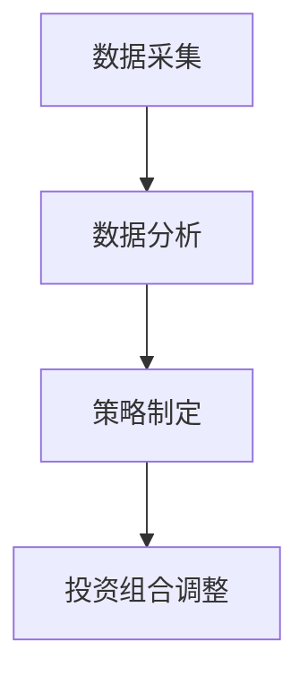
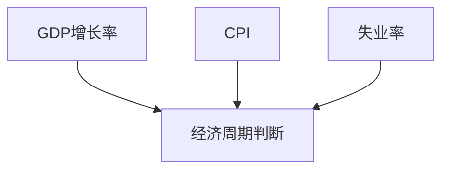

                 


# 彼得林奇的"行业轮动"策略实施步骤

> 关键词：彼得林奇、行业轮动、投资策略、经济周期、股票投资

> 摘要：本文详细阐述了彼得林奇的行业轮动策略的实施步骤，从行业选择、经济周期分析到投资组合的构建与调整，结合实际案例和数学模型，深入探讨了该策略的核心思想和操作方法。通过系统化的方法，帮助投资者理解和应用这一经典投资策略。

---

# 第1章: 行业轮动策略概述

## 1.1 彼得林奇投资理念

### 1.1.1 价值投资的核心思想
彼得林奇是美国著名基金经理，其价值投资理念强调寻找具有持续增长潜力的公司，通过深入研究基本面，选择被市场低估的股票进行长期投资。

### 1.1.2 彼得林奇的投资风格
- **长期投资**：避免频繁交易，注重公司长期增长。
- **基本面分析**：通过财务报表分析公司盈利能力、成长性和抗风险能力。
- **分散投资**：通过投资多个行业和公司分散风险。

### 1.1.3 行业轮动策略的起源与演变
行业轮动策略源于彼得林奇对经济周期的深刻理解。他认为，不同行业在不同经济阶段的表现差异显著，通过轮换投资可以捕捉不同行业的超额收益。

---

## 1.2 行业轮动策略的定义与特点

### 1.2.1 行业轮动的定义
行业轮动是指根据经济周期的变化，投资于表现较好的行业或板块，同时规避表现不佳的行业，以实现超额收益的投资策略。

### 1.2.2 行业轮动的核心特点
- **周期性**：行业轮动与经济周期密切相关。
- **动态性**：需要根据市场变化动态调整投资组合。
- **分散性**：通过投资多个行业降低风险。

### 1.2.3 行业轮动与市场周期的关系
经济周期分为四个阶段：衰退、复苏、过热、滞胀。每个阶段适合投资的行业不同，例如衰退阶段适合投资防御性行业（如公用事业），过热阶段适合投资周期性行业（如科技、金融）。

---

## 1.3 行业轮动策略的背景与意义

### 1.3.1 经济周期对行业的影响
- **衰退阶段**：低市盈率、防御性行业表现较好。
- **复苏阶段**：原材料、工业等行业开始复苏。
- **过热阶段**：周期性行业（如科技、金融）表现突出。
- **滞胀阶段**：防御性行业（如公用事业）相对稳定。

### 1.3.2 行业轮动在投资组合中的作用
- **提升收益**：通过投资表现较好的行业捕捉超额收益。
- **降低风险**：避免单一行业风险过大。

### 1.3.3 行业轮动策略的优势与局限性
- **优势**：适应市场变化，捕捉行业轮动带来的收益。
- **局限性**：需要准确判断经济周期，操作难度较大。

---

## 1.4 本章小结
本章介绍了彼得林奇的投资理念，行业轮动策略的定义、特点和与经济周期的关系。通过理解这些内容，投资者可以更好地把握行业轮动策略的核心思想。

---

# 第2章: 行业轮动策略的实施步骤

## 2.1 确定行业轮动的核心逻辑

### 2.1.1 行业选择标准
- **行业基本面分析**：分析行业的市场规模、增长潜力、竞争格局。
- **行业估值指标**：如市盈率、市净率等。
- **行业政策影响**：政府政策对行业的影响。

### 2.1.2 经济周期对行业的影响
- **衰退阶段**：防御性行业（如公用事业、医疗）表现较好。
- **复苏阶段**：工业、原材料等行业开始复苏。
- **过热阶段**：周期性行业（如科技、金融）表现突出。
- **滞胀阶段**：防御性行业相对稳定。

---

## 2.2 制定行业轮动的投资计划

### 2.2.1 投资目标与风险偏好
- **投资目标**：收益目标、风险承受能力。
- **投资期限**：短期或长期。

### 2.2.2 行业轮动的策略选择
- **积极型策略**：频繁调整投资组合，追求超额收益。
- **稳健型策略**：适度调整，降低波动性。

---

## 2.3 构建行业轮动的投资组合

### 2.3.1 行业选择
- **权重分配**：根据经济周期判断行业权重。
- **分散投资**：避免集中投资单一行业。

### 2.3.2 投资组合调整
- **定期评估**：每季度或半年评估一次投资组合。
- **动态调整**：根据市场变化调整行业配置。

---

## 2.4 监控与调整

### 2.4.1 行业表现监控
- **定期跟踪**：观察投资行业表现。
- **市场变化应对**：根据市场变化及时调整。

### 2.4.2 风险控制
- **止损策略**：设定止损点，避免重大亏损。
- **分散投资**：通过投资多个行业降低风险。

---

## 2.5 本章小结
本章详细介绍了行业轮动策略的实施步骤，包括行业选择、投资计划制定、投资组合构建与调整等内容，为投资者提供了具体的操作指南。

---

# 第3章: 行业轮动策略的系统化实现

## 3.1 系统架构设计

### 3.1.1 系统功能模块
- **数据采集模块**：采集行业数据。
- **数据分析模块**：分析行业基本面、估值指标。
- **策略制定模块**：根据经济周期制定投资策略。
- **投资组合调整模块**：动态调整投资组合。

### 3.1.2 系统架构图



---

## 3.2 系统实现

### 3.2.1 数据采集
- **数据来源**：股票价格、财务报表、行业报告。
- **数据处理**：清洗、整理、存储。

### 3.2.2 算法实现
- **行业评分模型**：根据基本面、估值指标对行业进行评分。
- **经济周期判断**：通过宏观经济指标判断经济周期。

### 3.2.3 投资组合调整
- **动态调整**：根据市场变化调整行业权重。

---

## 3.3 实战案例

### 3.3.1 案例背景
- **经济周期**：假设当前处于复苏阶段。

### 3.3.2 行业选择
- **工业**：复苏阶段表现较好。
- **原材料**：开始复苏。

### 3.3.3 投资组合构建
- **权重分配**：工业40%，原材料30%，防御性行业20%，其他10%。

---

## 3.4 本章小结
本章通过系统化的方法，详细介绍了行业轮动策略的实现过程，包括系统架构设计、算法实现和实战案例。

---

# 第4章: 数学模型与风险管理

## 4.1 数学模型

### 4.1.1 行业评分模型
- **模型公式**：
  $$
  \text{行业评分} = \alpha \times \text{市盈率} + \beta \times \text{市净率} + \gamma \times \text{ROE}
  $$
- **参数解释**：$\alpha$、$\beta$、$\gamma$为权重系数。

### 4.1.2 经济周期判断模型
- **指标选择**：GDP增长率、CPI、失业率。
- **模型流程图**



---

## 4.2 风险管理

### 4.2.1 投资组合的风险控制
- **分散投资**：通过投资多个行业降低风险。
- **止损策略**：设定止损点，避免重大亏损。

### 4.2.2 动态调整策略
- **定期评估**：每季度或半年评估一次投资组合。
- **及时调整**：根据市场变化及时调整行业配置。

---

## 4.3 本章小结
本章通过数学模型和风险管理策略，进一步完善了行业轮动策略的实施框架，确保投资过程更加稳健。

---

# 第5章: 总结与展望

## 5.1 总结
- **核心思想**：彼得林奇的行业轮动策略通过经济周期分析和行业基本面研究，实现投资收益的最大化。
- **实施步骤**：包括行业选择、投资计划制定、投资组合构建与调整。

## 5.2 展望
- **未来研究方向**：结合人工智能技术，优化行业轮动策略。
- **投资建议**：投资者应根据自身风险偏好和市场环境灵活调整策略。

---

# 作者信息

作者：AI天才研究院/AI Genius Institute & 禅与计算机程序设计艺术 /Zen And The Art of Computer Programming

---

# 附录

## 附录A: 行业轮动策略的Python实现

```python
import pandas as pd
import numpy as np

def industry_rating(industry_data):
    # 计算行业评分
    weights = {'市盈率': 0.4, '市净率': 0.3, 'ROE': 0.3}
    industry_data['评分'] = industry_data.apply(lambda x: 
        weights['市盈率'] * x['市盈率'] + 
        weights['市净率'] * x['市净率'] + 
        weights['ROE'] * x['ROE'], axis=1)
    return industry_data

# 示例数据
industry_data = pd.DataFrame({
    '行业': ['科技', '金融', '工业', '原材料'],
    '市盈率': [15, 12, 18, 20],
    '市净率': [2.5, 3.0, 1.8, 2.2],
    'ROE': [15%, 12%, 10%, 8%]
})

# 行业评分
result = industry_rating(industry_data)
print(result)
```

---

通过以上步骤，投资者可以系统化地实施彼得林奇的行业轮动策略，结合实际案例和数学模型，提升投资收益并降低风险。

