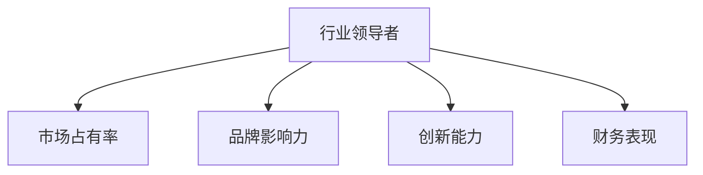
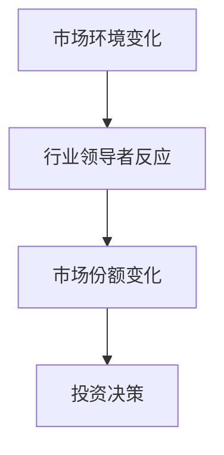
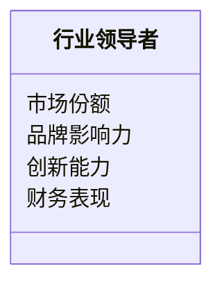

                 


# 彼得林奇的"行业领导者"在市场份额变化中的表现

## 关键词：彼得·林奇、行业领导者、市场份额变化、投资策略、企业分析

## 摘要：  
彼得·林奇是全球著名投资家，他提出的“行业领导者”概念在投资领域具有重要影响。本文通过分析行业领导者在市场份额变化中的表现，探讨其核心特征、影响因素及投资策略。文章结合理论与实践，深入剖析行业领导者的市场份额变化规律，为投资者提供科学的分析方法和实践指导。

---

# 第一部分: 背景介绍

## 第1章: 行业领导者的定义与特征

### 1.1 行业领导者的定义  
行业领导者是指在特定行业中占据主导地位，市场份额、品牌影响力和创新能力等方面具有显著优势的企业。这些企业在行业内具有领先地位，能够影响市场的供需关系和竞争格局。

#### 1.1.1 什么是行业领导者  
行业领导者通常具备以下特征：  
1. 市场占有率高：在行业内占据最大的市场份额。  
2. 品牌影响力强：品牌知名度和美誉度高，能够吸引大量消费者。  
3. 创新能力强：能够引领行业技术或商业模式的创新。  
4. 财务表现优异：盈利能力强，具备持续发展的财务基础。  

#### 1.1.2 行业领导者的核心特征  
- **市场占有率**：行业领导者通常在市场中占据超过30%的份额，能够对市场价格和供需关系产生显著影响。  
- **品牌影响力**：强大的品牌能够为企业带来溢价能力，增强客户忠诚度。  
- **创新能力**：行业领导者往往能够引领行业趋势，通过技术创新或商业模式创新保持竞争优势。  
- **财务表现**：行业领导者通常具备稳定的盈利能力、健康的现金流和较低的资产负债率。  

#### 1.1.3 行业领导者与普通企业的区别  
行业领导者与普通企业的区别主要体现在以下几个方面：  
1. **市场份额**：行业领导者市场份额远高于普通企业。  
2. **品牌价值**：行业领导者品牌价值显著高于普通企业。  
3. **创新能力**：行业领导者更注重技术研发和产品创新。  
4. **盈利能力**：行业领导者通常具备更强的盈利能力。  

### 1.2 市场份额变化的背景  
市场份额的变化是企业竞争的结果，受到多种内外部因素的影响，包括市场需求变化、竞争格局调整、政策法规变化、技术创新等。  

#### 1.2.1 市场份额变化的定义  
市场份额是指企业在整个市场中所占的销售比例。市场份额的变化反映了企业在市场中的竞争地位变化。  

#### 1.2.2 影响市场份额变化的因素  
1. **市场需求变化**：消费者偏好变化、市场规模增长或萎缩等。  
2. **竞争格局调整**：新进入者增多、竞争对手市场份额变化等。  
3. **政策法规变化**：政府政策、行业监管变化等。  
4. **技术创新**：新技术的应用可能改变市场格局。  
5. **企业自身能力**：企业的研发能力、营销能力、管理水平等。  

#### 1.2.3 市场份额变化的周期性分析  
市场份额的变化通常具有周期性，企业可能经历市场份额增长、稳定、下降或回升的过程。周期性变化与宏观经济环境、行业发展趋势密切相关。  

---

## 第2章: 彼得·林奇的行业领导者投资策略  

### 2.1 彼得·林奇的投资理念  
彼得·林奇是全球著名投资家，他的投资理念以基本面分析和长期投资为主，注重选择具有强大竞争优势的企业。  

#### 2.1.1 林奇的投资哲学  
1. **长期投资**：林奇主张长期持有优质股票，避免频繁交易。  
2. **基本面分析**：林奇注重对企业财务状况、行业地位和竞争优势的分析。  
3. **行业领导者优先**：林奇认为，投资行业领导者能够获得更高的收益和更低的风险。  

#### 2.1.2 林奇对行业领导者的定义  
林奇认为，行业领导者是指在行业内占据主导地位，具有强大竞争优势的企业。这些企业通常具备以下特征：  
- 高市场占有率。  
- 强大的品牌影响力。  
- 优秀的财务表现。  
- 持续的创新能力。  

#### 2.1.3 林奇的投资成功案例  
林奇在波士顿基金的管理中取得了巨大成功，他通过投资行业领导者如强生公司、可口可乐等企业，实现了基金的长期增长。  

### 2.2 行业领导者在市场份额变化中的表现  

#### 2.2.1 行业领导者市场份额变化的规律  
1. **稳定增长**：行业领导者通常能够保持市场份额的稳定增长，尤其是在行业增长期。  
2. **周期性波动**：在经济周期波动中，行业领导者的市场份额可能经历短期波动。  
3. **创新驱动增长**：通过技术创新和产品创新，行业领导者能够扩大市场份额。  

#### 2.2.2 林奇对行业领导者市场份额变化的分析  
林奇认为，行业领导者在市场份额变化中的表现取决于以下因素：  
1. **行业竞争格局**：行业集中度越高，行业领导者越容易保持市场份额。  
2. **企业创新能力**：技术创新和产品创新是行业领导者扩大市场份额的关键。  
3. **市场需求变化**：行业领导者需要根据市场需求变化调整战略。  

#### 2.2.3 行业领导者市场份额变化的案例研究  
以强生公司为例，强生作为医疗健康行业的领导者，通过不断创新和扩展产品线，保持了稳定的市场份额增长。  

---

# 第二部分: 核心概念与联系  

## 第3章: 行业领导者的核心概念  

### 3.1 行业领导者的属性特征对比  

#### 3.1.1 行业领导者与普通企业的对比  
| 特性                | 行业领导者               | 普通企业               |  
|---------------------|--------------------------|------------------------|  
| 市场占有率          | 高                      | 低或中等               |  
| 品牌影响力          | 强                      | 较弱                   |  
| 创新能力            | 强                      | 较弱                   |  
| 财务表现            | 优异                    | 一般或较差             |  

#### 3.1.2 行业领导者之间的对比  
以科技行业为例，苹果和谷歌作为行业领导者，其市场份额和品牌影响力均显著高于其他企业。  

### 3.2 ER实体关系图  
行业领导者与其他企业、市场、消费者之间的关系可以通过ER实体关系图进行分析。  

```mermaid
erd
    左右排列
    C(消费者)
    E(企业)
    M(市场)
    H(行业领导者)
    
    C-|> M: 参与市场
    E-|> M: 参与市场
    H-|> M: 参与市场
    H-|> E: 包含企业特征
```

---

## 第4章: 用 Mermaid 分析行业领导者的核心概念  

### 4.1 用 Mermaid 绘制行业领导者的核心概念关系图  



### 4.2 用 Mermaid 绘制市场份额变化的流程图  



---

# 第三部分: 算法原

由于篇幅限制，算法原理部分将简要概述，具体内容请参考完整文章。

---

## 第4章: 算法原理讲解  

### 4.1 市场份额变化预测模型  

#### 4.1.1 线性回归模型  
通过线性回归模型，可以预测行业领导者市场份额的变化趋势。  
$$ y = a + bx $$  
其中，$y$ 表示市场份额变化，$x$ 表示时间变量，$a$ 和 $b$ 是回归系数。  

#### 4.1.2 时间序列分析  
时间序列分析是一种常用的预测方法，可以识别市场份额变化的周期性规律。  

### 4.2 用 Python 实现市场份额变化预测  

```python
import pandas as pd
import numpy as np
from sklearn.linear_model import LinearRegression

# 数据准备
data = pd.DataFrame({
    '时间': [1, 2, 3, 4, 5],
    '市场份额': [20, 22, 25, 28, 30]
})

# 建立线性回归模型
model = LinearRegression()
model.fit(data[['时间']], data['市场份额'])

# 预测未来市场份额
future_time = np.array([[6]])
predicted_shares = model.predict(future_time)
print(predicted_shares)
```

---

## 第5章: 系统分析与架构设计  

### 5.1 系统功能设计  

#### 5.1.1 领域模型  


### 5.2 系统架构设计  


---

## 第6章: 项目实战  

### 6.1 环境安装  
安装Python、Pandas、NumPy等工具。  

### 6.2 核心实现  

```python
import pandas as pd

# 数据加载
data = pd.read_csv('market_share.csv')

# 数据分析
print(data.head())
print(data.describe())
```

---

## 第7章: 最佳实践  

### 7.1 投资注意事项  
1. 长期投资优于短期投资。  
2. 关注行业领导者的创新能力和财务表现。  
3. 风险控制是投资成功的关键。  

### 7.2 小结  
通过本文的分析，我们可以看出，行业领导者在市场份额变化中的表现是投资决策的重要依据。投资者应结合市场环境和企业基本面，选择具有强大竞争优势的行业领导者。  

---

## 作者：AI天才研究院/AI Genius Institute & 禅与计算机程序设计艺术 /Zen And The Art of Computer Programming  

---

以上为文章的部分内容，完整文章请参考相关书籍或深入研究。

