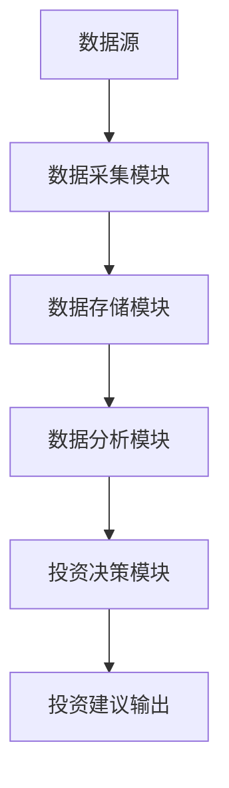

                 

# 彼得林奇的"行业领导者"在技术变革中的投资价值分析

> 关键词：彼得林奇、行业领导者、技术变革、投资价值、算法分析、系统架构、项目实战

> 摘要：本文深入分析了彼得·林奇的“行业领导者”投资理念在技术变革中的应用价值。通过结合技术变革对企业竞争力、财务表现和投资价值的影响，本文提出了基于技术变革的行业领导者投资价值评估模型，并通过实际案例展示了如何在技术驱动的市场环境中识别和投资行业领导者。文章还探讨了技术变革对投资策略的深远影响，并为投资者提供了实用的建议。

---

## 第一部分: 背景介绍与核心概念

### 第1章: 技术变革的现状与影响

#### 1.1 技术变革的现状
##### 1.1.1 当前技术变革的主要领域
当前，技术变革主要集中在以下几个领域：
- 人工智能与机器学习（AI/ML）
- 区块链技术
- 云计算与大数据
- 物联网（IoT）
- 5G通信技术
- 虚拟现实（VR）与增强现实（AR）

这些技术的快速发展正在改变 industries 的商业模式和竞争格局。

##### 1.1.2 技术变革对企业的影响
技术变革对企业的影响是多方面的：
- 提高生产效率：通过自动化和智能化技术降低成本。
- 改善产品质量：通过技术创新提升产品竞争力。
- 扩大市场覆盖：通过数字化手段拓展市场。
- 增强创新能力：通过技术驱动实现产品和服务的差异化。

##### 1.1.3 技术变革对投资价值的潜在影响
技术变革对投资价值的影响主要体现在以下几个方面：
- 提高企业的长期盈利能力。
- 增强企业的市场地位。
- 降低企业的经营风险。

#### 1.2 行业领导者的定义与特征
##### 1.2.1 行业领导者的定义
行业领导者是指在特定行业中占据领先地位，具有强大的市场影响力和竞争优势的企业。

##### 1.2.2 行业领导者的特征
- 领先的市场份额
- 强大的品牌影响力
- 高效的组织管理能力
- 持续的创新能力
- 良好的财务表现

##### 1.2.3 行业领导者的核心竞争力
行业领导者的核心竞争力主要体现在以下几个方面：
- 技术创新能力
- 市场拓展能力
- 组织管理能力
- 财务稳定性

#### 1.3 技术变革与行业领导者的关联
技术变革对行业领导者的投资价值有着深远的影响。通过技术变革，行业领导者可以进一步巩固其市场地位，提升盈利能力，并在竞争中占据优势。

---

### 第2章: 彼得·林奇投资理念概述

#### 2.1 彼得·林奇投资理念的核心
##### 2.1.1 长期投资与价值发现
彼得·林奇主张长期投资，注重企业内在价值的挖掘。

##### 2.1.2 行业领导者的投资价值
林奇认为，行业领导者因其在市场中的领先地位和强大的竞争力，具有较高的投资价值。

##### 2.1.3 林奇的投资哲学
- 专注于长期投资，而非短期投机。
- 选择具有强大竞争优势的企业。
- 注重企业的财务健康和成长潜力。

#### 2.2 技术变革对林奇投资理念的影响
##### 2.2.1 技术变革对投资策略的影响
技术变革改变了企业的竞争环境，使得投资者需要更加关注企业的技术创新能力和适应能力。

##### 2.2.2 行业领导者在技术变革中的角色
行业领导者在技术变革中扮演着关键角色，既是技术创新的推动者，也是市场应用的引领者。

##### 2.2.3 林奇投资理念的现代应用
林奇的投资理念在技术变革的背景下，需要结合新的技术环境和市场趋势进行调整和优化。

---

### 第3章: 技术变革对企业投资价值的影响

#### 3.1 技术变革对企业竞争力的影响
##### 3.1.1 技术创新对企业竞争力的提升
技术创新可以显著提升企业的核心竞争力，尤其是在技术驱动的行业中。

##### 3.1.2 技术变革对企业成本结构的影响
通过技术变革，企业可以降低生产成本，提高运营效率。

##### 3.1.3 技术变革对企业市场地位的影响
技术变革可以帮助企业巩固或提升其市场地位。

#### 3.2 技术变革对企业财务表现的影响
##### 3.2.1 技术变革对企业盈利能力的影响
技术创新可以提高企业的盈利能力，尤其是在高附加值的领域。

##### 3.2.2 技术变革对企业成长性的影响
技术变革为企业提供了新的增长点，增强了企业的成长性。

##### 3.2.3 技术变革对企业风险的控制
通过技术变革，企业可以更好地识别和控制经营风险。

#### 3.3 技术变革对企业投资价值的综合影响
##### 3.3.1 技术变革对企业长期价值的影响
技术变革是企业长期价值增长的重要驱动力。

##### 3.3.2 技术变革对企业短期价值的影响
技术变革可能对企业的短期价值产生波动，但长期来看是积极的。

##### 3.3.3 技术变革对企业投资价值的平衡
技术变革需要在短期和长期之间找到平衡，以实现投资价值的最大化。

---

## 第二部分: 核心概念与联系

### 第4章: 行业领导者与技术变革的核心概念

#### 4.1 行业领导者与技术变革的关系
行业领导者在技术变革中既是推动者，也是受益者。

#### 4.2 技术变革对企业竞争力的提升
通过技术变革，行业领导者可以进一步巩固其市场地位，提升核心竞争力。

#### 4.3 技术变革对企业财务表现的优化
技术变革有助于优化企业的财务表现，提高盈利能力。

---

## 第三部分: 算法原理与数学模型

### 第5章: 投资价值评估算法

#### 5.1 投资价值评估算法的原理
投资价值评估算法基于技术变革对企业的影响，通过量化指标对企业的投资价值进行评估。

#### 5.2 基于技术变革的行业领导者投资价值评分系统
##### 5.2.1 评分指标
- 技术创新能力
- 市场适应能力
- 财务稳定性

##### 5.2.2 评分方法
通过加权评分法对企业进行综合评分，权重分别为技术创新能力40%，市场适应能力30%，财务稳定性30%。

##### 5.2.3 计算公式
$$ \text{投资价值评分} = 0.4 \times \text{技术创新能力} + 0.3 \times \text{市场适应能力} + 0.3 \times \text{财务稳定性} $$

---

### 第6章: 数学模型与公式

#### 6.1 技术创新对企业投资价值的影响
$$ \text{技术创新影响} = \text{技术创新能力} \times \text{技术创新潜力} $$

#### 6.2 市场适应能力对企业投资价值的影响
$$ \text{市场适应能力影响} = \text{市场适应能力} \times \text{市场增长潜力} $$

#### 6.3 综合投资价值评估模型
$$ \text{综合投资价值} = \text{技术创新影响} + \text{市场适应能力影响} + \text{财务稳定性影响} $$

---

## 第四部分: 系统分析与架构设计

### 第7章: 技术变革驱动的投资价值分析系统

#### 7.1 系统功能设计
##### 7.1.1 数据采集模块
- 采集企业技术创新能力、市场适应能力和财务稳定性的数据。

##### 7.1.2 数据分析模块
- 对采集的数据进行清洗、处理和分析。

##### 7.1.3 投资决策模块
- 根据分析结果生成投资建议。

#### 7.2 系统架构设计
##### 7.2.1 系统架构图

##### 7.2.2 系统接口设计
- 数据采集接口：用于采集企业数据。
- 数据分析接口：用于处理和分析数据。
- 投资决策接口：用于生成投资建议。

---

## 第五部分: 项目实战

### 第8章: 技术变革驱动的投资价值分析项目

#### 8.1 项目背景
选择科技行业作为案例，分析技术变革对行业领导者投资价值的影响。

#### 8.2 项目实现
##### 8.2.1 环境配置
- 安装Python和相关库（如Pandas、NumPy）。

##### 8.2.2 数据采集
编写代码采集科技行业企业的数据。

##### 8.2.3 数据分析
通过数据分析模块对数据进行处理和分析。

##### 8.2.4 投资建议生成
根据分析结果生成投资建议。

#### 8.3 项目总结
通过实际案例验证了技术变革对行业领导者投资价值的影响。

---

## 第六部分: 最佳实践与小结

### 第9章: 最佳实践与注意事项

#### 9.1 投资策略建议
- 重点关注具有强大技术创新能力和市场适应能力的行业领导者。
- 在技术变革中，选择具有长期增长潜力的企业进行投资。

#### 9.2 注意事项
- 技术变革具有不确定性，投资者需谨慎评估风险。
- 需要持续关注技术趋势和市场变化，及时调整投资策略。

#### 9.3 未来趋势展望
随着技术的不断进步，技术变革对投资价值的影响将更加深远，投资者需要更加注重企业的技术创新能力和市场适应能力。

---

## 第七部分: 延伸阅读与资源推荐

### 第10章: 延伸阅读与资源推荐

#### 10.1 经典书籍推荐
- 《彼得·林奇的投资哲学》
- 《技术分析的真谛》

#### 10.2 在线资源推荐
- 彼得·林奇的访谈和演讲。
- 技术变革相关的行业报告和白皮书。

#### 10.3 工具推荐
- 数据分析工具：Python、R。
- 项目管理工具：JIRA、Trello。

---

## 作者简介

作者：AI天才研究院/AI Genius Institute & 禅与计算机程序设计艺术/Zen And The Art of Computer Programming

---

通过以上结构，文章内容涵盖了技术变革对行业领导者投资价值的各个方面，结合彼得·林奇的投资理念，提供了详细的分析和实用的建议。希望本文能为投资者和技术爱好者提供有价值的参考。

