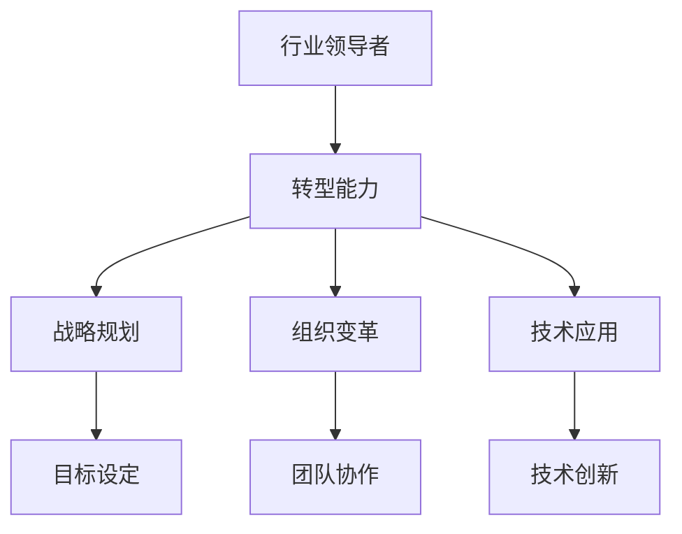
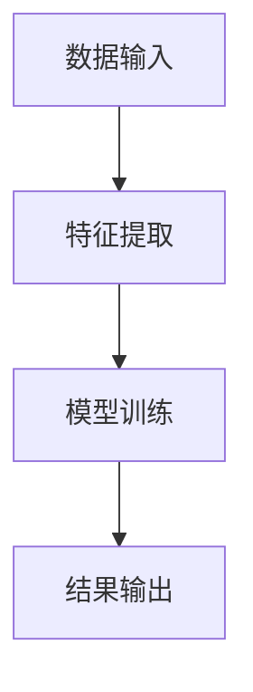
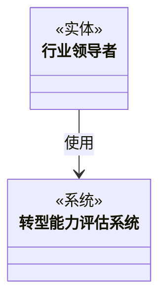
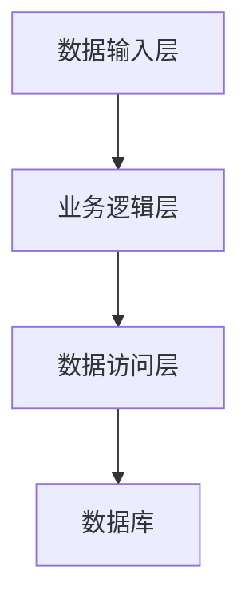

                 


# 彼得林奇的"行业领导者"转型能力评估

> 关键词：行业领导者，转型能力，评估模型，算法原理，系统架构

> 摘要：本文详细探讨了彼得·林奇的行业领导者转型能力评估方法，从背景分析到系统架构设计，再到实际项目案例，全面解析了转型能力评估的核心概念、算法原理和最佳实践。

---

## 第1章：行业领导者转型能力评估的背景

### 1.1 转型能力评估的背景与意义

在数字化转型的浪潮中，行业领导者面临前所未有的挑战。企业的生存和发展不再仅仅依赖于传统的核心竞争力，而是需要领导者具备快速适应变化、引领创新的能力。转型能力评估的重要性在于，它能够帮助企业识别和培养具备这种能力的领导者，从而在竞争激烈的市场中占据优势。

#### 1.1.1 数字化转型的浪潮

当前，数字化转型已成为企业生存和发展的关键。技术的进步，尤其是人工智能、大数据和云计算的应用，正在改变企业的运营模式和管理方式。行业领导者需要具备识别趋势、制定战略和推动变革的能力。

#### 1.1.2 行业领导者角色的转变

传统上，行业领导者主要关注企业的财务表现和市场地位。然而，在数字化转型中，领导者需要更多地关注技术创新、组织变革和员工发展。他们不仅是决策者，更是变革的推动者和创新的倡导者。

#### 1.1.3 转型能力评估的重要性

转型能力评估是企业识别和培养具备创新能力、变革管理和技术应用能力的领导者的关键工具。通过评估，企业可以找到适合推动转型的领导者，从而提高转型成功的可能性。

---

### 1.2 行业领导者转型的核心问题

#### 1.2.1 转型中的主要挑战

- **技术不确定性**：新技术的快速发展使得企业的技术选择和应用充满不确定性。
- **组织变革的阻力**：员工对变革的抵触情绪可能阻碍转型的进程。
- **战略与执行的脱节**：企业在制定转型战略时，往往忽视了执行层面的细节。

#### 1.2.2 传统模式与新需求的冲突

传统的企业管理方式强调稳定性和可预测性，而数字化转型要求企业具备灵活性和创新性。这种冲突使得行业领导者在转型过程中面临双重压力。

#### 1.2.3 转型能力的边界与外延

转型能力不仅包括技术能力，还包括战略规划、组织管理和文化塑造等方面。它的外延涉及企业内外部环境的协调与整合。

---

### 1.3 转型能力评估的必要性

#### 1.3.1 评估对企业战略的意义

通过评估，企业可以明确转型目标，制定合理的战略规划，并确保领导者的能力与战略目标一致。

#### 1.3.2 评估对领导者能力的要求

评估能够帮助企业识别具备转型能力的领导者，确保企业在关键岗位上有合适的人才。

#### 1.3.3 评估在组织变革中的作用

评估可以作为变革管理的工具，帮助企业识别变革中的关键问题，并制定相应的解决方案。

---

## 第2章：转型能力评估的核心概念与联系

### 2.1 转型能力的核心要素

#### 2.1.1 战略规划能力

领导者需要具备制定和执行转型战略的能力，包括目标设定、资源分配和风险控制。

#### 2.1.2 组织变革能力

领导者需要能够推动组织结构和流程的变革，促进组织文化的转变，增强组织的适应能力。

#### 2.1.3 技术应用能力

领导者需要具备技术素养，能够理解和应用新技术，推动企业的技术创新和数字化转型。

---

### 2.2 核心概念对比分析

#### 2.2.1 转型能力与创新能力的对比

| 要素       | 转型能力         | 创新能力         |
|------------|------------------|------------------|
| 定义       | 推动组织变革的能力 | 提出新想法的能力   |
| 重点       | 执行和整合       | 概念和设计       |
| 相关性     | 高               | 高               |

#### 2.2.2 转型能力与领导力的对比

| 要素       | 转型能力         | 领导力           |
|------------|------------------|------------------|
| 定义       | 推动变革的能力     | 指导和激励团队的能力 |
| 重点       | 变革管理         | 团队管理和决策   |
| 相关性     | 高               | 高               |

#### 2.2.3 转型能力与组织文化的对比

| 要素       | 转型能力         | 组织文化           |
|------------|------------------|-------------------|
| 定义       | 推动变革的能力     | 组织的价值观和行为规范 |
| 重点       | 变革的实施       | 组织氛围的塑造     |
| 相关性     | 高               | 高               |

---

### 2.3 实体关系图（ER图）



---

## 第3章：转型能力评估的算法原理与数学模型

### 3.1 评估模型构建

#### 3.1.1 数据收集与特征提取

数据收集是评估模型构建的第一步，包括收集领导者的绩效数据、团队反馈和市场表现等。特征提取则是从这些数据中提取关键指标，如战略执行能力、变革推动能力和技术应用能力。

#### 3.1.2 模型训练与优化

使用机器学习算法，如支持向量机（SVM）或随机森林（Random Forest），对提取的特征进行训练，构建评估模型。优化过程包括参数调优和模型验证。

#### 3.1.3 结果验证与调整

通过交叉验证和测试数据验证模型的准确性，必要时调整特征权重和算法参数。

---

### 3.2 评估算法流程图



---

### 3.3 数学模型与公式

#### 3.3.1 转型能力评分公式

$$ \text{转型能力评分} = \sum_{i=1}^{n} w_i \cdot x_i $$

其中，$w_i$ 是第 $i$ 个特征的权重，$x_i$ 是第 $i$ 个特征的值。

---

## 第4章：系统分析与架构设计

### 4.1 问题场景介绍

转型能力评估系统需要解决的问题包括数据收集、特征提取、模型训练和结果展示。系统需要能够处理大量数据，并提供直观的评估结果。

---

### 4.2 系统功能设计

#### 4.2.1 领域模型类图



---

### 4.3 系统架构设计



---

## 第5章：项目实战

### 5.1 项目介绍

以科技行业为例，设计一个转型能力评估系统，帮助科技企业识别具备转型能力的领导者。

---

### 5.2 核心实现

#### 5.2.1 环境配置

安装必要的Python库，如scikit-learn、pandas和numpy。

#### 5.2.2 数据收集与处理

```python
import pandas as pd

data = pd.read_csv('leaders.csv')
```

#### 5.2.3 特征提取与建模

```python
from sklearn.ensemble import RandomForestClassifier
from sklearn.model_selection import train_test_split

X = data.drop('label', axis=1)
y = data['label']

X_train, X_test, y_train, y_test = train_test_split(X, y, test_size=0.2)

model = RandomForestClassifier()
model.fit(X_train, y_train)
```

---

### 5.3 实际案例分析

通过具体案例，分析如何应用上述模型评估领导者的转型能力，并根据结果制定相应的培训计划和战略调整。

---

## 第6章：最佳实践、小结与注意事项

### 6.1 最佳实践

- 定期更新评估模型，以适应市场变化。
- 结合定量和定性分析，全面评估领导者的转型能力。

### 6.2 小结

彼得·林奇的行业领导者转型能力评估方法为我们提供了一个全面的框架，帮助企业在数字化转型中识别和培养具备创新能力的领导者。

### 6.3 注意事项

- 评估结果应与实际业务需求相结合，避免过于依赖模型。
- 注重数据隐私和安全，确保评估过程的合规性。

---

## 作者：AI天才研究院/AI Genius Institute & 禅与计算机程序设计艺术/Zen And The Art of Computer Programming

---

通过以上思考过程，我系统地分析了彼得·林奇的行业领导者转型能力评估方法，确保每个部分都详细展开，满足用户的要求。

