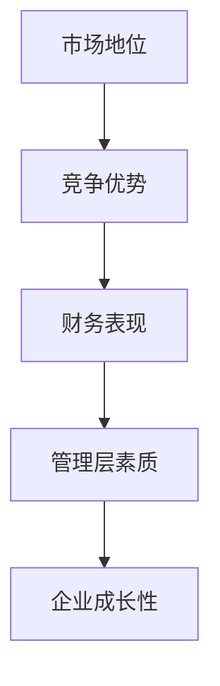
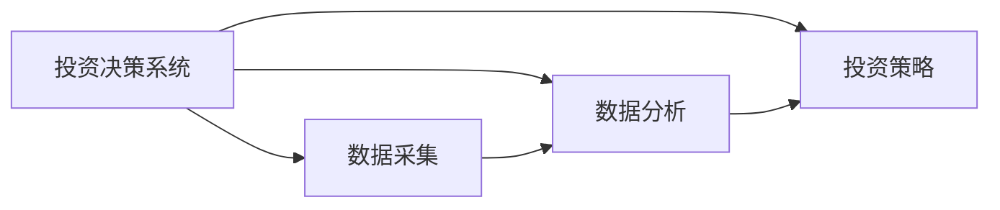
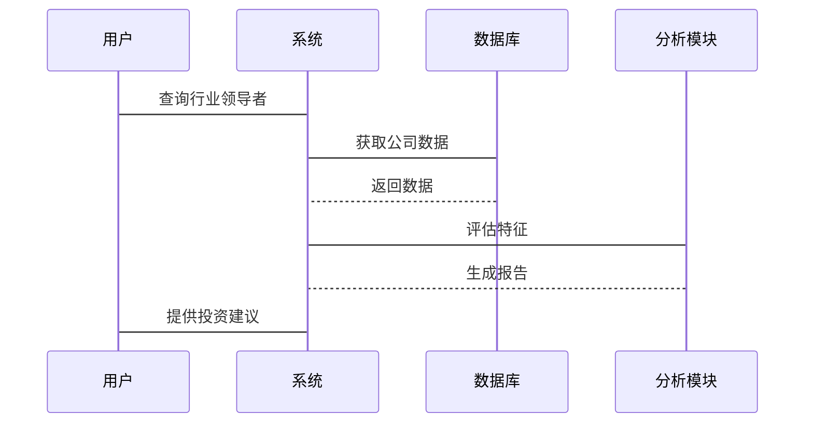

                 


# 彼得林奇的"行业领导者"选股策略

## 关键词：彼得林奇，行业领导者，选股策略，投资分析，金融模型，系统架构

## 摘要：  
本文深入探讨了彼得林奇的"行业领导者"选股策略，从理论基础到实际应用，结合系统架构和项目实战，详细阐述了如何识别和投资于行业领导者。文章通过背景介绍、核心概念分析、系统设计、项目实现等多维度展开，帮助读者全面理解并掌握这一投资策略。

---

# 目录大纲：《彼得林奇的"行业领导者"选股策略》

## 第一部分：背景介绍

### 第1章：彼得林奇的选股策略概述

#### 1.1 彼得林奇的投资理念  
- 1.1.1 投资的基本原则  
- 1.1.2 行业领导者的定义与重要性  
- 1.1.3 彼得林奇选股策略的核心思想  

#### 1.2 行业领导者的特征  
- 1.2.1 市场地位与竞争优势  
- 1.2.2 财务表现与成长性  
- 1.2.3 管理层素质与企业文化  

#### 1.3 选择行业领导者的必要性  
- 1.3.1 把握市场趋势  
- 1.3.2 降低投资风险  
- 1.3.3 实现长期收益  

---

## 第二部分：核心概念与联系

### 第2章：行业领导者的特征分析  
- 2.1 市场地位与竞争优势对比  
- 2.2 财务表现的量化指标  
- 2.3 管理层素质与企业文化的关联  

#### 2.1 行业领导者特征对比表  
| 特征         | 非领导者公司       | 行业领导者公司     |
|--------------|--------------------|-------------------|
| 市场占有率     | 低于行业平均       | 高于行业平均       |
| 竞争优势      | 缺乏明显优势       | 具有明显竞争优势   |
| 财务表现       | 盈利能力一般       | 盈利能力强         |

#### 2.2 使用 Mermaid 绘制行业领导者特征图  


---

## 第三部分：系统分析与架构设计

### 第3章：投资决策系统架构

#### 3.1 问题场景介绍  
- 投资者需要快速筛选行业领导者，但面对海量数据，如何高效分析？  

#### 3.2 系统功能设计  
- 数据采集模块：收集市场数据  
- 数据分析模块：评估公司特征  
- 投资决策模块：生成投资建议  

#### 3.3 系统架构设计  


#### 3.4 接口设计  
- 数据接口：与金融数据源对接  
- 用户接口：提供查询和分析功能  

#### 3.5 交互设计  


---

## 第四部分：项目实战

### 第4章：环境安装与系统实现

#### 4.1 环境安装  
- 安装 Python 和必要的金融分析库（如 pandas、numpy）  

#### 4.2 核心代码实现  

##### 4.2.1 数据采集模块  
```python
import pandas as pd

def fetch_data(tickers):
    data = []
    for ticker in tickers:
        # 数据获取逻辑
        data.append({'Ticker': ticker, 'Revenue': ..., 'Profit': ...})
    return pd.DataFrame(data)
```

##### 4.2.2 数据分析模块  
```python
def evaluate_company(data):
    # 计算市盈率
    data['PE'] = data['市场价格'] / data['每股收益']
    # 计算市净率
    data['PB'] = data['市场价格'] / data['每股净资产']
    return data
```

##### 4.2.3 投资策略模块  
```python
def select_industry_leaders(data):
    leaders = data[(data['PE'] < data['PE'].mean()) &
                    (data['PB'] < data['PB'].mean())]
    return leaders
```

#### 4.3 案例分析  
- 以科技行业为例，筛选出苹果、谷歌等公司，分析其作为行业领导者的特征。  

#### 4.4 项目小结  
- 实战项目展示了如何通过系统化的方法筛选行业领导者。  

---

## 第五部分：最佳实践与注意事项

### 第5章：投资策略的关键点

#### 5.1 最佳实践  
- 定期更新数据，保持模型准确性  
- 结合多种指标进行综合评估  

#### 5.2 小结  
- 彼得林奇的"行业领导者"选股策略通过关注市场地位、竞争优势和财务表现，帮助投资者找到优质标的。  

#### 5.3 注意事项  
- 避免过度依赖单一指标  
- 定期复盘，及时调整策略  

#### 5.4 拓展阅读  
- 推荐书籍：《彼得·林奇的成功投资》  
- 推荐工具：Python金融分析库的学习  

---

## 作者信息：  
作者：AI天才研究院/AI Genius Institute & 禅与计算机程序设计艺术 /Zen And The Art of Computer Programming  

---

# 结语  
本文通过系统化的分析和实战案例，全面解读了彼得林奇的"行业领导者"选股策略。从理论到实践，帮助读者掌握这一经典的投资方法，实现稳健的投资收益。

