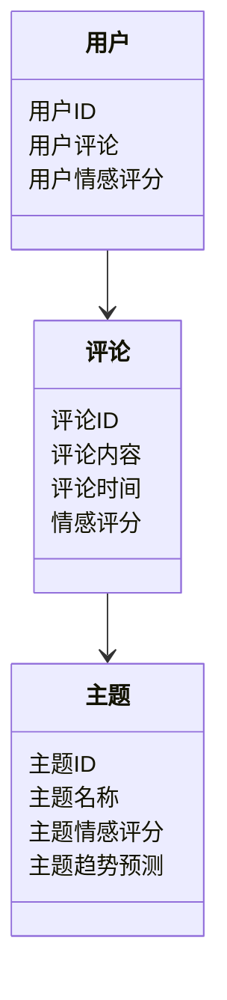
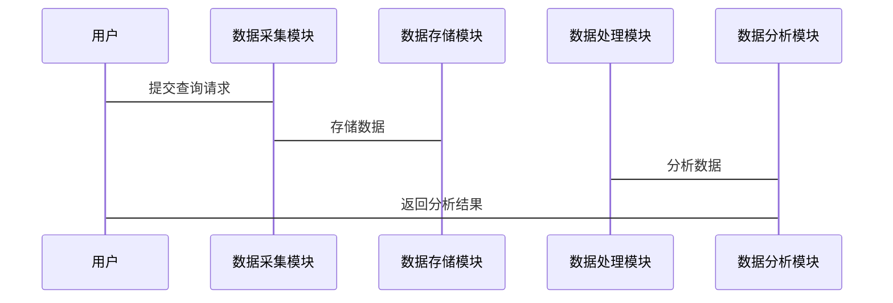

                 


# 彼得林奇的"街头智慧"在社交媒体舆情分析中的应用

## 关键词：
- 彼得林奇，社交媒体舆情分析，街头智慧，情感分析，投资哲学，数据挖掘

## 摘要：
本文探讨了将彼得林奇的“街头智慧”这一投资哲学应用于社交媒体舆情分析的可能性与实践。通过结合投资中的直觉与经验，本文提出了一种基于情感分析和权重计算的舆情分析模型，旨在提高舆情分析的准确性和实时性。文章详细介绍了模型的构建过程、算法实现、系统架构设计以及实际案例分析，为社交媒体舆情分析提供了新的思路和方法。

---

## 第一部分：背景介绍与核心概念

### 1.1 彼得林奇的“街头智慧”与投资哲学

#### 1.1.1 彼得林奇及其投资哲学
彼得·林奇（Peter Lynch）是美国著名投资家，以其在富达投资集团的长期优异表现而闻名。他的投资哲学强调“街头智慧”，即通过观察市场中的细微变化，结合投资者的直觉和经验，做出快速而准确的判断。这种投资方法的核心在于对市场情绪的敏感捕捉和对信息的快速处理能力。

#### 1.1.2 街头智慧的核心理念
1. **经验与直觉的结合**：彼得林奇认为，投资者的经验和直觉在市场分析中起着至关重要的作用。
2. **市场情绪的捕捉**：通过观察市场中的非理性行为，发现投资机会。
3. **快速判断与决策**：在信息不完全的情况下，基于经验做出快速决策。

#### 1.1.3 街头智慧在投资中的应用
彼得林奇通过“街头智慧”成功预测了许多市场变化，例如在互联网泡沫期间，他通过观察市场情绪的变化提前撤资，避免了巨大损失。

---

### 1.2 社交媒体舆情分析的定义与重要性

#### 1.2.1 社交媒体舆情分析的基本概念
社交媒体舆情分析是指通过分析社交媒体上的海量数据，了解公众对某个品牌、产品或事件的态度和情感。这种分析方法可以帮助企业及时发现和应对潜在的声誉风险。

#### 1.2.2 舆情分析在企业中的应用价值
1. **品牌声誉管理**：通过分析社交媒体上的评论，帮助企业了解公众对其品牌的态度。
2. **市场趋势预测**：通过分析市场情绪的变化，帮助企业预测市场趋势。
3. **竞争对手分析**：通过分析竞争对手的社交媒体数据，了解其市场策略和公众反应。

#### 1.2.3 舆情分析的挑战与难点
1. **数据量大**：社交媒体数据量庞大，分析起来需要高效的数据处理能力。
2. **信息复杂性**：社交媒体上的信息具有多样性和复杂性，难以直接提取有用信息。
3. **情感分析的准确性**：如何准确捕捉用户的情感倾向是舆情分析的核心难点。

---

### 1.3 街头智慧与社交媒体舆情分析的结合

#### 1.3.1 街头智慧在舆情分析中的潜在价值
1. **快速判断市场情绪**：通过分析社交媒体上的用户评论，快速捕捉市场情绪的变化。
2. **非理性行为的捕捉**：利用街头智慧中的直觉和经验，发现市场中的非理性行为。
3. **实时反馈机制**：通过实时舆情分析，企业可以快速应对市场变化。

#### 1.3.2 结合的必要性与可行性
社交媒体舆情分析需要快速、准确地捕捉市场情绪，这与彼得林奇的街头智慧不谋而合。通过结合两者，可以弥补传统舆情分析方法的不足，提高分析的准确性和实时性。

#### 1.3.3 街头智慧在舆情分析中的具体应用场景
1. **品牌声誉管理**：通过分析社交媒体上的用户评论，帮助企业及时发现并应对声誉危机。
2. **市场趋势预测**：通过分析市场情绪的变化，帮助企业预测市场趋势。
3. **竞争对手分析**：通过分析竞争对手的社交媒体数据，了解其市场策略和公众反应。

---

## 第二部分：街头智慧的核心要素与分析模型

### 2.1 街头智慧的核心要素

#### 2.1.1 经验与直觉的结合
彼得林奇的成功在于他将投资经验与直觉相结合，能够在市场变化中快速做出决策。这种能力可以应用于社交媒体舆情分析中，通过分析海量数据，快速捕捉市场情绪的变化。

#### 2.1.2 市场情绪的捕捉
市场情绪的变化往往体现在社交媒体上的用户评论中。通过分析这些评论的情感倾向，可以捕捉市场的整体情绪变化。

#### 2.1.3 信息的快速判断与决策
在社交媒体舆情分析中，需要快速判断信息的有用性和准确性，以便及时做出决策。

---

### 2.2 街头智慧分析模型的构建

#### 2.2.1 模型的输入与输出
- **输入**：社交媒体上的文本数据（如 tweets、评论等）。
- **输出**：市场情绪评分（如积极、消极、中性）和舆情趋势预测。

#### 2.2.2 模型的核心算法
- **情感分析**：通过自然语言处理技术，分析文本的情感倾向。
- **权重计算**：根据评论的影响力和相关性，计算评论的权重。
- **舆情趋势预测**：基于历史数据和当前数据，预测未来的舆情趋势。

#### 2.2.3 模型的评估与优化
- **评估指标**：准确率、召回率、F1值等。
- **优化方法**：通过调整算法参数和优化数据预处理步骤，提高模型的准确性。

---

### 2.3 街头智慧与传统舆情分析的对比

#### 2.3.1 传统舆情分析方法的优缺点
- **优点**：基于统计学方法，分析结果具有较高的客观性。
- **缺点**：难以捕捉市场情绪的细微变化，且计算复杂度较高。

#### 2.3.2 街头智慧分析的独特优势
- **快速判断**：通过直觉和经验，快速捕捉市场情绪的变化。
- **灵活性**：能够适应市场变化的非理性行为。

#### 2.3.3 两种方法的结合与互补
通过结合传统舆情分析方法和街头智慧分析方法，可以充分发挥两种方法的优势，提高舆情分析的准确性和实时性。

---

## 第三部分：街头智慧分析的算法实现

### 3.1 街头智慧分析的核心算法

#### 3.1.1 基于情感分析的特征提取
- **情感分析**：通过自然语言处理技术，分析文本的情感倾向。
- **特征提取**：提取文本中的关键词和情感特征。

#### 3.1.2 基于权重计算的舆情评分
- **权重计算**：根据评论的影响力和相关性，计算评论的权重。
- **舆情评分**：基于情感分析和权重计算，计算舆情评分。

#### 3.1.3 基于聚类分析的主题挖掘
- **主题挖掘**：通过聚类分析，识别社交媒体上的主要主题。
- **主题分析**：分析每个主题的舆情变化。

---

### 3.2 算法的数学模型与公式

#### 3.2.1 情感评分计算公式
$$ \text{情感评分} = \sum (\text{情感强度} \times \text{权重}) $$

#### 3.2.2 舆情趋势预测公式
$$ \text{趋势预测} = \sum (\text{当前评分} \times \text{时间权重}) $$

---

## 第四部分：系统架构设计与实现

### 4.1 问题场景介绍
社交媒体舆情分析系统需要实时处理海量数据，快速捕捉市场情绪的变化，并提供准确的舆情评分和趋势预测。

### 4.2 系统功能设计

#### 4.2.1 领域模型


#### 4.2.2 系统架构设计


#### 4.2.3 系统接口设计


---

## 第五部分：项目实战与案例分析

### 5.1 项目环境搭建
- **工具安装**：安装Python、自然语言处理库（如NLTK）、数据可视化工具（如Matplotlib）等。
- **数据源选择**：选择社交媒体平台（如Twitter、微博）作为数据源。

### 5.2 核心代码实现

#### 5.2.1 数据采集模块
```python
import tweepy

def get_twitter_data(query, max_tweets=100):
    # 初始化API
    auth = tweepy.OAuthHandler(consumer_key, consumer_secret)
    auth.set_access_token(access_token, access_token_secret)
    api = tweepy.API(auth)
    
    # 采集数据
    tweets = []
    for tweet in tweepy.Cursor(api.search, query=query).items(max_tweets):
        tweets.append({
            'text': tweet.text,
            'created_at': tweet.created_at,
            'user': tweet.user.screen_name
        })
    return tweets
```

#### 5.2.2 情感分析模块
```python
from textblob import TextBlob

def analyze_sentiment(text):
    blob = TextBlob(text)
    sentiment = blob.sentiment.polarity
    return 'positive' if sentiment > 0 else 'negative' if sentiment < 0 else 'neutral'
```

#### 5.2.3 舆情趋势预测模块
```python
import pandas as pd
from sklearn.linear_model import LinearRegression

def predict_trend(data):
    df = pd.DataFrame(data)
    model = LinearRegression()
    model.fit(df[['time']], df['sentiment_score'])
    return model.predict(df[['time']])
```

---

### 5.3 实际案例分析

#### 5.3.1 案例背景
假设某品牌在社交媒体上发布了新产品广告，我们需要分析用户评论的情感倾向，预测市场趋势。

#### 5.3.2 数据采集与分析
通过采集社交媒体上的评论数据，分析用户的情感倾向，并预测舆情趋势。

#### 5.3.3 案例结论
通过分析发现，用户对新产品的评论以中性为主，但负面评论有所增加，品牌需要及时采取措施应对潜在的声誉风险。

---

## 第六部分：最佳实践与小结

### 6.1 最佳实践 tips
1. **数据质量**：确保数据的准确性和完整性。
2. **模型调优**：根据实际需求，不断优化算法和模型。
3. **结合传统方法**：将街头智慧分析与传统舆情分析方法相结合，提高分析的准确性和实时性。

### 6.2 小结
本文探讨了彼得林奇的“街头智慧”在社交媒体舆情分析中的应用，提出了基于情感分析和权重计算的舆情分析模型，并通过实际案例分析验证了模型的有效性。未来，随着人工智能技术的不断发展，街头智慧分析在社交媒体舆情分析中的应用将更加广泛和深入。

---

## 作者：AI天才研究院 & 禅与计算机程序设计艺术

---

以上是《彼得林奇的"街头智慧"在社交媒体舆情分析中的应用》的技术博客文章，希望对您有所帮助！

